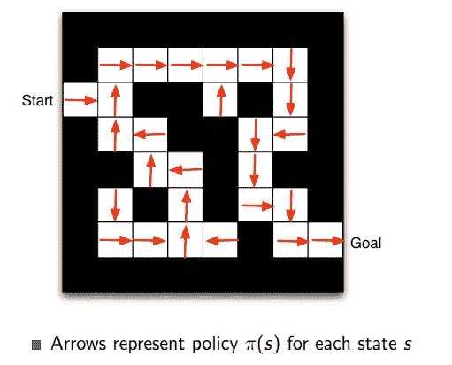

# 强化学习的基本术语

> 原文：<https://medium.com/analytics-vidhya/basic-terminology-reinforcement-learning-2357fd5f0e51?source=collection_archive---------6----------------------->

礼貌:谷歌自动驾驶汽车

在这里，我们将看到强化学习中使用的一些基本术语。所有这些都将以自动驾驶汽车为例进行解释，这样我们就很容易理解了！

**1。Agent:** 与环境交互并采取一定行动以获得最大回报的实体(学习算法+策略)。一辆自动驾驶汽车。

**2。环境 E:** 是智能体移动经过的周围环境。环境将代理的动作和当前状态视为输入，并为代理和下一个状态授予奖励，这就是输出。例句:城市就是环境。

**3。动作 A:** 代理根据环境状态采取的动作。当信号变成红色时，停下车。

**4。动作空间:**代理可以采取的所有可能动作的有限集。向前移动、左转、右转、加速、刹车等。

**5。状态 S:** 状态是指环境返回的当前情况。状态包含代理做出正确动作所需的所有有用信息。例:在我们的自主汽车强化学习问题的例子中，状态由城市中的障碍物(环境)、标志、地形等组成。

**6。状态空间:**状态空间是我们的代理为了达到目标可能采取的所有可能状态的集合。例句:自动驾驶汽车可以走多条路线到达同一个目的地。

**7。当代理执行特定的动作或任务时，给予代理的即时反馈。根据所采取的行动，奖励可以是积极的，也可以是消极的。如果自动驾驶汽车正确遵守交通规则，它将获得奖励，如果不遵守或在某处撞车，它将受到惩罚/负奖励。**

**8。事件:**代理从开始状态到结束状态的整个动作和状态循环构成了一个事件。例句:自动驾驶汽车可以在一公里内穿过车道而不撞上障碍物。

**9。策略π(s):** 它是一种策略，由代理根据当前状态来决定下一步的行动。它是从环境状态到处于这些状态时要采取的行动的映射。因此，给定当前状态，代理在表中查找该状态，以找到它应该选择的动作。例:自动驾驶汽车到达目的地的路线策略如下图所示。

自动驾驶汽车达到最终目标的政策

> ***注:*** *实际上，对于现实世界的问题，有那么多的状态，那么多的动作，那就用一个函数，而不是一个查找表，把一个状态映射到一个动作。*

10。Value: 与短期回报相比，贴现后的预期长期回报。

**11。价值函数 Vπ(s):** 它指定一个状态的价值即奖励的总额。它是一个从那个状态开始就应该被期待的代理。例:下图显示了自动驾驶汽车到达目的地的路径的价值函数。

自动驾驶汽车达到其目标的价值函数。

**12。贴现因子γ:** 它是一个介于 0 和 1 之间的数字，帮助我们设定一个平衡点，即在给定状态下，未来奖励在定义政策时应发挥多大作用。这样做是因为，由于回报是对未来状态的预先假设，因此存在很多不确定性。因此，为了更新我们的政策，使用折扣因子对价值进行折扣。

**13。探索:**为了探索所有可能的行动以及为了达到同一个目标可以采取的步骤顺序，我们一般会采取随机行动。这有助于我们探索整个环境，其中可能有更好的行动序列，并且是不可见的，以便代理可以采取这些行动来最大化回报。尝试一条新路线到达目的地。

**14。Exploit:** 这与 explore 相反，在 explore 中，代理在给定的特定状态下采取模型已知的最佳动作。尝试已知到达目的地的最短路线。

> **探索-利用权衡:**可能存在一种场景，其中存在到达目标的更短路径，但是代理当前不知道该路径。为了找到这些路径，我们随机探索，以发现这样的路线和可能性，即使有些路径可能会惩罚我们。这被称为探索-利用权衡，我们有目的地允许代理采取随机行动，以便找到到达目标的最佳路线。

15。马尔可夫性质:它是一种无记忆的性质，说明未来的状态只依赖于现在，而不依赖于过去的状态。

16。马尔可夫过程:具有一系列随机状态的过程，这些随机状态具有马尔可夫性质。马尔可夫过程可能有无限个状态。

17。马尔可夫决策过程(MDP): 马尔可夫决策过程正式描述了一个用于强化学习的环境，其中该环境是完全可观察的*。几乎所有的 RL 问题都可以形式化为 MDP，在部分可观测问题的情况下，甚至那些问题也可以转化为 MDP。

MDP 以元组(S，A，P，R，γ)的形式给出，其中

> s 是状态的有限集合
> 
> a 是一组有限的动作
> 
> p 是状态转移概率矩阵，

> r 是奖励函数

> γ是贴现因子γ ∈ [0，1]。

> *在**完全可观察的环境**中，系统的状态在任何时候都是已知的。例如:系统状态总是已知的国际象棋。然而，在**部分可观测的环境**中，系统在给定时间点的状态永远无法完全知晓。例句:在扑克游戏中，直到“表演时间”你才能看到对手的牌。为了抵消这种部分可见性，代理可以依靠记忆(过去的经验)，通过记住当前游戏中其他玩家的移动并预测接下来可能发生的事情，来预测未来可能变得可见的事情。

**因此，我们现在已经理解了强化学习中使用的基本术语。请浏览我的** [**下一篇文章**](/@thearsalion/getting-started-with-reinforcement-learning-89ef9c791180) **它几乎涵盖了你开始强化学习需要知道的一切！**

 [## 强化学习入门

### 这篇文章有你开始强化学习所需要知道的一切！它涵盖了它的类型，工作…

medium.com](/@thearsalion/getting-started-with-reinforcement-learning-89ef9c791180) 

# 反馈/建议:

如有任何反馈或建议，请在下面评论或在 arsalan.anwar.7777@gmail.com 发邮件或通过 LinkedIn 联系我，地址是[www.linkedin.com/in/arsalananwar1998](http://www.linkedin.com/in/arsalananwar1998)