# 使用 Python 学习数据分析的基本工具

> 原文：<https://medium.com/analytics-vidhya/basic-tools-to-learn-in-data-analysis-with-python-5b9b4a7a1b61?source=collection_archive---------21----------------------->

马库斯·斯皮斯克在 [Unsplash](https://unsplash.com?utm_source=medium&utm_medium=referral) 上的照片

**哈佛大学**称该职业为 21 世纪最性感的工作。 ”根据 **LinkedIn** 的数据，这一职业经历了指数级增长，成为增长第二快的职业。这是任何人都可以在数据领域开始职业生涯的时候。

先了解一下用 Python 开始**数据分析时大家应该知道的基本工具**

**第一步:开始(数据提取)**

你可以直接使用 *Jupyter 笔记本*([https://jupyter.org/](https://jupyter.org/))。这是一个你可以使用的免费开源网络应用程序。

**1** 。通过以下方式将 Python 库导入到您的笔记本中

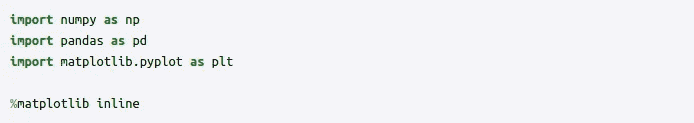

这里， **NumPy** 包含一个多维数组和矩阵数据结构。它可用于对数组执行一些数学运算，如三角函数、统计和代数例程，而 **Pandas** 用于数据操作和分析。特别是，它提供了用于操作数字表和时间序列的数据结构和操作，并且 **Matplotlib** 创建一个图形，一个图形中的绘图区域，在绘图区域中绘制一些线，用标签装饰绘图，等等。

**2** 。通过以下方式将数据导入笔记本

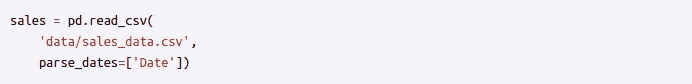

这里使用熊猫库，我们将数据集导入笔记本并保存到变量****中，解析数据* 用于根据系统匹配时间。***

***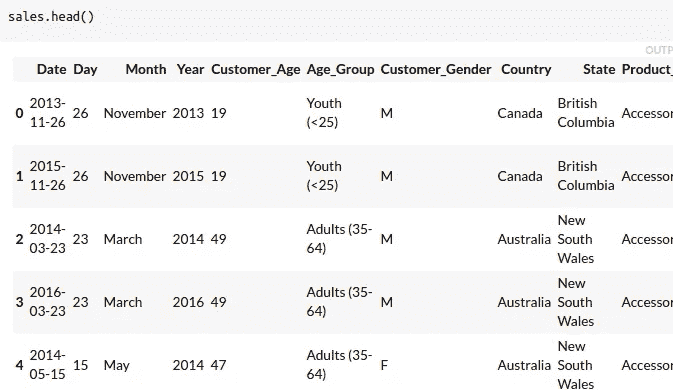***

***输出(图 1)***

*****第二步** : **数据探索*****

1.  ******sales . head()-*-**从*销售数据列表中提取五行。****

***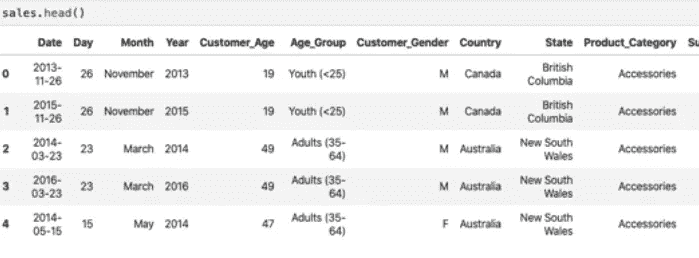***

***图 2***

******2 . sales . shape***-给我们*销售数据列表的*(行*列)*明细。****

***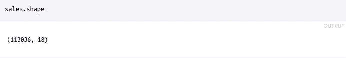***

***图 3***

******3 . sales . info()-***给我们详细介绍一下*列、非空行、计数和数据类型* ***。******

***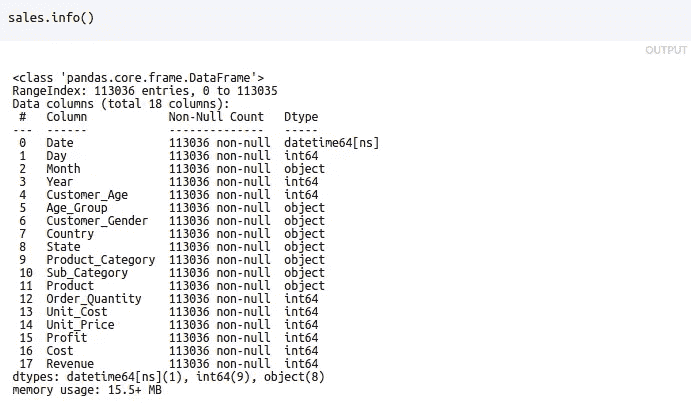***

***图 4***

******4 . sales . Describe()***-描述列的各种数学函数，如列的*平均值、标准差、最大值、最小值、25、50、75 百分位*。***

***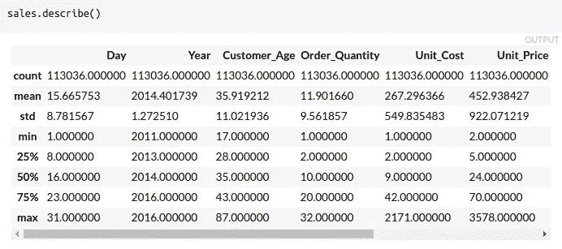***

***图 5***

*****步骤 3:特定列数据分析*****

1.  ******销售['单位 _ 成本']。describe()***-描述来自*销售数据集中的一个特定列(*此处为单位成本*)。****

***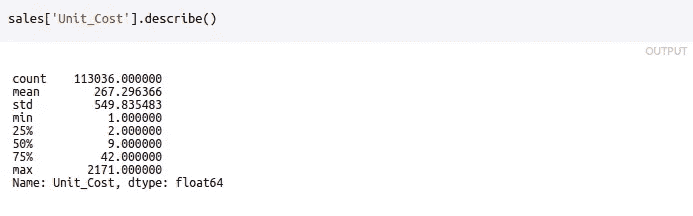***

***图 6***

******2 .销售['单位 _ 成本']。Mean()***-来自*销售数据集中的一个特定列的平均值(*此处为单位成本*)。****

***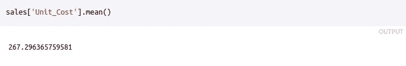***

***图 7***

***3 .销售额['单位成本']。Median()-来自*销售数据集的一个特定列(*此处为单位成本*)的中间值。****

***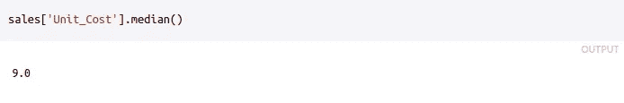***

***图 8***

> ***你可以从 https://pandas . pydata . org/pandas-docs/stable/reference/frame . html 找到更多的数据帧集合***

*****第四步:数据可视化*****

1.  ******销售['单位 _ 成本']。plot(kind='box '，vert=False，figsize=(14，6)) -*** 使用 Matplotlib，在*销售数据集*的 *unit_cost* 列上显示熊猫，在 *dimension=14，6* 中使用 **box** 作为 V *可视化*类型。***

***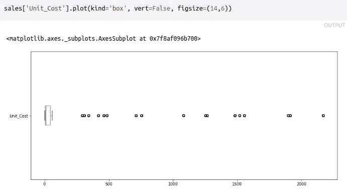***

***图 9***

******2 .销售额['单位 _ 成本']。plot(kind='density '，figsize=(14，6)) —*** 使用与上述相同的数据，将**密度**作为*可视化*类型。***

***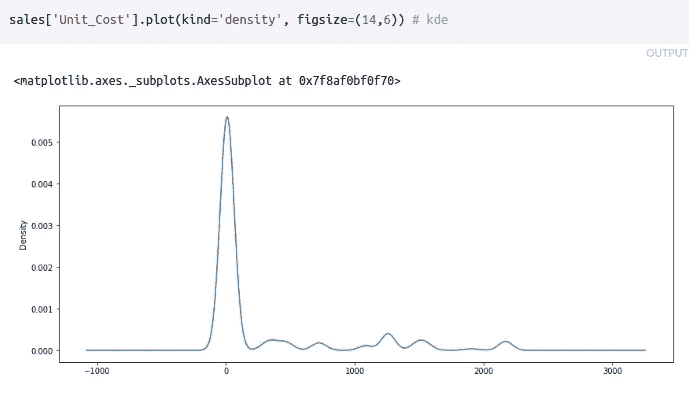***

***图 10***

******3.ax =销售额['单位成本']。plot(kind='density '，figsize=(14，6))
ax . axv line(sales[' Unit _ Cost ']。mean()，color = ' red ')
ax . axv line(sales[' Unit _ Cost ']。median()，color='green') -*** 使用与上述相同的数据，轴*用*红色*表示平均值的*垂直线*，中值用*蓝色* ***表示。*******

****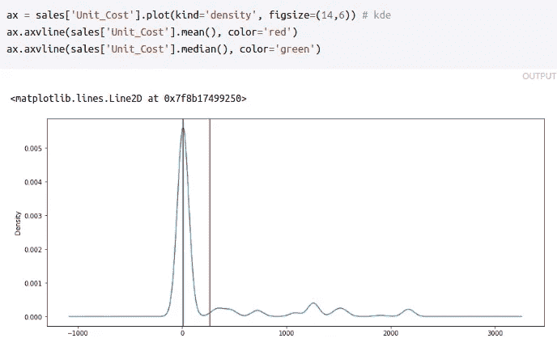****

****图 11****

*******4.ax =销售额['单位成本']。plot(kind='hist '，figsize=(14，6))
ax.set_ylabel('销售数')
ax.set_xlabel('美元')-*** 使用与上述相同的数据，其中*直方图*作为*可视化*类型， **Y 轴**标有*销售数*和 **X 轴**作为****

****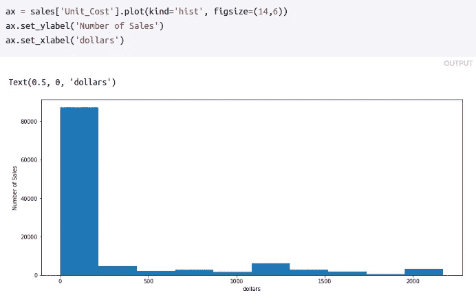****

****图 12****

******步骤 5:相关性******

1.  *******corr = sales . corr()-***查找销售数据集的*列和*行之间的相关性。****

****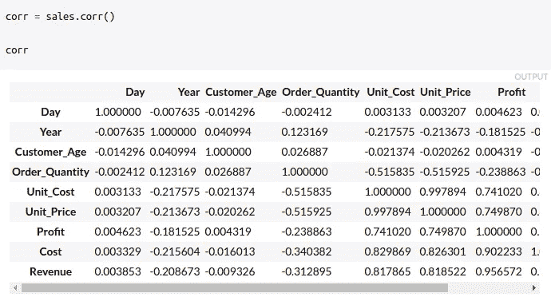****

****图 13****

******第六步:修改栏目******

1.  *******sales[' Revenue _ per _ Age ']= sales[' Revenue ']/sales[' Customer _ Age ']-***通过应用以下计算创建带有 *revenue_per_age* 的*新列*。****

****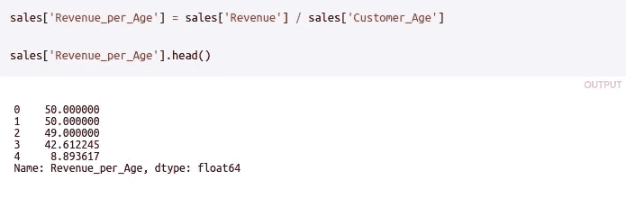****

****图 14****

*******2 . sales . loc[sales[' State ']= ' Kentucky ']-***获取*肯塔基的*州*的所有销售额。*****

***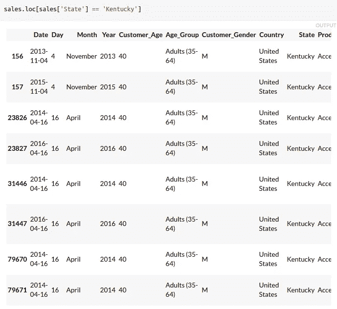***

***图 15***

******3.sales.loc[(销售['年龄 _ 组'] = '成年人(35–64)')&(销售['国家'] = '美国'，'收入']。mean() -*** 获得美国销售组*成年人(35–64 岁)的*平均收入*****

***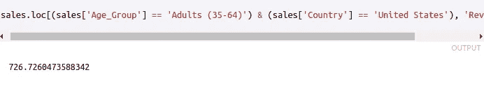***

***图 16***

***Y 你可以在这里参考本项目使用的数据集:[https://drive . Google . com/file/d/1 dlife 5 urkr _ gi 0 wznhtb 5 utwakomcoozl/view？usp =分享](https://drive.google.com/file/d/1dLIF5UrKR_gI0WznhTb5uTWaKOmcoOZL/view?usp=sharing)***

> ***F 或**熊猫**的完整 API 参考，请访问:[https://Pandas . pydata . org/Pandas-docs/stable/reference/index . html # API](https://pandas.pydata.org/pandas-docs/stable/reference/index.html#api)***
> 
> ***关于**号**的完整 API 参考，请访问:[https://numpy.org/doc/stable/reference/](https://numpy.org/doc/stable/reference/)***
> 
> ***关于 **Matplotlib** 的完整 API 参考，请访问:[https://matplotlib.org/3.1.1/api/index.html](https://matplotlib.org/3.1.1/api/index.html)***