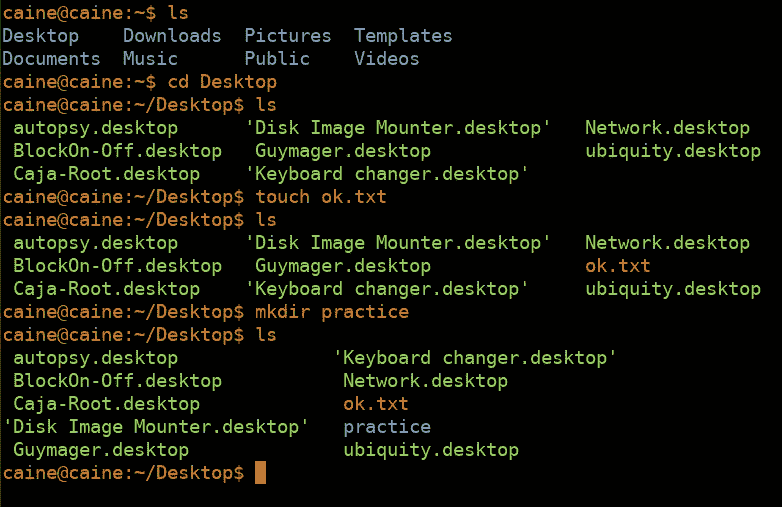

# UNIX 上的 Shell 脚本基础教程

> 原文：<https://medium.com/analytics-vidhya/basic-tutorial-shell-scripting-on-unix-65a5051e2e8f?source=collection_archive---------17----------------------->

编写 Linux 脚本

大家好，你们知道什么是 Unix 吗？

Unix/Linux 是一种类似 Windows、iOS 和 macOS 的操作系统。Unix 能够同时处理多个用户的活动。Unix 是由 Ken Thompson 和 Dennis Ritchie 于 1969 年左右在美国电话电报公司·贝尔实验室开发的。在 Unix 中，有一个类似 windows 中命令提示符的终端。该终端用于 shell 脚本。所以，我们来练习一下…