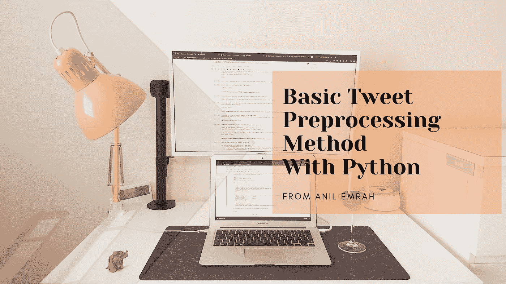

# 基于 Python 的基本 Tweet 预处理方法

> 原文：<https://medium.com/analytics-vidhya/basic-tweet-preprocessing-method-with-python-56b4e53854a1?source=collection_archive---------3----------------------->

嗨，伙计们！这个故事将是关于我的 Tweet 预处理方法，它将用于清理 Tweet，以便更好地处理 NLP 主题。我想解释为什么我们需要预处理，以及在这个故事中我们如何做到这一点。

自然语言处理的主题主要是试图找出人们在日常生活中产生的文本。为了更具体地说明这个故事，发布了推文。总的来说，我们…