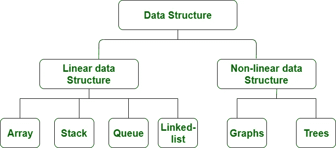
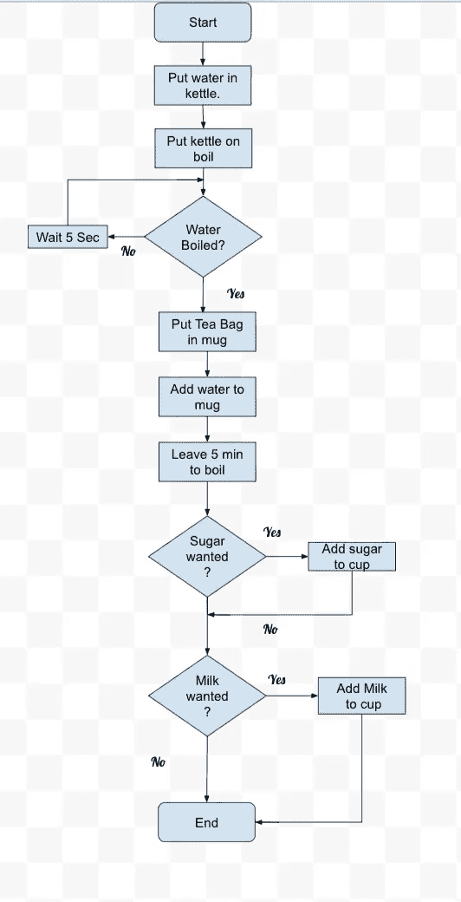

# 对数据结构和算法有基本的理解

> 原文：<https://medium.com/analytics-vidhya/basic-understanding-of-data-structure-algorithms-ee3eb4c45ac9?source=collection_archive---------25----------------------->

## 它是计算机科学的骨骼，强壮的骨骼永远不会让你失望。

我们多次听到数据结构和算法这个名字。让我们用一个真实的例子来理解这一点:假设我们必须去另一个城市，我们有许多选择，如:乘公共汽车、火车、飞机、我自己的车辆等。因此，我们选择来源的基础上的要求，如我们有什么预算，我们什么时候到达。计算机科学也是如此，有多种算法可用于解决同一问题(例如:计算阶乘数有多种方法，如使用递归、使用 for 循环、使用 do/while 循环等等)。

由[阿图罗·卡斯塔内拉](https://unsplash.com/@castaneyra?utm_source=medium&utm_medium=referral)在 [Unsplash](https://unsplash.com?utm_source=medium&utm_medium=referral) 拍摄的照片

**什么是数据结构:**数据结构是在计算机中存储和组织数据的一种特殊方式，以便可以有效地使用。数据结构是一种用于组织和存储数据的特殊格式。

**数据结构类型:**一般的数据结构类型包括数组、文件、链表、堆栈、队列、图形等。我们可以理解下图中的类型。

极客论坛

数据结构分为两种类型:

1.  线性数据结构:元素是按顺序访问的，但不是必须按顺序存储所有元素(如链表)。
2.  非线性数据结构:以非线性顺序访问/存储元素。

**什么是 an 算法:**我们以备茶问题来理解算法。准备一杯茶，我们遵循下面图表给出的步骤。

learningactors.com

我们所做的是，对于一个给定的问题(准备茶)，我们提供一个逐步的程序来解决它。

> 算法是解决给定问题的一步一步明确的指令。

在传统的算法研究中，判断算法优劣的标准主要有两个:

**答。正确性**:算法是否在有限的步骤中给出了问题的解决方案？

**B)。效率**:执行需要多少资源？(就内存和时间而言)

> 我们不必证明算法的每一步。

就是这样。我希望它能让你对数据结构和算法有一个基本的了解。如果微笑出现在你的脸上，请为我鼓掌。

我参考了《数据结构与算法》这本书(Narasimha Karumanchi)。

感谢您的阅读。祝你有美好的一天！！