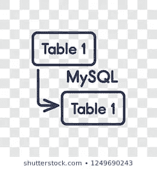
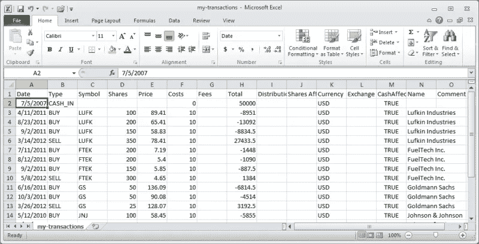
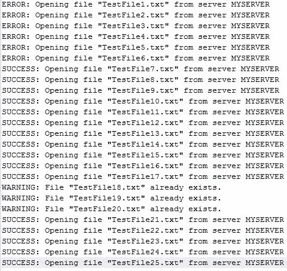

# 对 ETL 的基本理解

> 原文：<https://medium.com/analytics-vidhya/basic-understanding-of-etl-4ea1daa4868?source=collection_archive---------18----------------------->

为了理解 ETL(提取、转换和加载)的概念，我们必须理解数据的一些基本概念。

# **数据种类:**

数据主要分为结构化、半结构化和非结构化。

**结构化:**

如果我们知道字段以及它们的数据类型，那么我们称之为结构化。MySQL、Oracle 或 Microsoft SQL 等关系数据库中的数据就是结构化数据的一个例子。

**半结构化:**

我们知道字段或列，但不知道数据类型的数据，我们称之为半结构化数据。例如，以逗号分隔值的 CSV 格式的数据称为半结构化数据。

**未结构化:**

图片来自[https://www.sqlservercentral.com/](https://www.sqlservercentral.com/)

如果我们的数据不包含列或字段，我们称之为非结构化数据。服务器上生成的纯文本文件或日志形式的数据是非结构化数据的示例。

因此，将**非结构化**数据转换为**结构化**数据的过程被称为 ETL——提取、转换和加载。

之前我们使用了很多数据仓库工具进行 ETL，比如 informatica，datastage 等等。这些与结构化数据更加兼容。随着时间的推移，数据增长太快，而且越来越多地以非结构化格式提供，难以从这些数据中获得洞察力。大数据(Hadoop、spark)等最新技术不断涌现，大数据甚至可以实时提供完整的 ETL 包。

希望这个非常基本的 ETL 概念能对新手有所帮助。如果有任何疑问，请发邮件到 mlanujsharma@gmail.com 找我。