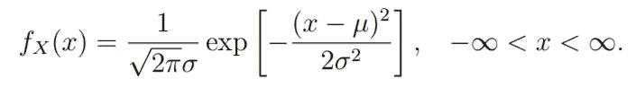
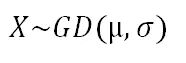
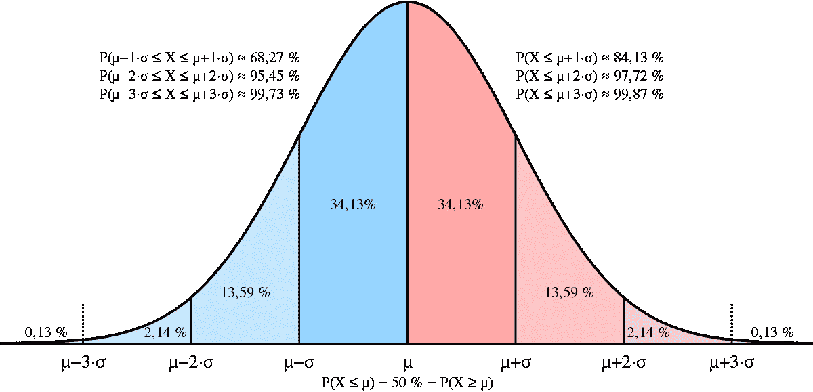
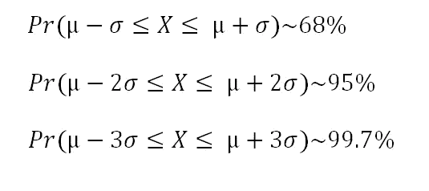
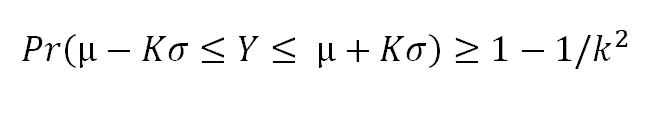
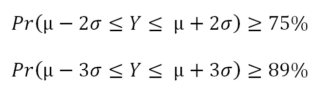

# 对高斯分布和切比雪夫不等式的基本理解

> 原文：<https://medium.com/analytics-vidhya/basic-understanding-of-gaussian-distribution-and-chebyshevs-inequality-ba57ba79a635?source=collection_archive---------4----------------------->

由于每天都会产生大量的数据，所以在几乎每个领域都必须使用统计分析来使可用的数据变得合理和可理解。当应用适当的统计方法时，它将原始数据转化为信息，这可以在实践中产生新的发现。

在统计学中，我们总是谈论数据分布这个术语，它说明了数据集中数据点之间的关系。

> 分布只是一个变量的数据或分数的集合。通常，这些分数是按照从小到大的顺序排列的，然后可以用图形显示出来。
> 
> ——第 6 页，[简明英语统计数据](http://amzn.to/2FTs5TB)，第三版，2010 年。

先说一个众所周知的数学模型，那就是 ***高斯分布*** 。大多数数据可以用高斯分布来描述，并修改参数，如平均值和标准偏差。它也被称为正态分布，因为它是如此普遍。

在 python 中，可以使用 [**范数 SciPy 模块**](https://het.as.utexas.edu/HET/Software/Scipy/generated/scipy.stats.norm.html) 来应用高斯分布。norm.pdf()函数可用于创建具有给定样本空间、平均值和标准差的高斯概率密度函数。

假设由 **X** 表示的随机变量遵循高斯分布，如果其概率分布函数(pdf)为-

其中为总体均值， **σ** 为标准差。

**X** 的高斯分布表示为:

正态分布曲线

满足高斯分布的数据遵循以下规则，表示 **68%** 的数据落在[ -σ，+σ]范围内。如果我们将标准差的值增加一倍和三倍，这表明更多的数据将偏离平均值，从而覆盖高斯曲线下 95%和 99.7%的数据。

让我们考虑另一种情况，其中我们有一个随机变量 **Y** 不遵循高斯分布。那么，我们如何确定 Y 的百分之几落在高斯分布的哪个范围内呢？

这就是 ***切比雪夫不等式*** 的由来。

***切比雪夫不等式*** 背后的概念是，对于大多数概率分布函数来说，存在位于距平均值一定距离处的某个分数的值。

在此，概率分布范围被定义为:

其中 **K** 代表标准差的范围。

如果我们代入 **K** =2，3:

与 68–95–99.7 的正态分布规则相比，切比雪夫不等式更弱，它指出至少 75%的值必须位于平均值的两个标准偏差内，89%的值必须位于三个标准偏差内。

*让我们来看看切比雪夫不等式的一些利弊。*

**优点:**

*   它只需要有限的二阶矩。
*   它在建立弱大数定律时是有用的。
*   它应用于一系列随机变量时并不要求序列元素的独立性。

**CONS:**

*   作为理论统计和概率论的工具，它比数据分析有用得多。
*   它几乎从不提供概率的精确界限。严格的界限需要更多关于随机变量的假设。

这就是高斯分布和切比雪夫不等式。希望，你们都觉得文章有用。

快乐学习！！

**来源**

 [## 统计数据分布的温和介绍-机器学习掌握

### 一个数据样本会形成一个分布，到目前为止最广为人知的分布是高斯分布…

machinelearningmastery.com](https://machinelearningmastery.com/statistical-data-distributions/)  [## 切比雪夫不等式

### 在概率论中，切比雪夫不等式(也称为 bienaym-Chebyshev 不等式)保证，对于一个…

en.wikipedia.org](https://en.wikipedia.org/wiki/Chebyshev%27s_inequality)  [## 如何学习数据科学的统计学，自我启动的方式

### 你想学数据科学的统计学而不去上一门又慢又贵的课程吗？商品新闻...你可以…

elitedatascience.com](https://elitedatascience.com/learn-statistics-for-data-science)