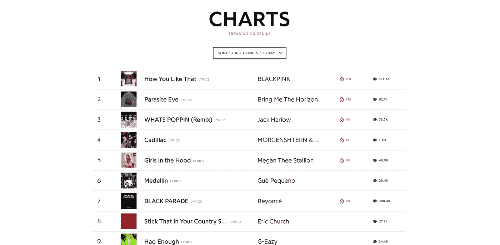
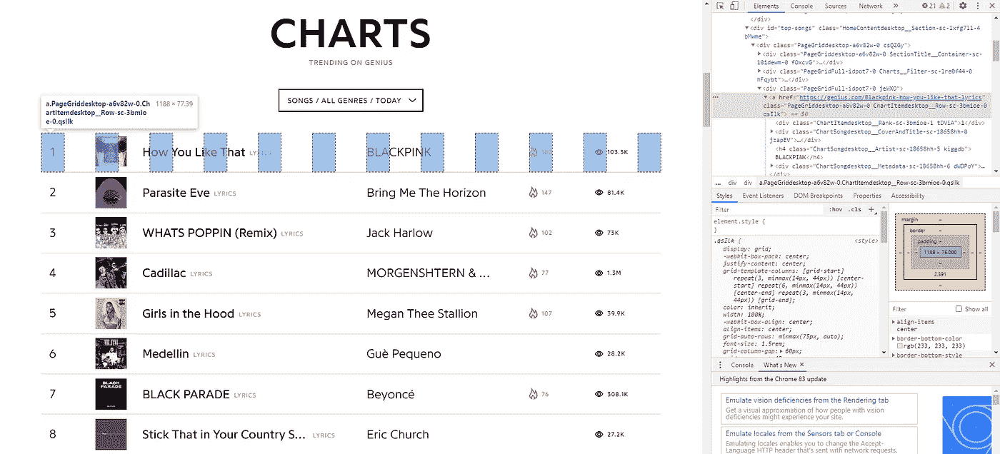
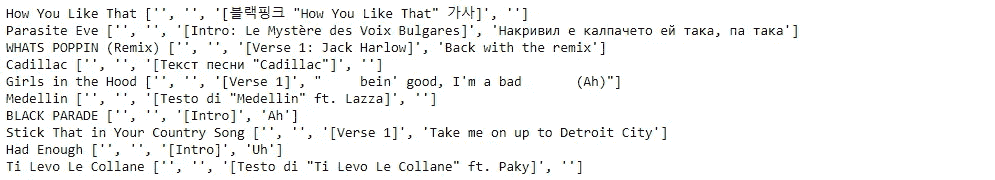

# 基本网页抓取

> 原文：<https://medium.com/analytics-vidhya/basic-web-scraping-d6bb44118304?source=collection_archive---------27----------------------->

## 只知道基本原理就能让你去任何地方。

网络搜集为处理你最感兴趣的数据提供了如此多的机会，而且比你想象的要容易。一个人对他们正在处理的数据的兴趣可以决定一个项目的成败，这对于他们的学习动机有很大的影响。这个简单的工具可以帮助你获取真正有助于你学习的数据。

读完这篇文章后，你应该能够将基本的网络抓取付诸实践，这将让你获得 80%的数据。

如果你不知道什么是网络抓取，那都是在名义上。你编写一个程序，*从网站上抓取*数据，从中你可以提取某些信息，形成你自己的数据集。

web 抓取有两个常见的标准 python 包，being Requests 和 BeautifulSoup。当然，还有许多其他的软件包，但是这两个是我将重点关注的，因为它们非常流行并且简单易用。

Requests 允许您简单地通过 HTTP 请求从任何网页获取信息。BeautifulSoup 允许您从请求中提取想要的信息。

我将简要介绍一下基本知识，然后通过搜集 Genius 上流行的十大歌曲的歌词，向您展示一个我如何学会使用它们的例子。

# 基本概述

## 要求

下面是分别为 pip 和 conda 安装请求的命令。

```
pip install requestsconda install -c anaconda requests
```

下面这简单的两行已经可以让你开始抓取网页了。

```
import requestspage = requests.get(url)
```

第二行将 HTTP 请求的结果返回到您的 URL，然后您可以从中提取信息。

## 美丽的声音

要安装 BeautifulSoup，下面分别是 pip 和 conda 的命令。

```
pip install beautifulsoup4conda install -c anaconda beautifulsoup4
```

通过这些行，您可以访问您想要从网站上获取的特定信息。

```
from bs4 import BeautifulSoupsoup = BeautifulSoup(page.content, 'html.parser')soup.find_all(tag)tag_element.get(property)
tag_element.text
```

HTTP 请求包含各种信息，但是我们使用内容(对应于 HTML)来创建一个漂亮的组对象。我们还传入了一个解析器，因为 BeautifulSoup 对象表示一个经过解析的 HTML 文档。这个 BeautifulSoup 对象具有某些方法和属性，可以让我们轻松地提取信息。

find_all 方法返回指定标签的元素列表。还有其他可选参数，比如 class，它允许我们进一步指定希望它返回哪些元素。这些元素有我们可以从中获取信息的方法和属性。

这只是为了对代码的样子有一个大致的了解，所以如果还没有完全理解，也不要担心。在本文后面的实际操作中使用它们将会把我们放下的难题拼凑起来。

## 基本网页抓取过程

1.  找到您想要提取的数据。
2.  使用网站的 URL 发出 HTTP 请求。
3.  将其 HTML 提取到一个 BeautifulSoup 对象中。
4.  在 HTML 中筛选，找到包含所需信息的元素。
5.  从这些元素中提取信息。
6.  将数据存储在数据集中。

# 示例:从 Genius 中提取歌词

就在一两年前，当我刚开始接触数据科学项目和文章时，我一直认为分析歌曲的歌词太酷了。然而，与此同时，它感觉完全遥不可及，我对人们如何着手获取数据感到困惑。现在才知道其实挺简单的。在这个例子中，我们将从 Genius 上流行的前十首歌曲中抓取歌词。

从导入我们最喜欢的包开始。

```
import requests
from bs4 import BeautifulSoup
```

然后让我们实际上找到保存这十首歌曲的页面的 URL。



genius.com 截图

经过大约 2 秒钟的滚动，我发现他们实际上只是在主页上，所以网址是"https://genius.com/"。

让我们把它放到我们的函数中来获取网页的 HTTP 请求信息。

```
home_page = requests.get(‘https://genius.com/')
```

现在我们可以开始打开页面，通过将 HTML 分解成一个 BeautifulSoup 对象来获取这些歌曲歌词的链接。

```
home_html = BeautifulSoup(home_page.content, ‘html.parser’)
```

现在我们有了一个 BeautifulSoup 对象，我们可以用 find_all 方法访问它的元素。在我们这样做之前，我们实际上必须查看页面的 HTML 以找到要挑选的正确元素。

你既可以按 ctrl+shift+i，也可以点击谷歌 Chrome 右上角的三个点→更多工具→开发者工具，它应该会在边上打开网页的源代码。你需要对文本进行一些筛选，但至少在 Chrome 中，浏览器会通过在页面上突出显示 HTML 的每个元素在页面上对应的内容来帮助指导你。打开几个 div 后，我发现我的链接在哪里。



genius.com 及其源代码的截图。这显示了在示例中找到链接的样子。

Genius 在这里有一些奇怪的 div，但是我们仍然可以看出这个元素对应于第一行。这里我们可以看到链接，更重要的是，我们可以看到保存我们信息的元素的类型——以及它的类。我们可以利用这些信息来挑选出所有这些元素。

链接在' a '标记中，它的类是' PageGriddesktop-a6v 82 w-0 ChartItemdesktop _ _ Row-sc-3 bmioe-0 qsIlk '。我确保检查了接下来的几个元素，看看我们实际上要检索的不仅仅是这一个链接，而是这种类型的所有链接，然后我把它扔进了我的函数。这个类可能看起来有点复杂，但对我们的目的来说这无关紧要，因为我们只需要用它来区分我们想要的“a”元素和页面上的其余“a”元素。

```
links = home_html.find_all(‘a’, class_=’PageGriddesktop-a6v82w-0 ChartItemdesktop__Row-sc-3bmioe-0 qsIlk’)
```

现在我们有了链接，我们可以试着从其中一个页面获取歌词，最后，对其余的页面重复同样的过程。

我们通过访问存储链接的“href”属性从“a”元素获取链接。

```
url = links[0].get(‘href’)
```

附注:到目前为止，我们几乎已经完成了网页抓取的全面运行；我们用我们的程序从一个网站上检索了信息。然而，我喜欢这个例子，因为我们再次运行它，但以稍微不同的方式，并希望通过重复这个过程获得完整的理解。

然后，我们可以从该页面中找到信息，并将其转换为一个漂亮的 Soup 对象。

```
lyrics_page = requests.get(url)
lyrics_html = BeautifulSoup(lyrics_page.content, ‘html.parser’)
```

然后我们仔细检查这个页面的 HTML，发现歌词在一个“div”元素中，这个元素有一个更方便命名的类“lyrics”。

```
lyrics_div = lyrics_html.find_all(‘div’, class_=’lyrics’)
```

这实际上是这个类唯一的 div，我们可以像这样获取歌词并将其拆分到各自的行中。

```
lyrics = lyrics_div[0].text
lines = lyrics.split(‘\n’)
```

现在我们可以循环每个链接的前几行代码，得到这个。

```
song_lyrics = {}for i in range(len(links)):
    url = links[i].get(‘href’) lyrics_page = requests.get(url)
    lyrics_html = BeautifulSoup(lyrics_page.content, ‘html.parser’) # get song lyrics
    lyrics_div = lyrics_html.find_all(‘div’, class_=’lyrics’)
    lyrics = lyrics_div[0].text
    lines = lyrics.split(‘\n’) # get song title
    title_elements = lyrics_html.find_all(‘h1’, class_=’header_with_cover_art-primary_info-title’)
    title = title_elements[0].text song_lyrics[title] = lines
```

这样，我们将每首歌的歌词列表存储在了一个字典中。我们可以通过显示每首歌曲及其前几行来检查我们的结果。

```
for song in song_lyrics:
    print (song, song_lyrics[song][:4])
```



从 Genius 排行榜上刮下来的十首歌的前几行

尽管在进一步使用它之前，显然还有一些清理工作要做，但这表明我们做了所有我们想做的事情。

现在，我希望您能够将数据科学工作流程的更多部分掌握在自己手中。你不必再仅仅依赖 Kaggle 和手工制作的数据集，你可以处理你在网上找到的几乎任何有趣的数据。到目前为止，它对我自己的旅程产生了很大的影响，我希望它对你也有影响。