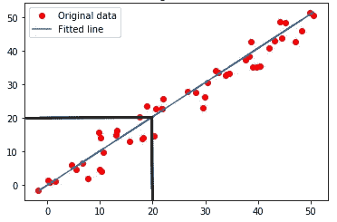
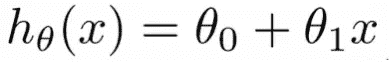
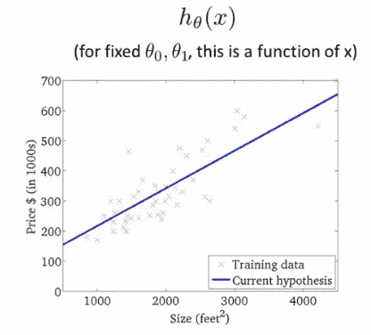
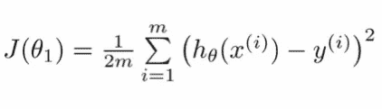
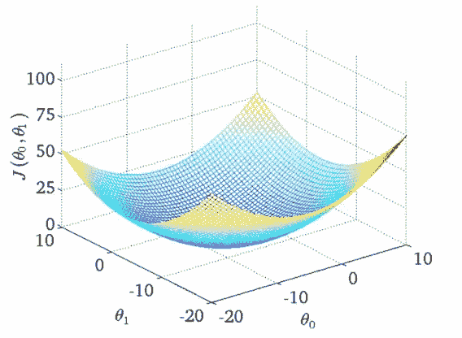
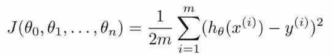
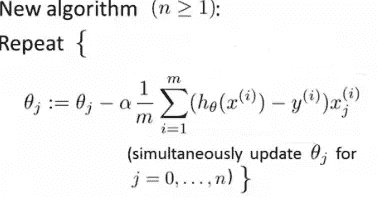

# 基础与超越:线性回归

> 原文：<https://medium.com/analytics-vidhya/basics-and-beyond-linear-regression-c12d99a4df35?source=collection_archive---------4----------------------->

## 一点一点地分解线性回归算法

马蒂亚斯·奥伯霍尔泽摄

这篇文章将带你从最基本的开始进行线性回归。当开始机器学习时，线性回归可能是人们遇到的第一个主题，老实说，它也是最广泛和最容易实现的算法之一。为了掌握机器学习，必须非常清楚基础知识。一开始可能看起来很累，但是一旦你有了完美的基础，编写代码将是一件轻而易举的事情。大多数帖子试图一口气涵盖所有内容，老实说，这有时会让人不知所措。试图理解复杂的方程，然后切换到代码，然后再回到数学和图形，只会让你很难跟上。这个系列旨在用一种稍微不同的方法来指导你完成机器学习。我们将首先分解算法并理解它的绝对细节，然后我们将在接下来的文章中继续实现。所以让我们开始吧！

线性回归属于监督机器学习算法的范畴。在监督学习中，当给定一个数据集时，我们已经知道正确的输出应该是什么样子，我们已经知道输入和输出之间的关系。监督学习广泛涵盖了两种类型的问题:

1.  回归问题(本文的重点)
2.  分类问题

有了这些背景，很明显，线性“回归”实际上属于“回归”问题范畴。但这些“回归”问题到底是什么？简而言之，回归问题试图在连续输出中预测结果，也就是说，它们试图将输入变量映射到某个连续函数。这里的输出是一个连续的集合。这也有助于记住，当我们试图预测的目标变量是连续的(例如，在数学意义上[1，5]是一个连续的集合，而{1，5}是离散的)，那么这是一个回归问题。

回归问题的一些例子是:

*   给定面积、房间数量等，预测房价。
*   根据距离、交通状况等计算出租车的费用。

线性回归视觉表示

在任何监督学习问题中，我们的目标很简单:

*“给定一个训练集，我们想要学习一个函数 h: X →Y，使得 h(x)是对 Y 的相应值的良好预测”*

这里 *h(x)* 被称为假设函数，基本上是我们试图通过我们的学习算法预测的(在这种情况下是线性回归)。

h 将 x 映射到 y

让我们从一元线性回归开始线性回归(一元问题)。

对于一元线性回归的情况，我们的假设函数是:

h(x)的方程式

上式中， *θ0* 和 *θ1* 称为假设的*参数*。

在这里，可视化表示会有所帮助:

线性回归的图形表示

我们一直在谈论的假设函数 *h(x)* 本质上是贯穿数据的蓝线，红色的 X 是我们的数据点。因此，我们线性回归的目的是找到最符合数据的直线。你可能还注意到，我们的 *h(x)* 方程实际上只是二维平面中一条直线的数学方程，现在我们已经看到，我们的假设 *h(x)* 实际上是一条图形意义上的直线，因此有术语*“线性”*回归。

# 价值函数

到目前为止，我们有一个假设，我们知道这个假设会给我们所需要的预测。但是我们如何评估我们的假设函数的表现。重要的是要知道我们的预测有多准确，以便了解我们的模型表现如何，以及它是否需要进一步的“训练”或更多的“调整”(基本上是参数的调整)。这就是成本函数发挥作用的地方。

成本函数是一个表达式，通过它我们可以评估当前假设的质量，并相应地进行修改。简而言之，我们的成本函数根据我们的预测与真实值的差距来决定我们希望模型产生的成本。直觉上认为“成本”实际上应该是我们的预测值和真实值之间的差值，即*h(x)-y。*这实际上是一个正确的直觉，因此我们得出线性回归的成本函数:

价值函数

现在我们有了假设、参数和成本函数，我们再次重申我们的目标。

这里的主要目标是最小化我们的成本函数 *J(θ)* ，以便我们得到 *h(x)* 作为通过 X 和 Y 图中最大点的函数，或者换句话说，我们希望最小化成本函数，以便我们模型的预测尽可能接近实际值。

## 但是为什么要最小化成本呢？

从成本函数的等式中很清楚，成本函数 *J(θ* ) 与我们的预测(即 *h(x)* 和真实值或标签*y*之间的差的平方成正比。因为我们希望我们的预测非常接近或等于真实值，所以我们显然需要两者之间的差尽可能小，因此我们必须最小化成本函数。

那么我们如何最小化这个成本函数呢？输入梯度下降！

# 梯度下降

我们上下文中的梯度下降是一种优化算法，目的是调整参数(这里是θ0 和θ1)以最小化代价函数 *J(θ0，θ1)* 。

让我们这样想，想象一个碗。这个碗上的任何一点都是当前成本，我们的目标是达到碗的底部，这被称为“全局最优或最小值”。这正是梯度下降试图达到的目的。它选择参数，评估成本，然后调整这些参数，以获得比前一个更低的成本，从而一步步接近最小值。一旦我们达到全局最小值或直观上的碗底，我们将拥有假设函数的最佳参数，因此能够做出准确的预测。

梯度下降

梯度下降本身就是一个庞大的话题。请查看同一系列中的这篇文章，它将带您一步一步地了解梯度下降的整个概念:

 [## 基础和超越:梯度下降

### 这篇文章旨在带你从梯度下降的基本概念到高级概念。从…开始时

kumudlakara.medium.com](https://kumudlakara.medium.com/basics-and-beyond-gradient-descent-87fa964c31dd) 

出于我们的目的，我们将直接查看梯度下降方程:

梯度下降方程

这个等式是梯度下降的主要“更新”步骤，在最小化成本之后，我们试图在正确的方向上更新我们的参数。 *α* 这里是学习率。如果你还没有对梯度下降有更深的理解，我建议你开发一个[，以便能够更好地理解线性回归(实际上是所有机器学习算法)。](https://kumudlakara.medium.com/basics-and-beyond-gradient-descent-87fa964c31dd)

# 扩展到多种功能

这就是线性回归的全部内容。通过梯度下降，我们得到最合适的参数，从而得到最合适的假设。我们可以保存这些参数，并使用这个假设对数据集之外的新数据进行预测。

到目前为止，为了简单和容易理解，我们在这篇文章中的讨论集中在一元线性回归上。但幸运的是，很容易将这些概念扩展到多元线性回归。让我们快速浏览一下！

# 多重特征

我们唯一需要做的主要改变是我们的假设函数。不是 *θ0* 和 *θ1* ，我们有更多的参数仅仅是因为我们有更多的特性。

所以我们在这种情况下的假设应该是这样的:

*hθ(x) = θ0 + θ1x1 + θ2x2 + θ3x3 +…..+ θnxn*

我们的成本函数现在还取决于不止一个或两个参数，因此需要相对于所有参数最小化。成本函数现在看起来像这样:

多特征线性回归的代价函数

在梯度下降的情况下，我们遵循相同的更新规则，但在这种情况下，我们同时更新所有参数(θ0…θn):

多特征线性回归的梯度下降法

还需要注意的是，这里这个术语:

成本函数的导数或斜率

实际上是成本函数的斜率，因此我们的梯度下降的核心更新规则保持不变:

在多个特征的情况下，唯一的区别是我们同时更新所有参数，而不仅仅是 *θ0* 和 *θ1* 。

# 就是这样！

恭喜你！你现在知道什么是线性回归，它是如何工作的。如果你没有一下子理解所有的东西，那也没关系。这并不是最容易理解的事情，但秘诀在于一遍又一遍地重复。相信我，所有这些数学在一个点之后开始变得有意义。在本系列的实现文章之前，我建议您查看一些线性回归的实现，并尝试拆开代码，理解一切是如何工作的。当我们在下面的帖子中这样做时，这将帮助你准备好自己实现这个算法！

## 参考

1.  【https://www.coursera.org/learn/machine-learning/home/ 
2.  [https://www.holehouse.org](https://www.holehouse.org/mlclass/01_02_Introduction_regression_analysis_and_gr.html)