# 基础与超越:逻辑回归

> 原文：<https://medium.com/analytics-vidhya/basics-and-beyond-logistic-regression-34549d2ee800?source=collection_archive---------11----------------------->

## 一点一点拆开逻辑回归算法

照片由丹·迈耶斯拍摄

这篇文章将带你从最基本的开始进行逻辑回归。为了掌握机器学习，必须非常清楚基础知识。一开始可能看起来很累，但是一旦你有了完美的基础，编写代码将是一件轻而易举的事情。大多数帖子试图一口气涵盖所有内容，老实说，这有时会让人不知所措。试图理解复杂的方程，然后切换到代码，然后再回到数学，只会让你很难跟上。这个系列旨在用一种稍微不同的方法来指导你完成机器学习。我们将首先分解算法并理解它的绝对细节，然后我们将在接下来的文章中继续实现。

这篇文章是在关于线性回归的同一个系列的文章之后，所以我建议也浏览一下，因为在那篇文章中介绍和解释的一些概念在这里被直接使用:

 [## 基础与超越:线性回归

### 这篇文章将带你从最基本的开始进行线性回归。当开始机器学习线性…

kumudlakara.medium.com](https://kumudlakara.medium.com/basics-and-beyond-linear-regression-c12d99a4df35) 

好了，我们开始吧！

逻辑回归属于监督机器学习算法的范畴。监督学习广泛涵盖了两种类型的问题:

1.  回归问题
2.  分类问题(我们在这篇文章中的重点)

逻辑回归属于分类问题的范畴。但是这些“分类”问题到底是什么呢？简单来说，分类问题试图预测离散输出的结果。他们试图将变量分成不同的类别。这也有助于记住，当我们试图预测的目标变量是离散的(例如，在数学意义上{4，11}是离散的，而 as [4，11]是连续的集合)时，这是一个分类问题。

分类问题的一些例子是:

*   给定产品细节，预测用户是否会购买产品
*   给定泰坦尼克号数据集，预测一个人能否幸存
*   将电子邮件分类为垃圾邮件
*   将肿瘤分类为恶性或良性

我们在这些问题中试图预测的变量是 *y:*

y = 0:缺少某些东西(例如，用户不会购买，乘客不会存活，良性肿瘤等。)

y = 1:存在某种情况(例如，顾客会购买，乘客会幸存，恶性肿瘤等。)

在上面所有的例子中，我们可以看到有一点是相似的，那就是输出空间。输出不是任何连续的值，事实上它通常是一个离散的集合(把它想成是/否问题，再看一下上面的例子)。因此，我们的输出空间是离散的。

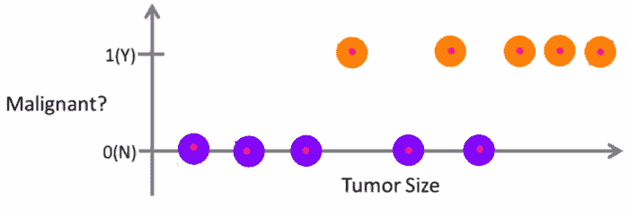

逻辑回归的输出示例

使用[线性回归](https://kumudlakara.medium.com/basics-and-beyond-linear-regression-c12d99a4df35)解决另一种类型的监督机器学习问题，即回归问题。

在任何监督学习问题中，我们的目标很简单:

*“给定一个训练集，我们想学习一个函数 h: X →Y，使得 h(x)是对 Y 的相应值的一个很好的预测”*

这里 *h(x)* 被称为假设函数，基本上是我们试图通过我们的学习算法预测的(在这种情况下是逻辑回归)。

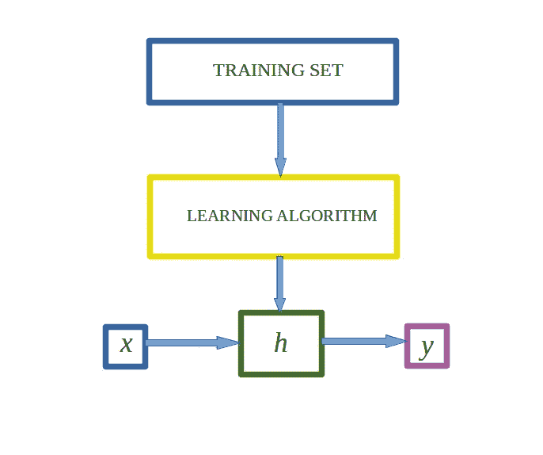

h 将 x 映射到 y

线性回归和逻辑回归的主要区别在于假设函数 *h(x)* 。让我们从二元分类开始，然后我们可以很容易地将这种观点扩展到多类分类。

# 假设函数

我们希望我们的分类器输出介于 0 和 1 之间的值，为此，我们需要使用一个特殊的假设函数来映射介于 0 和 1 之间的值。有许多这样的函数可用，但在进行逻辑回归时，sigmoid 函数似乎表现得最好。让我们来看看逻辑回归的假设方程:

假设方程和 sigmoid 函数

*g(z)* 是 sigmoid 函数，在我们的例子中*z =θ’x*其中*θ’*是 *θ* 的转置。假设函数现在看起来像这样:

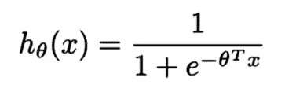

逻辑回归的假设函数

sigmoid 函数也称为逻辑函数。sigmoid 函数的图形看起来像这样:

sigmoid 函数的图形

从图中我们可以看到，sigmoid 函数正是我们想要的分类器。它将 X 轴上的所有实数值映射到 Y 轴上的[0，1]之间。

# 但是我们的输出不是应该是离散的吗？

是的，我们的“分类器”的输出仍然是离散的。这里我们说的是我们假设函数 *h(x)* 的输出。你现在可能已经明白了，这意味着我们的假设函数的精确的原始输出并不是我们的分类器的输出。现在让我们来解释这个假设函数，看看它能有什么帮助。

假设函数 *h(x)* 并不是我们分类器的最终输出，实际上它是给定输入 *x* 的 *y = 1* 的概率。例如:如果我们考虑一封电子邮件是否被分类为垃圾邮件，那么 *h(x) = 0.6* 意味着该电子邮件有 60%的可能性是垃圾邮件。

因此，该假设也可以表示为

*h(x)= P(y = 1 | x；θ)*

在上面的等式中，右手边是给定由 *θ参数化的 *x* 时 *y = 1* 的概率。*我们必须记住 *θ* 这里是假设中的参数向量。由于我们现在正在讨论二元分类，因此很明显 y=0 或 y=1，因此:

p(y = 0 | x*；θ)= 1—*P(y = 1 | x*；θ)*

假设函数实际上创建了一条线或曲线来分隔 y = 0 和 y = 1 的区域。这条线或曲线就是我们所说的决策边界。现在，让我们最终到达我们从假设中找到输出的部分。

一种方法是当 *h(x)* 的输出大于或等于 0.5 时预测 *y* =1，当 *h(x)* 小于 0.5 时预测 *y* =0。现在，让我们再次看看 sigmoid 函数:

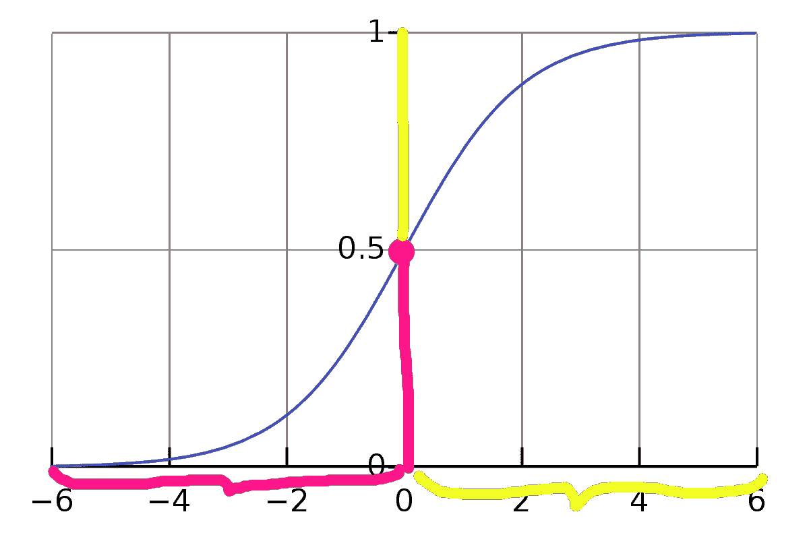

Sigmoid 函数

到目前为止，我们已经得出了这个结论:

*y* = 1 如果*h(x)*≥0.5→上图中黄色区域

*y*= 0 if*h(x)*<0.5→上图中标注粉色的区域

在上面的等式中，我们可以用 *g(z)* 替换 *h(x)* ，记住我们最初关于假设和 sigmoid 函数的讨论。从图中还可以看出:

当 *z* ≥ 0 时 *g(z)* ≥ 0.5(均以黄色标注)

*g(z)* < 0.5 当 *z* < 0 时(均以粉红色标注)。

好了，这就是关于假设函数的全部内容。现在我们有了一个假设，我们可以将输入 *x* 传递给它，并获得分类器的二进制输出。

现在我们有了一个假设，我们需要评估我们的假设有多好。为此，我们需要计算我们预测的“成本”,这基本上是对我们的预测与真实值接近程度的衡量。这就是成本函数发挥作用的地方。

# 价值函数

如果我们的输出是 *h(x)* ，而实际输出应该是 *y* ，那么成本函数实质上找到了我们希望我们的模型产生的“成本”。因此，成本实际上应该与 *h(x)* 和 *y* 之差成比例，这变得非常直观。

嗯，我们不能使用与线性回归相同的成本函数，因为逻辑回归的输出将是“波动的”,因此会导致许多局部最优。

线性回归的成本函数如下所示:

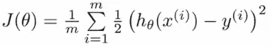

逻辑回归的成本函数

我们不能将这个成本函数用于逻辑回归，原因是线性回归和逻辑回归的假设不同。逻辑回归的假设涉及一个 sigmoid 函数，因此是一个复杂的非线性函数。如果我们把这个非线性的 *h(x)* 放到上面的 *J(θ)* 的方程中，我们会得到一个非凸函数。现在这是一个问题，因为一个复杂的非凸函数会有许多局部最优值，因此梯度下降将变得越来越困难。由于这个原因，我们需要一个凸函数，这样梯度下降可以找到全局最小值。

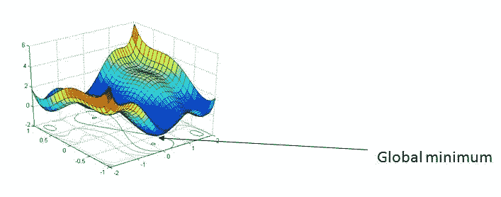

非凸梯度下降的 3d 图

好了，现在让我们看看如何用逻辑回归的 *h(x)* 来实现这个凸成本函数。首先，让我们用以下等式取代上一等式中的平方误差项:

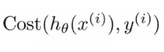

所以现在我们的成本函数看起来像这样:

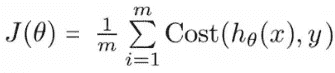

现在让我们定义这个*成本:*

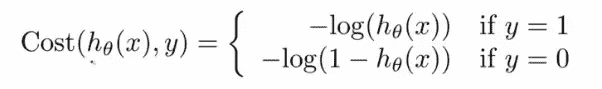

这实际上是我们的逻辑回归成本函数。如果这还没有直观的意义，请不要担心。在这里，图形表示应该会有所帮助:

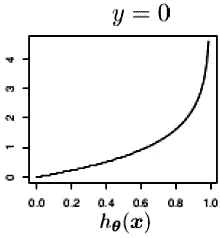

当 y=0 时，绘制成本图(h(x)，y)

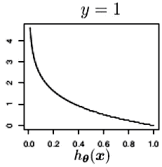

当 y=1 时，绘制成本图(h(x)，y)

从上面的图表中，我们可以得出对成本函数的数学理解如下:

> 如果 h(x) = y，则 Cost(h(x)，y) = 0
> 
> Cost(h(x)，y) →∞如果 y = 0 且 h(x) →1
> 
> Cost(h(x)，y) →∞如果 y = 1 且 h(x) →0

这意味着，如果正确答案应该是 *y=0* ，那么如果我们的假设函数也输出 0，那么我们的成本函数将是 0。但是如果我们的假设接近 1，那么我们的成本函数就接近无穷大(∞)。类似地，如果正确答案是 1，那么如果我们的假设输出 1，我们的成本函数将是 0，如果 *h(x)=0* ，它将接近无穷大(∞)。这正是我们想要我们的成本函数做的。如果模型预测正确，我们希望模型产生 0 成本，如果预测与正确标签完全相反，我们希望模型产生最大成本( *y* )。像这样定义成本函数保证了 *J(θ)* 对于逻辑回归是凸的。

现在让我们使用上面定义的逻辑来简化我们的*成本*函数，如下所示:

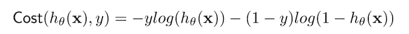

您可以通过插入 *y=0* 并评估表达式，然后插入 *y=1* 并再次评估成本来验证成本函数的表达式。你会发现你得到了和我们之前定义的相同的成本方程。

现在整个成本函数变成了:

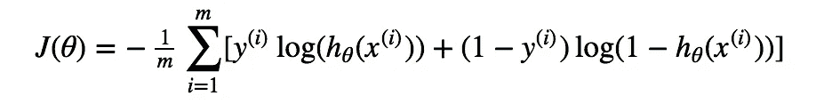

好了，现在我们有了成本函数。下一步当然是优化我们的参数，为此我们利用梯度下降。

# 梯度下降

梯度下降本身就是一个相当大的话题。要详细了解梯度下降，请务必查看同一个系列中的帖子，它将带您从最基础的开始进行梯度下降:

 [## 基础和超越:梯度下降

### 这篇文章旨在带你从梯度下降的基本概念到高级概念。从…开始时

kumudlakara.medium.com](https://kumudlakara.medium.com/basics-and-beyond-gradient-descent-87fa964c31dd) 

出于我们的目的，我们将直接跳到算法:

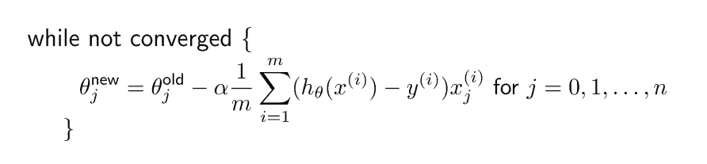

逻辑回归的梯度下降

这里我们可以看到，这个算法实际上和我们在线性回归的例子中看到的是一样的。然而，唯一的区别是假设函数 *h(x)* 的定义，它是逻辑回归情况下的 sigmoid 函数。上面的等式是梯度下降的主要“更新”步骤，其中在最小化成本之后，我们试图在正确的方向上更新我们的参数。 *α* 这里是学习率。

嗯，大概就是这样。这就是逻辑回归的全部。到目前为止，为了便于理解，我们已经讨论了二元分类。然而，我们的方法可以很容易地扩展到多类分类问题的情况。让我们快速看一下。

# 多类分类:一个对所有

当我们有…嗯，“多个”类(超过 2 个类)时，我们使用这种方法。所以我们的 *y* 不再仅仅是 0 或 1，而是 *y* 也可以取其他离散值。记住虽然 y={0，1，…。，n}，y 仍然是离散的。

这里的方法实际上很简单。我们把问题分成多个(准确的说是 n+1 个)二元分类问题。在每一个例子中，我们都预测了 *y* 是我们其中一个类的成员的概率。所以基本上我们选择一个类，把所有其他类放在一个单独的第二类中。这现在变成了一个二元分类问题，我们知道如何解决这些问题。这个迷你二进制分类问题的输出将会给我们一个概率，这个概率是我们选择的第一个类中的一个，这个类没有和其他类放在一起。现在，我们只需对每个类重复此操作，然后使用返回最高值的假设作为我们的预测，因为该假设显示了我们预测正确的最大概率。因此，我们最终选择最大化 *h(x)* 或 *y=1* 的概率的类。

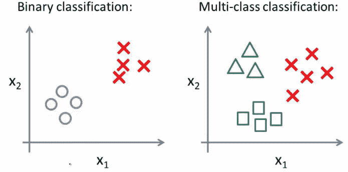

二元分类与多类分类

# 就是这样！

干得好！你现在知道什么是逻辑回归以及它是如何工作的了。如果你第一次没有理解所有的数学，不要担心。起初这看起来有点令人畏惧，但是掌握它的秘诀是不断复习基础知识，并让它们绝对清晰。好了，现在你应该能够完全理解任何实现逻辑回归的代码了。在本系列的实现文章之前，我建议您查看一些逻辑回归的实现，并尝试将代码拆开，理解一切是如何工作的。

# 参考

1.  [http://www.holehouse.org/](https://www.holehouse.org/)
2.  Marc Peter Deisenroth，A. Aldo Faisal，Cheng Soon Ong
3.  https://www.coursera.org/learn/machine-learning/home/