# 如何以 AWS Lambda 为后端构建自定义亚马逊 Alexa 技能？

> 原文：<https://medium.com/analytics-vidhya/basics-for-developing-a-custom-alexa-skill-with-aws-lambda-as-backend-5ac115c2919?source=collection_archive---------7----------------------->


欢迎来到 Alexa 技能包，你可以说你好！

大家好，a 偶然为我的公司开发这个 Alexa 技能项目，并努力获得一个平稳的开端，所以我写这篇博客，以帮助他人。希望这对你有帮助。:)

# 设置 ASK SDK

本指南描述了如何安装 ASK SDK for Python，为开发 Alexa 技能做准备。我在后端使用了 AWS lambda 函数，因为与 Alexa 开发者控制台和许多其他很酷的东西相比，你可以在这里调试。

# 先决条件

Python 的 ASK SDK 需要 **Python 2 ( > = 2.7)** 或者 **Python 3 ( > = 3.6)** 。继续之前，请确保您安装了受支持的 Python 版本。要显示版本，请在命令提示符下运行以下命令:

```
$ python --version
Python 3.6.5
```

# 将 ASK SDK for Python 添加到项目中

许多 Python 开发人员更喜欢在虚拟环境中工作，我也是，所以在这篇博客中，我将只讨论虚拟环境。虚拟环境是一个独立的 Python 环境，有助于管理项目依赖性和包版本。最简单的入门方法是在虚拟环境中安装 SDK。

```
$ pip install virtualenv
```

接下来，为你的 Alexa 技能创建一个新文件夹，并导航到该文件夹:

```
$ mkdir skill
$ cd skill
```

接下来，通过发出以下命令创建一个名为`skill_env`的虚拟环境:

```
$ virtualenv skill_env
```

接下来，激活您的虚拟环境并安装 SDK。

运行以下命令激活您的虚拟环境:

```
$ skill_env\Scripts\activate
```

命令提示符现在应该以 *(skill_env)* 为前缀，表明您正在虚拟环境中工作。使用以下命令安装 ASK Python SDK:

```
(skill_env)$ pip install ask-sdk
```

SDK 将被安装在`skill\Lib\site-packages`文件夹中。site-packages 文件夹中包含的目录包括:

```
ask_sdk
ask_sdk_core
ask_sdk_dynamodb
ask_sdk_model
boto3
...
```

# 发展你的第一项技能

# 先决条件

除了已安装的 ASK SDK for Python 版本之外，您还需要:

*   一个亚马逊开发者账户。这是创建和配置 Alexa 的技能所必需的。
*   一个[亚马逊网络服务](https://aws.amazon.com/)账户。这是在 AWS Lambda 上托管技能所必需的。

# 创建 Hello World

您将在一个名为`hello_world.py`的 python 文件中编写您的 Hello World。在您之前创建的`skill`文件夹中，使用您喜欢的文本编辑器或 IDE 创建一个名为`hello_world.py`的文件。

# 实现 Hello World

# 请求处理程序

自定义技能需要响应 Alexa 服务发送的事件。例如，当你问你的 Alexa 设备(如回声，回声点，回声显示等。)要“打开 hello world”，您的技能需要响应发送给您的 Hello World 技能的启动请求。使用 ASK SDK for Python，您只需编写一个请求处理程序，即处理传入请求并返回响应的代码。您的代码负责确保使用正确的请求处理程序来处理传入的请求并提供响应。

首先创建一个技能生成器对象。技能生成器对象有助于添加负责处理输入请求和为您的技能生成自定义响应的组件。

将以下代码键入或粘贴到您的`hello_world.py`文件中。

```
from ask_sdk_core.skill_builder import SkillBuildersb = SkillBuilder()
```

为了使用处理程序类，每个请求处理程序都被编写为一个类，它实现了`AbstractRequestHandler`类的两个方法；`can_handle`和`handle`。

`can_handle`该方法返回一个布尔值，表明请求处理程序是否可以为请求创建适当的响应。`can_handle`方法可以访问请求类型和附加属性，这些属性可能是技能在以前的请求中设置的，甚至是从以前的交互中保存的。Hello World 技能只需要引用请求信息来决定每个处理程序是否可以响应传入的请求。

# 启动请求处理程序

下面的代码示例显示了如何配置当技能接收到一个 [LaunchRequest](https://developer.amazon.com/en-US/docs/alexa/custom-skills/request-types-reference.html#launchrequest) 时要调用的处理程序。在没有特定意图的情况下调用技能时，会发生 LaunchRequest 事件。

将以下代码键入或粘贴到您的`hello_world.py`文件中，在前面的代码之后。

```
from ask_sdk_core.dispatch_components import AbstractRequestHandler
from ask_sdk_core.utils import is_request_type, is_intent_name
from ask_sdk_core.handler_input import HandlerInput
from ask_sdk_model import Response
from ask_sdk_model.ui import SimpleCardclass LaunchRequestHandler(AbstractRequestHandler):
    def can_handle(self, handler_input):
        *# type: (HandlerInput) -> bool*
        return is_request_type("LaunchRequest")(handler_input) def handle(self, handler_input):
        *# type: (HandlerInput) -> Response*
        speech_text = "Welcome to the Alexa Skills Kit, you can say hello!" handler_input.response_builder.speak(speech_text).set_card(
            SimpleCard("Hello World", speech_text)).set_should_end_session(
            False)
        return handler_input.response_builder.response
```

如果传入的请求是一个 LaunchRequest，can_handle 函数返回 **True** 。handle 函数生成并返回一个基本的问候响应。

# HelloWorldIntent 事件处理程序

下面的代码示例显示了如何配置一个处理程序，以便在技能收到名为 HelloWorldIntent 的意向请求时调用。在前一个处理程序之后，键入或粘贴以下代码到您的`hello_world.py`文件中。

```
class HelloWorldIntentHandler(AbstractRequestHandler):
    def can_handle(self, handler_input):
        *# type: (HandlerInput) -> bool*
        return is_intent_name("HelloWorldIntent")(handler_input) def handle(self, handler_input):
        *# type: (HandlerInput) -> Response*
        speech_text = "Hello World" handler_input.response_builder.speak(speech_text).set_card(
            SimpleCard("Hello World", speech_text)).set_should_end_session(
            True)
        return handler_input.response_builder.response
```

can_handle 函数检测传入请求是否为 [IntentRequest](https://developer.amazon.com/en-US/docs/alexa/custom-skills/request-types-reference.html#intentrequest) ，如果 intent 名称为 HelloWorldIntent，则返回 **True** 。handle 函数生成并返回一个基本的“Hello World”响应。

# 帮助意图处理程序

下面的代码示例显示了如何配置一个处理程序，以便在技能接收到内置意图 [AMAZON 时调用。帮助意向](https://developer.amazon.com/en-US/docs/alexa/custom-skills/standard-built-in-intents.html#available-standard-built-in-intents)。在前一个处理程序之后，键入或粘贴以下代码到您的`hello_world.py file`中。

```
class HelpIntentHandler(AbstractRequestHandler):
    def can_handle(self, handler_input):
        *# type: (HandlerInput) -> bool*
        return is_intent_name("AMAZON.HelpIntent")(handler_input) def handle(self, handler_input):
        *# type: (HandlerInput) -> Response*
        speech_text = "You can say hello to me!" handler_input.response_builder.speak(speech_text).ask(speech_text).set_card(
            SimpleCard("Hello World", speech_text))
        return handler_input.response_builder.response
```

与前面的处理程序类似，该处理程序将 IntentRequest 与预期的 intent 名称进行匹配。返回基本的帮助指令，`.ask(speech_text)`使用户的麦克风打开，供用户响应。

# CancelAndStopIntent 处理程序

CancelAndStopIntentHandler 类似于 HelpIntent 处理程序，因为它也是由内置的 [AMAZON 触发的。取消或亚马逊。停止意图](https://developer.amazon.com/en-US/docs/alexa/custom-skills/standard-built-in-intents.html#available-standard-built-in-intents)。以下示例使用单个处理程序来响应这两种意图。将以下代码键入或粘贴到您的`hello_world.py`文件中，在前面的处理程序之后。

```
class CancelAndStopIntentHandler(AbstractRequestHandler):
    def can_handle(self, handler_input):
        *# type: (HandlerInput) -> bool*
        return is_intent_name("AMAZON.CancelIntent")(handler_input)
                or is_intent_name("AMAZON.StopIntent")(handler_input) def handle(self, handler_input):
        *# type: (HandlerInput) -> Response*
        speech_text = "Goodbye!" handler_input.response_builder.speak(speech_text).set_card(
            SimpleCard("Hello World", speech_text)).set_should_end_session(True)
        return handler_input.response_builder.response
```

对这两种意图的响应是相同的，因此使用单一处理程序可以减少重复代码。

# SessionEndedRequest 处理程序

虽然在接收到一个 [SessionEndedRequest](https://developer.amazon.com/en-US/docs/alexa/custom-skills/request-types-reference.html#sessionendedrequest) 之后，您不能返回一个带有任何语音、卡片或指令的响应，但是 SessionEndedRequestHandler 是一个放置您的清理逻辑的好地方。在前一个处理程序之后，键入或粘贴以下代码到您的`hello_world.py`文件中。

```
class SessionEndedRequestHandler(AbstractRequestHandler):
    def can_handle(self, handler_input):
        *# type: (HandlerInput) -> bool*
        return is_request_type("SessionEndedRequest")(handler_input) def handle(self, handler_input):
        *# type: (HandlerInput) -> Response*
        *# any cleanup logic goes here* return handler_input.response_builder.response
```

# 实现异常处理程序

以下示例向您的技能添加了一个*无所不包*异常处理程序，以确保该技能为所有异常返回一条有意义的消息。将以下代码键入或粘贴到您的`hello_world.py`文件中，在前面的处理程序之后。

```
from ask_sdk_core.dispatch_components import AbstractExceptionHandlerclass AllExceptionHandler(AbstractExceptionHandler): def can_handle(self, handler_input, exception):
        *# type: (HandlerInput, Exception) -> bool*
        return True def handle(self, handler_input, exception):
        *# type: (HandlerInput, Exception) -> Response*
        *# Log the exception in CloudWatch Logs*
        print(exception) speech = "Sorry, I didn't get it. Can you please say it again!!"
        handler_input.response_builder.speak(speech).ask(speech)
        return handler_input.response_builder.response
```

# 创建 Lambda 处理器

[Lambda 处理程序](https://docs.aws.amazon.com/lambda/latest/dg/python-programming-model-handler-types.html)是 AWS Lambda 函数的入口点。下面的代码示例创建一个 Lambda 处理程序函数，将所有入站请求路由到您的技能。Lambda handler 函数创建一个 SDK skill 实例，该实例配置了您刚刚创建的请求处理程序。将以下代码键入或粘贴到您的`hello_world.py`文件中，在前一个处理程序之后。

```
sb.add_request_handler(LaunchRequestHandler())
sb.add_request_handler(HelloWorldIntentHandler())
sb.add_request_handler(HelpIntentHandler())
sb.add_request_handler(CancelAndStopIntentHandler())
sb.add_request_handler(SessionEndedRequestHandler())sb.add_exception_handler(AllExceptionHandler())handler = sb.lambda_handler()
```

一旦你创建了你的 AWS Lambda 函数，是时候给 Alexa 服务调用它的能力了。为此，导航到 Lambda 配置中的**触发器**选项卡，并添加 **Alexa 技能工具包**作为触发器类型。完成后，上传上一步生成的文件`skill.zip`，并用 module_name.handler 填充*处理程序*信息，在本例中为`hello_world.handler`。

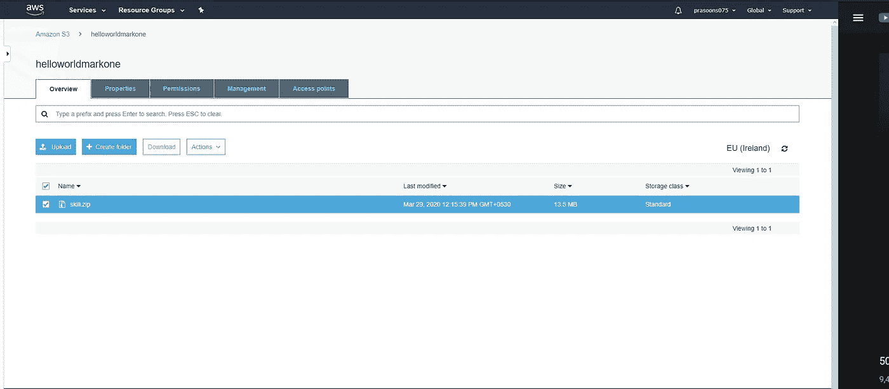

# 配置和测试您的技能

现在技能代码已经上传到 AWS Lambda 了，可以用 Alexa 配置技能了。

*   按照以下步骤创建新技能:

1.  登录 [Alexa 技能工具包开发者控制台](https://developer.amazon.com/alexa/console/ask)。
2.  点击右上角的**创造技能**按钮。
3.  输入“mark1”作为您的技能名称，然后单击下一步。
4.  对于模型，选择**自定义**，点击**创建技能**。

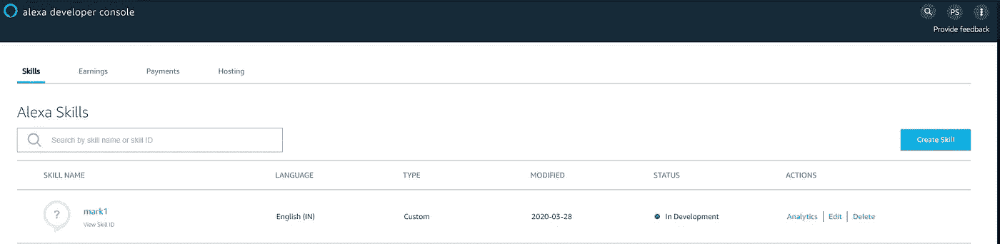

此处技能名称为“mark1”。

*   接下来，定义技能的交互模型。从工具条中选择**调用**选项，输入**技能调用名称**的“欢迎者”。

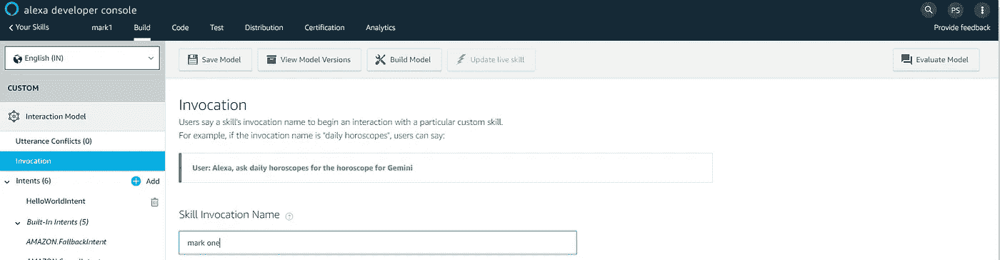

调用名称“标记一”。

*   接下来，向交互模型添加一个名为`HelloWorldIntent`的意图。点击交互模型的 Intents 部分下的 **Add** 按钮。保持选择**创建自定义意图**，输入 **HelloWorldIntent** 作为意图名称，并创建意图。在 intent detail 页面上，添加一些示例语句，用户可以说出这些语句来调用 intent。对于这个例子，考虑下面的示例话语，并随意添加其他的。

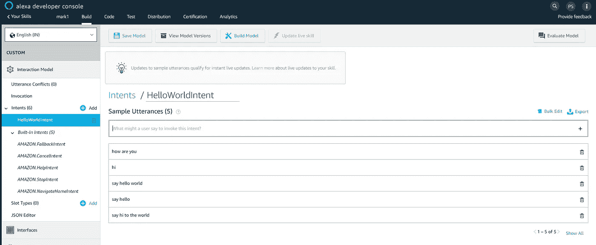

*   由于`AMAZON.CancelIntent`、`AMAZON.HelpIntent`和`AMAZON.StopIntent`是内置的 Alexa 意图，您不需要为它们提供示例语句。
*   编辑完交互模型后，一定要保存并构建模型。
*   接下来，为技能配置端点。为此，请按照下列步骤操作:

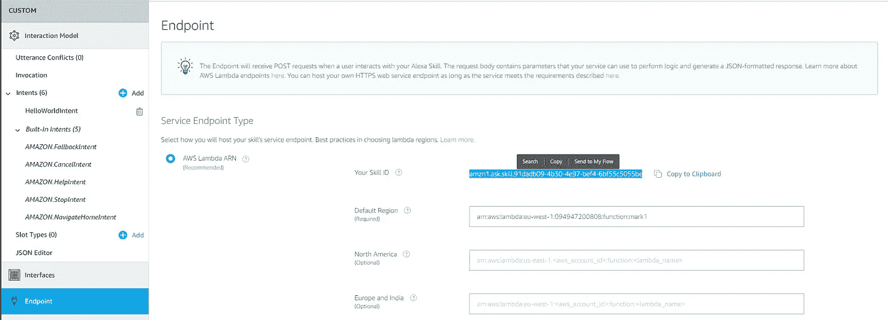

在新选项卡中打开 AWS 开发人员控制台。

导航到上一步中创建的 AWS Lambda 函数。

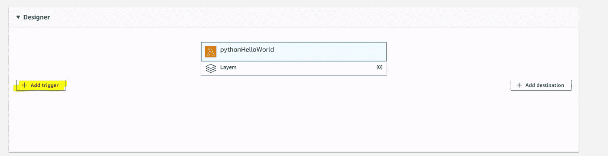

从**设计器**菜单中，添加 **Alexa 技能包**触发菜单，向下滚动将技能 ID 粘贴到**技能 ID 验证**配置中。完成后点击**添加并保存**以更新 AWS Lambda 功能。

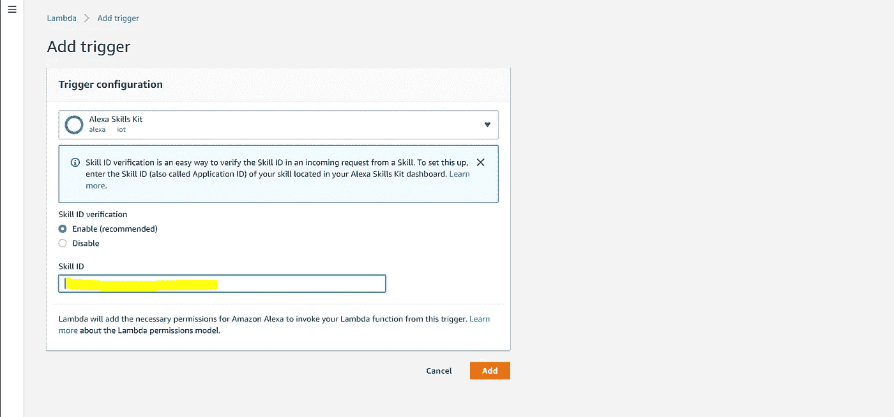

从页面右上角复制 AWS Lambda 函数 **ARN** 。ARN 是一个唯一的资源号，帮助 Alexa 服务识别它在技能调用期间需要调用的 AWS Lambda 函数。

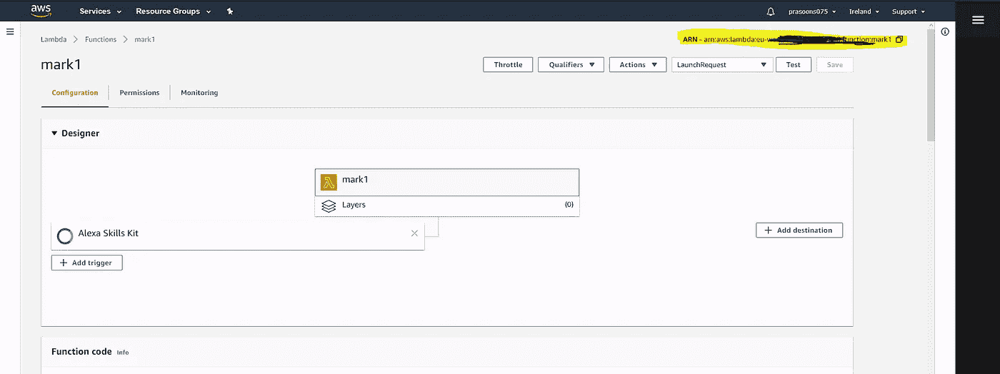

导航到 Alexa 技能工具包开发者控制台，点击你的**标记 1** 技能。

在您的技能下，点击**端点**选项卡，选择 **AWS Lambda ARN** 并粘贴在**默认区域**字段下的 ARN 中。

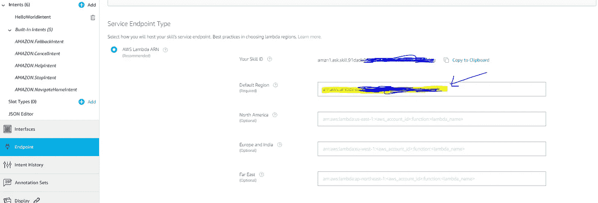

其余设置可以保留默认值。点击**保存端点**。

点击**调用**选项卡，保存并建立模型。

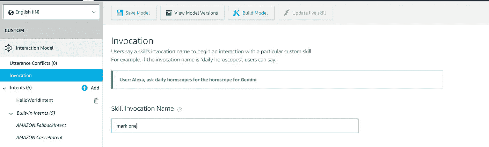

此时，可以测试技能了。在顶部导航中，点击**测试**。确保该技能的**测试已启用**选项已启用。您可以使用测试页面以文本和语音形式模拟请求。

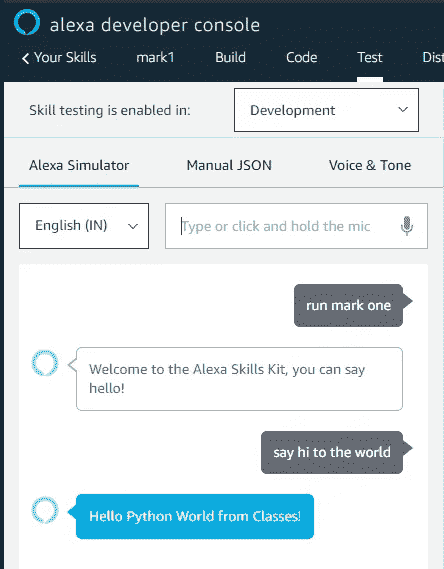

使用调用名和一个示例语句作为指导。例如，*告诉迎宾员说你好*应该会让你的技能用“你好，世界”的声音和带显示屏的设备上的“你好，世界”卡片来回应。你也可以在手机上或在[https://alexa.amazon.com](https://alexa.amazon.com/)打开 Alexa 应用程序，在**你的技能**下查看你的技能。

请随意开始试验您的意图以及技能代码中相应的请求处理程序。一旦你完成了迭代，可选地继续获得你的技能认证和发布，这样它可以被世界各地的客户使用。

你可以在这里找到上面[的完整代码。](https://github.com/prasoons075/Alexa-Skill/blob/master/hello_world.py)