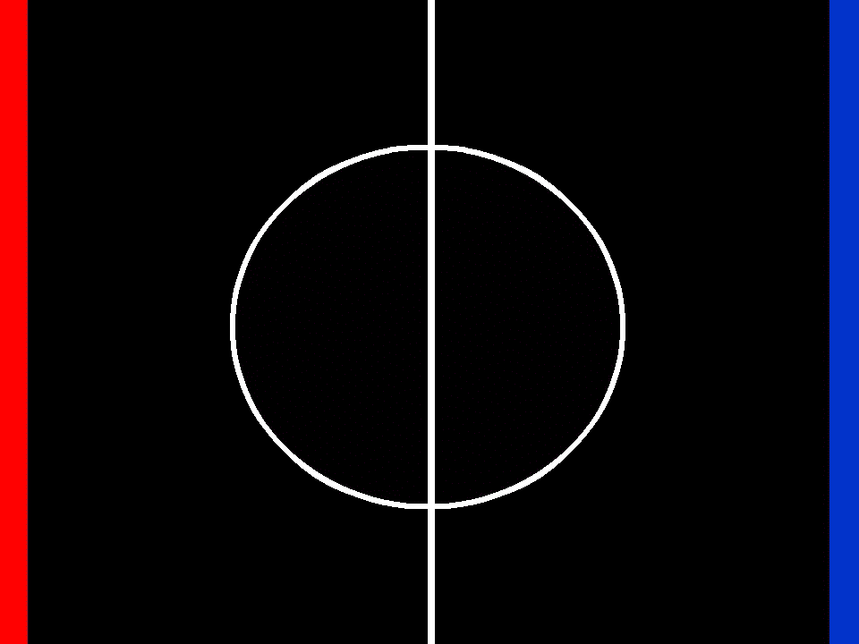
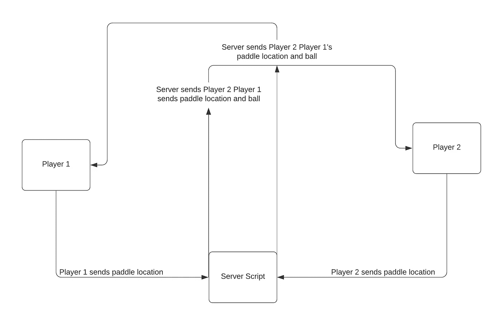
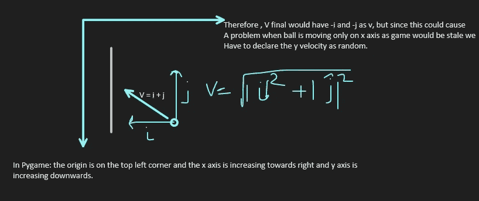
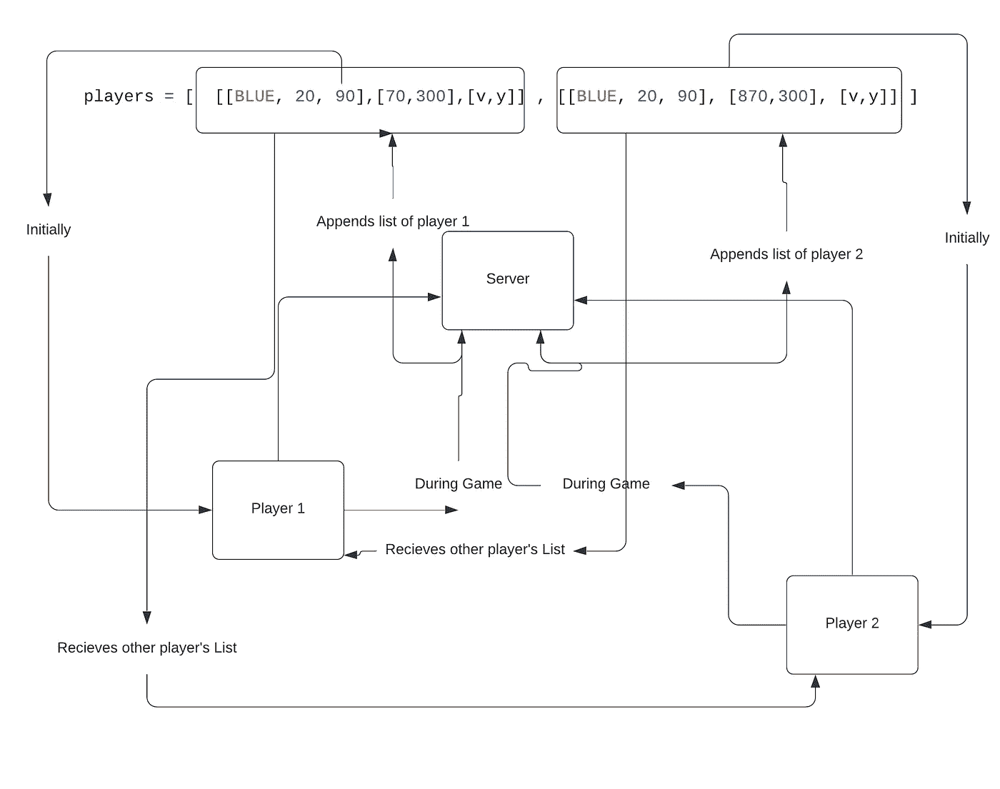

# python 中的网络通信基础

> 原文：<https://medium.com/analytics-vidhya/basics-for-network-communication-on-python-af3f677af42c?source=collection_archive---------10----------------------->

这将是一个在 Pygame 上制作一个在线乒乓球游戏，以及使用 pickle 制作你的后端和前端框架的教程。



经典的乒乓球



网络游戏的流程

正如你所看到的，当玩家 1 或玩家 2 移动他们的球拍时，他们会将球拍坐标发送到服务器，作为回报，他们会收到其他玩家的球拍位置和球的位置

让我们开始吧:

首先，创建一个文件夹，在其中创建以下文件:

ball.py

main.py

network.py

paddle.py

记分牌. py

server.py

并下载这些图片:

[背景](https://github.com/Shubhaankar-sharma/ping-pong-online/blob/master/background.png?raw=true)

[图标](https://github.com/Shubhaankar-sharma/ping-pong-online/blob/master/pong.png?raw=true)

让我们从编辑 main.py 文件开始

首次下载 Pygame:

```
On CMD:
pip install pygame
```

现在打开 main.py:

并开始编写初始化屏幕的基本代码…现在我喜欢全屏，所以我使用了全屏选项，这是声明屏幕的高度，宽度变量的最佳实践，因此它是可调整大小的，而不是硬编码的…但为了本教程的缘故，我将使用全屏。

```
import pygame
import sys, os
#now import the background
#As i like to be safe i always import from os
def resource_path(relative_path):
        if hasattr(sys, '_MEIPASS'):
            return os.path.join(sys._MEIPASS, relative_path)
        return os.path.join(os.path.abspath("."), relative_path)# initialization (do this in every game pygame.init())
pygame.init()#Declaring colors so that we don't have to set rgb values again
BLACK = (0, 0, 0)
WHITE = (255, 255, 255)
RED = (255, 0, 0)
BLUE = (0, 0, 255)# creating a screen
screen = pygame.display.set_mode((960, 720), pygame.DOUBLEBUF | pygame.FULLSCREEN)# title and icon
pygame.display.set_caption("Pong by shubhaankar")
icon = pygame.image.load(resource_path('pong.png')) 
pygame.display.set_icon(icon)# background
background = pygame.image.load(resource_path('background.png'))#main game
def main():
     #initialization of game
     clock =  pygame.time.Clock()  #FPS
     running = True
     pos = []   #list of positions of objects                             
     #main game loop(always running)
     while running:  
         for event in pygame.event.get():
              if event.type == pygame.KEYDOWN:
                  if event.key == pygame.K_ESCAPE: ##Hit Esc to quit
                          running = False
         screen.blit(background, (0, 0))#refresh screen
         pygame.display.flip()
         clock.tick(120)     #FPSmain()
pygame.quit()
```

现在打开您创建的 paddle.py 文件…我们将在其中创建一个 paddle 类…

```
import pygame
RED = (0,0,0)
class Paddle(pygame.sprite.Sprite):
	def __init__(self,color,width,height):
		super().__init__()self.image = pygame.Surface([width,height])
		self.image.fill(RED)
		self.image.set_colorkey(RED)#drawing the paddle
		pygame.draw.rect(self.image,color,[0,0,width,height])
		self.rect = self.image.get_rect()
```

现在，这基本上是做的是，我们从 Pygame 中的一个精灵类继承我们的桨…..(精灵对象是可以制作动画的对象)

在 init 方法中，我们输入颜色、宽度、高度并绘制一个矩形…

现在你一定在想为什么我们要用精灵

好处是，当所有的精灵对象移动时，我们可以在一行代码中将它们添加到屏幕上，而对于单独的类，我们必须分别添加它们。

现在我们将添加以下功能:向上移动，向下移动，和用键划水移动。

```
def moveUp(self,pixels):
		self.rect.y -= pixels
		#to check if the paddle does not go off the screen
		if self.rect.y < 0 :
			self.rect.y = 0
	def moveDown(self,pixels):
		self.rect.y += pixels
		#to check if the paddle does not go off the screen
		if self.rect.y > 620 :
			self.rect.y = 620
	def paddle_movement(self):
			keys = pygame.key.get_pressed()
			# Player A
			if keys[pygame.K_UP]:
				self.moveUp(15)
			if keys[pygame.K_DOWN]:
				self.moveDown(15)
```

这是不言自明的…当移动时，你将减少 y 坐标，反之亦然

现在是 paddle.py 文件的完整代码:

```
import pygame
RED = (0,0,0)
class Paddle(pygame.sprite.Sprite):
	def __init__(self,color,width,height):
		super().__init__()self.image = pygame.Surface([width,height])
		self.image.fill(RED)
		self.image.set_colorkey(RED)#drawing the paddle
		pygame.draw.rect(self.image,color,[0,0,width,height])
		self.rect = self.image.get_rect()
	def moveUp(self,pixels):
		self.rect.y -= pixels
		#to check if the paddle does not go off the screen
		if self.rect.y < 0 :
			self.rect.y = 0
	def moveDown(self,pixels):
		self.rect.y += pixels
		#to check if the paddle does not go off the screen
		if self.rect.y > 620 :
			self.rect.y = 620
	def paddle_movement(self):
			keys = pygame.key.get_pressed()
			# Player A
			if keys[pygame.K_UP]:
				self.moveUp(15)
			if keys[pygame.K_DOWN]:
				self.moveDown(15)
```

同样，我们将在 ball.py 文件中创建一个 ball 类

```
import pygame
from random import randint
BLACK = (0,0,0)
class Ball(pygame.sprite.Sprite):
	def __init__(self,color,width,height,v,u):
		super().__init__()self.image = pygame.Surface([width,height])
		self.image.fill(BLACK)
		self.image.set_colorkey(BLACK)#drawing the ball
		pygame.draw.rect(self.image,color,[0,0,width,height])
		self.rect = self.image.get_rect()self.velocity = [v,u]# Fetch the rectangle object that has the dimensions #of the image.
		self.rect = self.image.get_rect()
```

现在，这几乎和桨一样，除了我们取球的初速度…

现在我们将添加球的运动:

```
def update(self):
	        self.rect.x += self.velocity[0]
	        self.rect.y += self.velocity[1]def bounce(self):
		self.velocity[0] = -self.velocity[0]
		self.velocity[1] = randint(-8, 8)
```

这仅仅是更新球的速度，(速度已经以类似于运动学中的向量的格式声明)并且当被调用时反弹函数通过改变方向来反弹球(就像光线从表面反弹)。

现在我们将确定球、球拍和边界之间的碰撞…



这个图表将解释拍球的机制

```
def movement(self,player,p2,scoreA,scoreB):
		if self.rect.x >= 950:
			scoreA += 1
			self.velocity[0] = -self.velocity[0]
		if self.rect.x <= 0:
			scoreB += 1
			self.velocity[0] = -self.velocity[0]
		if self.rect.y > 710:
			self.velocity[1] = -self.velocity[1]
		if self.rect.y < 0:
			self.velocity[1] = -self.velocity[1]
		if pygame.sprite.collide_mask(self, player) or pygame.sprite.collide_mask(self, p2):
			self.velocity[0] = -self.velocity[0]
			self.velocity[1] = self.velocity[1]
```

现在这决定了碰撞是否发生，如果碰撞发生了，我们就改变速度并反弹回来…

我们没有使用我们之前定义的反弹函数，好像我们调用这个函数每个球员的系统都可以取一个不同的随机整数，并改变球的路线…

但是你会问是什么阻止了球只在 x 轴上运动…我们马上就会看到这将如何发生…

在上面的代码行中，我们采用不同的桨，分数，然后调用它们的属性或特性，如速度、位置、高度、宽度来检查碰撞。现在，我已经硬编码了边框和拨片，但是你可以尝试添加一个屏幕属性，然后调用 screen.x 或 screen.y，然后尝试做同样的事情。

现在整个 ball.py 代码:

```
import pygame
from random import randint
BLACK = (0,0,0)
class Ball(pygame.sprite.Sprite):
	def __init__(self,color,width,height,v,u):
		super().__init__()  self.image = pygame.Surface([width,height])
		self.image.fill(BLACK)
		self.image.set_colorkey(BLACK) #drawing the ball
		pygame.draw.rect(self.image,color,[0,0,width,height])
		self.rect = self.image.get_rect()  self.velocity = [v,u] # Fetch the rectangle object that has the dimensions of the image.
		self.rect = self.image.get_rect()  def update(self):
			self.rect.x += self.velocity[0]
			self.rect.y += self.velocity[1] def bounce(self):
		self.velocity[0] = -self.velocity[0]
		self.velocity[1] = randint(-8, 8) def movement(self,player,p2,scoreA,scoreB):
		if self.rect.x >= 950:
			scoreA += 1
			self.velocity[0] = -self.velocity[0]
		if self.rect.x <= 0:
			scoreB += 1
			self.velocity[0] = -self.velocity[0]
		if self.rect.y > 710:
			self.velocity[1] = -self.velocity[1]
		if self.rect.y < 0:
			self.velocity[1] = -self.velocity[1]
		if pygame.sprite.collide_mask(self, player) or pygame.sprite.collide_mask(self, p2):
			self.velocity[0] = -self.velocity[0]
			self.velocity[1] = self.velocity[1]
```

现在打开 Network.py

在这里，我们将定义一些函数，我们的客户端将使用这些函数与服务器进行通信。

```
import socket
import pickle class Network:
    def __init__(self): ##this will connect to the server initially
        self.client = socket.socket(socket.AF_INET, socket.SOCK_STREAM)
        self.server = '192.168.1.3' #server ip #<---
        self.port = 5555   #server port #<---
        self.addr = (self.server, self.port)
        self.p = self.connect()
 def getP(self):
        return self.p def connect(self):
        try:
            self.client.connect(self.addr)
            return pickle.loads(self.client.recv(2048))
        except:
            pass def send(self, data):
        try:
            self.client.send(pickle.dumps(data))
            return pickle.loads(self.client.recv(2048))
        except socket.error as e:
            print(e)
```

这主要是语法…这里我们最初与服务器连接，并通过 python 类 Pickle 发送我们的初始数据，您可以在文档中阅读用法…

这些功能基本上执行以下操作:

getP 仅用于在服务器发送数据时从服务器接收数据

发送功能是发送数据和从服务器接收数据，正如我们之前所说的…

现在，这一切都结束了…

注意:根据您的需要更改 IP 和端口，我建议您在测试时可以检查您机器的本地 IPV4 地址，它可能有点像 192.168.0.1

我们现在将打开 server.py 脚本并开始在其中编码…

```
import socket
from _thread import *
from random import randint
import sysimport pickle BLACK = (0, 0, 0)
WHITE = (255, 255, 255)
RED = (255, 0, 0)
BLUE = (0, 0, 255)server = '192.168.1.3'
port = 5555
s = socket.socket(socket.AF_INET, socket.SOCK_STREAM)try:
    s.bind((server, port)) except socket.error as e:
    str(e)s.listen()
print("Waiting For a connection, Server Started")
```

这也只是基本的连接性内容，我们试图绑定在一个开放端口上，通常 web 服务器运行在 8000 或 8001 上，但由于我们只运行一个脚本…为了避免错误或传入连接，我们使用 5555

s.listen()打开连接端口

```
v,y = randint(4, 8), randint(-8, 8)
while y ==0:
    y = randint(-8,8)
```

在前一段代码下面写下:

这基本上是从服务器端声明球的速度，以便两个客户端接收相同的球速度。

正如我之前提到的，我们要做的是，防止球侧向移动，我们将运行一个 while 循环，如果 y 速度为零，我们将再次产生 y 速度

```
players = [  [ [BLUE, 20, 90],[70,300],[v,y] ]   ,[ [BLUE, 20, 90], [870,300], [v,y] ]   ]
```



在列表中，玩家[0]是玩家 1，玩家[1]是玩家 2

该流程图解释了列表的信息流程

每个球员名单有三个组成部分:

1.  桨的颜色、长度、宽度
2.  x，y 位置
3.  球的速度

```
# When Player initialy connects
def threaded_client(conn, player):
    conn.send(pickle.dumps(players[player]))
    reply = ''
    while True:
        try:
            data = pickle.loads(conn.recv(2048))
            players[player][1] = data[0] if not data:
                print("Disconnected")
                break else:
                if player == 1:
                    reply = players[0][1] else:
                    reply = players[1][1] print("Recieved: ", data)
                print("Sending:", reply)
            conn.sendall(pickle.dumps(reply))
        except:
            break print("Lost Connection")
    conn.close()
```

现在，这是非常简单的，当一个玩家连接服务器时，服务器根据玩家编号给玩家发送列表，然后它进入一个循环，当它接收到玩家列表时，它附加列表，然后它发送回其他玩家的列表

```
currentPlayer = 0
total = []
lst = []
while True:
    conn, addr = s.accept()
    print("Connected to:", addr)
    total.append(addr)
    lst.append(conn)
    lst.append(addr)
 if len(total) >1:
        conn_1 = lst[0]
        addr_1 = lst[1]
        conn_2 = lst[2]
        addr_2 = lst[3]
        print(len(total))
        start_new_thread(threaded_client, (conn_1, currentPlayer))
        currentPlayer += 1
        start_new_thread(threaded_client, (conn_2, currentPlayer))
```

我们将第一个玩家声明为 0，因此我们可以使用 players[0]来发送各自的玩家列表，同样，第二个玩家将为 1，因此我们将发送 players[1]。

我们放了一个 if 语句，这样我们就可以在两个玩家连接的时候开始发送信息，否则如果第一个玩家连接，他的游戏就会开始，球就会失控。

这基本上只是为我们上面声明的不同播放器启动了两个线程…

现在，整个 server.py 脚本

```
import socket
from _thread import *
from random import randint
import sysimport pickle BLACK = (0, 0, 0)
WHITE = (255, 255, 255)
RED = (255, 0, 0)
BLUE = (0, 0, 255)server = '192.168.1.3'
port = 5555
s = socket.socket(socket.AF_INET, socket.SOCK_STREAM)try:
    s.bind((server, port)) except socket.error as e:
    str(e)s.listen()
print("Waiting For a connection, Server Started")
v,y = randint(4, 8), randint(-8, 8)
while y ==0:
    y = randint(-8,8)
l = randint(-8,8)
players = [[[BLUE, 20, 90],[70,300],[v,y]],[ [BLUE, 20, 90],[870,300],[v,y]]] # When Player initialy connects
def threaded_client(conn, player):
    conn.send(pickle.dumps(players[player]))
    reply = ''
    while True:
        try:
            data = pickle.loads(conn.recv(2048))
            players[player][1] = data[0] if not data:
                print("Disconnected")
                break else:
                if player == 1:
                    reply = players[0][1] else:
                    reply = players[1][1] print("Recieved: ", data)
                print("Sending:", reply)
            conn.sendall(pickle.dumps(reply))
        except:
            break print("Lost Connection")
    conn.close() currentPlayer = 0
total = []
lst = []
while True:
    conn, addr = s.accept()
    print("Connected to:", addr)
    total.append(addr)
    lst.append(conn)
    lst.append(addr)
 if len(total) >1:
        conn_1 = lst[0]
        addr_1 = lst[1]
        conn_2 = lst[2]
        addr_2 = lst[3]
        print(len(total))
        start_new_thread(threaded_client, (conn_1, currentPlayer))
        currentPlayer += 1
        start_new_thread(threaded_client, (conn_2, currentPlayer))
```

现在我们将打开记分板文件并添加一个记分板

```
import pygamedef score(Ball, screen, WHITE, score_A,score_B ):
 font = pygame.font.Font(None, 74)
            text = font.render(str(score_A), 1, WHITE)
            screen.blit(text, (250, 10))
            text = font.render(str(score_B), 1, WHITE)
            screen.blit(text, (710, 10))
```

咻！！！

现在最后一部分将在 main.py 脚本中

在这里我们将添加球员和球，并使用网络模块

首先，我们需要在 main.py 文件中进行一些导入

```
from paddle import Paddle
from ball import Ball
from network import Network
from scoreboard import score
```

现在，我们将声明一个精灵列表

```
sprites_lists = pygame.sprite.Group()
```

现在我正在重新编写整个 main 函数，然后我会解释它:

```
def main():
        clock =  pygame.time.Clock()
        scoreA = 0
        scoreB = 0
        running = True
        n = Network()
        pos = [] while n.getP() is None:
            _ = 0
        player_1_list = n.getP()
        P = Paddle(player_1_list[0][0],player_1_list[0][1],player_1_list[0][2]) P.rect.x = player_1_list[1][0]
        P.rect.y = player_1_list[1][1]
        pos.append(player_1_list[1])
        p2 = Paddle(RED, 20, 90)
        sprites_lists.add(P)
        sprites_lists.add(p2) ball = Ball(WHITE, 20, 20,player_1_list[2][0],player_1_list[2][1])
        ball.rect.x = 472
        ball.rect.y = 350
        sprites_lists.add(ball)
        while running: p2_pos = n.send(pos)
                    print(p2_pos)
                    if type(p2_pos) == list:
                        p2.rect.x = p2_pos[0]
                        p2.rect.y = p2_pos[1]
                    for event in pygame.event.get(): if event.type == pygame.KEYDOWN:
                            if event.key == pygame.K_ESCAPE:
                                running = False P.paddle_movement() ball.movement(P, p2, scoreA, scoreB)
                    if ball.rect.x >= 950:
                        scoreA += 1
                    if ball.rect.x <= 0:
                        scoreB += 1
                    sprites_lists.update() screen.blit(background, (0, 0))
                    sprites_lists.draw(screen)
                    # Score
                    pos = [[P.rect.x,P.rect.y]] score(ball,screen,WHITE,scoreA,scoreB)
                    pygame.display.flip()
                    clock.tick(120)
```

我们基本上只是用 0 初始化得分 a 和 b

然后我们调用网络方法来初始化我们与服务器的连接

然后，我们还初始化了一个 pos 列表，在那里我们将存储我们的桨的速度，并将接收其他人的速度

然后我们使用 getP 函数，它将给出我们的初始属性

然后，当 getP 为空时，我们等待，直到另一个玩家没有连接

然后我们调用球拍，球类，并把我们从服务器收到的信息提供给他们

对手永远是红色的

我们正在将所有的桨球添加到精灵列表中

然后在主循环中，我们发送我们的信息并接收其他玩家的信息，我们将这些信息提供给我们在本地声明的对手的球拍

然后我们调用桨移动函数，这样我们就可以移动我们的桨了

然后我们说，如果球到了一个球员的边界，那么给另一个球员得分

然后，我们只是刷新屏幕来显示运动

然后我们用我们改变的速度重新声明列表

以及显示分数

代码已经完成，现在你可以运行服务器脚本，然后运行 main.py 脚本，或者在同一台机器上运行一个脚本，在另一台机器上运行一个脚本，然后享受游戏

我知道这个代码有错误，因为我没有通过服务器发送整个类，代码本来可以更干净，但为了解决基本问题，这是一个好的开始。