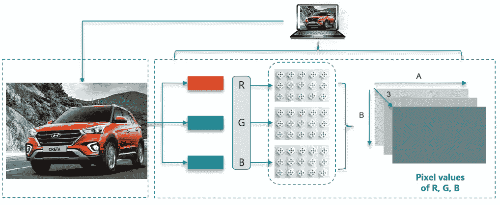
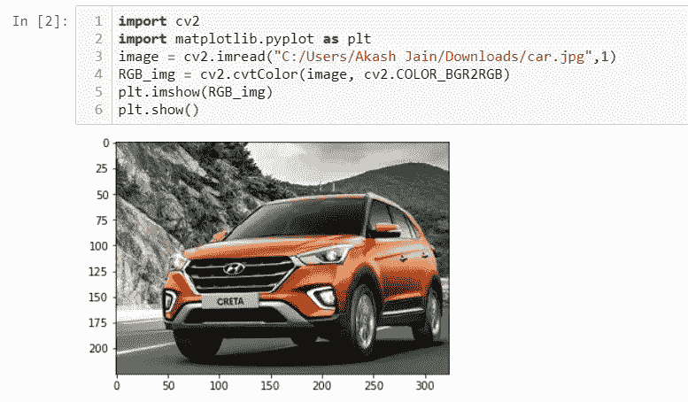
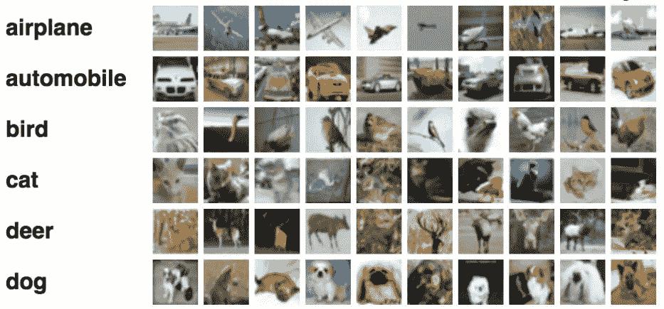
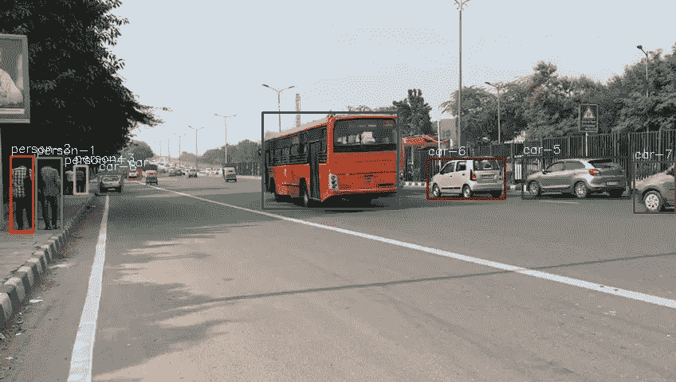
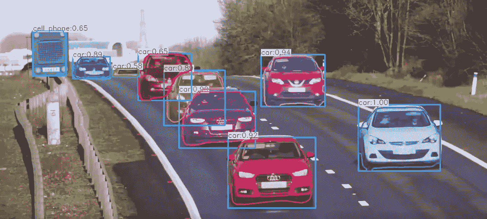
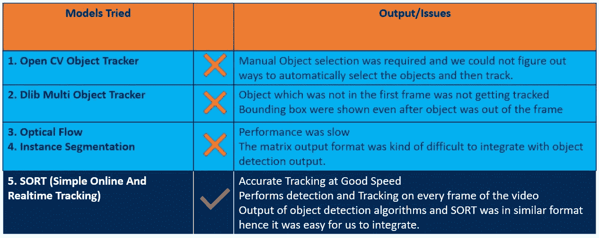
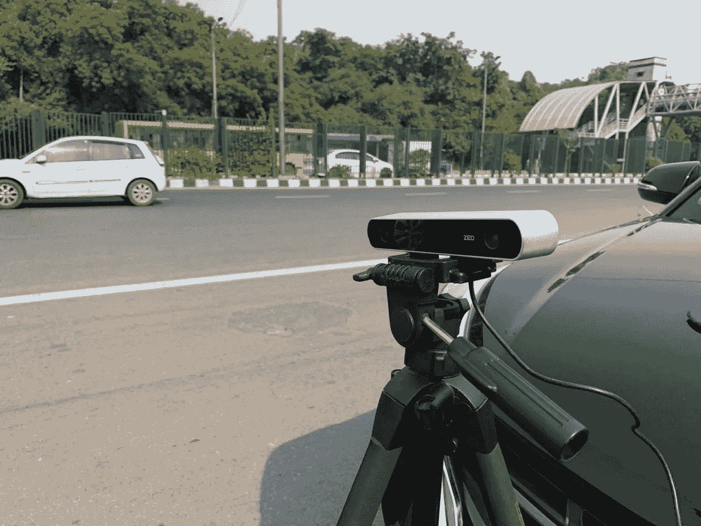

# 计算机视觉及其一些应用，如物体检测和跟踪

> 原文：<https://medium.com/analytics-vidhya/basics-of-computer-vision-and-some-of-its-application-d84ee847d4c0?source=collection_archive---------18----------------------->


基本上是让计算机看到并理解图像和视频的内容。简单。

互联网上充斥着大量的图像和视频，如果我们要索引和搜索图像，计算机需要知道图像包含什么。

这是计算机科学的一个领域，致力于使计算机能够像人类一样看到、识别和处理图像。这是人工智能的一个领域。

您可能想知道计算机视觉与图像处理有何不同？

嗯，图像处理是从现有图像创建新图像的过程，可能是通过以某种方式增强内容。它与理解图像的内容无关。

然而，计算机视觉背后的想法是理解图像的内容。可能需要对原始图像进行图像处理，例如裁剪、去除噪声、归一化、亮度等。

一个物体可以从任何方向，任何光线条件下被看到。真正的计算机视觉应该能够看到任意数量的图像，并且仍然能够提取一些有意义的东西。这是计算机视觉的主要挑战。

当你在 facebook 上上传一张图片的时候，有一个叫做自动标记的功能。脸书会给你自动建议标记谁在图像中的人。这一切都归功于计算机视觉。这个想法是将人类视觉系统可以完成的任务自动化。

说到这里，我们先来了解一下计算机是如何读取一幅图像的。一个正常人可以很容易地分辨出下图中的汽车。但是计算机真的能看到这些吗？答案是否定的。


计算机将图像视为 0 到 255 之间的数字矩阵。对于彩色图像，将有三个通道:红色、绿色和蓝色，即 RGB。并且将存在与每个通道相关联的矩阵。矩阵的每个元素将代表像素的亮度强度。所有这些通道相互叠加，形成 3D 矩阵。因此，计算机将图像解释为 3D 矩阵，如下图所示。



计算机视觉有三个主要的处理组件。

1.  **图像采集:**可以使用网络摄像头、DSLR、手机摄像头
2.  **图像处理:**边缘检测、分割、分类等。
3.  **图像分析:**物体识别，物体跟踪等。

当我在海德拉巴的 ISB 学习商业分析的时候，我和我的三个朋友一起做了一个为期三个月的顶点项目，为视觉障碍者制作智能眼镜。这个项目给了我们很多机会来探索和获得计算机视觉和深度学习的经验。我将试着用简单的例子来分享一些经验。但在此之前，我想用著名的计算机视觉库 OpenCV 展示一些图像处理的基础知识。

**OpenCV:** 开源计算机视觉库。它支持深度学习框架 pytorch、tensorflow 和 caffe。如果你想将面部识别应用于视频，做图像分类，物体检测等。你迟早需要学习 openCV。让我们从一些非常基本的步骤开始:

cv2.imread():用于读取图像。它需要两个参数:图像的路径和我们希望图像被阅读的方式。在下面的例子中,“1”意味着它将加载实际颜色的图像。你可能也注意到了为什么我在第 4 行把它转换成 RGB。OpenCV 使用 BGR 作为图像的默认颜色顺序，matplotlib 使用 RGB。当你在 matplotlib 中显示用 OpenCV 加载的图像时，通道将从后向前。解决这个问题最简单的方法是使用 OpenCV 将其显式转换回 RGB。下面我也解释了为什么我使用 matplotlib imshow()而不是 opencv imshow()。



cv2。加载一幅彩色图像。主要用于没有 alpha 通道的 8 位图像。在上面的示例中，您可以将“1”作为参数传递。意思是一样的。

cv2。im read _ gray:加载灰度图像。您可以在 imread()参数中传递“0”，它的含义是相同的。

cv2。VideoCapture():用于读取视频文件。如果您指定路径，它将读取视频文件。如果指定为 0，它会将网络摄像头作为输入视频。

```
video = cv2.VideoCapture('Test.avi')
```

cv2.imshow():查看图像/视频，如上例所示。请注意，cv2.imshow()在 jupyter 笔记本上不起作用。如果运行 cv2.imshow()，笔记本将停止响应。所以，我用过 matplotlib imshow()。

cv2.waitkey(0):它将一直等待，直到按下任何键

cv2.windowsdestroyall():它将销毁所有临时打开的窗口

诸如此类。继续探索功能，如调整大小，改变色彩空间，图像旋转，翻译，过滤等。如果你想知道细节。

现在，我将解释计算机视觉的一些应用。

**图像分类:**给整张图像分配一个标签。它也被称为目标分类或图像识别。有大量的类别可以对图像进行分类。假设你想给所有有汽车的图片分配一个标签。哪辆车不重要。



**物体检测:**通过包围盒定位图像中的物体，并且还识别图像中的每个物体。可用于面部检测、道路上的物体检测、车辆类型检测、任何事件中的行人计数等。在我们的项目中，我们使用对象检测算法来检测道路上的各种对象。有各种预训练模型，这些模型是在一些著名的公共图像数据集上训练的。预训练模型的问题是，它是在美国道路或任何发达国家的道路上训练的。如果我们在印度的道路上行驶，这不会给出很好的准确性，因为我们有人力车、汽车和各种其他类型的物体，它们不能被模型检测到。最好的方法是通过收集大量印度道路的视频/图像来训练模型，注释图像，然后训练模型。这是一个使用预训练的 YOLOv3 模型在印度道路上进行的对象检测的示例。不要担心写在边框上的数字。它用于跟踪视频中多个帧上的对象。



目标检测

**Yolo** (你只看一次)是最著名的物体检测算法。Yolov3 是 Yolo 的最新版本，经过更新，该算法更加精确，尤其是在检测小物体时。为了检测图像中的所有物体，它只需要看图像一次。这就是 Yolo 非常快的原因。这是关于 YOLO 的一个非常基本的信息。如果你想深入了解物体检测算法，你可以在这方面做更多的探索。还有各种各样的其他模型。我的意图只是给你一个关于这些主题的开始，然后如果你想获得更深入的知识，你可以更进一步。

**语义分割:**基本上是给图像的每个像素分配一个标签或类别的任务。

现在，你可能想知道它与图像分类有什么不同？

嗯，语义分割将图像的每个像素分类到一个类别或标签中。然而，图像分类将单个类别分配给整个图像。


语义分割

如果你注意到上面的例子，图像中的每个像素属于一个特定的类，即汽车，人，树，道路等。并且属于同一类的所有像素都被分配了相同的颜色。基本上，同一个类的不同实例被赋予相同的颜色，所以这里不能识别人物 1 和人物 2。语义分割不预测对象周围的任何边界框。

当我们开始探索我们的项目时，我们开始了解语义分割。但是，由于我们的目的是跟踪道路上的每个物体，我们不能继续这样做，因为这种方法不能识别同一类的不同实例。因此，如果道路上有多辆汽车，那么它会将所有汽车视为一个类别。此外，它没有给出边界框和预测，这使得它与我们的用例更加不相关。然后我们想，如果我们有一些其他的方法，可以给出每个对象的掩码，也可以给出这些对象的编号。所以，我们以实例分割结束。

语义分割的应用之一是自动驾驶汽车。它有助于提供道路上空闲空间的信息。也用于检测车道标志和交通信号。这是我在 youtube 上找到的一个关于语义分割的漂亮视频。

**实例分割:**



实例分割

如果你注意到上面的例子，同一个类的不同实例被单独分段。这可以用于对象跟踪。在我们的项目中，我们尝试了预训练的 Mask -RCNN 模型来跟踪道路上的物体。然而，性能并不像我们的实时视频用例那样令人印象深刻。

**目标跟踪:**我们项目的主要目标之一是跟踪道路上的目标，并描述这样的场景:“道路上有 3 辆车，其中 2 辆在移动，1 辆静止。”我们尝试了各种跟踪算法来跟踪物体的边界框。这里总结了我们尝试过的预训练模型和我们面临的问题。



如果您想了解更多细节，您可以在每种型号上探索更多信息，并在您的机器上试用。

**使用视差图计算距离:**我们项目的另一个特点是将图像作为输入，计算各种物体与摄像机的距离。对于距离计算，我们需要图像及其相应的深度图。为了计算深度图，我们需要立体图像(从两个相机拍摄的同一场景的图像)。我们使用 ZED 相机捕捉所需的数据。我们去了德里的不同街道，从不同的角度捕捉图像，这样我们就有了各种各样的图像。



在我的下一篇博客中，我会尝试涵盖更多关于距离计算模型的细节。

我的意图是涵盖计算机视觉的基础知识，并强调它的能力。如果你真的想了解细节，我会鼓励你运行 github 上的一些应用程序代码，这样你就可以了解上下文了。

如果你有任何问题，请随时联系我。