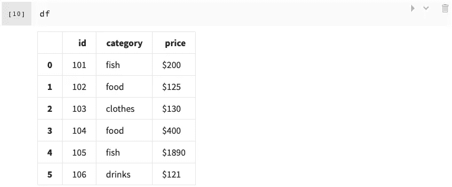
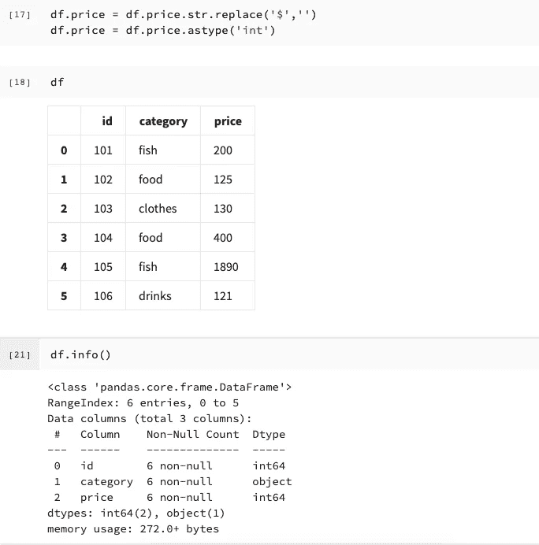
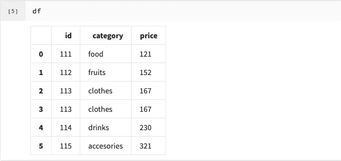
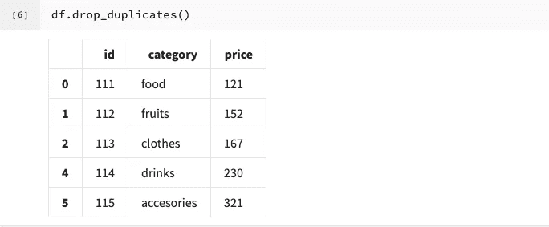
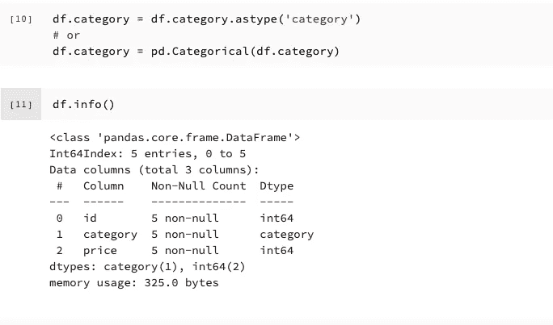

# 数据清理的基础

> 原文：<https://medium.com/analytics-vidhya/basics-of-data-cleaning-bf7a7ce0e2ca?source=collection_archive---------32----------------------->

数据清理是每个数据科学过程中必不可少且耗时的过程。大多数数据科学家甚至声称他们几乎 90%的时间都用于清理和验证数据(数据清理阶段)。


在 [Unsplash](https://unsplash.com?utm_source=medium&utm_medium=referral) 上由 [Carlos Muza](https://unsplash.com/@kmuza?utm_source=medium&utm_medium=referral) 拍摄的照片

**那么，什么是真正的数据清洗呢？**

数据清理是从一组数据、记录、表格或数据库中检测、识别和纠正损坏或不准确信息的过程。

为什么数据清理如此重要？

数据清理有助于您清除任何不准确、错误、输入不正确的数据，这意味着您拥有一个准确且经过验证的数据集来进行分析。这一点非常重要，您不希望在数据集上输入任何不准确甚至错误的信息，这可能会导致错误的见解和结论，从而影响您的整体决策。

在这篇文章中，我将谈论你应该做的数据清理过程的几个基础。

首先**，验证数据**

无论何时获取数据集，在数据清理中要做的第一件事就是验证数据。

例如，如果您的数据中有一列包含您的客户对您的服务给出的评分，范围从 0 到 5。当您检查数据时，发现很少有观测值包含超出范围的值 6。您的评分不可能为 6，这可能是由于人为错误，如输入不正确或导入数据时出错。

```
In [**9**]: dfOut[**9**]:id  price  Rating0  101   $200       51  102   $125       42  103   $130       33  104   $400       54  105  $1890       65  106   $121       1In [**10**]: df.describe()Out[**10**]:id    Ratingcount    6.000000  6.000000mean   103.500000  4.000000std      1.870829  1.788854min    101.000000  1.00000025%    102.250000  3.25000050%    103.500000  4.50000075%    104.750000  5.000000max    106.000000  6.000000
```

查看评级栏的最大值，您发现最大值为 6，超出了范围。

另一种情况是当你的列中有一个符号或字母时。这对于涉及货币的列非常常见，比如商品价格或票价，涉及的符号是美元符号。为什么我们需要丢弃符号或字母，这是因为你不能把一个字符串或对象类型的值转换成一个整数或带字符串的浮点数，你不会想要操作或分析一个字符串或对象类型中的数字列，对吗？



看，价格栏有$符号和数字在一起。



您可以替换$并将其转换为整数格式。

接下来，**重复值**

在调查或表单等数据获取过程中，重复值经常很容易出现。这是因为用户或顾客可能不止一次地键入他们的值。另一种可能性是组合不同的数据集，这导致重复的观察行。对于这种情况，我们需要识别重复的观察行，保留其中一行，删除另一行。



Inplace = True 指定我们希望将更改应用于原始数据帧。

另一个例子是，客户 id 重复，但权重不同。您可以应用统计学知识，如取平均值或中值，并保留其中一个以防止重复观察发生。

第三，**格式化数据**

通常当你导入数据集并查看它的信息时，每个变量的类型总是不在理想的位置。例如字符串或对象形式的价格，字符串或对象类型的分类变量。


在这种情况下，您可能希望检查数据的每一列，格式化数据并将其转换为您喜欢的类型。此外，一些分类列可能有大量不同的类别，但许多是重复的。其中一些可能是打字错误，不同的语言，甚至是不太有用的类别。您可能希望将这些值重新分配给自己选择的新创建的类别。



我们可以用两种不同的方法将 category 列转换为 category 类型，这两种方法返回相同的输出。

看，这只是每个原始数据集中经常出现的三个常见问题。想象一下，未经清理的数据被分析、建模并呈现给观众或公司。这将导致你的公司因为错误的决策而遭受巨大的损失，甚至用不准确的信息误导观众。