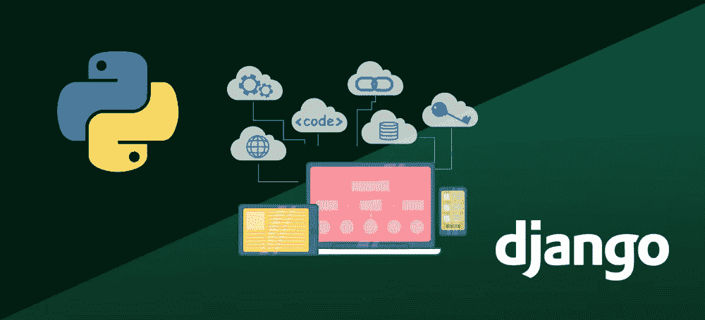
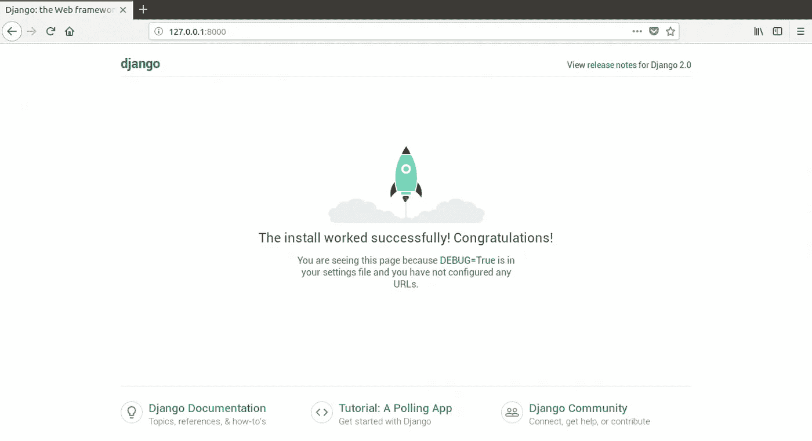

# DJANGO 基础知识

> 原文：<https://medium.com/analytics-vidhya/basics-of-django-23a954959d94?source=collection_archive---------39----------------------->



欢迎来到姜戈的基础课。既然我们已经来到这里，我们将会看到，我们将会征服姜戈的基础。

## 姜戈是什么？


Django 是一个免费的开源 web 应用框架，用 Python 编写。框架基本上是使开发更容易的模块的集合。它们被组合在一起，允许我们从现有的资源中创建，而不是从头开始创建应用程序或网站。如果我们从头开始创建一个网站，我们需要开发管理面板，联系表格，认证支持，文件上传支持，评论框等组件。我们自己。通过使用框架，这些组件已经构建好了，我们需要做的就是正确地配置它们以匹配我们的站点。

## 开始一个项目


[安德鲁·尼尔](https://unsplash.com/@andrewtneel?utm_source=medium&utm_medium=referral)在 [Unsplash](https://unsplash.com?utm_source=medium&utm_medium=referral) 上拍照

考虑到您已经安装了 Django(顺便说一下，您可以通过在命令行界面中键入以下命令来进行检查

```
**$** python -m django --version
```

按下回车键。)如果已经安装了 Django，您应该会看到您的安装版本。如果不是，您将得到一个错误，告诉“没有名为 django 的模块”。向前迈进，让我们马上投入到启动项目中。在我们将 ***cd*** 放入我们希望项目所在的目录后，我们要做的第一件事就是在终端上运行下面的命令。

```
**$** django-admin startproject <project-name>
```

*将<项目名称>替换为您选择的项目名称。*
该命令在我们所在的当前目录下创建一个新目录。执行命令后，我们会注意到以下文件及其位置结构:

```
<project-name>/
    manage.py
    <project-name>/
        __init__.py
        settings.py
        urls.py
        asgi.py
        wsgi.py
```

让我们简单地看一下每个文件，看看它们的作用和目的是什么。

*   这是一个命令行工具，可以让你以多种方式与 Django 项目交互。它基本上有助于网站的管理。
*   `**__init__.py**`:基本上是一个空文件，通知 Python 这个目录应该被认为是 Python 包。
*   `**settings.py**`:我们 Django 项目的所有设置和配置都可以在这个文件中找到。
*   `**urls.py**`:这个文件包含了这个 Django 项目的 URL 声明。
*   这是兼容 WSGI 的 web 服务器为我们的项目服务的入口。web 服务器网关接口是一个简单的调用约定，用于 web 服务器将请求转发给用 Python 编程语言编写的 Web 应用程序或框架。

我们将运行的下一个命令是:

```
**$** python manage.py migrate
```

***快速注意:*** *以上命令及以后的所有命令，均针对 Linux 和 macOS。如果你在 Windows 上，你所要做的就是把开始的‘python’替换成‘py’，就像* `**$** py manage.py migrate`

如果一切顺利，我们可能会在终端上看到这样的东西

```
Apply all migrations: auth, admin, contenttypes, sessions
Running migrations:
  Rendering model states... DONE
  Applying contenttypes.0001_initial... OK
  Applying auth.0001_initial... OK
  Applying admin.0001_initial... OK
  Applying admin.0002_logentry_remove_auto_add... OK
  Applying contenttypes.0002_remove_content_type_name... OK
  Applying auth.0002_alter_permission_name_max_length... OK
  Applying auth.0003_alter_user_email_max_length... OK
  Applying auth.0004_alter_user_username_opts... OK
  Applying auth.0005_alter_user_last_login_null... OK
  Applying auth.0006_require_contenttypes_0002... OK
  Applying auth.0007_alter_validators_add_error_messages... OK
  Applying auth.0008_alter_user_username_max_length... OK
  Applying auth.0009_alter_user_last_name_max_length... OK
  Applying sessions.0001_initial... OK
```

该命令帮助我们创建项目所需的必要数据库。实际发生的是，这个命令查看`**INSTALLED_APPS**`设置，并根据我们的`**<project-name>/settings.py**`文件中的数据库设置建立任何需要的数据库表。

现在我们可以看到我们的项目是否已经开始成功运行。进入终端，在编写下面的命令之前，我们需要确保我们在包含`manage.py file`的目录中

```
$ python manage.py runserver
```

现在，我们在浏览器中输入以下地址`[http://127.0.0.1:8000/](http://127.0.0.1:8000/)`，瞧！我们看到以下窗口



***快速注意:****`***runserver***`*命令默认在端口 8000 的内部 IP 上启动开发服务器。我们可以通过将服务器的端口作为命令行参数传递来更改它。我们只需要在刚刚执行的命令前面添加端口号，并在浏览器的地址字段中用该端口号替换 8000。**

*厉害！我们刚刚创建了我们的第一个网站，并使用网络服务器运行它！虽然我们还有很长的路要走..*

*至此，我们已经完成了 Django 的基础知识。嗯，不尽然..有很多东西需要涵盖，但这些是另一个博客的故事。；)
到那时，干杯伙计们，学习愉快。:)*

**PS:你可以在这里看到 Django 的不同概念在其文档中解释得非常漂亮和详细:* [*https://docs.djangoproject.com/en/3.0/intro/*](https://docs.djangoproject.com/en/3.0/intro/)*