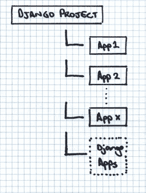
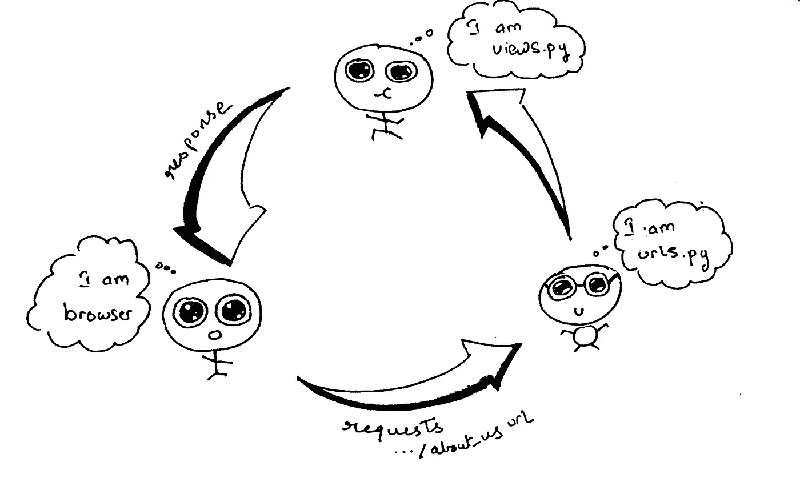

# DJANGO 基础:第二章[应用、URL、视图和模板]

> 原文：<https://medium.com/analytics-vidhya/basics-of-django-chapter-ii-apps-urls-views-and-templates-d647eaef69e4?source=collection_archive---------21----------------------->


马库斯·斯皮斯克在 [Unsplash](https://unsplash.com?utm_source=medium&utm_medium=referral) 上的照片

我们在我之前的博客中看到了一些基本概念，如果你还没有看过的话，可以看看这里:
[*https://medium . com/@ harshkumar 700/basics-of-django-23a 954959 d94*](/@harshkumar700/basics-of-django-23a954959d94)

继续说，姜戈的世界里还有很多值得我们探索的地方。在这篇博客中，我们将详细了解应用程序、URL、视图和模板。所以没有更多的麻烦，

# 应用程序

在前一篇博客中，我们开始了我们的新项目，并让它运行起来。现在，在我们进入其他概念之前，我们必须了解 Django 中的“应用”以及它们与“项目”的区别。一个 app 基本上提供了我们正在开发的网站(项目)中的一个功能。它是为一个目的服务的，在网站中做一些特别的事情。
一个项目就是我们正在开发的整个项目或者网站。根据网站所需的不同功能，项目可能包含不同的应用程序。例如，如果我们正在建立一个电子商务网站(这是整个项目)，我们可能会添加各种用于不同目的的应用程序，如服务于用户成功支付的支付网关应用程序，用于现有用户登录的登录应用程序等等。干得好，伙计们！现在我们知道 Django 中的 app 是什么，以及它与项目有何不同。

继续，我们如何开始一个项目已经在之前的博客中解释过了，但只是为了唤起你的记忆，这里是我们如何做的。我们运行以下命令

```
**$** python manage.py startproject <project-name>
```

这将创建一个包含多个 Python 文件的目录。现在，在这个项目中，假设我们需要添加一个新的应用程序来提供特定的功能；我们首先进入项目目录，如下所示:

```
**$** cd <project-name>
```

然后，运行命令，

```
**$** python manage.py startapp <app-name>
```

***快速注意:*** *以上命令及以后所有命令，均针对 Linux 和 macOS。如果你在 Windows 上，你所要做的就是把开始的‘python’替换成‘py’，就像* `**$** py manage.py startapp <app-name>`

不言而喻，你可以用自己选择的名字替换<app-name>。此命令将根据您的应用程序和文件的名称创建一个目录，其位置结构如下所示:</app-name>

```
<app-name>/
    __init__.py
    admin.py
    apps.py
    migrations/
        __init__.py
    models.py
    tests.py
    views.py
```

典型的 Django 项目结构如下所示:



[https://djangobook . com/WP-content/uploads/structure _ drawing 1 . png](https://djangobook.com/wp-content/uploads/structure_drawing1.png)

要在我们的项目中包含该应用程序，我们还需要一个步骤。我们需要将应用程序名称添加到`settings.py`文件中的`INSTALLED_APPS`列表，如下所示:

```
INSTALLED_APPS = [
    '<app-name>',
    'django.contrib.admin',
    'django.contrib.auth',
    'django.contrib.contenttypes',
    'django.contrib.sessions',
    'django.contrib.messages',
    'django.contrib.staticfiles',
]
```

太棒了。至此，我们在理解 Django 基础知识的旅程上向前迈进了一步，但这还没有结束。现在，是时候让我们通过 Django 中的*URL*的概念来*看看视图*和*冲浪*了。

# URL 和视图

我们现在将了解什么是 URL 和视图，以及它们是如何连接的。在这篇博客的后面，我们还将了解与这两者密切相关的另一个组件。



上图试图解释整个连接，以及工作是如何在幕后完成的。但是让我们更详细地看看。假设，我们请求一个页面，比如“/about_us”页面。该请求指向应用程序的`urls.py` 文件，然后该文件决定需要触发`views.py`中的哪个功能。`urls.py`文件查看`/about_us` url，并在那里找到需要触发的函数名。然后启动该函数，无论我们告诉该函数做什么，它都会在用户访问该 URL 时完成。这样，某种响应被发送到浏览器，比如 HTTP 响应或 HTML 模板。好吧，如果你没有完全掌握它，也不要担心。一个实际的例子可以在很大程度上澄清这一点。例如，我们创建了一个名为`basic_blog`的网站(项目)。然后我们创建了一个应用程序，它的名字是，比如说我们项目中的`blogs_app`，`basic_blog`。现在我们需要添加两个视图。一个用于主页，另一个用于“关于我们”页面。因此，在`blogs_app`中的`views.py`文件下，我们编写以下代码。

```
from django.http import HttpResponsedef home(request):
    return HttpResponse('Home')

def about_us(request):
    return HttpResponse('About Us')
```

> [当一个页面被请求时，Django 创建一个](https://docs.djangoproject.com/en/3.0/ref/request-response/) `[**HttpRequest**](https://docs.djangoproject.com/en/3.0/ref/request-response/)` [对象，其中包含关于请求的元数据。然后 Django 加载适当的视图，将](https://docs.djangoproject.com/en/3.0/ref/request-response/) `[**HttpRequest**](https://docs.djangoproject.com/en/3.0/ref/request-response/)` [作为第一个参数传递给视图函数。每个视图负责返回一个](https://docs.djangoproject.com/en/3.0/ref/request-response/) `[**HttpResponse**](https://docs.djangoproject.com/en/3.0/ref/request-response/)` [对象。](https://docs.djangoproject.com/en/3.0/ref/request-response/)
> 
> **快速注释**:这里有一个关于两种观点的伟大博客，供你补充知识。一定要读一读:[https://medium . com/@ ksarthak 4 ever/django-class-based-views-vs-function-based-view-e 74 b 47 b 2 e 41 b](/@ksarthak4ever/django-class-based-views-vs-function-based-view-e74b47b2e41b)

现在对于 URL 部分，首先我们必须在 app 文件夹中创建一个名为`urls.py`的文件夹，然后向其中添加以下代码:

```
from django.contrib import admin
from django.urls import path
from . import views
urlpatterns = [
    path('admin/', admin.site.urls),
    path('about_us/', views.about_us),
    path('', views.homepage)
]
```

*   `path(‘admin/’, admin.site.urls)`行意味着对于每个以`admin/`开头的 URL，Django 都会找到一个相应的视图。在这里，我们包括了许多管理网址。
*   类似地，`path(‘about_us/’, views.about_us )`行意味着对于每个以`about_us/`开头的 URL，Django 将找到一个相应的视图，这里是`views.py`中的`about_us`
*   现在，`path('', views.home )`行告诉`views.py`文件在基本 URL 前面没有附加任何内容时触发`homepage`视图。

现在，只发送一个 HttpResponse 向我们展示了整个设置的工作原理，但是只显示纯文本有点…嗯，有点乏味。如果我们可以通过发送 HTML 模板而不是仅仅发送纯文本来使它变得有趣，这不是很棒吗？嗯，我们很幸运，因为这是我们之前谈到的第三个组件发挥作用的地方，那就是“模板”

> **快速重要提示**:由于在一个给定的项目中可能有许多应用程序，每个应用程序都有自己的一组 URLs 基础 app 中有一个基础 URL 文件`urls.py`，是你启动项目时自动创建的。它用于将所有应用程序路径连接到项目。我们可以用下面的方法来做。

```
from django.contrib import admin
from django.urls import path, include
from . import views

urlpatterns = [
    path('admin/', admin.site.urls),
    path('blogs_app/', include('blogs_app.urls')),
]
```

# 模板

当我们启动 Django 应用程序时，模板目录不会像其他文件和目录一样自动创建。我们需要在 app 目录中创建一个名为“templates”的目录。因此，模板基本上包含了所需 HTML 输出的静态部分。
在上面的`views.py`文件中，我们将 HttpResponse 返回给了浏览器。我们现在将发回 HTML 模板，而不是那样做。为此，第一步显然是在上面提到的 app 目录中创建一个名为“templates”的新目录。在' templates '目录中，我们创建两个 HTML 文件，一个用于名为 say homepage.html 的主页，另一个用于名为 about_us.html.
的关于我们的页面，在 homepage.html，

```
<!DOCTYPE html>
<html lang="en">
<head>
    <meta charset="UTF-8">
    <title>Home</title>
</head>
<body>
    <h1>Home Page</h1>
    <p style="color:blue;">Welcome to our site</p>
</body>
</html>
```

而在 about_us.html 中

```
<!DOCTYPE html>
<html lang="en">
<head>
    <meta charset="UTF-8">
    <title>About Us</title>
</head>
<body>
    <h1>About Us</h1>
    <p style="color:red;">We Love Django!</p>
</body>
</html>
```

这是你能遇到的最基本的 HTML 代码。如果你懂 HTML，你知道你可以做得更多，但是为了简单的解释，这里有一个非常基本的代码。如果你还不知道 HTML 并且想要学习它，你可以从现在开始，也许可以尝试一下:
[https://medium.com/hackernoon/learn-basic-html-be230361457](/hackernoon/learn-basic-html-be230361457)

所以，我们已经准备好了 HTML 模板，现在我们要做的就是修改我们的`views.py`文件，这样它就可以将这些 HTML 模板发送到浏览器，而不是像以前那样发送一些纯文本。我们不必做太多；只需进行如下所示的一些更改:

```
#from django.http import HttpResponse
from django.shortcuts import render

def homepage(request):
    return render(request, 'homepage.html')

def about_us(request):
    return render(request, 'about_us.html')
```

> [*包*](https://docs.djangoproject.com/en/3.0/topics/http/shortcuts/) `[***django.shortcuts***](https://docs.djangoproject.com/en/3.0/topics/http/shortcuts/)` [*收集了“跨越”多级 MVC 的助手函数和类。换句话说，为了方便起见，这些函数/类引入了受控耦合。*](https://docs.djangoproject.com/en/3.0/topics/http/shortcuts/)`[*render*](https://docs.djangoproject.com/en/3.0/topics/http/shortcuts/)`[*(request，template_name，context=None，content_type=None，status=None，using=None)将给定的模板与给定的上下文字典相结合，并返回一个带有渲染文本的*](https://docs.djangoproject.com/en/3.0/topics/http/shortcuts/) `[***HttpResponse***](https://docs.djangoproject.com/en/3.0/topics/http/shortcuts/)` [*对象。*](https://docs.djangoproject.com/en/3.0/topics/http/shortcuts/)

因此，当用户请求一个带有 URL 的页面时，比如说`…/about_us`；它被定向到 urls.py 文件，然后该文件检查此 URL。找到后，它会在`path(‘about_us/’, views.about_us)`行中寻找需要触发的视图。它看到需要触发`views.about_us`。在`views.py`文件中，我们看到视图返回一个名为`about_us.html`的 HTML 模板(存储在 templates 目录中)，如在`about_us`视图下的行`return render(request, ‘about_us.html’)`所示。这样，响应被发送到显示相应 HTML 模板的浏览器。

厉害！在了解 Django 基础知识的旅程中，我们已经走了很远！但这还没有结束。嗯，

感谢您的阅读！我希望你喜欢这篇文章。
欢呼声一如既往..快乐学习。:)

和我联系:
LinkedIn—[www.linkedin.com/in/harsh-kumar-1a99a0176](http://www.linkedin.com/in/harsh-kumar-1a99a0176)Github—[www.github.com/harsh-kr](https://github.com/harsh-kr)