# 预测准确性的基础

> 原文：<https://medium.com/analytics-vidhya/basics-of-forecast-accuracy-db704b0b001b?source=collection_archive---------0----------------------->

马克 A 在 [Unsplash](https://unsplash.com?utm_source=medium&utm_medium=referral) 上的照片

尽管有多种预测方法，但要计算出准确的预测几乎是不可能的。建议我们运行各种预测模型，并对它们进行比较，以找出哪个模型能给我们提供更准确的预测。

# 为什么我们需要预测的准确性？

为了测量准确性，我们将现有数据与通过运行现有期间的预测模型获得的数据进行比较。实际值与预测值之差也称为 ***预测误差。预测误差越小，我们的模型就越准确。***

通过选择对已知数据最准确的方法，它增加了获得准确未来值的可能性。

# 预测准确性的衡量标准

有几种衡量预测准确性的方法:

平均预测误差

平均绝对误差(MAE)或平均绝对偏差(MAD)

均方根误差(RMSE)

平均绝对百分比误差(MAPE)

让我们考虑这个例子的下表。

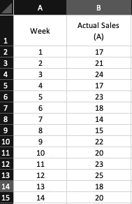

这张表显示了一家商店的周销售量。商店经理不熟悉预测模型，所以他将本周的销售额作为下周的预测。由于简单的性质，这种方法也被称为*简单预测方法*。

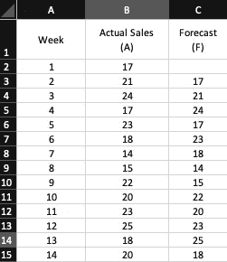

# 计算预测误差

实际值与预测值之差称为 ***预测误差*** 。因此，在本例中，第 2 周的预测误差为

预测误差(第 2 周)= 21–17 = 4

预测误差的正值表示模型低估了该期间的实际值。预测误差的负值表示模型高估了该期间的实际值。

下表计算了剩余几周的预测误差:

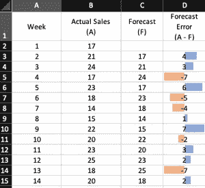

# 平均预测误差

预测准确性的一个简单衡量标准是预测误差的平均值，也称为平均预测误差。

在本例中，计算所有预测误差的平均值，以获得平均预测误差:

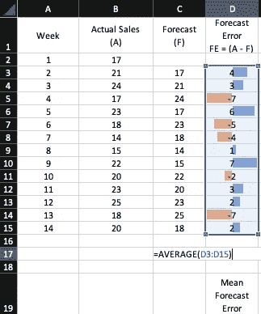

这种预测方法的 MFE 是 0.2。

由于 MFE 为正，这意味着模型预测不足；实际值往往会超过预测值。因为正负预测误差往往会相互抵消，所以平均预测误差可能很小。因此，MFE 不是一个特别有用的预测准确性的衡量标准。

# 平均绝对偏差或平均绝对误差

这种方法避免了正负预测误差的问题。顾名思义，平均绝对误差是预测误差绝对值的平均值。

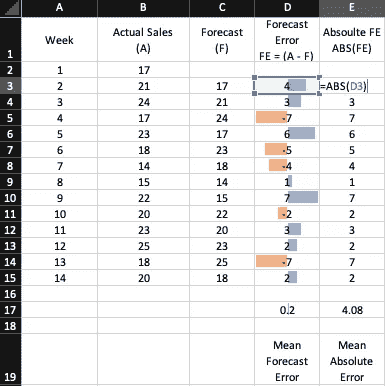

该预测模型的 MAD 为 4.08

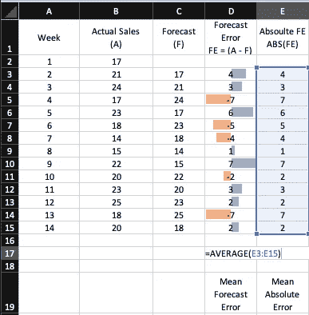

# 均方误差

均方差也避免了正负预测误差相互抵消的挑战。它是通过以下方式获得的:

首先，计算预测误差的平方

然后，取预测误差平方的平均值

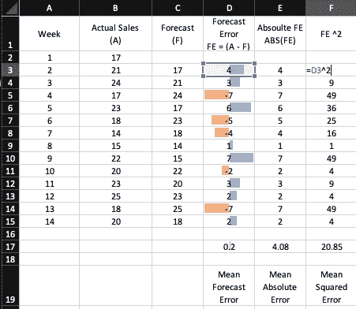

# 均方根误差(RMSE)

均方根误差是均方误差(MSE)的平方根。这是计算预测准确性的有用指标。

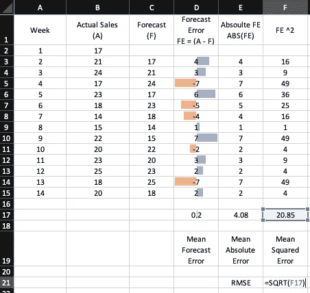

该预测模型的 RMSE 为 4.57。这意味着，平均而言，预测值与实际值相差 4.57 倍。

# 平均绝对百分比误差(MAPE)

MAE 或 RMSE 的大小取决于数据的规模。因此，很难对不同的时间间隔进行比较(例如，将预测月销售量的方法与预测周销售量的方法进行比较)。在这种情况下，我们使用平均绝对百分比误差(MAPE)。

计算 MAPE 的步骤:

通过将绝对预测误差除以实际值

计算个体绝对百分比误差的平均值

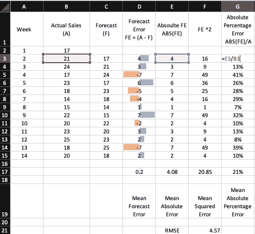

该模型的 MAPE 为 21%。

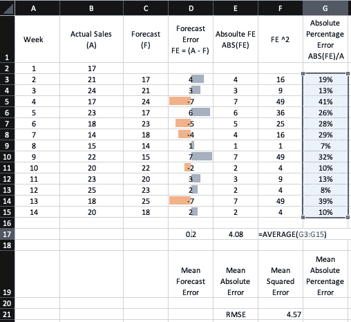

它表示在给定模型中，预测值与实际值的平均偏差为 21%。

# 如何使用它们？

预测准确性的这些度量表示预测方法可以预测时间序列的历史值的程度。

这些度量值越低，预测模型就越准确。

到目前为止，我们一直使用简单的预测方法进行预测。在以下示例中，我们使用了三期移动平均和简单指数平滑进行预测，然后我们比较了准确性:

三期移动平均线:

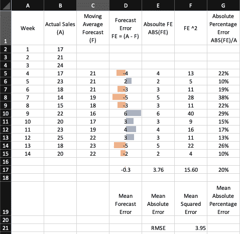

[简单指数平滑](https://www.vivran.in/post/time-series-forecast-exponential-smoothing)(平滑因子= 0.20)

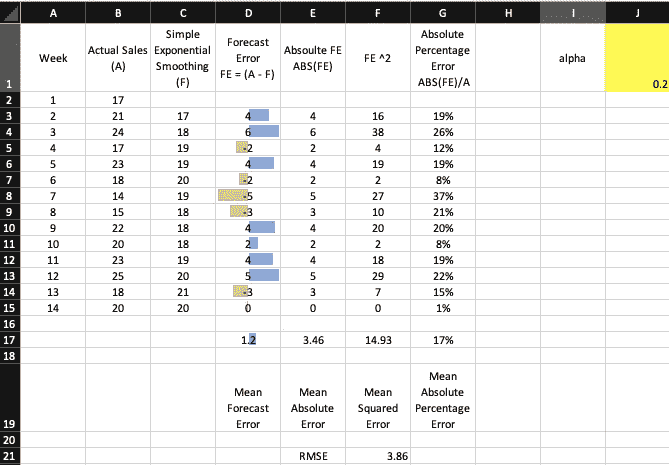

# 比较不同的预测模型

下表总结了所有三种模式的所有预测准确性指标:

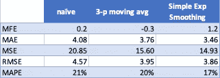

我们可以得出结论，通过简单的指数平滑获得的预测具有较低的预测准确性度量值。因此，为了预测未来值，我们应该在三个模型中选择这个模型。

# 需要考虑的事项

预测准确性的测量是比较不同预测方法的关键因素。尽管如此，我们必须小心不要过于依赖他们。还应考虑可能影响预测的合理判断和业务知识。历史预测的准确性并不是唯一的考虑因素，尤其是当时间序列显示的模式在未来可能会改变时。

另读:[机器学习中的性能指标【完全指南】— neptune.ai](https://neptune.ai/blog/performance-metrics-in-machine-learning-complete-guide)

*我写关于* [*MS Excel*](https://www.vivran.in/my-blog/categories/excel) *，* [*权力查询*](https://www.vivran.in/my-blog/categories/powerquery) *，* [*权力毕*](https://www.vivran.in/my-blog/categories/powerbi) *，* [*权力中枢*](https://www.vivran.in/my-blog/categories/power-pivot) *，*[*DAX*](https://www.vivran.in/my-blog/categories/dax)*，* [*数据*](https://www.vivran.in/my-blog/categories/data-analytics)

[@imVivRan](https://twitter.com/imvivran)