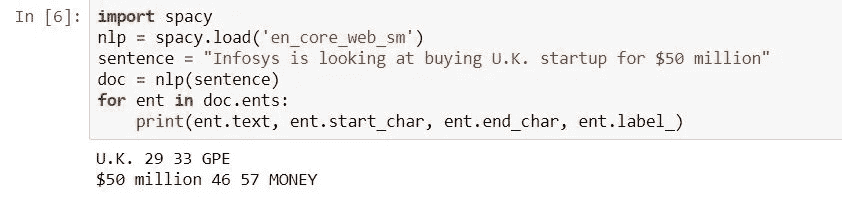
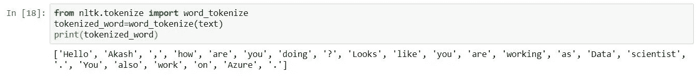

# 使用空间 NER 的自然语言处理和文档摘要的基础

> 原文：<https://medium.com/analytics-vidhya/basics-of-natural-language-processing-nlp-9952f7db3e1e?source=collection_archive---------14----------------------->

在我进入 NLP 应用的细节之前，我想向你简要介绍一下 NLP 世界中使用的各种术语。如果您已经熟悉基础知识，您可以跳过这一部分，直接进入应用部分。

我们使用各种语言与社会交流。想象一下，如果机器能够理解我们说的和写的语言。

自然语言处理(NLP)是机器学习的一个分支，致力于让机器学习和理解人类的语言。但是机器将如何学习呢？就像你教你的孩子读书写字一样，你也必须训练机器去理解。你必须注释/标记数据集，以标记各种实体，如姓名、电子邮件、组织等。并训练模型，以便如果您通过了训练模型上的测试数据集，它将获取名称、组织等。自动地从文本语料库而不是人工地做它。我希望我说得有道理。

好在我们已经有了可以用于 NLP 的预训练模型。但是，准确性取决于您使用的数据集及其与模型训练数据集的相似性。

设置好背景后，让我们进入 NLP 世界中每个人都应该知道的一些重要术语。一旦我覆盖了基础知识，我将更关注使用空间 NER 模型的自然语言处理的应用。

**词干化:**词干化是将单词还原为其词根形式的过程，即使该词根没有词典意义。例如:beautiful 和 beautifully 在英语词典中没有任何意义。

**词条化:**是将单词缩减到其词条或词典中的过程。它考虑了单词在句子中的意思。例如:beautiful 和 beautifully 分别被引申为 beautiful 和 beautifully，但没有改变词义。但是,“好”和“更好”是“好”的同义词，因为这两个词有相似的意思。

词干化和词汇化是自然语言处理中的词汇规范化技术。基本上用来产生词根形式的词。它们被广泛应用于文本挖掘。文本挖掘就是分析用自然语言书写的文本并从中提取高质量信息的过程。找出课文中的模式。可以是文本分类。

在文本聚类中，词干化和词汇化被用来减少携带相同信息的词的数量。它在情感分析中被广泛使用，作为进一步分析的文本准备、文档摘要等的一部分。

所以，你可能想知道为什么要词干化或者为什么要词汇化？

它们都生成单词的词根形式，但是 stem 可能不是真正的英语单词，而 lemma 是真正的英语单词。与词汇化相比，词干化是一个更快的过程。在词条化中，你使用 wordnet 语料库和停用词语料库来提出词条，这会使速度变慢。

因此，如果你正在构建一个语言应用程序，其中语言是非常重要的，那么你应该使用词汇化。

**规范化:**词条化和词干化是关键词规范化的技术。

**命名实体识别(NER):** NER 是一种将一个句子分成名字、位置、组织等类别的方法。

所以，如果你想找到名字，组织，位置等。从像简历这样的文件中，你可以使用 NER 技巧。

NER 是一种信息抽取技术，用于识别和分类文本中的命名实体。它可以用于客户支持。有一些预先训练好的 NER 模型，比如斯帕西·NER，你可以用它来从文本语料库中提取实体。

如果你看到输出，英国是 GPE，这是一个国家，城市，州等实体名称。五千万是钱。如果你注意到 Infosys 不被认为是一个组织，因为预先训练的模型不习惯看到这样的名字。我在后面的部分已经解释了如何提高精度。

**词性:**词性标注

用名词、代词、副词、形容词等标记一个单词。一句话。

其中 MD 是情态，PRP 是人称代词，VB 是动词，DT 是限定词，NN 是名词。

**记号化:**把一个段落分成更小的块，比如句子或单词，这叫做记号化。

句子标记化

单词标记化

**词典:**是一种有词有义的词典。

**停用词:**停用词在文本中被视为干扰。文本可能包含停用词，如 is、am、are、this、a、an、the 等。

**单词包:**是从文本中提取特征的最简单的方法。BoW 将文本转换成文档中单词出现的矩阵。这个模型关注给定的单词是否出现在文档中。概括地说，它包括以下步骤。但是使用 sklearn 库，只需几行代码就可以完成。

**变价器:**大部分用于情感分析的库都是根据一个句子中正反词的数量来计算得分的。但是如果我们有一句“我不快乐”呢？这个句子有“快乐”一词，这是一个肯定的词，所以根据各种原始情感分析库，这将被标记为肯定的句子，但这不是肯定的。“不快乐”在这里是否定，也称为变价词。它可以有三种类型。

否定，加强和减弱。否定用来颠倒单词的极性，加强词和减弱词用来增加或减少肯定词或否定词的强度。

**应用:**NLP 的一些激动人心的应用有

情感分析:用于各种领域，了解公众对产品、政治等的情感。

聊天机器人:用于网站自动回答用户可能有的一些常见问题。

自动更正:在您的手机/电子邮件上更正拼写

**文档摘要:**提取文档摘要。我将尝试详细说明这个应用程序。

如果您在任何文档数据集(如简历数据集)上使用预训练的空间 NER 模型，您可能不会获得良好的结果，因为空间模型是在 OntoNotes 语料库上训练的，onto notes 语料库是电话对话、新闻专线、新闻组、广播新闻、广播对话和网络日志的集合。这些类型的文本主要包含完整的句子，这与你正在培训的简历有很大的不同。下面是一个简历的例子，用来解释上下文。

例如，实体“迪拜”周围没有语法上下文，这使得预先训练的模型很难将其识别为位置。预先训练好的模型习惯于看到像“…当他在迪拜旅行时，…”这样的句子。

一般来说，机器学习性能总是与你训练和评估模型的特定问题领域相关联。

如果您想尝试提高精确度，我建议您在计划使用的数据集上训练空间 NER 模型，而不是使用预训练模型。为此，首先必须使用数据注记工具对数据集进行注记。 [dataturks](https://dataturks.com/) 提供了一个这样的工具，你可以上传 zip 文件，它将允许你标记标签，如下图所示。它会以 json 文件的形式给出输出，您可以使用该文件来训练 NER 模型，并在测试数据集上测试准确性。

话虽如此，但它可以用来提取姓名、公司、位置、技能、职务等。这样您就不需要手动打开每份简历。摘要的准确性取决于您如何最好地训练您的模型。关于空间的更多细节，你可以参考他们的文档([https://spacy.io/](https://spacy.io/))。

这是进入 NLP 世界的基本入门。我建议你参加一个结构化的课程，并使用各种公开可用的数据集进行练习。有许多可以使用 NLP 的用例，例如从 iphone XR 等任何产品的 Twitter 上提取推文并进行情感分析。以下是你可以做的步骤。

*   使用 API 从 Twitter 收集数据，并将其存储在 csv 文件中
*   做一些探索性的数据分析
*   清理数据
*   词汇化，标记化，特征提取，DTM，模型构建
*   对清洗后的数据进行情感分析
*   最后，借助 Power BI 或 Tableau 等可视化工具展示您的分析，或者您可以使用 Python seaborn 库创建图表，如单词云、同现图、趋势分析等。

如果你能做到以上所有的步骤，很可能你已经在 NLP 上有了一个好的开始。作为下一步，你可以专注于基于深度学习的 NLP，这是目前更先进的。

如果你有任何问题，请随时联系我。