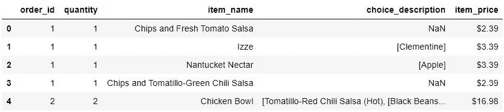
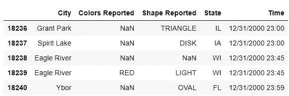
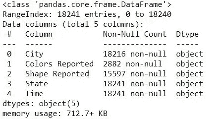
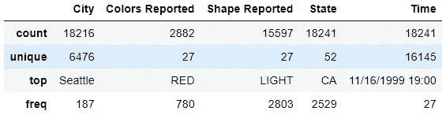
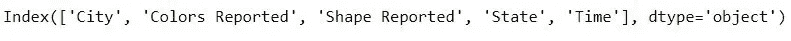
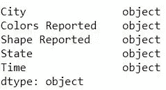
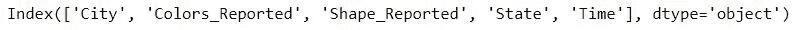
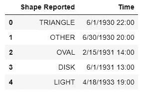

# 熊猫基础知识—第一部分

> 原文：<https://medium.com/analytics-vidhya/basics-of-pandas-part-1-9eac7104fd3b?source=collection_archive---------9----------------------->

当处理表格数据时，比如存储在电子表格或数据库中的数据，pandas 是您的合适工具。熊猫将帮助你探索、清理和处理你的数据。在熊猫中，数据表被称为数据帧。本博客将提出一些常见的问题，并尝试回答这些问题。

为了演示熊猫的用途，我将使用 UFO 数据集。数据存储为 excel 文件，文件名为 ufo.xlsx。


# 如何将表格数据文件读入 pandas？

下面的代码演示了如何将 csv 文件读入数据帧。

```
import pandas as pd
''' read a dataset of Chipotle orders directly from a URL and store the results in a DataFrame'''
orders = pd.read_table('[http://bit.ly/chiporders',sep='\t'](http://bit.ly/chiporders',sep='\t'))
ufo=pd.read_excel('ufo.xlsx',sheet_name='ufo')#reading excel file
```

下面的代码演示了如何分别查看数据帧的第一个和最后五个元素

```
# examine the first 5 rows
print(orders.head())
print(ufo.tails())
```



芯片订单数据集



UFO 数据集

# 如何从数据框中选择熊猫系列？

```
# select the 'City' Series using bracket notation
ufo['City']
# or equivalently, use dot notation
ufo.State 
```

使用点符号的限制

*   如果系列名称中有**个空格**，则点符号不起作用
*   如果序列与一个**数据帧方法或属性**同名(如“头”或“形状”)，点符号不起作用
*   圆点符号不能用来定义**新系列**的名称(见下文)

# 为什么有些 pandas 命令以括号结尾(而另一些没有)？

这个问题的简单答案是**方法**以括号结束，而**属性**没有。

方法示例

```
ufo.head()
ufo.info()
ufo.city.nunique()#no of unique cities #outputs 6476
'''use an optional parameter to the describe method to summarize only 'object' columns.'''
ufo.describe(include='object')
```



ufo.info()



ufo.describe(include='object ')

属性的示例

```
ufo.columns
ufo.shape # outputs ((18241, 6)) -- (no.rows , no.columns)
ufo.dtypes
```



UFO 数据集中的所有列



不同列的数据类型

# 如何重命名熊猫数据框架中的列？

通过重命名方法重命名列

```
ufo.rename(columns={'Colors Reported':'Colors_Reported', 'Shape Reported':'Shape_Reported'}, inplace=True)
ufo.columns
```



重命名的列

通过覆盖 columns 属性重命名列

```
ufo_cols = ['city', 'colors reported', 'shape reported', 'state', 'time']
ufo.columns = ufo_cols
ufo.columns
```


已回滚由方法“rename”应用的更改

用下划线替换列空格

```
''' replace all spaces with underscores in the column names by using the 'str.replace' method'''
ufo.columns = ufo.columns.str.replace(' ', '_')
ufo.columns
```


# 如何从熊猫数据框架中删除列？

删除单个列

```
#axis=1 represents columns
ufo.drop('Colors Reported', axis=1, inplace=True)
```

一次删除多个列

```
ufo.drop(['City', 'State'], axis=1, inplace=True)
uf.head()
```



移除列后

要删除行，您可以使用下面给出的代码

```
ufo.drop([2,9], axis=0, inplace=True)
```

这标志着这个介绍性博客的第 1 部分的结束。在接下来的部分，我将涉及一些更有趣的和与熊猫相关的基本问题。

谢谢😉