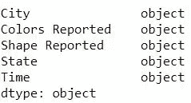

# 熊猫基础知识—第二部分

> 原文：<https://medium.com/analytics-vidhya/basics-of-pandas-part-2-d6f931dcce30?source=collection_archive---------15----------------------->

在我的上一篇文章中，我讨论了初学者在处理各种数据集时面临的一些常见查询。这篇文章是我上一篇文章的延续。

我将继续使用本文第一部分中使用的相同数据集(UFO)来演示进一步的概念。


# 如何对熊猫数据帧或系列进行排序？


UFO-数据集头()

为了解释这个属性，我稍微修改了数据集中的“Time”列。

下面的代码演示了如何将“时间”列按升序或降序排序。

```
#as a default parameter sorts the values in ascending order
ufo.Time.sort_values()
#sorts in descending order
ufo.Time.sort_values(ascending=False)
#Another way to sort
ufo.sort_values('Time')
```


按升序排序的“时间”列


按降序排序的“时间”列

# 在 DataFrame 的大多数方法中，这个就地参数是什么？

在其核心，`inplace`参数帮助您决定如何影响 Pandas 对象的底层数据。是否要更改您正在处理的 DataFrame 对象并覆盖之前的内容？或者，您是否希望制作 DataFrame 对象的副本并将其赋给不同的变量，以便以后可以修改原始数据？

当您将参数作为`inplace=True`传递时，您所做的更改将被覆盖到您当前的数据帧中，而如果您给出`inplace=False`(这是默认参数)，它会显示一个带有已更改属性的数据帧的副本。

例子

```
#makes changes to the original DataFrame
ufo.drop('Colors Reported', axis=1, inplace=True)
ufo.Time.sort_values(inplace=True)
```

# 如何通过列值过滤熊猫数据帧的行？

以下代码表示“城市”列值为“伊萨卡”的数据帧

```
ufo[(ufo['City']=='Ithaca')]
```


城市== '伊萨卡'

我们也可以使用更多的比较器来过滤数据。比如`<,>,||,&`

注意' & '是'和'比较器' || '是'或'比较器。

```
ufo[(ufo['Time']<1940) & (ufo['Time']>1935)]
```


1935 年

# 如何更改熊猫系列的数据类型？

有几种方法可以改变熊猫系列的数据类型，让我们来看看其中的几种。

使用`astype`法是所有方法中最常见的。让我们看看数据框架中的默认列类型。



数据类型

最初，所有给定的数据类型都是“对象”格式，让我们使用`astype`方法对其进行类型转换。

```
#to conert an object to integer typecast it to string and then to integer.
ufo['Time']=ufo['Time'].astype(str).astype(int)
```


更改了时间列的数据类型

# 我如何在熊猫中使用字符串方法？

熊猫系列的字符串方法通过' str '访问。下面的代码单元展示了如何使用 string 方法将特定列中的所有单词大写。

```
#displays the name of cities in Block letters
ufo.City.str.upper()
```


字符串的 upper()方法

你可以使用字符串进行大量的操作，在数据分析中广泛使用的一种技术是查找特定的字符串是否出现在给定的列中。假设您必须找到多少数据点对应于“ny”州，那么您可以使用下面的代码块来获得所需查询的计数。

```
ufo.State.str.contains('NY').count()
#outputs 18247
```

str 还有一些更常用的方法，比如用其他字符替换字符串中的特定字符的`str.replace()`方法(在参数中给出，用逗号分隔)。

这标志着“熊猫基础知识”系列第二部分的结束。在我的下一篇文章中，我将会谈到一些更基本的问题。

谢谢😉