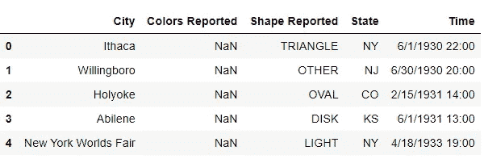
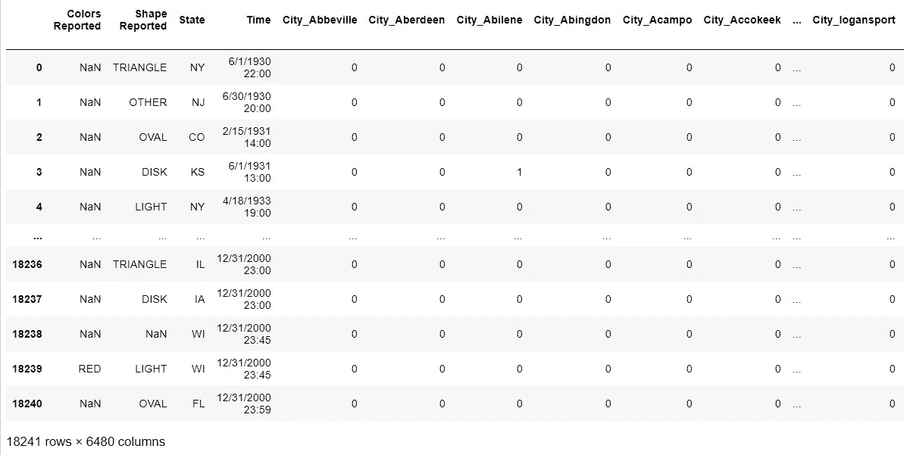
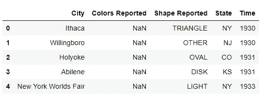
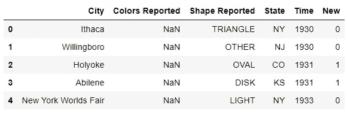
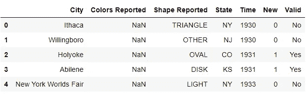
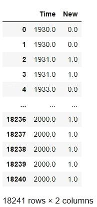
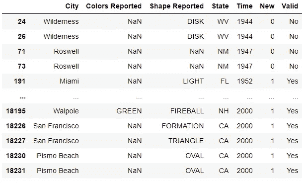

# 熊猫基础知识——第 3 部分

> 原文：<https://medium.com/analytics-vidhya/basics-of-pandas-part-3-dba6b5d06d03?source=collection_archive---------44----------------------->

在我的上一篇文章中，我谈到了初学者在处理各种数据集时面临的一些常见查询。本文是我以前文章的延续。

我将继续使用本文第一部分和第二部分中使用的相同数据集(UFO)来演示进一步的概念。


## **如何将分类特征转换为数字特征？**

分类特征需要改为数字特征，以适应任何特定的模型。虽然使用标签编码器是有益和方便的，但是熊猫提供了一种使用`get_dummies`将分类特征转换为数字特征的方法。

```
pd.get_dummies(ufo,columns=['City'])
```



在实现 get_dummies 函数之前



在实现 get_dummies 函数或方法后。

## 我如何将函数应用于熊猫系列或数据帧？

这可以通过三种方法来实现

*   `*applymap*`-对数据帧中的每个元素应用一个函数
*   `*apply*`-对系列中的每个元素应用一个函数
*   `*map*`-将一个系列的现有值映射到一组不同的值

让我们在数据框中从给定的时间格式中分离出年份

```
ufo['Time']=ufo['Time'].apply(lambda x:x.split('/')[2])
#splits string using '/' as a separator 
ufo['Time']=ufo['Time'].apply(lambda x:x.split(' ')[0])
#splits string using ' ' as a separator
```



为了演示地图和`applymap`方法，我创建了一个新的列，并命名为“new”(缺乏创造力)，包含值 0 和 1。



修改的不明飞行物数据集

```
ufo['Valid']=ufo.New.map({0:'No',1:'Yes'})
```



应用映射后

```
ufo.loc[:,'Time':'New'].applymap(float)
#apply map is only valid for DataFrame and not series object
```



应用 applymap 方法后

## 我如何找到并删除熊猫中的重复行？

您可以通过将`.duplicated()`归属于整个数据框来找出重复的行。也可以使用与系列对象相同的属性来检查列的相似值。

`[**duplicated**](http://pandas.pydata.org/pandas-docs/stable/generated/pandas.DataFrame.duplicated.html)`逻辑:

*   `**keep='first'**`(默认):除第一次出现外，将重复项标记为真。
*   `**keep='last'**`:除最后一次出现外，将重复项标记为真。
*   `**keep=False**`:将所有重复项标记为真。

```
ufo.duplicated().sum()
#checks the total no of rows that are identicle 
ufo.drop_duplicates(keep='first',inplace=True)
#dropping duplicate entries keeping the very first of each
```



重复条目

当然，在使用数据集时，人们最终会发现更多的技术，但我的系列文章强调了我在使用数据集时遇到的一些(如果不是所有的话)查询。希望你喜欢读我的文章

这标志着“熊猫基础”系列的结束。希望你喜欢阅读它。在这里查看与本系列相关的另外两篇文章

[熊猫基础知识—第一部分](/analytics-vidhya/basics-of-pandas-part-1-9eac7104fd3b)

[熊猫基础知识—第二部分](/analytics-vidhya/basics-of-pandas-part-2-d6f931dcce30)

谢谢😉