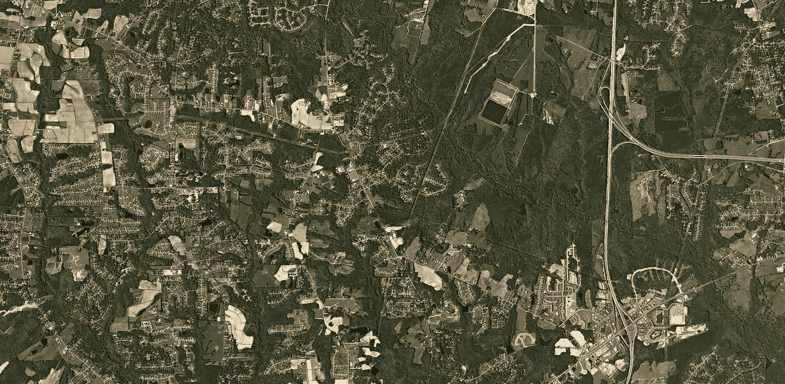
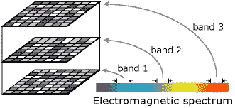
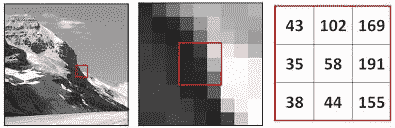
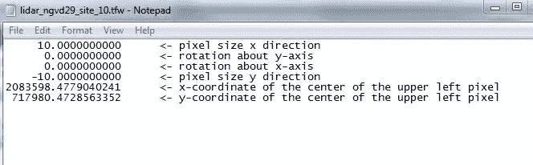
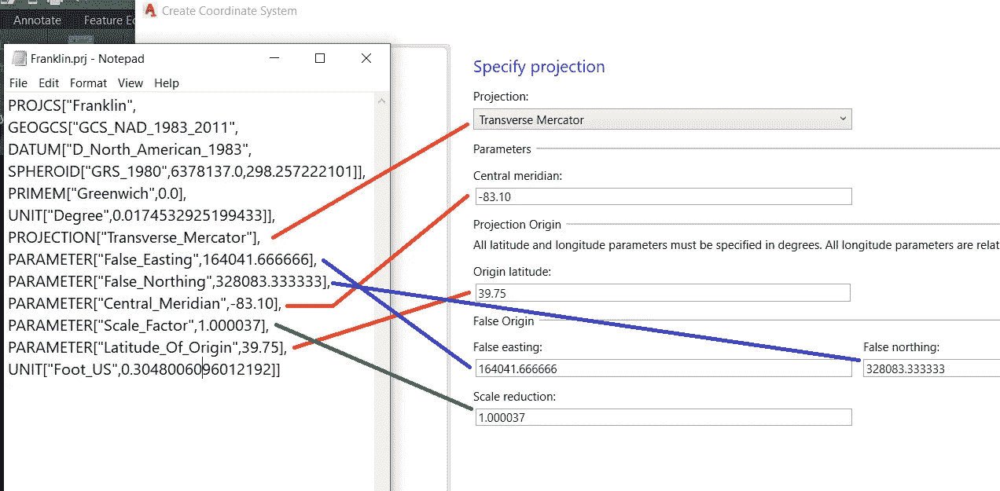

# 卫星图像基础

> 原文：<https://medium.com/analytics-vidhya/basics-of-satellite-imagery-b187aa4bd260?source=collection_archive---------14----------------------->

我正在和 Omdena 做我的第二个项目，涉及评估肯尼亚沙漠蝗虫的影响。这是我第一次使用卫星图像，作为一个新手，有太多的新术语，我不得不绞尽脑汁。像往常一样，我花了很多时间在谷歌上搜索资料，最终决定写下这篇文章，作为像我这样的卫星图像新手的参考。事不宜迟，让我们开始吧。

来源:谷歌

## 兰德斯塔和哨兵报

当你做一些与卫星图像相关的事情时，这些将是首先出现的词。这些只不过是环绕地球运行的卫星的名字。所以如果你看到一张“陆地卫星图像”，这意味着这张图像是由陆地卫星拍摄的。现在这两者的区别是什么？

Landsat 卫星提供地球表面的高质量、多光谱图像。这些中等分辨率的遥感图像不仅仅是图片，还包含了在可见光和不可见光光谱的不同点收集的许多层数据。Landsat 卫星具有最佳的地面分辨率和光谱带，可有效跟踪土地利用情况，记录由于气候变化、城市化、干旱、野火、生物量变化(碳评估)以及一系列其他自然和人为变化引起的土地变化。

Sentinel-2 多光谱传感器可拍摄高质量的地形照片，用于土地管理、农业和林业监测。哨兵-2 是一颗光学卫星。

## 法官

每颗陆地卫星上的传感器都被设计用来获取电磁波谱中不同频率范围的数据。这些范围称为波段。许多光栅文件(包括彩色数码照片)都是由多个波段或图层组成的。您可以将图像带(也称为通道或层)视为在同一地点同时拍摄的图像的集合。地球观测卫星上的许多传感器测量从地球表面反射或发射的电磁辐射(EMR)量。这些传感器被称为多光谱传感器，可以同时测量电磁波谱的多个区域的数据。传感器测量的波长范围称为波段，通常用名称(例如红光或近红外)和所记录能量的波长来描述。([来源](https://gsp.humboldt.edu/OLM/Courses/GSP_216_Online/lesson3-1/bands.html)

来源:谷歌

## 光栅图像

最简单的形式是，栅格由按行和列(或格网)组织的像元(或像素)矩阵组成，其中每个像元包含一个表示信息的值，如温度。栅格是数字航空照片、卫星影像、数字图片甚至扫描地图。([来源](https://desktop.arcgis.com/en/arcmap/10.3/manage-data/raster-and-images/what-is-raster-data.htm#:~:text=Rasters%20are%20digital%20aerial%20photographs,format%20represents%20real%2Dworld%20phenomena%3A&text=Continuous%20data%20represents%20phenomena%20such,satellite%20images%20and%20aerial%20photographs.))

来源:谷歌

## 争执

标记图像文件格式，缩写为 TIFF 或 TIF，是一种用于存储光栅图形图像的计算机文件格式，在图形艺术家、出版业和摄影师中很流行。TIFF 文件可以保存为各种颜色格式和各种压缩形式。TIFFs 使用无损压缩来保持图像的完整性和清晰度，通常用于专业摄影。GIF(图形交换格式的缩写)是一种用于存储高达 256 种颜色的图形图像的文件格式。

## TFW

[GIS](https://techterms.com/definition/gis) 应用使用的 TIFF 世界文件；包含存储为 [TIFF](https://techterms.com/definition/tiff) 图像的地图的位置、比例和旋转。通常用于保存航空卫星照片的世界位置；使用与 JPEG 世界文件相同的格式。TFW 文件以纯文本格式保存。它们存储一系列线条，这些线条指定图像左上角的 X 和 Y 像素大小、旋转信息和世界坐标。([来源](https://fileinfo.com/extension/tfw))

来源:谷歌

## PRJ 文件

扩展名为 PRJ 的文件已成为包含坐标系相关信息的行业标准。([好出处](https://vsp.pnnl.gov/help/vsample/ESRI_PRJ_File.htm))

来源:谷歌

## 杰奥森

GeoJSON 是一种开放的标准地理空间数据交换格式，用于表示简单的地理要素及其非空间属性。基于 JavaScript 对象符号(JSON)，GeoJSON 是一种用于编码各种地理数据结构的格式。