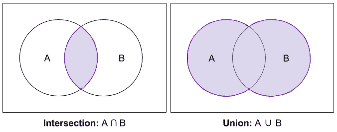
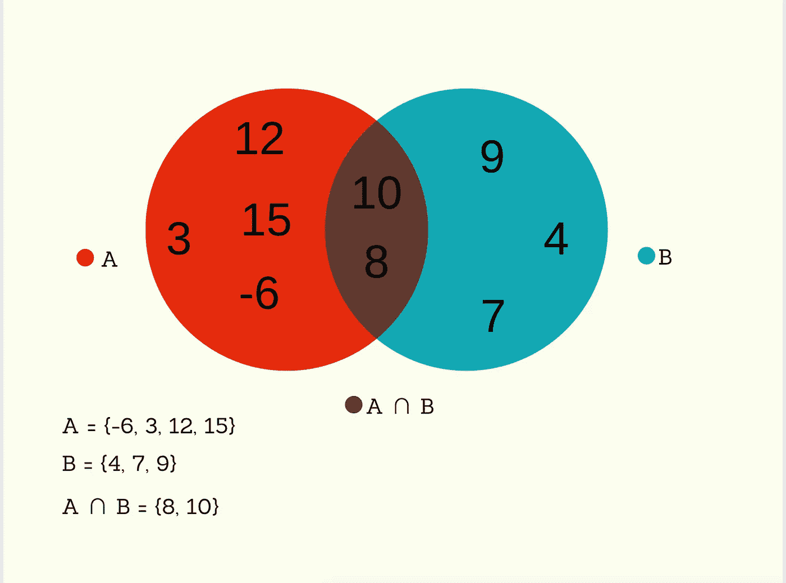
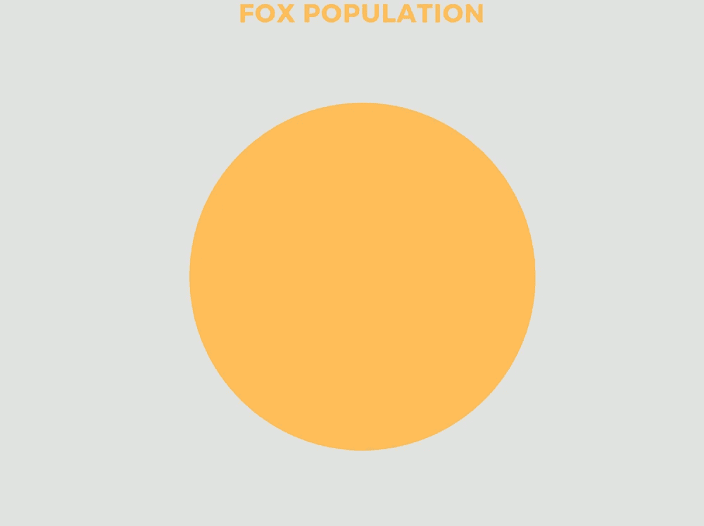
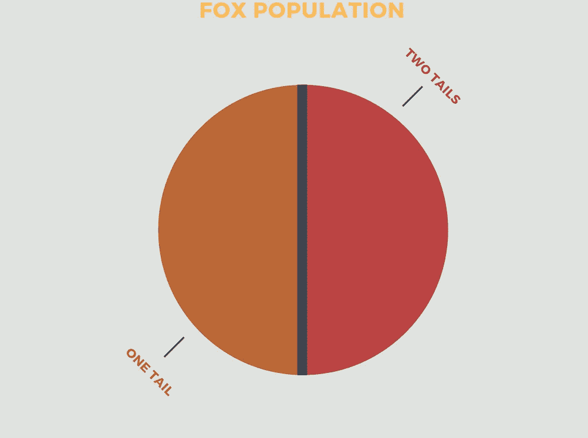
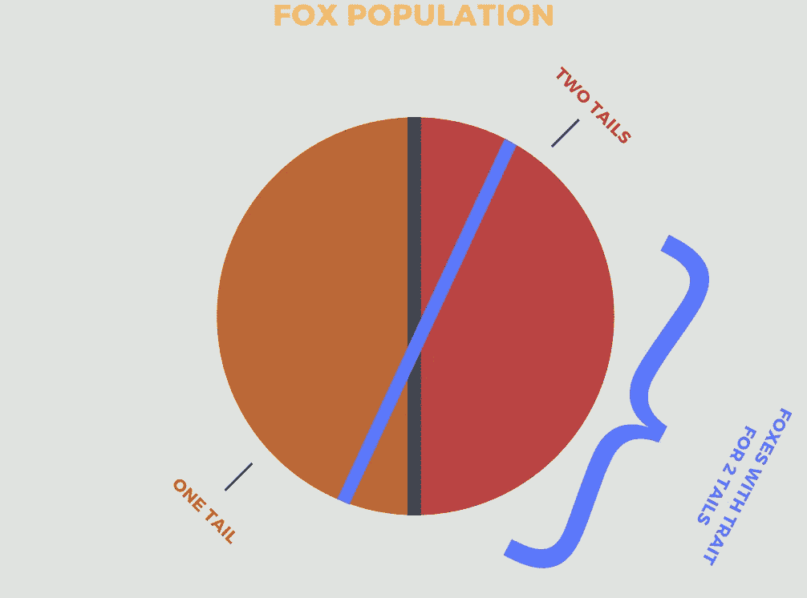
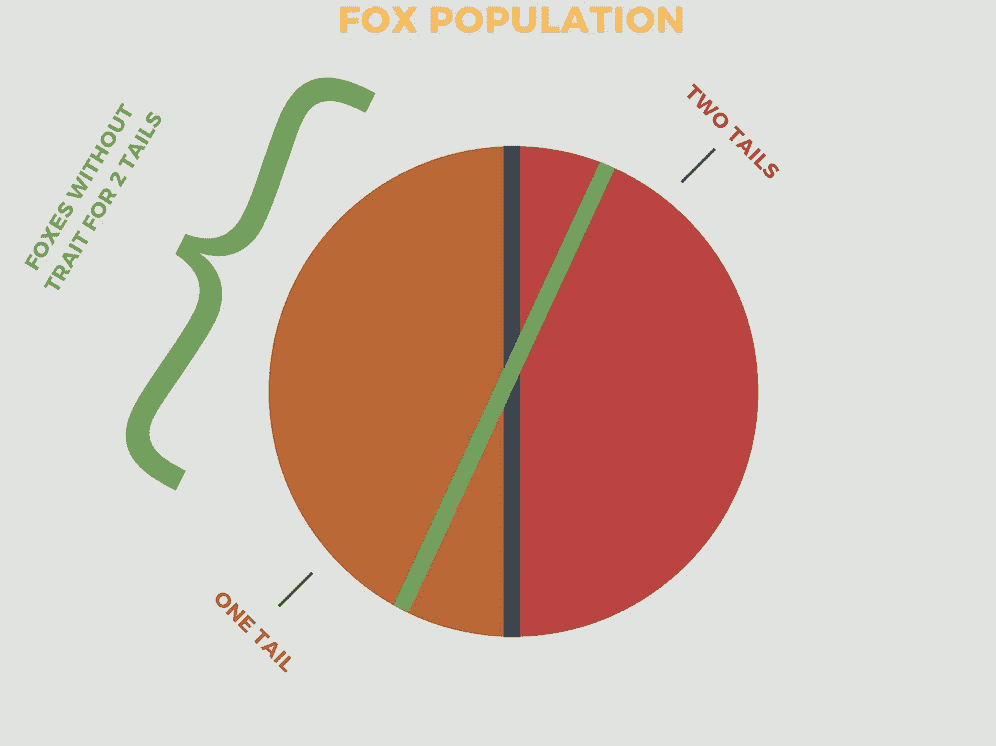
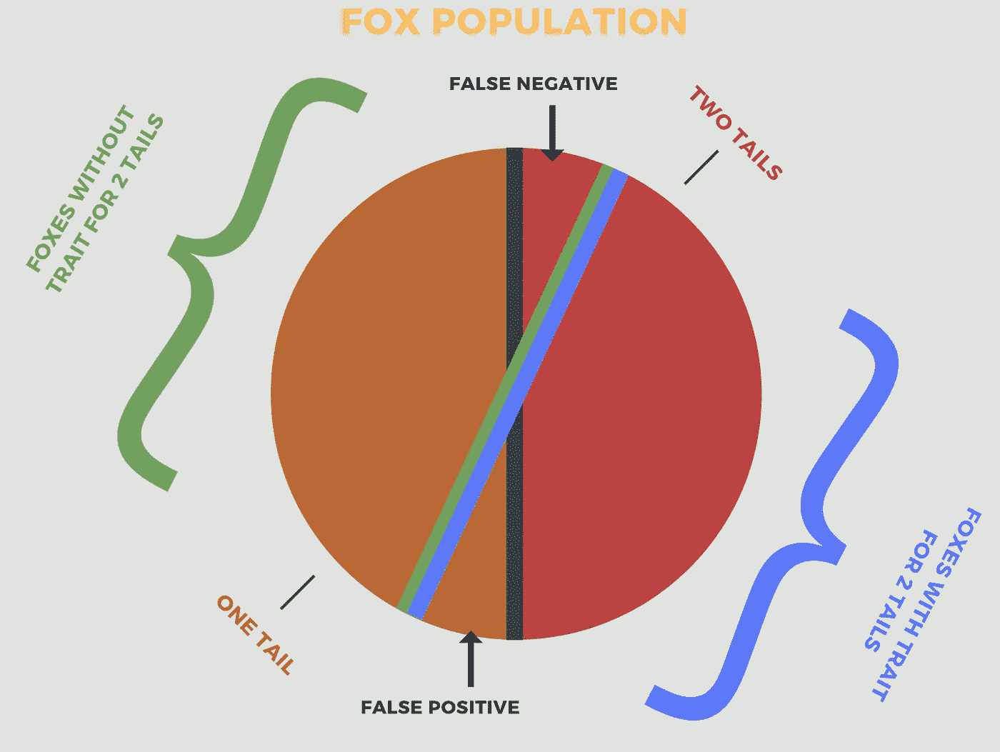

# 集合论基础

> 原文：<https://medium.com/analytics-vidhya/basics-of-set-theory-c0fbde81909f?source=collection_archive---------2----------------------->

## 对于数据科学—以真实世界为例🦊



集合 A 包含元素 1，4，-10，7
集合 B 包含元素 1，3，7，9，11，-10

A = { 1，4，-10，7 }
B = { 1，3，7，9，11，-10 }

集合可以包含任何内容。

```
Z = { Car, Book, 88, Blue, & } 
```

汽车是 Z 的元素
3 是 B 的元素
书不是 A 的元素

```
Car ∈ Z
3 ∈ B
Book ∉ A
```

A 的基数等于 4
Z 的基数等于 5

```
|A| = 4
|Z| = 5
```

交集 B 包含同时存在于 A 和 B 中的元素

```
A ∩ B = { 1 , 7 , -10 }A ∩ B = { x : x ∊ A and x ∊ B } 
```

联合 B 包含 A 和/或 B 中的值

```
A ∪ B = { 1 , 3 , 4 , 7 , 9 , 11 , -10}A ∪ B = { x : x ∊ A or x ∊ B }
```

**基因检测示例**

利用我们目前所学的知识，让我们看一个例子。

一组遗传学家发现了一个携带新表现型的狐狸种群(我们的样本)。两条尾巴的生长而不是一条。第二条尾巴直到狐狸成年后才开始生长，所以为了预测哪只狐狸会长出第二条尾巴，遗传学家开发了一种测试。

X =被测试两条尾巴的所有小狐狸的集合

```
T = { x ∊ X : x has two tails }
N = { x ∊ X : x has one tail }
```


```
X = T ∪ N 
```

x 是所有被测幼狐的集合。一只狐狸要么以后会有两条尾巴，要么不会。

```
Also T ∩ N = ∅ 
```

一只狐狸不能同时有一条尾巴和两条尾巴。测试的全部目的是看一只狐狸是在集合 T 还是集合 n 中。

让我们看看测试本身，看看它告诉我们什么。首先有两种情况。**场景 A** :一只年轻的狐狸被测试，结果显示两条尾巴的特征呈阳性。场景 B :一只年轻的狐狸被测试，结果显示两条尾巴的特征呈阴性。

```
A = { x ∊ X : young fox tests positive for two tailed trait }
B = { x ∊ X : young fox tests negative for two tailed trait }
```

重要的是要指出，在这个阶段测试阳性或阴性并不意味着狐狸会或不会有两条尾巴，它只是意味着狐狸携带或不携带两条尾巴的特征。

这意味着:

```
A ∪ B = X   (all the young foxes after being tested)
A ∩ B = ∅    (a young fox is in A or B after being tested not both) 
```

在一个完美的世界中，人们可以说，“如果一只年轻的狐狸携带这一特性，它将有两条尾巴，如果一只年轻的狐狸不携带这一特性，它将没有两条尾巴”，但这几乎从来没有发生过。我们将着眼于 4 个交叉点，让我们能够详细阐述这个缺陷。

```
T ∩ A = Two Tails and +Trait  ➔  True Positive 
N ∩ B = One Tail  and -Trait  ➔  True Negative T ∩ B = Two Tails and -Trait  ➔  False Negative  
N ∩ A = One Tail  and +Trait  ➔  False Positive 
```

我们还可以通过将有两条尾巴的狐狸的基数除以样本的基数，以及将有一条尾巴的狐狸的基数除以样本的基数来考察比例。

```
|T| ÷ |X| → Proportion of foxes with two tails
|N| ÷ |X| → Proportion of foxes with one tail for example |T| ÷ |X| = 20% thus 20% of our sample has two tails 
|N| ÷ |X| = 80% thus 80% of our sample has one tail

                 **therefore .2 + .8 = 1**
```

如果操作正确，将这些值相加应该得到 1。理想情况下，这些比例将被用来预测世界上所有携带这一特征的狐狸的后代。如果取样正确，小样本群体可以给我们一个更大群体的视图，这是不可能检索数据的。

最后

```
|T ∩ A| ÷ |T| = True Positive Rate 
|N ∩ B| ÷ |N| = True Negative Rate|T ∩ B| ÷ |T| = False Negative Rate
|N ∩ A| ÷ |N| = False Positive Rate 
```

**维恩图&包含-排除公式**

当试图理解集合论的思想时，维恩图是一个很好的可视化工具。



该文氏图的包含-排除公式如下。

```
|A ∪ B| = |A| + |B|- |A ∩ B| 
```

让我们来看一个修改过的维恩图，它包含了我们的基因测试样本



🦊

左边浅橙色的圆圈代表我们正在观察的整个狐狸种群。没有任何真实的数据，我们只会把人口分成两半。一边是一只尾狐，另一边是两只尾狐



蓝线右边的每只狐狸都有两条尾巴的特征，而绿线左边的每只狐狸没有两条尾巴的特征..绿色和蓝色线条创建的小三角形代表行为不符合我们预期的狐狸。



回忆:

```
*T ∩ A = Two Tails and +Trait  ➔  True Positive  (green bracket area)
N ∩ B = One Tail  and -Trait  ➔  True Negative  (blue bracket area)***T ∩ B = Two Tails and -Trait  ➔  False Negative ** 
**N ∩ A = One Tail  and +Trait  ➔  False Positive**
```

✅，现在就到这里吧