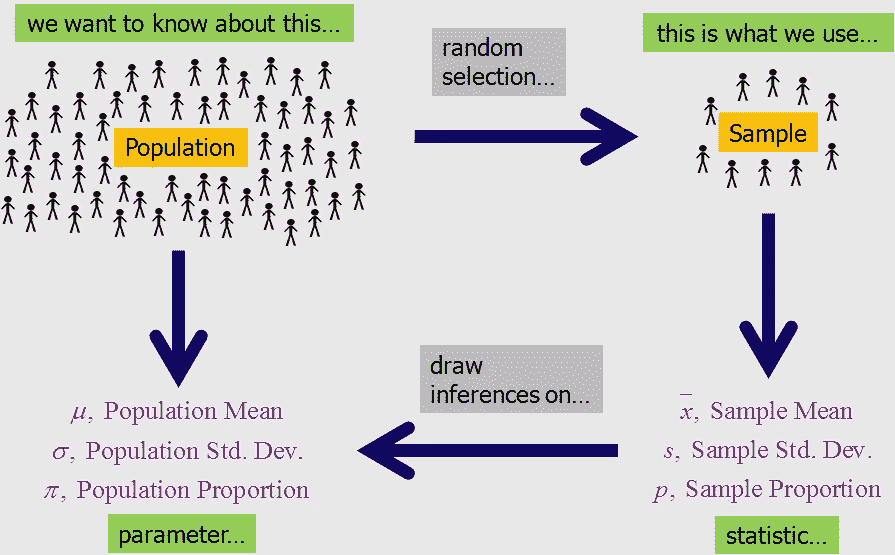
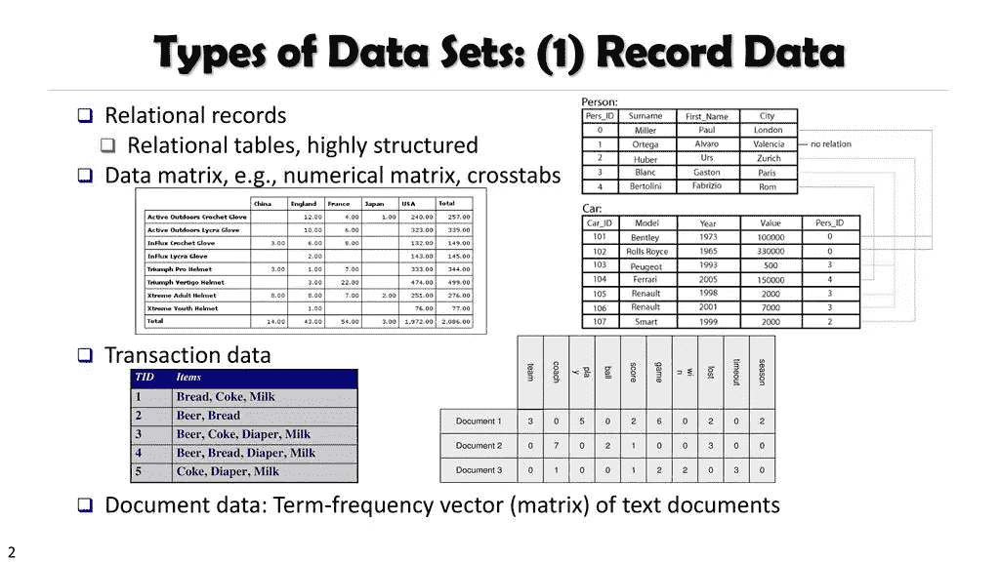
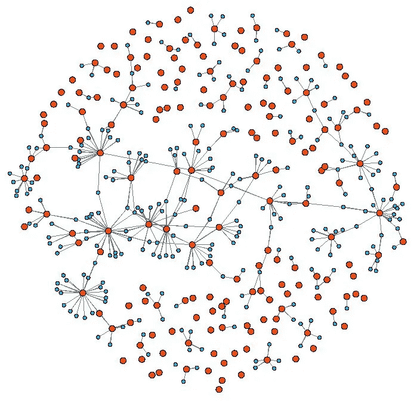
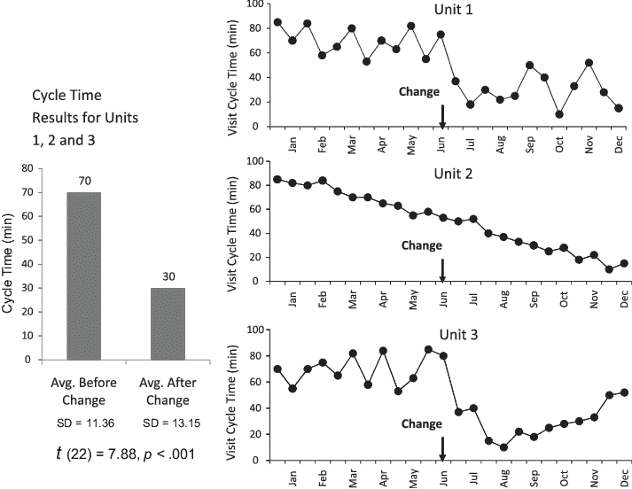

# 统计学基础—第 2 部分

> 原文：<https://medium.com/analytics-vidhya/basics-of-statistics-part-2-90cd182c622a?source=collection_archive---------23----------------------->

这是理解统计学系列的第二部分。

以下是第一部分的链接:

 [## 统计学基础

### 定义:统计学作为一门学科，它关注的是数据的收集、分析和解释，因为…

medium.com](/@namudurisujith/basics-of-statistics-38065180e70b) 

**统计学中的重要术语**

**人口**:这个术语不言自明，人口就是所有可能的数据。

例如:访问特定网站的人。

**参数:**与总体相关的数值。

例如:人们花在网站上的平均时间。

样本:从总体中选择的观察值。

例如:在一天中的特定时间访问网站的人。

**统计量**:与观察值相关的数值。

例如:人们在某一天花在网站上的平均时间。

统计的重要术语

在上一篇文章中，我们已经提到了什么数据，但是我们还不知道如何获得数据。

让我们深入研究一下。

**数据来源**

基本上有两种类型的数据源

1.原始资料

2.次级资料

**原始数据**:定期收集的数据(每天收集的数据)。

**二次数据**:已经收集并存储的数据，可能是一组天的数据。

让我们稍微谈一下数据集的类型。

什么是数据集？

**数据集**是与特定主题相关的数字或值的集合。

例如:特定班级中每个学生的考试成绩是一个数据集。

数据集的类型:

数据集大致分为 3 组，即:

**记录数据:**记录或数据字段之间没有关系的最基本形式，每个数据对象都有相同的属性集。

例子 **:** 交易数据，数据矩阵。

记录数据

**基于图形的数据:**数据对象被映射，以便捕捉对象之间的关系。

例子:分子结构、网络、万维网等。

**有序数据:**数据对象具有涉及时间或空间顺序的关系。

示例:顺序数据(视频)、遗传数据(时间序列)、事务序列、空间数据(地图、图像)。

我知道这都是概念性的，但是为了理解将在 ML/数据科学领域的各种应用中使用的统计学，还有构建模块。

在下一篇文章中，我们将了解统计数据的类型。

感谢您阅读文章。