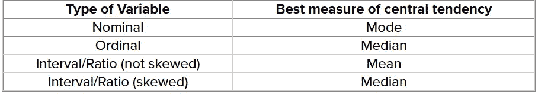

# 统计学基础—第 3 部分

> 原文：<https://medium.com/analytics-vidhya/basics-of-statistics-part-3-c930e5b89fd6?source=collection_archive---------28----------------------->

在本文中，我将向您介绍术语描述统计学和推断统计学。

这是理解统计学(理论)系列的第三部分，因为我更喜欢人们理解基本的概念，这些概念是构建的基石。

如果你想查看前面的文章，下面是链接。

 [## 统计学基础—第 2 部分

### 这是理解统计学系列的第二部分。

medium.com](/analytics-vidhya/basics-of-statistics-part-2-90cd182c622a) 

在统计和不断增长的数据科学领域，数据是可用的，但光靠这些并不能帮助实现最终结果，而这正是信息派上用场的地方。

什么都不对吗？让我这么说吧，这是你在销售团队的第一天，你的老板让你做一个演示，并交给你一份 Excel 表格。你对与你共享的数据一无所知。这就是描述性统计拯救你的一天:)

从数据到信息的转变是描述统计学的全部内容。

你如何描述一个数据？

从统计学的角度来看，数据描述如下

1.  频数分布
2.  集中趋势
3.  分散/变化

F **频率分布** : A *频率分布*是一个变量中所有不同值及其出现频率的概述。根据值的类型和范围，有 3 种类型的频率分布

1.  绝对的
2.  把…分组
3.  未分组的

C

在统计学中，**集中趋势**的三个最常见的度量是

1.  平均
2.  中位数
3.  方式

下面是一个汇总表，它可以帮助我们了解第一部分中讨论的不同类型变量的集中趋势的最佳度量。

集中趋势基于变量的类型。

M 统计**离差**的**度量**的常见例子有

1.  差异
2.  标准偏差
3.  四分位间距
4.  平均偏差
5.  范围

在 Excel 中，我们有一个数据分析工具包，它有一个描述性统计功能，可以提供有关数据的信息。

Python 有 **describe()** 方法提供类似的信息。

感谢您通读这篇文章。

将在基础统计学系列的下一篇文章中讨论推断统计学，随后是分析技术，其中的基础知识将使您更容易获得完整的理解。