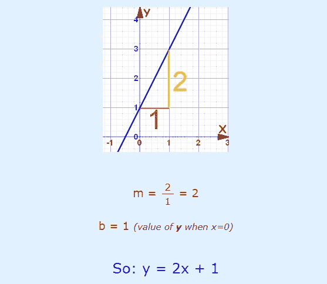
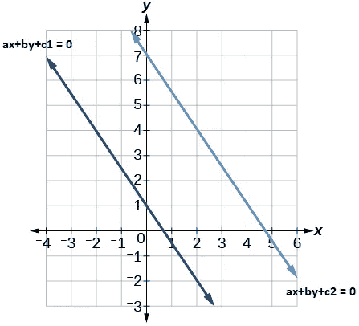
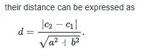
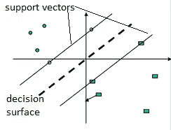
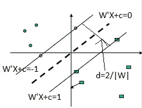

# 支持向量机基础(SVM)

> 原文：<https://medium.com/analytics-vidhya/basics-of-support-vector-machine-svm-ba6e923dc7b3?source=collection_archive---------16----------------------->

SVM 是最常用的 ML 技术之一，但是在我阅读 SVM 解释的几乎所有地方，有许多东西是假定初学者会知道的。我想有时候甚至你也知道，但是把事情联系起来有点困难。我正在尝试我的解释方式，我想如果我这样理解，其他大多数人也会理解。

让我们了解 SVM，但在此之前，我想问几个问题，在阅读时，你需要问自己？

1)什么是直线的方程？
2)两条平行线怎么看，它们的方程怎么看？
3)我们如何得到两条线之间的距离？
4)一条线如何被表示为一个矢量。

如果你知道所有这些问题的答案，我还是建议你看看下面的解释，相信我，伙计们，这会让你的 SVM 之旅更顺利。

现在让我们继续我们的第一个问题什么是直线的方程式？这绝对不是一个新东西，我们大多数人会回答说 y= mx + b 或者它的另一种形式是 ax+by+c=0，但是你还记得如果你把它画在纸上会是什么样子吗？我认为理解 SVM 是非常重要的。让我们看看下面的图片。

参考:[https://www.mathsisfun.com/equation_of_line.html](https://www.mathsisfun.com/equation_of_line.html)

这里，如果我们比较 y=mx+b 和 y=2x+1，那么 b 表示 y 轴上直线的截距，在本例中为 1，y 的变化是 x 的两倍，即 y=2x，所以这里 m 为 2。

让我们进入下一个问题——两条平行线看起来怎么样，它们的方程看起来怎么样？两条平行线总是有相同的权重向量。新手可能会对什么是重量向量感到困惑。让我用另一张图展示一下。

这里 a 和 b 在我们的权重向量中被称为权重，但是我想说的是两条平行线只有截距的不同，在我们的例子中是 c1 和 c2。现在让我们快速理解如何计算两条线之间的距离，这是我们的第三个问题。所以两条平行线之间的距离等于

最后但同样重要的是，我们如何把一条线表示成向量？线矢量由两个矩阵的点积表示，其中第一个矩阵表示重量，第二个矩阵表示尺寸。如果我们以线 ax+by+c = 0 为例，它可以表示为 W'X+c = 0，其中 W 表示权重向量 W=[a，b]，第二个矩阵将表示为 X=[x，y]。

我希望到目前为止我解释清楚了。现在让我们进入我们的话题 SVM。让我首先提出问题，然后 SVM 如何帮助我们实现我们将讨论的结果。让我们假设我们想把圆形的点和方形的点分开。

在 SVM，我们试图通过找到最接近决策面的数据点之间的最大差异来找到一个**决策面**，它是我们图片中的虚线。这些决策点被称为**支持向量**，在我们的图片中显示为两条平行线。现在的问题是为什么我们要最大化距离？原因是通过最大化距离，我们可以减少点被错误分类的可能性。这有一个数学证明，但我们不会在这里讨论。差距越大，点被错误分类的可能性就越小。

现在让我们假设决策表面是 ax+by+c=0，并且因为支持向量平行于决策表面并且与决策表面等距，所以支持向量线方程可以表示为 ax+by+c=-1 和 ax+by+c=1。(这里代替 1 的可以是任何常数值，因为它是常数，这无关紧要)如果我们需要用向量来写这些方程，我们可以分别将这些方程写成 W'X+c=0，W'X+c=-1 和 W'X+c=1，其中 W '代表 W 的转置**如前所述，我们需要找到支持向量之间的最大距离，为了做到这一点，我们将首先找到距离，然后我们将使用数学来最大化距离**。因此，为了计算距离，我们已经知道公式是，如果两条线的方程是 ax+by+c1=0 和 ax+by+c2=0

现在如果我们用上面的公式计算距离。给我们一条线 W'X+c=-1，我们可以把它写成 W'X+c+1=0，W'X+c=1 可以写成 W'X+c-1=0。现在这两者之间的距离将是|c-1-c-1|/|W|，即 2/|W|(因为 W 是向量|W|=sqrt(a + b))，我们知道决策面与支持向量的距离相等，因此支持向量与决策面的距离将是 1|W|。请参考下图。

参考:[http://web.mit.edu/6.034/wwwbob/svm.pdf](http://web.mit.edu/6.034/wwwbob/svm.pdf)

为了最大化余量，我们需要最小化||w||。在支持向量之间没有数据点的
条件下:
{ W’；yi =+1 时，Xi+c ≥+ 1
W’；yi =-1 时，Xi+c ≤- 1

上述两个方程可以组合成 yi(Xi W)≥1

现在，这看起来像一个约束优化问题，在给定 yi(Xi W)≥1 的条件下，我们需要最小化|W|。

为了进一步讨论关于 SVM 的解决方案的细节，首先，非常必要的是理解在现实世界中约束优化问题实际上是什么样子，以及我们如何解决它们，以便同样可以应用于我们的 SVM 约束优化问题。我将在下一篇博客中详细解释我们将如何解决这个约束优化问题。