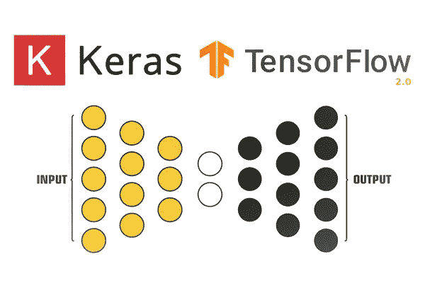
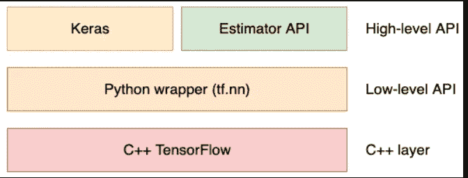
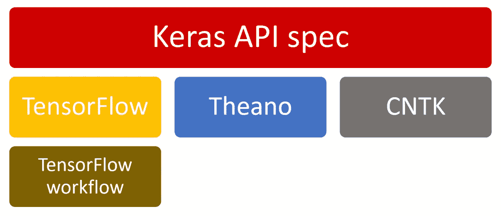
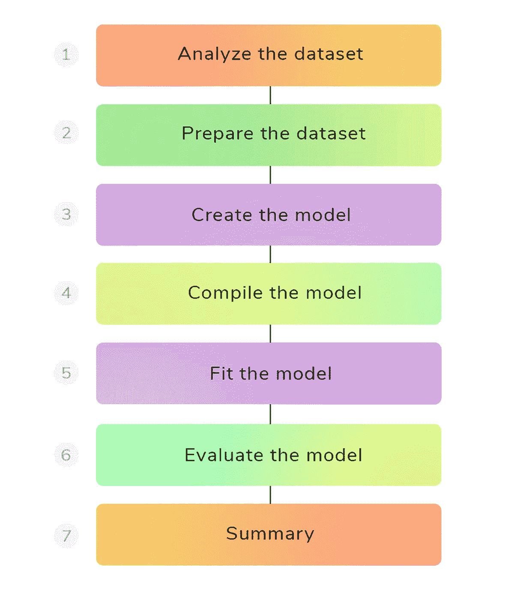

# TensorFlow 2.0 基础知识和训练模型

> 原文：<https://medium.com/analytics-vidhya/basics-of-tensorflow-2-0-and-training-a-model-bf33cf4dff5a?source=collection_archive---------25----------------------->



# TensorFlow 2.0 简介

**TensorFlow** 是一个数值处理库，最初由谷歌开发，供研究人员和机器学习从业者用于进行机器学习研究。您可以使用 TensorFlow 执行任何数值运算，它主要用于训练和运行深度神经网络。

TensorFlow 主要提供简化机器学习和深度学习解决方案在各种平台上的部署——计算机 CPU、GPU、移动设备，以及最近在浏览器中的部署。最重要的是，TensorFlow 为创建机器学习模型和大规模运行它们提供了许多有用的功能。*2019 年，TensorFlow 2 发布，重点关注易用性，同时保持良好的性能。*

TensorFlow 2.0 允许新手从简单的 API 开始，而专家可以同时创建非常复杂的模型。让我们探索这些不同的层次。

## TensorFlow 2.0 主架构

TensorFlow 2 架构有几个抽象层次。让我们首先介绍最底层，然后找到通向最高层的路:



**解释建筑的层次:**

***C++层***

大多数深度学习计算都是用 C++编写的。为了在 GPU 上运行操作，TensorFlow 使用了由 NVIDIA 开发的名为 CUDA 的库。这就是为什么如果您想利用 GPU 功能，您需要安装 CUDA，以及为什么您不能使用其他硬件制造商的 GPU。

***低级 API***

Python **低级** **API** 然后包装 C++源代码。当您在 TensorFlow 中调用 Python 方法时，它通常会在后台调用 C++代码。这个包装层允许用户更快地工作，因为 Python 被认为比 C++更容易使用，并且不需要编译。这个 Python 包装器使得执行非常基本的操作成为可能，比如矩阵乘法和加法。

***高级 API***

位于顶部的是高层 API，由两个组件组成——Keras 和 Estimator API。Keras 是一个用户友好的、模块化的、可扩展的 TensorFlow 包装器。 **Estimator API** 包含几个预制组件，可以让你轻松构建你的机器学习模型。您可以将它们视为构建块或模板。预制组件只需对代码进行最少的修改，就可以让您尝试不同的模型架构。

# 介绍 Keras

Keras 于 2015 年首次发布，旨在作为一个接口，实现神经网络的快速实验。有几个深度学习框架可以帮助建立深度神经网络。TensorFlow、Theano、CNTK(微软)是行业和研究中使用的一些主要框架。Keras 充当这些框架的包装器。它以用户友好著称，是开发者的首选库和终极深度学习工具。

**Keras API 的架构**



## 为什么是 Keras？

*   它支持美国有线电视新闻网，RNN 和两者的结合
*   快速原型制作
*   深度足以建立严肃的模型
*   写得很好的文件——参见

**基本上，Keras 车型通过以下渠道。**



# 使用 Keras 的简单计算机视觉模型

让我们从计算机视觉的一个经典例子开始——用**改进的国家标准与技术研究所** ( **MNIST** )数据集进行数字识别。

用于安装 TensorFlow 2.x 版本。

```
#!pip install tensorflow==2.0.0alpha0 #Tensorflow alpha version
#!pip install tensorflow==2.0.0-beta1 #Tensorflow beta version#print(tf.__version__) # Check the version
```

## 准备数据

首先，我们导入数据。它由训练集的 60，000 幅图像和测试集的 10，000 幅图像组成:

```
**import tensorflow as tf # import tensorflow as tf for faster typing 
import numpy as np      # import numerical python as np** **num_classes = 10
img_rows, img_cols = 28, 28
num_channels = 1
input_shape = (img_rows, img_cols, num_channels)****(x_train, y_train),(x_test, y_test) =  tf.keras.datasets.mnist.load_data()     #load the datasets****x_train, x_test = x_train / 255.0, x_test / 255.0 #DataNormalization**
```

**tf.keras.datasets** 模块提供了下载和实例化大量经典数据集的快速访问。在使用 **load_data** 导入数据后，我们将数组除以 255.0，得到一个在[ *0，1* 范围内的数，而不是[ *0，255* ]范围内的数。通常的做法是归一化数据，要么在[ *0，1* 范围内，要么在[ *-1，1* 范围内。

## 构建模型

转到构建实际模型。我们将使用一个非常简单的架构，由两个完全连接的层组成，称为密集层。现在，让我们看一下代码。可以看到，Keras 代码非常简洁明了地写着。

```
**model = tf.keras.models.Sequential()
model.add(tf.keras.layers.Flatten())
model.add(tf.keras.layers.Dense(128, activation='relu'))
model.add(tf.keras.layers.Dense(num_classes, activation='softmax'))**
```

由于我们的模型是层的线性堆栈，我们从调用顺序函数开始。然后我们一层接一层地添加每一层。我们的模型由两个完全连接的层组成。我们一层一层地建造它:

*   **展平:**这将把代表图像像素的 2D 矩阵转换成 1D 数组。我们需要在添加完全连接的层之前这样做。 *28* × *28* 图像被转换成大小为 *784* 的矢量。
*   **密度**大小 *128* **:** 这将使用大小 *128* × *784* 的权重矩阵和大小 *128* 的偏差矩阵将 *784* 像素值转化为 128 个激活。总的来说，这意味着 *100，480 个*参数。
*   **密集**大小*10*:这将把 *128* 激活变成我们的最终预测。注意，因为我们希望概率总和为 *1* ，我们将使用 softmax 激活函数。softmax 函数获取图层的输出，并返回总和为 1 的概率。它是分类模型最后一层的选择激活。

您可以获得模型、输出及其权重的描述。

```
**model.summary()**
```

以下是输出:

```
**Model: "sequential"**
**_________________________________________________________________**
**Layer (type) Output Shape Param #** 
**=================================================================**
**flatten_1 (Flatten) (None, 784) 0** 
**_________________________________________________________________**
**dense_1 (Dense) (None, 128) 100480** 
**_________________________________________________________________**
**dense_2 (Dense) (None, 10) 1290** 
**=================================================================**
**Total params: 101,770**
**Trainable params: 101,770**
**Non-trainable params: 0**
```

## 训练模型

Keras 让培训变得极其简单:

```
**model.compile(optimizer='sgd',loss='sparse_categorical_crossentropy, metrics=['accuracy'])**
```

呼叫**。对于我们刚刚创建的模型，compile()** 是一个强制步骤。必须指定几个参数:

*   **优化器:**这是将执行梯度下降的组件。
*   **损失:**这是我们将优化的指标。在我们的例子中，我们选择交叉熵，就像上一章一样。
*   **度量:**这些是在训练期间评估的附加度量函数，以提供模型性能的进一步可见性(与 loss 不同，它们不用于优化过程)。

```
**model.fit(x_train, y_train, epochs=5, verbose=1, validation_data=(x_test, y_test))**
```

然后我们调用。fit()方法。我们将训练五个**时期**，这意味着我们将在整个训练数据集上迭代五次。注意，我们将 **verbose** 设置为 1。这将允许我们得到一个进度条，上面有我们之前选择的指标、损耗和**预计到达时间** ( **ETA** )。ETA 是对该时期结束前剩余时间的估计。下面是进度条的样子:

**评估模型:**

```
**model.evaluate(x_test,y_test)**
```

我们遵循三个主要步骤:

1.  **加载数据**:在这种情况下，数据集已经可用。在未来的项目中，您可能需要额外的步骤来收集和清理数据。
2.  **创建模型**:通过使用 Keras，这一步变得很简单——我们通过添加连续的层来定义模型的架构。然后，我们选择了一个损失、一个优化器和一个要监控的指标。
3.  培训模型:我们的模型第一次运行得很好。对于更复杂的数据集，您通常需要在训练期间微调参数。

由于 TensorFlow 的高级 API Keras，整个过程非常简单。在这个简单的 API 背后，这个库隐藏了很多复杂性。

*参考文献:*

*   [https://www.tensorflow.org/guide/keras/overview](https://www.tensorflow.org/guide/keras/overview)
*   [https://web . Stanford . edu/class/cs20si/lectures/March 9 guest lecture . pdf](https://web.stanford.edu/class/cs20si/lectures/march9guestlecture.pdf)
*   [https://blog . tensor flow . org/2020/03/recap-of-2020-tensor flow-dev-summit . html](https://blog.tensorflow.org/2020/03/recap-of-2020-tensorflow-dev-summit.html)
*   [http://keras.io](http://keras.io/)
*   [https://www.deeplearning.ai/tensorflow-in-practice/](https://www.deeplearning.ai/tensorflow-in-practice/)