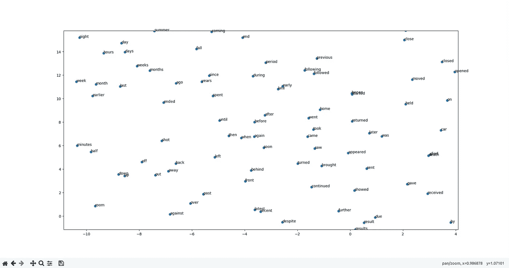
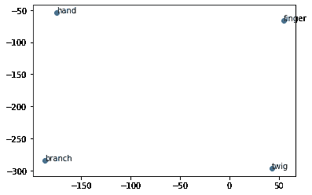

# 在 Python 中使用预训练手套向量的基础

> 原文：<https://medium.com/analytics-vidhya/basics-of-using-pre-trained-glove-vectors-in-python-d38905f356db?source=collection_archive---------0----------------------->

## 下载、加载和使用预先训练的手套向量

# 内容

本文将涵盖:
******* 下载并加载预先训练好的向量 ******* 寻找与给定向量相似的向量 ******* 【数学与文字】 ******* 可视化向量

进一步的阅读资源，包括原始的手套论文，在最后提供。

# 手套简介

**Glo**bal**Ve**ctors for Word re presentation，或 GloVe，是一种"[无监督学习算法，用于获取单词的矢量表示。](https://nlp.stanford.edu/projects/glove/)“简单来说，GloVe 可以让我们拿一个文本的语料库，直观地将那个语料库中的每一个单词转换成高维空间中的一个位置。这意味着相似的单词将被放在一起。

如果你想详细了解 GloVe 的工作原理，可以在最后找到相关链接。

# 下载预先训练的向量

前往 https://nlp.stanford.edu/projects/glove/。然后在“下载预先训练的单词向量”下面，你可以为不同大小或训练数据集选择四个选项中的任何一个。

我选择了*维基百科 2014 + Gigaword 5* 矢量。你可以在[http://nlp.stanford.edu/data/glove.6B.zip](http://nlp.stanford.edu/data/glove.6B.zip)下载那些精确的矢量(警告:这是一个 822 MB 的下载)

我不能保证下面使用的方法将与所有其他预先训练的向量一起工作，因为它们还没有经过测试。

# 进口

对于这个项目，我们将需要使用、Numpy、Scipy、Matplotlib 和 Sklearn。
如果您需要安装其中任何一个，您可以运行以下命令:

```
pip install numpy
pip install scipy
pip install matplotlib
pip install sklearn
```

根据您的 Python 版本，您可能需要用 pip 替换 pip3。

现在，我们可以通过以下方式从这些模块中导入我们需要的零件:

# 加载向量

在代码中加载向量之前，我们必须理解文本文件是如何格式化的。
文本文件的每一行包含一个单词，后跟 *N 个*数字。N 个数字描述了单词位置的向量。 *N* 可能会因你下载的矢量而异，对我来说， *N* 是 50，因为我用的是 *glove.6B.50d.*

以下是文本文件中的一行示例，缩短为前三个维度:

```
business 0.023693 0.13316 0.023131 ...
```

为了加载预先训练好的向量，我们必须首先创建一个字典来保存单词之间的映射，以及这些单词的[嵌入向量](https://en.wikipedia.org/wiki/Word_embedding)。

```
embeddings_dict = {}
```

假设您的 Python 文件与 GloVe vectors 在同一个目录中，我们现在可以打开包含嵌入内容的文本文件:

```
with open("glove.6B.50d.txt", 'r', encoding="utf-8") as f:
```

注意:你需要将*glove . 6b . 50d . tx*t*替换为你为向量选择的文本文件的名称。*

一旦进入 *with* 语句，我们需要遍历文件中的每一行，并按每个空格将该行拆分成它的每个组成部分。

在拆分行之后，我们假设单词中没有任何空格，并将其设置为等于拆分行的第一个(或第零个)元素。

然后我们可以把这一行的剩余部分，转换成一个 *Numpy* 数组。这是单词位置的向量。

最后，我们可以用新单词及其对应的向量来更新我们的字典。

作为我们加载向量的完整代码的回顾:

请记住，如果您的矢量文本文件包含带有空格的单词，您可能需要编辑将单词从矢量*中分离出来的方法。*

# 寻找相似向量

我们可以用手套向量做的另一件事是找到与给定单词最相似的单词。我们可以通过如下奇特的一行函数来实现这一点:

这个很复杂，我们来分解一下。
*排序*将一个 iterable 作为输入，并使用一个键对其进行排序。在这种情况下，我们传入的 iterable 是我们想要排序的所有可能的单词。我们可以通过调用 *embeddings_dict.keys()来获得这样的单词列表。*

现在，因为默认情况下 Python 会按字母顺序对列表进行排序，所以我们必须指定一个*键*来按照我们想要的方式对列表进行排序。
在我们的例子中，*键*将是一个 lambda 函数，它将一个单词作为输入，并返回该单词的嵌入和我们给该函数的嵌入之间的距离。我们将使用欧几里得距离来度量两个嵌入之间的距离。

*scipy* 在其模块 *spatial* 下有一个测量欧氏距离的函数，我们之前导入过。所以我们最后的排序键变成了:

```
*lambda* *word*: spatial.distance.euclidean(embeddings_dict[word], embedding)
```

现在，如果我们想根据与给定单词的接近程度对所有单词进行排序，比如说“king”，我们可以使用:

```
find_closest_embeddings(embeddings_dict["king"])
```

然而，这将打印每个单词，所以如果我们想缩短它，我们可以在最后使用一个切片，最接近的，让我们说五个单词。

```
find_closest_embeddings(embeddings_dict["king"])[:5]
```

因为与给定单词最接近的单词总是那个单词，所以我们可以将我们的切片偏移 1。

```
find_closest_embeddings(embeddings_dict["king"])[1:6]
```

用我的向量 glove.6B.50d，

```
print(find_closest_embeddings(embeddings_dict["king"])[1:6])
```

版画: *['王子'，'皇后'，'叔叔'，'二世'，'孙子']*

我们直接采用嵌入，而不是将单词转换成嵌入的原因是，当我们添加和减去嵌入时，我们可以找到与嵌入最接近的近似单词，而不仅仅是单词。我们可以做到这一点，即使嵌入并不完全依赖于任何单词。

# 数学与文字

既然我们可以把任何单词转换成向量，我们可以对向量和单词使用任何数学运算。

比如我们可以把两个字加在一起，减在一起，就像数字一样。即*小树枝+手≈手指*

上面的代码打印了“*指甲*作为它的顶部结果，这在逻辑上是可以接受的。

# 可视化矢量

没有什么比可视化数据更有助于发现数据中的洞见。

为了可视化向量，我们首先要使用一种称为 t-分布式随机邻居嵌入的方法，也称为 t-SNE。t-SNE 将允许我们把数据的 50 维减少到 2 维。在我们这样做之后，就像使用 *matplotlib* 散点图来绘制它一样简单。如果你想了解更多关于 SNE 霸王龙的知识，在文章的最后有一些链接。

幸运的是，sklearn 有一个 [t-SNE 类](https://scikit-learn.org/stable/modules/generated/sklearn.manifold.TSNE.html)，可以让我们的工作变得更容易管理。为了实例化它，我们可以使用:

```
tsne = TSNE(*n_components*=2, *random_state*=0)
```

*n_components* 指定减少数据的维数。
*random_state* 是我们可以用来获得一致结果的种子*。*

初始化 t-SNE 类后，我们需要获得每个单词的列表，以及该单词的对应向量。

```
words =  *list*(embeddings_dict.keys())
vectors = [embeddings_dict[word] for word in words]
```

第一行获取 *embeddings_dict* 的所有键，并将其转换为一个列表。

第二行使用 list comprehension 来获取与我们选择的每个单词对应的 *embeddings_dict* 中的值，并将其放入列表中。

我们也可以手动指定*单词*，这样它将只绘制单个单词。即*词=【“姐姐”、“哥哥”、“男人”、“女人”、“叔叔”、“阿姨”】*

在得到我们想要使用的所有单词及其对应的向量后，我们现在需要在向量上拟合 t-SNE 类。
我们可以使用:

```
Y = tsne.fit_transform(vectors[:1000])
```

如果你愿意，你可以移除或扩展*矢量*末端的切片，但是要注意；这可能需要一台强大的计算机。

在 t-SNE 类完成对向量的拟合后，我们可以使用 *matplotlib* 散点图来绘制数据:

```
plt.scatter(Y[:, 0], Y[:, 1])
```

这本身不是很有用，因为它只是一堆点。为了改进它，我们可以通过使用标签循环遍历每个 *X Y* 点并调用 *plt 来注释图表，使用那些 *X Y* 点和那个标签来注释*。该函数的其他输入用于重要的格式化。[Matplotlib 中的注释](https://matplotlib.org/users/annotations.html)

最后，我们可以展示这个情节，

```
plt.show()
```


有点拥挤，但你仍然可以看到相关性。



放大

这在功能较弱的计算机上可能会滞后，所以你可以选择减少显示的字数，将 *vectors[:1000]* 改为更像 *vectors[:250]* 的东西，或者将 *words* 改为你自己制作的列表。



*单词= [“树枝”、“小枝”、“手指”、“手”]*

可视化矢量的完整代码:

# 结论

在我的 GitHub [这里](https://github.com/sebtheiler/tutorials/tree/main/using-pretrained-glove-vectors)有 Jupyter 笔记本和 Python 文件格式的完整代码。

使用预训练的手套向量只能做这么多。对于更高级的用法，我建议参考[官方自述文件](https://github.com/stanfordnlp/GloVe/blob/master/README.md)来训练你自己的向量。

上面没有提到的一个重要用途是在自然语言处理模型的开始加载一个嵌入层，使用这些向量。理论上，这将大大提高模型的准确性，并节省从头训练新嵌入的时间。

# 延伸阅读:

**论文:**
原手套论文:[https://nlp.stanford.edu/pubs/glove.pdf](https://nlp.stanford.edu/pubs/glove.pdf)
原 t-SNE 论文:[http://jmlr . org/Papers/volume 9/vandermaten 08 a/vandermaten 08 a . pdf](http://jmlr.org/papers/volume9/vandermaaten08a/vandermaaten08a.pdf)

**更详细的手套解说:** *******[https://mlexplained . com/2018/04/29/paper-Manchester-GloVe-global-vectors-for-word-representation-explained/](https://mlexplained.com/2018/04/29/paper-dissected-glove-global-vectors-for-word-representation-explained/)
*******[https://blog . acolyer . org/2016/04/22/GloVe-global-vectors-for](https://blog.acolyer.org/2016/04/22/glove-global-vectors-for-word-representation/)

**更详细的 t-SNE 解说:** *******[https://mlexplained . com/2018/09/14/paper-解剖-可视化-数据-使用-t-SNE-解释/](https://mlexplained.com/2018/09/14/paper-dissected-visualizing-data-using-t-sne-explained/)
*******[https://distill.pub/2016/misread-tsne/](https://distill.pub/2016/misread-tsne/)