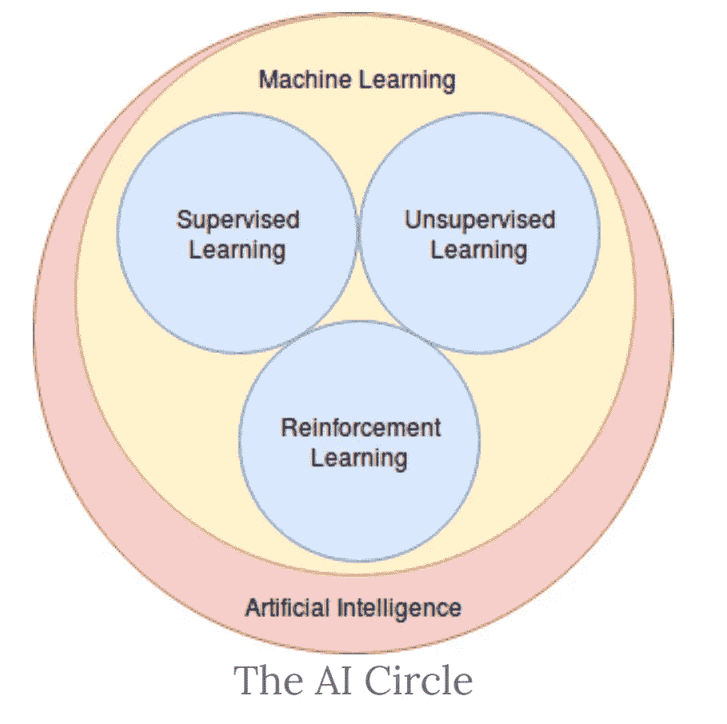
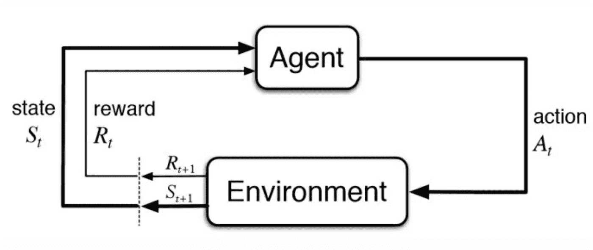
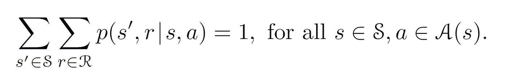
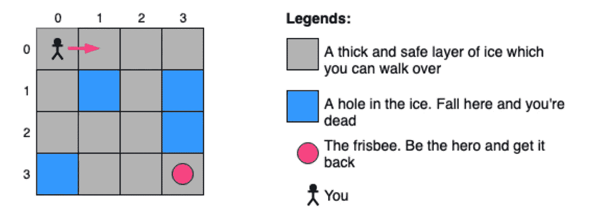
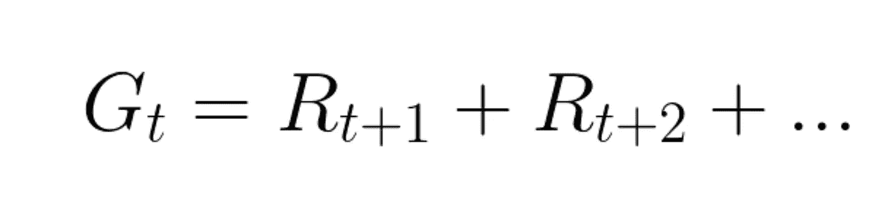
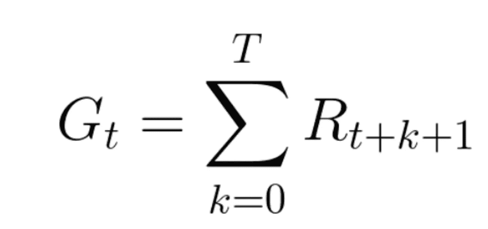
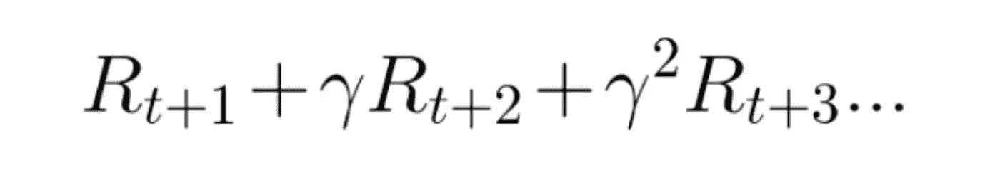
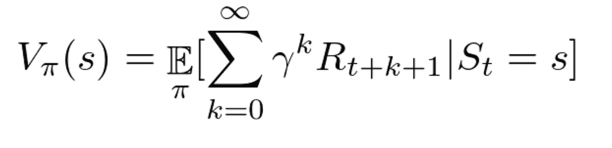
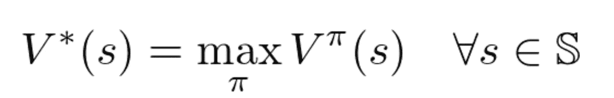
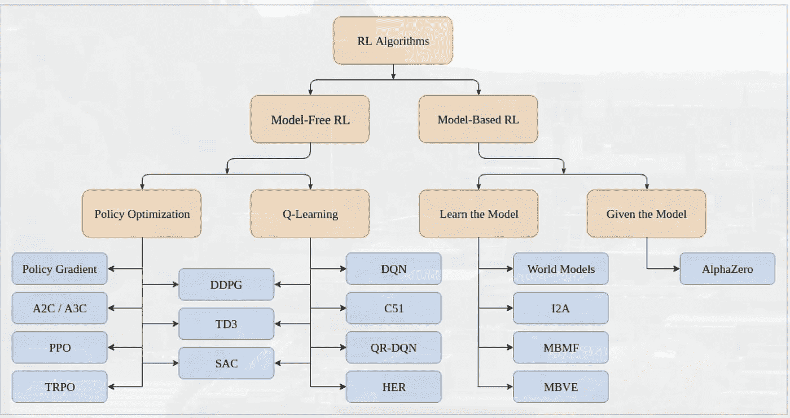

# 基础——强化学习

> 原文：<https://medium.com/analytics-vidhya/basics-reinforcement-learning-66aae5da4c85?source=collection_archive---------14----------------------->

图片提供:DataCamp

如你所知，机器学习是人工智能的一个子类。同样，各种学习算法也属于机器学习。在这个系列中，我将介绍中级水平的强化学习(RL)的基础知识。当我们谈到强化学习时，许多人会有这样的概念，即它的特征是什么，以及我们如何预测我们的目标。简而言之，RL 是一种技术，它使代理能够在交互环境中使用来自其自身行为和经验的反馈，通过反复试验来学习。虽然监督学习和强化学习都使用输入和输出之间的映射，但与监督学习不同，监督学习中提供给代理的反馈是执行任务的正确动作集，强化学习使用奖励和惩罚作为积极和消极行为的信号。

# 强化学习的应用

为了更清楚，这里有一些强化学习的实际应用

*   工业自动化机器人技术。
*   商业战略规划
*   机器学习和数据处理
*   无人驾驶汽车
*   飞机控制和机器人运动控制
*   股票市场交易

# 强化学习的体系结构

从上面的图片中，我们可以了解我们的强化学习的基本架构是什么样子的。我们的 RL 模型由一个代理组成，我们需要训练它通过做出一系列决策(动作)来与环境交互。环境可以是任何东西，它不局限于游戏平台。甚至在股市交易中使用 RL。在这种情况下，股票市场是我们的环境，代理人将在那里互动。环境会告诉我们的代理人的状态，代理人也会从环境中得到反馈，这就是奖励。

**强化学习的目标:**最大化我们未来的总回报。

**奖励假设:**我们的智能体通过从环境中获得的奖励(标量反馈)更多地了解它与环境的交互。因此，奖励是我们的中心思想，以使我们的代理在环境中更好。

> *在现实世界中，我们应该定义自己对环境的回报。*

我希望你已经理解了强化学习的真正本质和它的主要目标。让我们更深入地研究一下强化学习领域中使用的术语

# 强化学习的组成部分

当我们开始谈论 RL 时，这些是最常用的术语

**状态**:代理当前的情况。

**动作**:代理将当前状态改变为未来状态的决定或动作

**环境**:代理交互和执行动作的地方，环境可以是物理的，也可以是虚拟的

代理人:我们在强化学习问题中训练的处理环境的代理人。

**奖励**:从当前状态转移到未来状态后给予代理的反馈。反馈信号是标量的。

**策略**:作为策略制定的最优策略，代理从一个状态移动到另一个状态时采用。

**价值函数:**代理人在当前状态采取行动转移到下一个未来状态会得到的回报。

# 马尔可夫决策过程

我们在强化学习中的所有问题都可以表述为马尔可夫决策过程。一个 MDP 由一组有限的环境状态 S、每个状态下的一组可能的动作 A(s)、一个实值奖励函数 R(s)和一个转移模型 P(s '，s | a)组成。然而，真实世界的环境更有可能缺乏任何环境动力学的先验知识。

因此，MDP 和代理人一起产生了这样开始的序列或轨迹:

S0，A0，R1，S1，A1，R2，S2，A2，R3，…..

确定未来奖励的条件概率

上面的函数给出了未来奖励的概率，条件是我们在状态*s’*中采取特定动作’*a’*，通过获得奖励移动到状态*s’*

插图来了解强化学习算法的工作原理。

冰冻湖游戏

在上面的图像中，简笔画是我们的代理。我们需要训练代理人拿到飞盘，飞盘的颜色是粉红色的，但是要注意不要掉到洞里面。我们的环境是代理交互的 4 x 4 网格。

代理可以采取的措施有:向左移动。向右移动，向前移动，向后移动。状态是对环境的观察在这个例子中，代理的位置是状态。所以，现在我们的环境中有 16 个状态。我们可以制定一个奖励。如果代理人掉进洞里，游戏结束，奖励是-1，到达终点是+1。

*   我们的代理从**环境**接收**状态 S0** (在我们的例子中，我们从冰冻的湖(环境)接收代理(状态)的第一个位置)
*   基于该**状态 S0，**代理采取**动作 A0** (我们的代理将向左移动)
*   环境过渡到一个**新**状态**S1**(新帧)
*   环境给代理一些**奖励 R1** (不踩冰:+1)

RL 循环输出→ **(状态、动作、奖励)**

主要目标是最大化我们的预期累积回报。

每个时间点的未来奖励总和

对于每个时间步骤，我们都在总结我们的奖励。在现实世界中，我们不能把所有的回报加起来，因为有些回报不会马上到来。为了更关心未来的奖励，我们引入了一个称为“gamma”的贴现因子，它将用于贴现我们的未来奖励。gamma 的值应该在 0 到 1 的范围内。这被认为是重要的超参数之一。

1.  **越大****γ**值，代理人越关心**的长期报酬。**
2.  另一方面，**的值**越小，代理越关心**最近的奖励**。

因此，重要的是调整我们的 gamma 值以保持平衡，从而使我们的目标**最大化未来贴现累积奖励**

带折扣系数的所有奖励的总和

# 强化学习的方法

以下是强化学习中广泛使用的方法

**基于价值(状态-动作对):**在基于价值的方法中，我们的目标是最大化我们的价值函数 **V(s)。**分析达到特定状态或采取特定行动所需的良好价值(即价值学习)。

从所有的值函数中，我们将取状态-动作对的最大值

**基于策略:**在基于策略的 RL 中，我们需要直接优化策略函数***【π(s)】***，而不需要使用值函数。直接推导出一个最优策略，使回报最大化。形式上，策略是从状态到选择每个可能动作的概率的映射。如果代理人在 t 时刻遵循策略 ***π*** ，那么 ***π* (a|s)** 就是 A = *a* 的概率如果 S = *s* 。

我们有两种政策:

1.  **确定性:**处于给定状态的策略将总是返回相同的动作。相同状态中的相同动作导致所有时间步长的相同下一个状态。
2.  **随机:**输出动作的分布概率**。**主体在某个状态采取行动，由此产生的下一个环境状态必然始终相同，这些不确定性导致更难找到最优策略

# **蒙特卡洛 vs TD 学习:**

**强化学习中的蒙特卡罗**方法，其中代理与环境交互，但在场景结束时从环境中获得**反馈。与价值函数不同，价值函数在每个时间步获得反馈，以了解当前状态有多好。**

在这种蒙特卡罗方法中，代理生成经验样本，最后计算平均回报，我们用它来理解状态或状态-动作值。这只能用在偶发性问题中。

**TD(时间差)学习**另一方面，不会等到一集结束才更新**最大预期未来报酬估计:它会更新在该体验发生的非终点状态 St 的值估计 V。**

这种方法称为 TD(0)或**一步 TD(在任何单个步骤后更新值函数)。**

# **基于模型与无模型的强化学习**

在**基于模型的学习**中，代理利用先前学习的模型来完成手头的任务，而在**无模型学习**中，代理仅仅依靠一些试错经验来进行动作选择。 **Q-Learning 被认为是无模型学习，因为它从每个经验中学习。**

# **强化学习的分类**

流程图

从上面的图片中，我可以推断出在强化学习算法下有很多领域可以探索和研究。在这一系列教程中，作为一个初学者，我将使用无模型算法下的概念。

在无模型算法中，有两个部分

1.  政策优化
2.  q 学习

我想先关注一下 **Q 学习**，然后再深入**深度 Q 学习。**

## **其他文章**

*   [水平提升-理解 Q 学习](/@nancyjemi/level-up-understanding-q-learning-cf739867eb1d)
*   [深度 Q 学习讲解](/@nancyjemi/deep-q-learning-explained-65df980aac6f)

万岁 yyyyy！！！你已经到了我第一篇博客的结尾。感谢你阅读这篇文章，我希望你已经对什么是强化学习有了一些基本的理解，并对每个术语和术语有了一些基本的细节。

***用下面的问题*** 检查你的基本理解

1.  代理学习他们的行动的中心思想是什么？

(环境，**奖励**)

2.gamma 值越高，代理人关心的越多？

(**长期奖励，**短期奖励，)

3.代理通过试错法学习环境的以下哪种方法？

(基于模型的，**无模型的**，TD 学习，蒙特卡罗)

4.对于情节性任务，使用什么方法？

(时间差学习，**蒙特卡罗方法**)

感谢您阅读我的文章。如有任何建议和问题，请发电子邮件至 nancyjemimah@gmail.com 给我。

对于我另外两个系列的工作代码，我想让你访问我的 [GitHub](https://github.com/NancyJemimah/INFO7390_Advance_Data_Science)