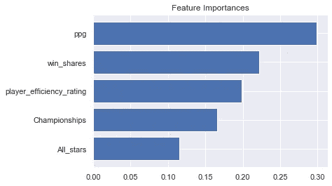
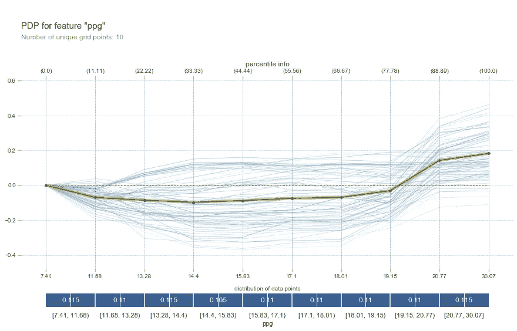
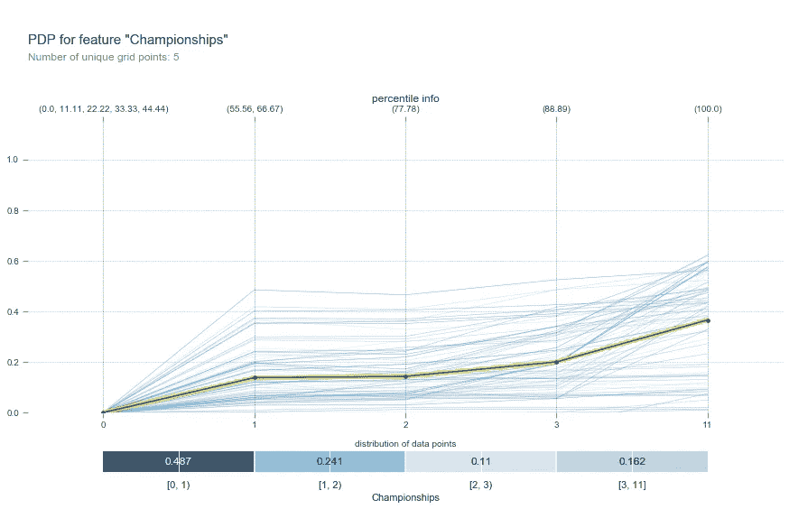
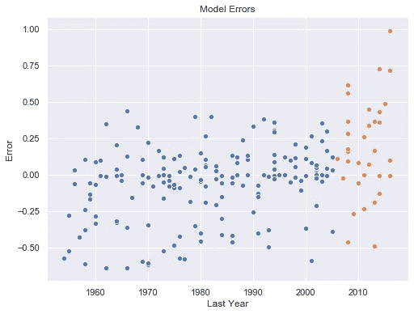

# 用 Python 预测篮球名人堂

> 原文：<https://medium.com/analytics-vidhya/basketball-hall-of-fame-predictions-with-python-b7cee3724112?source=collection_archive---------9----------------------->

名人堂经常是篮球迷们争论的焦点。只有精英中的精英才应该被允许加入，但是影响选民决定的因素太多了。在这里，我们试图模拟他们的决策，并估计玩家被投票的概率。

包含与这个项目相关的可视化的 Tableau 故事可以在[这里](https://public.tableau.com/profile/jean6960#!/vizhome/BasketballHallofFameProbability/BasketballHallofFameProbabilities)找到。

包含这个项目代码的 ipython 笔记本可以在[这里](https://github.com/sebasdarius/data_science_portfolio/blob/master/Basketball_HOF/Model_Selection.ipynb)找到。

我们使用从 basketball-reference.com[刮来的数据。我们收集了常规赛和季后赛的数据，全明星赛的出场次数和各种奖项。我们也使用了和 basketball-reference.com 一样的标准来决定我们的模型将用来训练哪些球员。我们只考虑那些在 NBA 打了大部分职业生涯，并且积累了至少 50 份职业胜利股份的球员。](https://www.basketball-reference.com/)

# **模型构建**

首先，我们导入一些需要在数据文件中使用和读取的库。

接下来，我们创建一些我们认为很有预测性的特征。这就是领域知识在机器学习中非常有用的地方。我们还将数据分为训练集、验证集和测试集。因为在现实生活中，我们会使用过去的数据来预测未来的事件，所以我们使用这种方法来分割我们的数据。

我们也删除了还没有资格被投票的球员。大厅要求玩家退役至少 3 年才被考虑。

接下来，我们手动选择一些我们认为可能值得一看的特性。我们确定了 26 个可能具有预测性的特征。有了一个更大的数据集，我们也许能够从所有的特征开始。但是对于这个小数据集(141 个训练观察值)，太多的变量将使我们的模型难以学习。

我们还创建了一个名为`print_metrics`的函数来打印出模型的精度和损失函数。

我们使用 Brier 评分作为我们的衡量标准。我们使用这个指标是因为它严重惩罚了大的错误，我们不希望我们的最终概率与事实相差太远。

## 逻辑回归

我们要尝试的第一个模型是逻辑回归模型。这是一个很好的首选，因为它是一个简单的算法，这意味着它比更复杂的算法更不容易过度拟合。它也有一个概率解释，这对我们的需求很重要。

为了选择用于逻辑回归的特征，我们使用 sklearn 的递归特征消除(RFE ),它适合我们的模型，并基于前一步的系数在每一步移除一个特征。

输出:

```
6 selected features
['Count_mvp', 'All_stars', 'Championships', 'box_plus_minus', 'value_over_replacement_player', 'ppg'] 

Training Accuracy:  0.8272251308900523 
Validation Accuracy:  0.9 
Out of Bag Accuracy:   
Training Loss:  0.10711748964899732 
Validation Loss:  0.0705776399962272
```

当我们打印最优逻辑回归模型的系数时，我们得到如下结果。

```
 Coefficients
Count_mvp                          1.569915
All_stars                          2.117843
Championships                      1.551612
box_plus_minus                     1.191951
value_over_replacement_player     -1.241967
ppg                                0.437403
```

我们发现了一些不寻常的事情，那就是“价值超过替代球员”的系数是负的。这令人惊讶，因为这是一个玩家指标，玩家越优秀，这个指标应该越高。负系数几乎肯定是与某些其他特征共线的结果。所以我们要把它从模型中剔除。

当我们这样做时，我们得到以下系数。

```
Training Accuracy:  0.8272251308900523 
Validation Accuracy:  0.9 
Out of Bag Accuracy:   
Training Loss:  0.1148539455765552 
Validation Loss:  0.07083869752849309

                Coefficients
Count_mvp           1.681519
All_stars           2.267450
Championships       1.590180
box_plus_minus      0.114319
ppg                 0.228630
```

注意:看起来我们的模型在验证集上比在训练集上表现得更好，这也是不寻常的。但这可能是由于验证集的规模较小。

## 随机森林

现在我们将尝试另一种类型的模型，随机森林。这种算法也不会过度拟合，这是另一个不错的选择。

我们再次使用 sklearn 特征来提取模型的特征。这次不是用系数去特征，而是用 sklearn 的`feature_importance_`。`feature_importance_`随机播放每个特征，并检查该特征被随机播放时模型性能受到的影响。性能下降越多，该功能就越重要。

输出:

```
5 selected features
['All_stars', 'Championships', 'player_efficiency_rating', 'win_shares', 'ppg']Training Accuracy:  0.9790575916230366 
Validation Accuracy:  0.8666666666666667 
Out of Bag Accuracy:  0.8743455497382199 
Training Loss:  0.029356830069540672 
Validation Loss:  0.08266228037366541
```



随机森林要素重要性

作为健全性检查，我们为每个预测变量创建部分相关图，以查看我们的每个特征和目标之间是否存在正相关关系。部分相关图让我们通过查看模型如何针对特定特征的不同值对我们的训练示例进行预测来解释我们的模型。它们本质上允许我们看到特征和目标之间的关系，至少根据模型是这样的。

每场比赛和锦标赛的分数输出:



虽然一些地块最初有小的下降，但从长期来看，它们都是增加的。所以我们可以相信模型没有发现变量之间的奇怪关系。

# 组合估计量

现在，我们将看看是否可以通过平均两个估计器的输出来得到更好的结果。

输出:

```
Training Accuracy:  0.9476439790575916 
Validation Accuracy:  0.9666666666666667 
Training Loss:  0.06099515571971145 
Validation Loss:  0.03333333333333333
```

这个模型似乎比单个模型做得更好。所以我们会把它作为我们的最终模型。

## 测试

最后一步是在我们的测试集上测试模型。

输出:

```
Ensemble: 
0.8571428571428571 0.1364061293309076
```

尽管我们采取了预防措施，但看起来我们的模型可能有点过拟合。没有大量数据，很难构建一个可靠的验证集来防止这种情况发生。然而，该模型似乎仍然工作得很好，特别是在准确性方面。

## 模型可视化

最后，让我们想象一下我们的模型在测试和训练集上的表现。



我们可以看到，我们的模型在训练集上的表现明显好于测试集。一个值得注意的观察是，测试集中的大部分错误都是模型确信会进入名人堂的球员。

此外，最大的错误似乎是两个最近符合条件的球员。这可能向我们暗示，这个模型可能没有错，其中一些球员可能真的会进入名人堂，尽管他们还没有做到。

因此，考虑到进入名人堂生涯的所有因素，我们能够建立一个相当不错的分类器。通过 sklearn 的内置功能、一些功能工程以及使用分类器集成，我们还能够改进我们的模型。我们还做了一些数据可视化，帮助我们解释我们的模型。

感谢阅读！

tableau Dashboard:[https://public . tableau . com/app/profile/jean 6960/viz/basketballhallofmeprobability/basketballhallofmeprobabilities](https://public.tableau.com/app/profile/jean6960/viz/BasketballHallofFameProbability/BasketballHallofFameProbabilities)

Jupyter 笔记本:[https://github . com/sebasdarius/data _ science _ portfolio/blob/master/Basketball _ HOF/Model _ selection . ipynb](https://github.com/sebasdarius/data_science_portfolio/blob/master/Basketball_HOF/Model_Selection.ipynb)