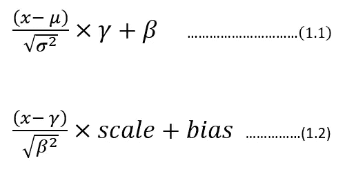
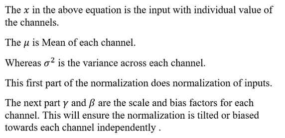
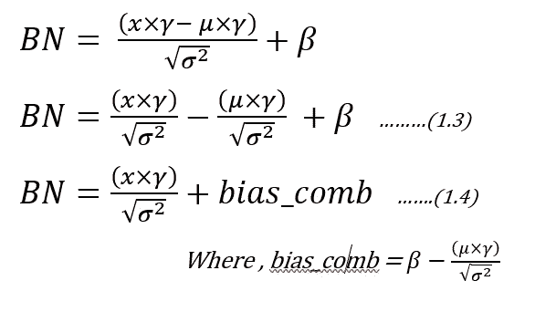
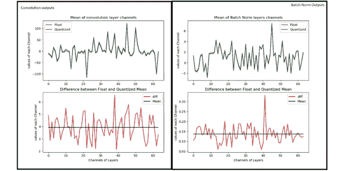
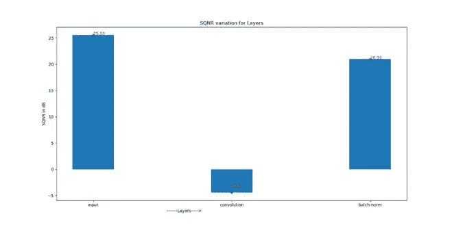

# 批量规范化:与量化推理模型不同的视角

> 原文：<https://medium.com/analytics-vidhya/batch-normalization-a-different-perspective-from-quantized-inference-model-f362cac2bd85?source=collection_archive---------19----------------------->

众所周知，训练中批量标准化的好处是减少内部协变量偏移，从而优化训练以更快收敛。本文试图引入一个不同的视角，在批量归一化层的帮助下恢复量化损失，从而保持模型的准确性。该文章还给出批量标准化的简化实现，以减少边缘设备上的负载，该负载通常会限制神经网络模型的计算。

**批量标准化理论**

在训练神经网络的过程中，我们必须确保网络学习得更快。加快速度的方法之一是使网络输入正常化，同时使网络的间歇层正常化。这种中间层规范化就是所谓的批量规范化。批次范数的优势还在于它有助于最小化内部协变量移位，如本文所述。

像 TensorFlow、Keras 和 Caffe 这样的框架都有相同的表示，只是附加了不同的符号。一般而言，批量标准化可由以下数学公式描述:

*批量归一化方程*

这里，等式(1.1)是 Keras/TensorFlow 的表示。而等式(1.2)是 Caffe 框架使用的表示。在这篇文章中，方程(1.1)风格被用于上下文的延续。

现在让我们将等式(1.1)修改如下:

现在，通过观察(1.4)的等式，在减少乘法和加法的数量方面，存在优化的选择。可以为每个通道离线计算偏置梳(读为组合偏置)因子。此外,“gamma/sqrt(方差)”的比率可以离线计算，并且可以在实现批量范数方程时使用。该方程可用于量化推理模型，以降低复杂性。

**量化推理模型**

部署在边缘设备中的推理模型通常是整数运算友好的 CPU，如 ARM Cortex-M/A 系列处理器或 FPGA 设备。现在，为了使推理模型对边缘设备的架构友好，将在 Python 中创建一个仿真。然后将推理模型的输入、权重和输出链转换成定点格式。在定点格式中，选择 8 位的 Q 用整数.小数格式表示。这个模拟模型将帮助您在设备上更快地开发推理模型，还将帮助您评估模型的准确性。

例如:Q2.6 表示 6 位小数，2 位整数。

现在，表示每个层的 Q 格式的方式如下:

1.  取输入、输出和各层/权重的最大值和最小值。
2.  使用 Python 函数获取表示动态范围所需的小数位数(通过使用最大值/最小值)如下:

> def get _ fract _ bits(tensor _ float):
> #假设 8 位中，有一位作为符号
> fract _ dout = 7—NP . ceil(NP . log2(ABS(tensor _ float)。max()))
> 
> frac _ dout = frac _ dout . astype(' int 8 ')
> 
> return fract_dout

**举例:** 我们把 Resnet-50 当做一个模型来量子化。让我们使用用 Imagenet 训练的 Keras 内置 Resnet-50。

> #创建模型
> def model_create():
> 
> model = TF . compat . v1 . keras . applications . resnet 50 . resnet 50(include _ top = True，weights='imagenet '，input_tensor=None，input_shape=None，
> 
> 池=无，类=1000)
> 
> 回报模型

让我们为 resnet-50 准备输入。下图取自 ImageNet 数据集。

> def 准备 _ 输入():
> 
> img = image . load _ img(" D:\ \ Elephant _ water . jpg "，target_size=(224，224))
> 
> x_test = image.img_to_array
> 
> x_test = np.expand_dims(x_test，axis=0)
> 
> x =预处理 _ 输入(x _ 测试)# from tensor flow . compat . v1 . keras . applications . resnet 50 导入预处理 _ 输入，解码 _ 预测
> 
> 返回 x

现在让我们调用上面的两个函数，找出输入的 Q 格式。

> 模型=模型 _ 创建()
> 
> x =准备输入()

如果观察输入‘x’，它的动态范围在-123.68 到 131.32 之间。这使得很难适合 8 位，因为考虑到一个符号位，我们只有 7 位来表示这些数字。因此，此输入的 Q 格式将变为 Q8.0，其中 7 位是输入数字，1 位是符号位。因此，它将数据剪切在-128 到+127 之间(- ⁷到⁷ -1)。因此，在这种输入量化转换中，我们会丢失一些数据(最明显的是 131.32 被削波至 127)，其损失可以通过信号与量化噪声比看出，这将在下面描述。

如果你对每个层的权重和输出使用相同的方法，我们将会有一些 Q 格式，我们可以固定它来模拟量化。

> #让我们获取第一层属性
> 
> (填充，_) = model.layers[1]。填料
> 
> #让我们获取第二层属性
> 
> wts = model.layers[2]。获取权重()
> 
> 跨度= model.layers[2]。大步
> 
> W=wts[0]
> 
> b=wts[1]
> 
> hparameters =dict(
> 
> pad=padding[0]，
> 
> 步幅=步幅[0]
> 
> )
> 
> #让我们量化权重。
> 
> quant_bits = 8 #这将是我们的数据路径。
> 
> wts_qn，wts_bits_fract = Quantize(W，quant_bits) #权重和偏差都将使用 wts_bits_fract 进行量化。
> 
> #让量化偏差也在 wts_bits_fract
> 
> b_qn = (np.round(b *(2 <<wts_bits_fract></wts_bits_fract>
> 
> names_model,names_pair = getnames_layers(model)
> 
> layers_op = get_each_layers(model,x,names_model)
> 
> quant_bits = 8
> 
> print(“Running conv2D”)
> 
> # Lets extract the first layer output from convolution block.
> 
> Z_fl = layers_op[2] # This Number is first convolution.
> 
> # Find out the maximum bits required for final convolved value.
> 
> fract_dout = get_fract_bits(Z_fl)
> 
> fractional_bits = [0,wts_bits_fract,fract_dout]
> 
> # Quantized convolution here.
> Z，cache _ conv = conv _ forward(x . as type(' int 8 ')，wts_qn，b_qn[np.newaxis，np.newaxis，np.newaxis，…]，hparameters，fractional_bits)

现在，如果您观察上面的代码片段，卷积运算将获取输入、权重和输出，并定义其分数位。
即:fractional_bits=[0，7，-3]
其中，第 1 个元素表示输入的分数表示的 0 位(Q8.0)
第 2 个元素表示权重的分数表示的 7 位(Q1.7)。
第 3 个元素代表输出的分数表示的-3 位(Q8.0，但需要额外的 3 位用于整数表示，因为范围超出了 8 位表示)。

这将不得不对每一层重复以获得 Q 格式。

现在已经熟悉了量化，我们可以开始讨论量化对 SQNR 和精度的影响。

**信号与量化噪声比**

由于我们已经通过使用 Q 格式将动态范围从浮点表示减少到定点表示，因此我们已经将值离散化为最接近的整数表示。这引入了量化噪声，量化噪声可以通过信号与量化噪声比进行数学量化。(参考:[https://en . Wikipedia . org/wiki/Signal-to-quantization-noise _ ratio](https://en.wikipedia.org/wiki/Signal-to-quantization-noise_ratio))

如上式所示，我们将测量信号功率与噪声功率之比。应用于对数标度的这种表示转换为 dB (10log10SQNR)。这里，信号是浮点输入，我们将其量化为最接近的整数，噪声是量化噪声。
*示例*:输入的大象示例的最大值为 131.32，但是我们将它表示为最接近的整数，即 127。因此，量化噪声= 131.32–127 = 4.32。
因此，SQNR = 131.3 /4.3 = 924.04，即 29.66 db，这表明与 48dB(6 *无比特数)的可能性相比，我们仅获得了接近 30dB 的可能性。

取决于结构，可以为每个单独的网络建立 SQNR 对准确性的这种反映。但是间接的，我们可以说 SQNR 越好，精确度越高。

**量化环境中的卷积:**

CNN 中的卷积运算是众所周知的，我们用输入乘以核，累加得到结果。在此过程中，我们必须记住，我们是以 8 位作为输入进行操作的，因此乘法的结果至少需要 16 位，然后将其累积在 32 位累加器中，这将有助于保持结果的精度。则结果被舍入或截断为 8 位，以携带 8 位宽的数据。

> def conv _ 单步 _ 量化(a_slice_prev，W，b，ip _ fract，wt _ fract，fract _ dout):
> 
> “””
> 
> 在输出激活的单个切片(a_slice_prev)上应用由参数 W 定义的一个过滤器
> 
> 前一层的。
> 
> 参数:
> 
> a _ slice _ prev-shape(f，f，n_C_prev)的输入数据切片
> 
> W —包含在窗口中的权重参数—形状矩阵(f，f，n_C_prev)
> 
> b —包含在形状(1，1，1)的窗口矩阵中的偏差参数
> 
> 退货:
> 
> z-标量值，对输入数据的切片 x 上的滑动窗口(W，b)进行卷积的结果
> 
> “””
> 
> a _ slice 和 w 之间的元素式乘积。暂时不添加偏差。
> 
> s = NP . multiply(a _ slice _ prev . astype(' int 16 ')，W) #让结果保存在 16 位中
> 
> #对卷 s 的所有条目求和
> 
> z = NP . sum(s . as type(' int32 ')#最终结果存储在 int 32 中。
> 
> # 32 位的结果将被指令化为 8 位以恢复数据路径。
> 
> #将偏差 b 添加到 Z。将 b 强制转换为 float()，以便 Z 产生标量值。
> 
> #将偏置设为 32 位，以添加到 z。
> 
> Z = Z+(b<< ip_fract).astype(‘int32’)
> 
> # Lets find out how many integer bits are taken during addition.
> 
> # You can do this by taking leading no of bits in C/Assembly/FPGA programming
> 
> # Here lets simulate
> 
> Z = Z >>(IP _ frac+wt _ frac—frac _ dout)
> 
> 如果(Z > 127):
> 
> Z = 127
> 
> elif(Z < -128):
> 
> Z = -128
> 
> else:
> 
> Z = Z.astype(‘int8’)
> 
> return Z

The above code is inspired from AndrewNg’s deep learning specialization course, where convolution from scratch is taught. Then modified the same to fit for Quantization.

**量子化环境中的批量范数**

如等式 1.4 所示，我们修改了表示法，以降低复杂性并执行批量标准化。下面的代码展示了相同的实现。

> def calculate_bn(x，bn_param，Bn_fract_dout):
> 
> x_ip = x[0]
> x_fract_bits = x[1]
> 
> bn _ param _ gamma _ s = bn _ param[0][0]
> 
> bn _ param _ frac _ bits = bn _ param[0][1]
> 
> op = x _ IP * bn _ param _ gamma _ s . as type(NP . int 16)# x * gamma _ s
> 
> #此输出将有 x _ frac _ bits+bn _ param _ frac _ bits
> 
> 分形位=x 分形位+ bn 参数分形位
> 
> bn_param_bias = bn_param[1][0]
> 
> bn _ param _ frac _ bits = bn _ param[1][1]
> 
> bias = bn _ param _ bias . astype(NP . int 16)
> 
> #让我们将偏差调整到小数位数
> 
> bias = bias<< (fract_bits — bn_param_fract_bits)
> 
> op = op + bias # + bias
> 
> # Convert this op back to 8 bits, with Bn_fract_dout as fractional bits
> 
> op = op >>(frac _ bits—Bn _ frac _ dout)
> 
> BN_op = op.astype(np.int8)
> 
> 返回 BN_op

现在有了量化推理模型的这些部分，我们可以看到批量范数对量化的影响。

**结果**

用 ImageNet 训练的 Resnet-50 用于 python 仿真，量化推理模型。从上面的部分，我们结合在一起，只分析第一个卷积其次是批量范数层。

就复杂性和维持模型的准确性而言，卷积运算是网络中最繁重的。我们来看看量化为 8 位后的卷积数据。下图左侧表示 64 个通道(或应用的滤波器)输出的卷积输出，其平均值用于比较。蓝色表示浮点参考，绿色表示量化实现。差值图(左侧)给出了浮点值和量化值之间存在多少差异的指示。差值图中画线是平均值，其值约为 4。这意味着浮点值和量化值之间的平均差值接近 4。

*卷积和批量范数输出*

现在我们来看右边的图，这是批量标准化部分。如你所见，绿色和蓝色曲线如此接近，它们的差异范围缩小到小于 0.5 范围。平均线在 0.135 左右，以前卷积的情况下在 4 左右。这表明我们正在将浮点和量化实现之间的差异从均值 4 减少到 0.135(几乎接近 0)。

现在，让我们来看看 SQNR 图，以了解批量定额的影响。

*层序列的信号与量化噪声比*

以防数值不可见，我们有以下 SQNR 数
输入 SQNR : 25.58 dB(进入模型的输入)
卷积 SQNR : -4.4dB(第一次卷积的输出)
批量标准 SQNR : 20.98 dB(批量标准化输出)

可以看到，输入 SQNR 约为 25.58dB，降至-4.4 dB，这表明损耗巨大，因为 8 位以上的表示受到限制。但是希望并没有落空，因为批处理规范化有助于将 SQNR 恢复到 20.98 dB，使其接近输入 SQNR。

**结论**

*   批量标准化有助于校正平均值，从而调整通道间的量化变化。
*   批量标准化恢复 SQNR。从上面的演示可以看出，与卷积层相比，我们看到了 SQNR 的恢复。
*   如果 edge 上的量化推理模型是理想的，则考虑包括批量归一化，因为它作为量化损失的恢复，也有助于保持准确性，以及更快收敛的训练好处。
*   使用(1.4)可以降低批量标准化的复杂性，从而可以离线计算许多参数，以减少边缘设备上的负载。

**参考文献**

*   [https://medium.com/r/?URL = https % 3A % 2F % 2 farxiv . org % 2 fpdf % 2f 1502.03167 . pdf](https://arxiv.org/pdf/1502.03167.pdf)
*   [https://www.coursera.org/specializations/deep-learning](https://www.coursera.org/specializations/deep-learning)
*   [https://en . Wikipedia . org/wiki/Signal-to-quantization-noise _ ratio](https://en.wikipedia.org/wiki/Signal-to-quantization-noise_ratio)

*最初发表于*[T5【https://ignitarium.com】](https://ignitarium.com/blogs/batch-normalization-a-different-perspective-from-quantized-inference-model/)*。*