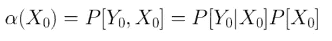
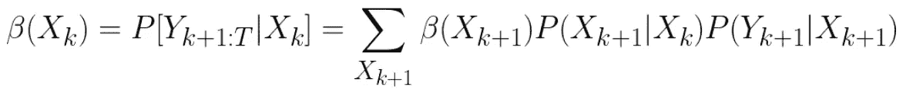
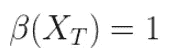
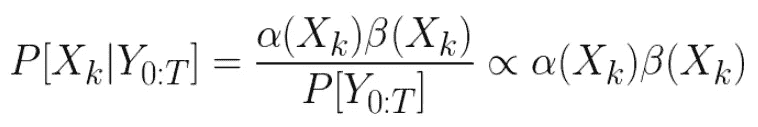
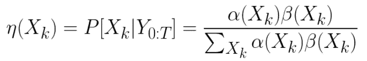
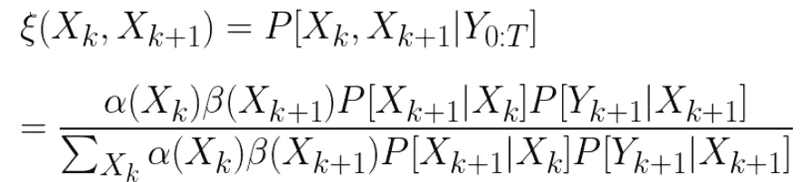
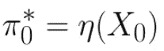
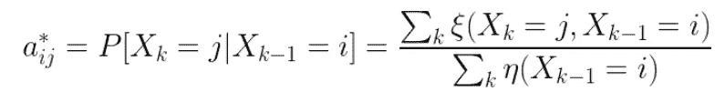
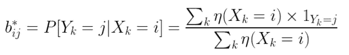

# 训练隐马尔可夫模型的 Baum-Welch 算法——隐马尔可夫模型系列之二

> 原文：<https://medium.com/analytics-vidhya/baum-welch-algorithm-for-training-a-hidden-markov-model-part-2-of-the-hmm-series-d0e393b4fb86?source=collection_archive---------0----------------------->

## *如何训练一个隐马尔可夫模型，并用于滤波平滑？*

第一部分:[隐马尔可夫模型的体系结构](/@rmwkwok/hidden-markov-model-part-1-of-the-hmm-series-3f7fea28a08)
第二部分:[训练 HMM 的算法:Baum-Welch 算法](/@rmwkwok/baum-welch-algorithm-for-training-a-hidden-markov-model-part-2-of-the-hmm-series-d0e393b4fb86)
第三部分:[用训练好的 HMM 进行预测的算法:Viterbi 算法](/@rmwkwok/viterbi-algorithm-for-prediction-with-hmm-part-3-of-the-hmm-series-6466ce2f5dc6)

在[上一篇文章](/@rmwkwok/hidden-markov-model-part-1-of-the-hmm-series-3f7fea28a08)中，我谈到了隐马尔可夫模型(HMM)的架构和参数化，以及我将在这里使用的变量的含义。在本文中，我们将讨论在使用 HMM 进行[预测](/@rmwkwok/viterbi-algorithm-for-prediction-with-hmm-part-3-of-the-hmm-series-6466ce2f5dc6)之前，训练 HMM 的算法。

# 鲍姆-韦尔奇算法

Baum-Welch 算法也称为前向-后向算法，是一种动态规划方法，也是期望最大化算法的特例。其目的是调整隐马尔可夫模型的参数，即状态转移矩阵 ***A*** ，发射矩阵 ***B*** ，初始状态分布 **π₀** ，使模型最大限度地与观测数据相似。

该算法有几个阶段，包括初始阶段、前进阶段、后退阶段和更新阶段。前向和后向阶段形成 EM 算法的 E 步骤，而更新阶段本身是 M 步骤。

# 初始相位

在初始阶段，参数矩阵***a******b*****【π₀】**的内容被初始化，如果没有关于它们的先验知识，这可以随机进行。

# 正向阶段

在前向阶段，计算以下递归阿尔法函数。对于函数的偏差，我会强烈推荐[这个 YouTube 视频](https://www.youtube.com/watch?v=M7afek1nEKM)，因为演讲者把它呈现得很清楚，解释得很好。

这里有几点需要说明:

1.  阿尔法函数被定义为直到时间 *k* 的观测数据和时间 *k* 的状态的联合概率
2.  它是一个递归函数，因为 alpha 函数出现在等式右侧(R.H.S .)的第一项中，这意味着前一个 alpha 在下一个的计算中重复使用。这也是为什么它被称为前进阶段。
3.  R.H.S .的第二项是来自**T5【A】**的状态转移概率，而最后一项是来自 ***B*** 的发射概率。
4.  在时间 *k* -1，对所有可能的状态求和。

需要指出的是，每个 alpha 都包含了到时间 *k* 为止的观测数据的信息，为了得到下一个 alpha，我们只需要重新使用当前 alpha，并添加关于下一个状态和下一个观测变量的转换的信息。这种递归行为通过将我们从每次查看过去的观察数据中解放出来，节省了获取下一个 alpha 的计算。

顺便说一下，我们需要下面的起始 alpha 来开始递归。

起始α是发射和初始状态概率的乘积

# 反向相位

下面公式的偏差请参考[这段 YouTube 视频](https://www.youtube.com/watch?v=jwYuki9GgJo)。

这里也可以提出类似的观点:

1.  贝塔函数被定义为在给定时间 *k* 的状态下，从时间 *k+* 1 观察到的数据的条件概率
2.  这是一个递归函数，因为β函数出现在等式右侧的第一项，这意味着下一个β函数将在当前β函数的计算中重复使用。这也是为什么称之为逆相。
3.  R.H.S .的第二项是来自 ***A*** 的状态转移概率，而最后一项是来自 ***B*** 的发射概率。
4.  在时间 *k* +1，对所有可能的状态求和。

同样，我们需要结束β来开始递归。

**坚持住！为什么是阿尔法和贝塔函数？**

好问题！

首先，如前所述，它们都是递归函数，这意味着我们可以重用前一个答案作为下一个答案的输入。这就是动态编程的意义所在——您可以通过重用旧的结果来节省时间！

其次，正向阶段的公式非常有用。假设你有一组训练有素的跃迁和发射参数，并且假设你的问题是实时地从观测数据中找出神秘的隐藏真相。那么你实际上可以这样做！当你得到一个数据点(数据点 *p* )时，你可以把它放入公式中，这个公式将给出相关隐藏状态的概率分布，从中你可以选择最有可能的一个作为你的答案。故事并没有就此结束，当你得到下一个数据点(数据点 *q* )时，你再把它放入公式中，它会给你另一个概率分布，让你挑选最佳选择，但这不仅是基于数据点 *q* 和跃迁和发射参数，也是基于数据点 *p* 。这样使用的公式叫做*。*

*第三，继续上面的讨论，假设你已经收集了许多数据点，因为你知道数据点越早，你的答案选择所基于的观察数据就越少。因此，你想通过某种方式将后期数据中的信息“注入”到早期数据中来改善这种情况。这就是逆向公式发挥作用的地方。这样使用的公式叫做 ***平滑*** 。*

*第四，这是关于最后两段的合并。在α和β公式的帮助下，在给定整个观察数据序列的情况下，可以确定状态变量在任何时间 *k* 的概率分布。这也可以从数学上理解。*

**

*分母项是一个归一化常数，通常像这样去掉，因为它不依赖于状态，因此在比较任意时刻 k 不同状态的概率时，它并不重要。*

*最后，alpha 和 beta 函数的结果在更新阶段非常有用。*

# *更新阶段*

****

*对于以上公式的偏差，如果你看过我建议的正向和反向公式的 YouTube 视频，并且能理解，那么大概你自己推导这两个就没问题了。*

*这里的第一个公式只是重复我们在上面看到的，概括一下，它告诉我们在给定所有观测数据的情况下，一个状态在时间 *k* 的概率分布。然而，第二个公式告诉我们一点不同的东西，这是给定数据的两个连续状态的联合概率。他们利用阿尔法函数，贝塔函数，过渡和发射已经可用。这两个公式进一步用于最终进行更新。*

******

*这里没有显示偏差步骤，因为数学不是本文的目的，但是显示公式本身将有助于我们了解它们是如何通过这些步骤被重用的。*

*提到了 Baum-Welch 算法是 EM 算法的一个例子。这里我将简单解释一下原因。α和β函数形成 e 步骤，因为它们在给定观察数据和参数矩阵 ***、A*** 、 ***B*** 、 **π₀** 的情况下预测期望的隐藏状态。更新阶段是 M 步，因为最后三个更新公式是这样导出的，即在给定观测数据的情况下，L.H.S .参数将最好地拟合预期的隐藏状态。*

# *摘要*

*Baum-Welch 算法是 EM 算法的一个例子，在 E 步骤中，给定观察数据和调整前的参数矩阵集，向前和向后公式告诉我们期望的隐藏状态。然后，M 步更新公式调整参数矩阵，以最佳拟合观察到的数据和预期的隐藏状态。然后这两个步骤被反复迭代，直到参数收敛，或者直到模型达到某个精度要求。*

*像任何机器学习算法一样，该算法可能会过度拟合数据，因为根据定义，M-step 鼓励模型尽可能好地接近观察到的数据。此外，虽然我们没有过多地讨论初始阶段，但它确实会影响模型的最终性能(因为这是一个使模型陷入局部最优的问题)，因此人们可能希望尝试不同的参数初始化方式，看看哪种方式更好。*