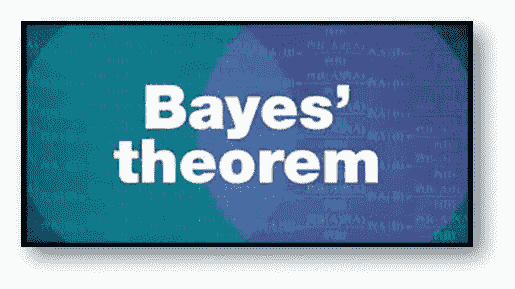
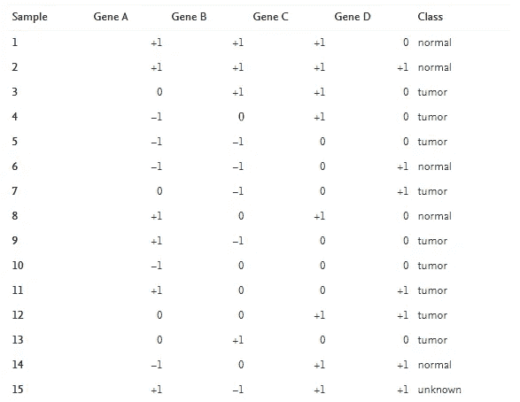
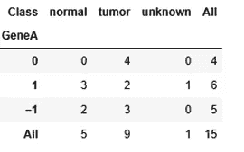
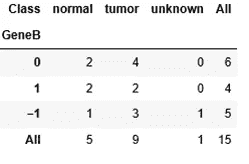
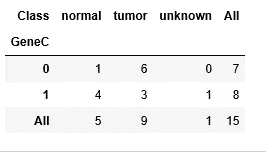
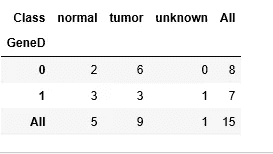
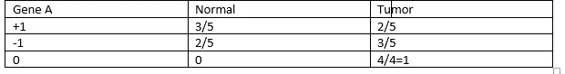
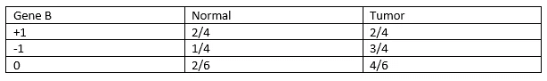
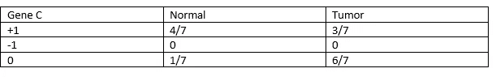
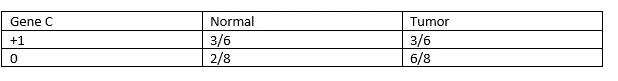

# 贝叶斯定理

> 原文：<https://medium.com/analytics-vidhya/bayes-theorem-40e3ee97a8f5?source=collection_archive---------12----------------------->

人们总是认为，过去的经验总是会影响当前的决策。这个概念不能比统计学中的贝叶斯定理更好地解释了。在这个博客中，我想用另一个概念继续我的基本统计部分，这是概率中最基本的概念之一。

那么，什么是**贝叶斯定理**？它如何帮助做出更好的决策？贝叶斯定理帮助我们知道一个事件或我们相信的任何方面的概率，给出与该事件相关的证据。

贝叶斯定理

举个例子，Amit 早餐最喜欢的食物是鸡蛋面包，午餐最喜欢的食物是披萨。

p(B)= Amit 早餐吃鸡蛋面包的概率是 0.6。

p(L)= Amit 早餐吃披萨的概率是 0.5。

P(B|L) =假设 Amit 午餐吃披萨，早餐吃鸡蛋面包的概率是 0.7

这里我们可以看到早餐吃鸡蛋面包和早餐吃鸡蛋面包的概率是不同的，因为他午餐会吃披萨。

现在，如果我们被要求找出，在早餐有鸡蛋面包的情况下，午餐吃披萨的概率是多少。贝叶斯定理的图像来了。

贝叶斯定理基于与未来事件相关的条件的先验知识来更新未来事件的概率。

**引出**

让我们考虑事件 A 和事件 B

给定条件概率-

P(A|B) = P(A∩B)/P(B)

P(B|A) = P(A∩B)/P(A)

注意——条件概率已经在我的第一篇[文章](/@ushmi2015/basic-of-statistics-e0ba347a8a77)中解释过了。

P(A∩B) = P(A|B) * P(B)= P(B|A) * P(A)

所以， **P(B|A) = P(A|B) * P(B)/ P(A)**

我们再举一个例子。假设城市中的人们已经受到登革热的影响，这是假设(H)。一项调查发现，受登革热影响的人居住在水停滞地区，这就是证据(E)。

所以，

P(H|E) = P(E|H) *P(H)/ P(E)

让我们举一个不太复杂的例子。给定健康数据样本的图片，我们将尝试分析给定的某些特征，该人是否属于肿瘤类。这些特征是基因 A、基因 B、基因 C、基因 D。这里所有特征都是相互依赖的，即基因 A、基因 B、基因 C 和基因 D 互不依赖。基因表达值被离散为低表达(1)、过表达(+1)或正常表达(0)。样本 15 没有被分类。

来源-[https://www . science direct . com/topics/护理与健康专业/贝叶斯学习](https://www.sciencedirect.com/topics/nursing-and-health-professions/bayesian-learning)

要处理一个有价值的输出，在查看该表之后应该采取的第一步是创建一个频率和 like hood 表。频率表或交叉表给出了每个特征出现的次数，类似于 hood 表给出了每个特征出现的概率。下面的前四个表格给出了数据的频率表。

基因 A 的交叉标签

基因 B 的交叉标签

基因 C 的交叉标签

基因 D 的交叉标签

因此，给定数据，基因 A、基因 B、基因 C 和基因 D 的相似性可以给出如下。请注意，样品 15 是未分类的，因此我们将只从样品 1 到样品 14 进行取样。

就像基因 A 的胡德

就像基因 B 的胡德

就像基因 C 的胡德

就像基因 D 的胡德

给定样本 15，样本属于正态类的概率是多少，等于-

P(正常|样本 15 的特征)= P(A =+1 |正常)*P(B =-1 |正常)* P(C =+1 |正常)* P(D =+1 |正常)* P(正常)

=3/5*1/4*4/7*3/6*5/14

=180/5292

=0.034

再次给定样本 15，样本属于肿瘤类的概率是多少，等于-

P(肿瘤|样本 15 的特征)= P(A =+1 |肿瘤)*P(B =-1 |肿瘤)*P(C=+1|肿瘤)*P(D=+1|肿瘤)* P(肿瘤)

=2/5*3/4*3/7*3/6*9/14

=486/11760

=0.041

所以，

p(正常)= 0.034/0.034+0.041 = 0.034/0.075 = 0.45 = 45%

p(肿瘤)= 0.041/0.034+0.041 = 0.041/0.075 = 0.548 = 55%

因此，对于样本 15，该类有 45%的可能性是正常的，而该类有 55%的可能性是肿瘤。这是一个基本的分类问题，其中有一个独立于特征变量的假设。这是我们可以使用贝叶斯定理的概念来解决基本分类问题的一个基本例子。在现实生活中的问题，数据将更多，我们必须使用一些编码。但是理解这个定理的基础及其在不同问题中的应用有助于我们做出更好的决定。

在零壳理论中，贝叶斯定理描述了在得到证据之前假设的概率和得到证据之后假设的概率之间的关系。这一原理也高度用于检测欺诈活动或异常活动，同时提供贷款或过滤电子邮件作为垃圾邮件或非垃圾邮件。许多机器学习算法都是受到贝叶斯定理的启发。我已经解释了贝叶斯定理的唯一基础。你可以通过 [Kaggle](https://www.kaggle.com/) 中的大量例子来研究与之相关的复杂问题。

*希望这篇文章在某些方面对你有所帮助*。*感谢你阅读我的帖子。如果你想阅读我未来的帖子，只需点击“连接”或“关注”即可。*