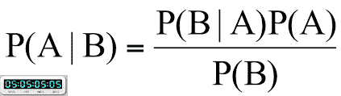
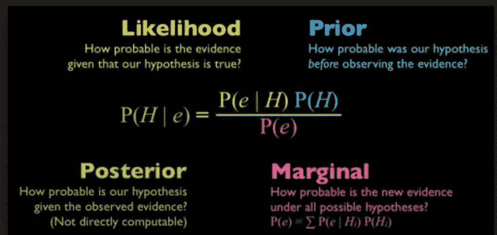
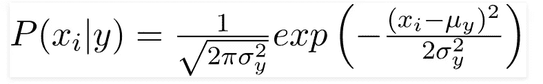
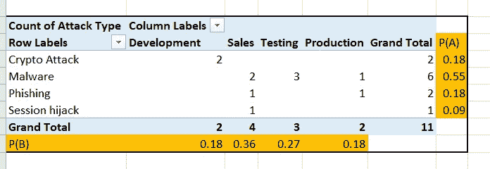
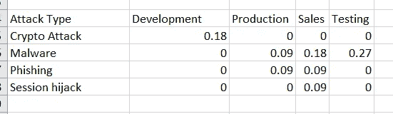

# 贝叶斯定理和朴素贝叶斯分类器

> 原文：<https://medium.com/analytics-vidhya/bayes-theorem-and-naive-bayes-classifier-45171aaf2830?source=collection_archive---------4----------------------->

金光、云彩、努布拉山谷

欢迎阅读关于机器学习的系列文章。

让我们讨论一个假设的小场景，一群人计划在春天去山区野餐。

*   已经看到，下雨天有一半是阴天。(~50%)
*   通常多云的早晨是常见的，一周大约有 3 天。(~40%)
*   在春季，通常 30 天中有 6 天是多雨的，约占 20%。

## 野餐那天下雨的可能性有多大？

由于问题陈述中涉及多个因素(变量),因此我们应用贝叶斯定理来预测降雨量。

**贝叶斯定理**告诉我们 A 发生的频率*给定 B 发生的频率*，写成 **P(A|B)** ，当我们知道 B 发生的频率*给定 A 发生的频率*，写成 **P(B|A)** ，以及 A 和 B 各自的可能性有多大。

贝叶斯定理

*   P(A|B)是“给定 B 的概率”，即给定 B 发生的概率
*   P(A)是 A 的概率
*   P(B|A)是“B 给定 A 的概率”，B 给定 A 发生的概率
*   P(B)是 B 的概率

给定云下雨的几率写成 P(雨|云)

P(雨|云)= ( *P(雨)P(云|雨))/* P(云)

p(雨|云)=*(0.2×0.5)/*0.4 = 0.25

有 25%的可能性会下雨。

# 朴素贝叶斯分类器

## 那么什么是分类器和特征呢？

分类器是一种机器学习模型，它基于某些特征区分不同的对象。特征是被观察的单个可测量的属性。

朴素贝叶斯分类器是机器学习模型。这通常用于分类任务。这个分类器假设特征之间没有依赖性。该分类器基于贝叶斯定理。

下面给出了一些真实世界的例子

*   将一封电子邮件标记为**垃圾邮件**，或者**非垃圾邮件**
*   将一篇关于**科技**、**政治**或**体育**的新闻文章分类？
*   可用于人脸识别
*   情感分析
*   推荐系统

优点:它们快速且易于实现

缺点:要求预测者独立。在大多数实际情况下，预测器是相关的，这会影响分类器的性能。

## 朴素贝叶斯分类器的类型:

## 多项式朴素贝叶斯；

这用于文档类别分类。例如政治、体育、信息技术等。特征/预测值:文档中出现单词的频率。

## 伯努利朴素贝叶斯；

这有点类似于多项式朴素贝叶斯，但预测因子是布尔变量。例如，如果一个单词出现在文本中，那么预测值为是，否则为否

## 高斯朴素贝叶斯:

当要素具有连续值时使用。还假设所有特征都遵循**高斯**分布，即正态分布。

高斯分布(正态分布)

由于数据集中值的显示方式发生了变化，条件概率的公式也随之变化

# 网络安全中的朴素贝叶斯；

考虑一个服务器场，其中有一些机器以及针对这些机器的攻击类型:

来自系统的攻击数据示例

从频率表中，我们有一个概率，我们的测试服务器在 27%的时间内会成为攻击目标，整体加密攻击的概率是 18%。

所以我们可以定义给定 B(攻击类型)的情况下，A(目标系统)发生的概率，也就是 P(A|B)。为此，我们简单地取每个攻击，然后除以这些攻击的总数。

在这种情况下，我们看到:

P(销售|恶意软件)= 0.18
P(生产|网络钓鱼)=0.09
P(测试|恶意软件)=0.27

现在，我们将使用贝叶斯定理来确定 P(B | A)，这是给定服务器(B)的攻击类型(A)的概率

P(恶意软件|销售)= ( P(销售|恶意软件)x P(恶意软件))/ P(销售)

p(恶意软件|销售额)= (0.18 * 0.55)/ 0.36=0.27

有 27%的机会受到恶意软件的攻击。

在我的下一篇文章中，我将使用 sklearn 库来解释这一点。

# 结论:

朴素贝叶斯快速且易于实现，但其最大的缺点是要求预测器是独立的。在大多数实际情况下，预测器是相关的，这影响了分类器的性能。