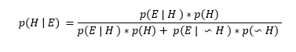

# 贝叶斯定理和使用朴素贝叶斯分类器的文本分类

> 原文：<https://medium.com/analytics-vidhya/bayes-theorem-and-text-classification-using-naive-bayes-classifier-591ade7d5299?source=collection_archive---------17----------------------->

本文讨论贝叶斯定理以及朴素贝叶斯分类器在文本分类中的应用。

首先，我们将考虑一个问题，假设我们被给定某些信息*，在给定烟雾的情况下找到火灾的概率。*为了得到 *p(火|烟)*或 *p(火给烟)*，让我们画一个可以看到所有可能性的样本空间，如下:

为了找到 *p* (火|烟)，我们只关心存在烟(证据)的区域{1}和{3},因为我们受限于给定烟的证据，所以 *p* (火|烟)将是

或者我们也可以写它已经

将它推广到给定证据的事件:

如前所述，我们需要考虑两个方面 1。证据真实-事件发生空间{1}。2.证据为真-事件未发生空间{3}。

(或)

同样的公式可以改写如下，基本上在分母中，我们将所有证据为真的区域相加。

我们已经得出了贝叶斯定理公式，基本上贝叶斯规则是根据证据来描述一个事件的概率。更一般地，基于先验知识寻找事件的概率可以写成:

**朴素贝叶斯多类分类器:**

朴素贝叶斯分类器根据贝叶斯原理工作，但它是朴素的，这意味着我们假设观察到事件的概率是相互独立的。让我们逐步解决这个问题，目标是基于贝叶斯规则将文档分类。

**问题描述**:将文档分类，这里他只考虑 2 个类别，但是同样的思路可以扩展到多类分类问题。

**目标**:通过找到每一类的概率，基于给定的单词识别文档类别。

***遵循的步骤:***

## 第一步:从标签数据中找出给定类别的单词的概率

## 第二步:根据贝叶斯定理从测试数据中找出给定单词的类的概率

## 第三步:得到所有类的最大概率作为我们的预测

让我们考虑一个基本的非现实的简单数据集来理解朴素贝叶斯分类器。

我们的训练数据中有 4 个带标签的文档(每一行都是下面的一个文档)。

{

「正面」:「奇妙惊人的伟大电影」，

“正面”:“很棒很惊艳的电影”，

「负面」:「糟糕沉闷无聊的电影」，

“消极”:“沉闷无聊的可怕电影”

}

在下表中显示相同的上述数据:

数据集

数据集中的所有单词都作为列(特征),如果该单词出现在文档中，则值设置为 1，如果不出现，则值设置为 0。

## 第一步:使用训练数据找出给定班级单词的概率

每个单词的概率可以通过计算每个单词的频率来找到，请注意，我们将每个单词的频率加 1，这样我们可以避免概率为 0(例如，正面评论中单词“可怕”的概率将为 0，我们希望在步骤 2 中乘以概率时避免出现这种情况),还要注意， *p(正面)与 p(负面)相同，p(负面)为 0.5，因为我们有 2 个正面评论的文档和 2 个负面评论的文档*

每一类的先验概率

概率的计算方法是将该单词的出现次数除以给定类别中的单词总数:

给定评论的单词概率为正

负类相同:

给定评论的单词概率为负

## 第二步:根据贝叶斯定理从测试数据中找出给定单词的类的概率

现在我们有了所有需要的信息，我们可以计算给定单词的类的概率。在这里，我们试图将带有单词{“Amazing Movie”}的文档归类到其中一个类中。根据贝叶斯法则，我们可以计算如下概率

给定词语“惊人的，电影”时，评论为正面的概率

给定单词“惊人的，电影”时，给定评论的单词为负面的概率

由于我们将在步骤 3 中比较两个概率以获得最大概率，我们可以忽略上述等式中的分母，因为它们是相同的。同样，基于联合概率重新排列上述两个等式中的分子将得到以下结果:

基于我们表格中的值:

## 第三步:得到所有类的最大概率作为我们的预测

从上面每个类别的计算概率来看，最大值是正面类别，因此我们可以得出结论，根据文档中的给定单词{“Amazing Movie”}，我们可以将其分类为具有正面评论的文档。

概括公式:

相同的概念可以用于多类分类问题:

输出预测可归纳如下，也请注意，我们在下面使用了对数函数，以避免我们通过概率相乘得到的小值。Log 函数将概率相乘转化为对数概率的相加:log(*p(A)* p(B))= log(p(A))+log((p(B))*。

所有类别概率值中的最大概率值

请报告任何错误/建议。感谢阅读。