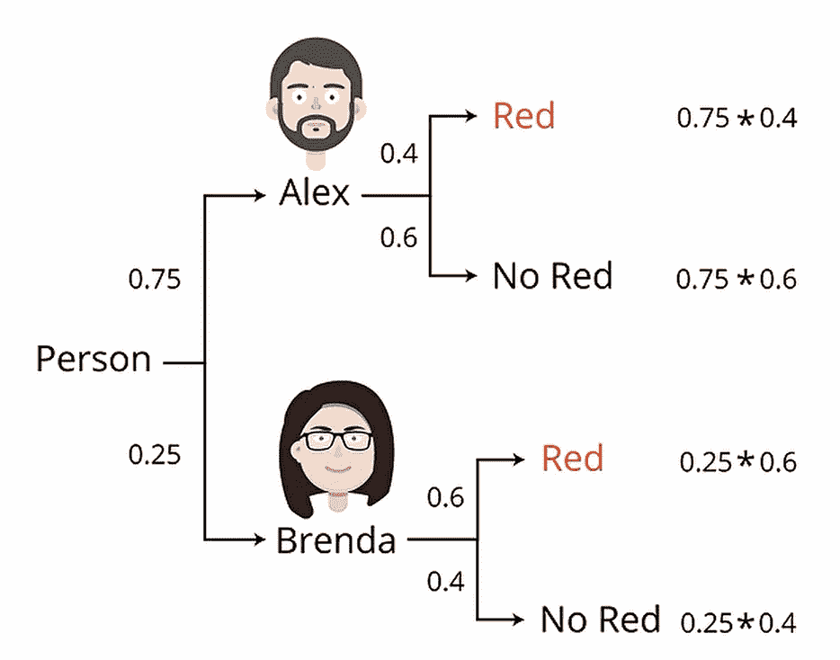
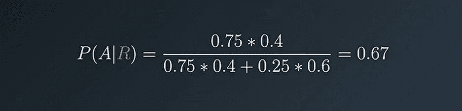
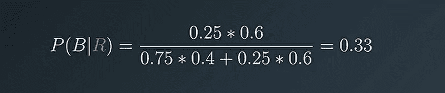
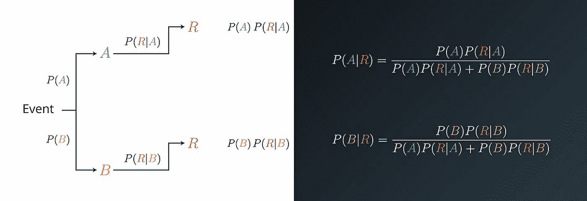

# 通俗易懂的贝叶斯定理

> 原文：<https://medium.com/analytics-vidhya/bayes-theorem-in-layman-s-terms-38a1d3b9ba7e?source=collection_archive---------8----------------------->

莫里茨·金德勒在 [Unsplash](https://unsplash.com?utm_source=medium&utm_medium=referral) 上拍摄的照片

如果你在理解贝叶斯定理上有困难，相信我，你并不孤单。在本教程中，我将一步一步地帮助你跨过那座桥。

所以，让我们开始吧。

# 建立直觉

让我们假设 Alex 和 Brenda 是你办公室里的两个人，当你正在工作时，你看到有人从你面前走过，而你没有注意到她/他是谁。

让我们来计算概率，

P(亚历克斯)= 0.5，P(布伦达)= 0.5

现在我会给你额外的信息，

1.  这个人穿着一件红色的毛衣。
2.  亚历克斯一周穿两次红色衣服。
3.  布伦达一周穿三次红色衣服。

让我们用这些新信息来计算概率，

亚历克斯是路过的人的概率是 2/5，

p(亚历克斯)= 0.4

布伦达是路过的人的概率是 3/5，

p(布伦达)= 0.6

我们在新信息之前被计算出来的概率叫做**先验**，我们在新信息之后被计算出来的概率叫做**后验**。

# 让我们深入一点复杂的问题

考虑这样一个场景，Alex 每周来办公室 3 天，Brenda 每周来办公室 1 天。

让我们来计算概率，

亚历克斯是路过的人的概率是 3/4，

p(亚历克斯)= 0.75

布伦达是路过的人的概率是 1/4，

p(布伦达)= 0.25

我已经在上面展示了用新信息计算概率，所以，我会让你独自走这一部分。

快进>>>

来源:Udacity 机器学习纳米学位

人是**亚历克斯**的概率是 **0.75** 和**布伦达**是 **0.25** ，这是两种情况。**亚历克斯**穿红色的概率是 **0.4** ，而**亚历克斯**不穿红色的概率是 **0.6** 。在**布伦达**的情况下，**布伦达**穿红的概率为 **0.6** ，而**布伦达**不穿红的概率为**0.4**。

由于我们只对红色事件感兴趣，我们忽略了其他事件。

归一化我们得到的概率，

穿红色毛衣的人是亚历克斯的概率，

来源:Udacity 机器学习纳米学位

穿红色毛衣的人是布伦达的概率，

来源:Udacity 机器学习纳米学位

好哇，我们成功过桥了。

# 推导公式

从上面我们学到的东西，我们可以推导出下面的公式。

来源:Udacity 机器学习纳米学位

本教程到此为止，希望对某人有所帮助。

谢谢你陪我散步。愿你能跨越更多像这样的桥梁，one✌.

如果你喜欢这个教程，请鼓掌分享。