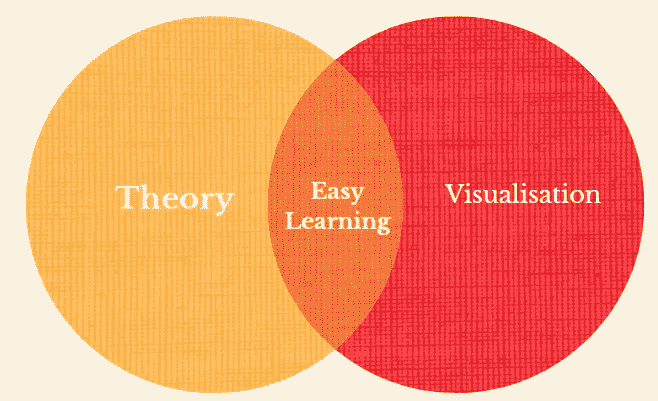
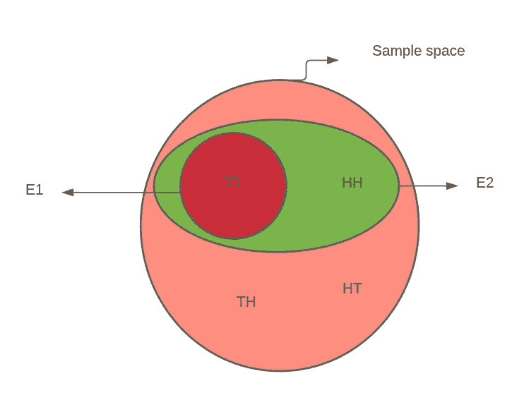
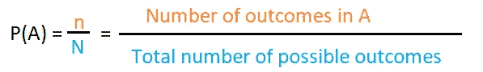
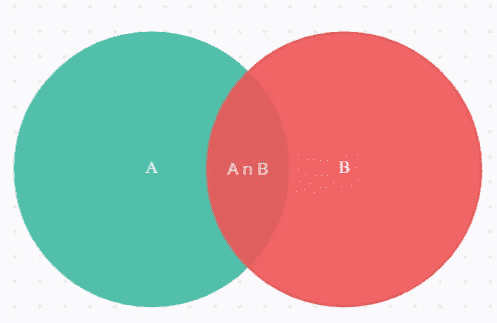
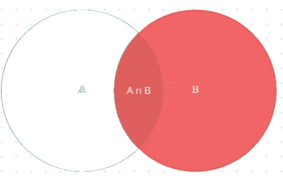
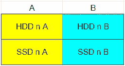
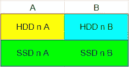
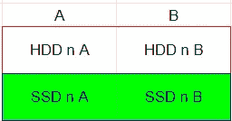
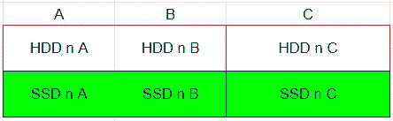

# 使用文氏图的贝叶斯定理；

> 原文：<https://medium.com/analytics-vidhya/bayes-theorem-using-venn-diagrams-681b71ac450d?source=collection_archive---------5----------------------->

## 对初学者友好的方法



初学者的贝叶斯定理。作者图片

当我从高中开始学习/修改我的概率课程时，我是这样想象和理解的。这篇文章是我学习和理解贝叶斯定理时的思考过程。是什么让这个故事成为初学者友好的故事？嗯，我已经从一些基本的概率术语开始解释，希望即使那些没有很强基础的人也能够理解贝叶斯定理。它以简单的语言呈现，易于掌握流程，但使用了足够多的数学和技术术语，因此推广这个超出本文范围的定理对您来说并不困难。

简而言之，这篇文章应该让你更好地理解条件概率和使用文氏图的贝叶斯定理。

**先决条件:**

我们将从一些概率基础开始，然后我们将从条件概率和贝叶斯定理开始。相反，如果你知道基础知识，你可以直接进入条件概率。但是，我们不会详细讨论集合和维恩图的基础知识，所以如果你不知道，我强烈建议你在进一步阅读之前学习它们。它们是简单的话题，不会占用你太多的时间，但是非常有影响力。

> 当您从基础开始阅读时，这篇文章可能会显得有点太长。但是坚持到最后，你会发现它值得你花时间。如果需要的话，中间休息一下。

**这里面是什么？**

1.  **概率基础**

*   实验、试验和结果
*   样本空间、事件和事件的概率
*   排他性和独立性(两者是不同的)

2.**条件概率**

3.**贝叶斯定理**

# **1。概率基础**

简单来说， ***概率*** 就是一个事件在固定数量的 ***试验*** 或者一个 ***试验*** 中发生的可能性有多大。

你可能很熟悉寻找掷骰子时得到特定数字的概率。掷出一次骰子得到 1 的概率有多大？掷出一次骰子得到 7 的概率有多大？

这就是 [*维基百科*](https://en.wikipedia.org/wiki/Experiment_%28probability_theory%29) 对实验的描述:

> “在[概率理论](https://en.wikipedia.org/wiki/Probability_theory)中，**实验**或**试验**(见下文)是可以无限重复的任何程序，并且具有可能的[结果](https://en.wikipedia.org/wiki/Outcome_(probability))的明确定义的[集合](https://en.wikipedia.org/wiki/Set_(mathematics))，称为[样本空间](https://en.wikipedia.org/wiki/Sample_space)。如果一个实验有不止一个可能的结果，那么这个实验被称为[](https://en.wikipedia.org/wiki/Randomness)*随机实验，如果只有一个结果，那么这个实验被称为 [*确定性实验*](https://en.wikipedia.org/wiki/Deterministic_system)*
> 
> *“随机实验经常重复进行，这样集体的结果可能会受到[统计分析](https://en.wikipedia.org/wiki/Statistics)。相同实验的固定次数的重复可以被认为是一个**组合实验**，在这种情况下，单独的重复被称为**试验**。例如，如果一个人将同一个硬币投掷 100 次并记录每个结果，那么每次投掷都将被视为由所有 100 次投掷组成的实验中的一次尝试。”*

*如果我们把一个实验所有可能的结果放在一个集合里，就叫做**样本空间。**一个**事件**可以被描述为样本空间的任何子集。每当我们谈论概率时，我们通常谈论感兴趣的事件发生的概率。*

*为了更好地理解这些概念，我们可以定义一个实验，并找出什么是试验、样本空间、事件，以及这些事件在该特定实验中的概率。你准备好了吗？*

***实验/(试用):**接连投掷两枚硬币，记录观察结果。*

*(想象重复这个实验 5 次，然后每次扔两个硬币就是一次尝试。)*

*所以，让我们找出实验或样本空间所有可能的结果。然后我们将进一步定义两个事件，并找出这些事件的概率。t 是尾巴的意思，H 是头的意思。所以，这意味着在第一次投掷中得到一条尾巴，在第二次投掷中得到一个头。准备好的..？*

***样本空间，S**=【TT，TH，HT，HH】*

*事件 1，E1:让我们把它定义为得到两条尾巴的事件(TT)。*

*E1=【TT】*

*事件 2，E2:得到两条尾巴或两个头的事件。*

***E2**=【TT，HH】*

*(*看，一个事件可以有来自样本空间的任意数量的元素。它不必总是有一个元素。它只是样本空间的一个子集。)*

**

*作者图片*

*如你所见，E1 本身是 E2 的一个子集。那么，告诉我，什么是(E1 北 E2)或(E2 北 E1)？*

*概率，*

**

*上式中，A 中的结果数(有利结果)是我们感兴趣的事件子集中的元素数，可能结果总数是样本空间中的元素总数。*

*E1 事件的概率，*

*p(E1)=(E1 中的元素数)/(S 中的元素总数)*

*P(E1) = 1/4 = 0.25*

*E1 事件不发生的概率可以用下面的等式求出。*

*P(E1') = 1 — P(E1)*

*P(E2) = 2/4 = 0.5*

**

*作者图片*

*公理*

*0 ≤ P(E) ≤ 1*

*P(S) = 1*

## ***独立性和**排他性*

*当一个事件的概率不受另一个事件结果的影响，反之亦然，这样的事件称为独立事件。如果两个事件**不是**独立的，我们称它们为相关事件(显然😂).此外，如果两个事件彼此独立，那么它们相交的概率将由下式给出*

*P(A n B) = P(A) * P(B)*

*和*

*P(A|B) = P(A)*

*P(B|A) = P(B)*

> *P(A|B) —读作“给定 B，A 的概率”。如果你不知道这是什么意思，不要担心，我们会在下一节课，条件概率中详细讨论这个问题。*

**

*作者图片*

*E1 和 E2 是独立的吗？让我们找出答案。*

*从图中可以清楚地看出，(E1 n E2) = E1，因为 E1 是 E2 的子集。*

*所以最初的*

*P(E1 E2)= P(E1)= 0.25*

*现在，让我们试试*

*P(E1) * P(E2) = 0.25 * 0.50 = 0.125*

*因此，由于观测的原始值与计算值不匹配，我们可以说 E1 和 E2 不是独立的，因此，我们不能使用上面给出的方程来找出 P(E1nE2)。**总是在不使用上述等式的情况下计算 P(A n B ),并使用该等式来验证事件是否独立。***

*当两个事件的交集为空或者没有公共元素时，这两个事件就是**互斥的**。排他性很简单，可以用文氏图很容易地证明。*

**

*作者图片*

*紫色和红色是互斥的，因为它们没有共同的元素。或者说，他们的交集是空的。*

*P(A U B) = P(A) + P(B)*

*如果 A 和 B 互斥。*

*否则，*

*P(A U B) = P(A) + P(B) — P(AnB)*

*现在，你知道如何检查排他性，如果概率是已知的，不是吗？*

*并且，**排他性并不总是意味着独立性，反之亦然。***

*如果你愿意，可以休息一下，理解第一部分，然后再回来。我们来看看条件概率。*

# ***条件概率***

*万岁！我们离贝叶斯定理更近了一点。*

*我们先来了解一下 P(A|B)是什么意思。*

**

*作者图片*

*考虑两个集合，A 和 b。如你所见，它们并不互相排斥。*

*同样，样本空间，S = AUB*

*也就是说，样本空间的所有元素都是 A 和 B 的组合。*

*P(A|S)是指，样本空间为 S 时的 P(A)即我们通常的 P(A)是 P(A|S)。*

***那么当我们把样本空间从 S 换成 B 时会发生什么呢，也就是说，我们已经知道我们的下一个结果只能来自 B，因为 B 已经发生了(给定)。我们说 P(A|B)就是代表这个。明白了吗？看看下面的维恩图，A 从 S 中完全消失是因为 B 已经发生了(给定)。***

**

*作者图片*

*现在，B 是我们新的样本空间，我们得到 A 的新概率可以表示为 P(A|B) =得到 A 的概率，给定 B。*

*在 B 内部，(A n B)是我们可以从 A 中得到一个元素的唯一子集，也就是说，我们的新事件集已经从 A 简化为(A n B)。*

*所以，利用我们之前看到的基本概率方程，*

*P(E) =有利结果的数量/样本空间中的结果数量*

*P(A|B) =在(A n B)中的结果数/在新样本空间 B 中的结果数*

*将分子和分母除以 S(我们的原始样本空间)中的元素个数，我们可以得到分子中的 P(A n B)和分子中的 P(B)。即，*

## ***P(A|B) = P(A n B)/P(B)***

*给定，P(B)**≦**0。同样的，*

## ***P(B|A) = P (A n B)/ P(A)***

*给定，P(A)**≦**o .由此，我们可以写出，*

## ***P(A n B) = P(A|B) * P(B)***

## *P(A n B) = P(B|A) * P(A)*

> ***提示**:要检查两个事件的独立性，首先用这个公式找到 P(A n B)，检查 P(A) * P(B)是否也给出相同的值。如果是，那么 A 和 B 是独立的。再想远一点就能明白为什么 P(A|B) = P(A)或者 P(B|A) = P(B)也被用来检验两个事件的独立性。*

*最后，我们可以开始贝叶斯定理！*

# ***贝叶斯定理***

*我觉得用一个例子来解释贝叶斯定理比较好。有一个陈述和两个与之相关的问题。我们可以利用这些问题来理解贝叶斯定理。我们将在第一个问题中熟悉一些概率和数字，并在第二个问题中解决真实贝叶斯定理。我建议你不要跳过第一个问题。*

*为了简单起见，我们只考虑 2 个类和 1 个特性。如果你不知道类或特性是什么意思，不要担心。我以后会解释的。*

*让我们考虑一下，对于某个商店的某个特定产品，比如说存储驱动器，有两个供应商 A 和 B。这两家供应商都提供固态硬盘和硬盘。*

*在供应给商店的所有驱动器中，70%或 0.7%由 A 提供，30%或 0.3%由 b 提供。在 A 提供的所有驱动器中，80%或 0.8%是 HDD，20%或 0.2%是 SSD。在 B 的情况下，比例是 35%的硬盘和 65%的固态硬盘。*

1.  *如果随机选择一个驱动器，获得 SSD 的概率有多大？*
2.  *如果有人从这家商店购买固态硬盘，它来自供应商 A 的概率是多少？*

**

*集合表示(不按比例)(图片由作者提供)*

*在进入问题之前，让我们确定问题陈述中给出的数字。*

*P(A) = 0.7*

*P(B) = 0.3 = 1 — P(A)*

*P(HDD | A) = 0.8*

*P(SSD |A) = 0.2*

*p(硬盘| B) = 0.35*

*P(SSD | B) = 0.65*

1.  *如果随机选择一个驱动器，获得 SSD 的概率有多大？*

*看一下上面的文氏图，找出有利的结果，并找出总的结果。有利的结果是(SSD n A) U (SSD n B)。结果或样本空间的总数将是(A U B)，因为它是样本空间，P( A U B) = 1。*

**

*绿色—有利的结果(图片由作者提供)*

*SSD = SSD n (A U B)*

*SSD = (SSD n A) U (SSD n B)*

*这从文氏图中可以明显看出。取概率时，并集变成加法，当事件互斥时( *P(AUB) = P(A)+P(B) — P(A n B)，P(A n B* )对于互斥事件变成 0)。*

*P(SSD) = P(SSD n A) + P(SSD n B)*

*通过应用我们从条件概率中学到的公式，*

> *P(A n B) = P(A|B) * P(B)*

***P(SSD) = P(SSD | A)。P(A) + P(SSD | B)。P(B)***

*如果再多一个供应商 C，就会多一项 P(SSD | C)。专业术语*

*P(SSD) = 0.2*0.7 + 0.65*0.3 = 0.335*

*同样的，*

*P(硬盘)= 0.8*0.7 + 0.35*0.3 = 0.665 = 1 — P(固态硬盘)*

*现在，让我们来看第二个问题，这实际上是我们要用贝叶斯定理来理解和解决的问题。*

*2.如果有人从这家商店购买固态硬盘，它来自供应商 A 的概率是多少？*

*记得下面的段落吗？*

> *那么当**我们把样本空间从 S 变为 B** 时会发生什么呢？这意味着，我们已经知道，我们的下一个结果只能来自 B，因为 B 已经发生了(给定)。我们说 P(A|B)就是代表这个。明白了吗？看看下面的文氏图。*

**

*再也不用看固态硬盘以外的东西了。这已经发生了(图片作者)*

*如果你看维恩图，我们只需要考虑现在的 SSD 集(绿色)。这是我们新的样本空间。为什么？因为已经发生了(给定了)。*

*所以，为了从这个新的样本空间(绿色)中得到一个 A，我们需要从(SSD n A)中得到一个元素。*

*所以，我们需要的概率，*

*P(A | SSD)= P(SSD n A)/P(SSD)= P(A n SSD)/P(SSD)*

*上述方程也可以通过直接应用条件概率方程来导出。再次使用条件概率方程，*

*P(A | SSD) = P(SSD | A)。P(A)/P(SSD)= 0.2 * 0.7/0.335 = 0.418*

*这是最简单的贝叶斯定理，只有两个类和一个特征。总的来说，*

# *P( A| F) = P(F | A)。P(A) / P(F)*

*也可以写成，*

```
***P( A| F)  = ( P(F | A)   *  P(A) )/ P(F)**
**Posterior = ( Likelihood * Prior ) /  Evidence***
```

*P(A |F ) =后验概率*

*P(A) =先验概率(先验知识)*

*P(F) =证据*

*如果多了一个供应商呢？*

**

*作者图片*

*SSD = (SSD n A) U (SSD n B) U (SSD n C)*

*P(SSD) = P(SSD | A)。P(A) + P(SSD | B)。P(B) + P(SSD | C)。专业术语*

*P(B | SSD) = P(SSD | B)。P(B) /P(固态硬盘)*

***第二个问题有什么特别之处？**一件有趣的事情是，这里事件已经发生，我们被要求找出原因的**概率。在前面的例子中，我们被要求找出获得固态硬盘的概率。但在这里，我们已经得到了固态硬盘，我们需要找到它来自特定供应商的概率。***

*想象这些供应商是机器学习分类问题的不同类别，SSD、HDD 等是特征。我们的目标是什么:- **给出特征，找出类。(给定 SSD，找出供应商)**。*

*你为什么不试着用贝叶斯定理来找出我们下一个问题的答案呢？*

> *问:如果有人从这家商店购买固态硬盘，它来自供应商 B 的可能性有多大？*

*可以考虑一下如何一次性处理多个特性( [***查看一下这个 Google sheet***](https://docs.google.com/spreadsheets/d/1caRzAqryscCU5cdBG6_FDp_dvr9dq7LVGQUB7ui1KDs/edit?usp=sharing)***)***)。而且，一旦你确定你清楚贝叶斯定理，你可以进一步阅读朴素贝叶斯分类器。我认为维恩图是你的伴侣。*

*用维恩图理解条件概率，你的生活会轻松很多。但是，随着类和特性的增长，可视化它们可能会变得越来越困难。因此，在试图用文氏图理解贝叶斯定理时，使用少量的特征。*

## *摘要*

*.*

**

*作者图片*

***。**当考虑一个条件概率时，你的样本空间会发生变化。凭着这种直觉，你可以使用上面给出的概率的基本方程，来得到新的条件概率。*

**

*作者图片*

*P(A|B) = P(A n B)/P(B)*

*P(B|A) = P (A n B)/ P(A)*

*P(A n B) = P(B|A) * P(A) = P(A|B) * P(B)*

> ***提示**:要检查两个事件的独立性，先用这个公式求出 P(A n B)，检查 P(A) * P(B)是否也给出相同的值。如果是，那么 A 和 B 是独立的。同样，如果 P(A|B) = P(A)或 P(B|A) = P(B)，那么事件也是独立的。*

*。贝叶斯定理处理原因的概率。贝叶斯定理的方程很容易理解，并且可以从文氏图和/或条件概率方程中导出。贝叶斯定理的最佳实际应用之一是在给定特征的情况下找到分类问题中的类。*

***P( A| F) = P(F | A)。P(A) / P(F)***

***P(F) = P(F | A)。P(A) + P(F | B)。P(B) + P(F | C)。P(C) ……。***

*P(A |F ) =后验概率*

*P(A) =先验概率(先验知识)*

*P(F) =证据*

*为了更好地理解，我们可以讨论将其扩展到多类、多要素数据集，并在另一篇文章中讨论朴素贝叶斯。你可以 [***查看这个谷歌表单***](https://docs.google.com/spreadsheets/d/1caRzAqryscCU5cdBG6_FDp_dvr9dq7LVGQUB7ui1KDs/edit?usp=sharing) 来获得一个多特征问题的集合表示。这篇文章太长了。希望你喜欢并从中吸取教训。关注我更多这样的文章，我们一起学习。*

*祝你愉快。*

***参考文献**:米勒&弗氏，工程师概率统计(第九版)|理查德 a .约翰逊|皮尔森*