# 2018/19 赛季 NBA 三分球的贝叶斯分层建模

> 原文：<https://medium.com/analytics-vidhya/bayesian-hierarchical-modelling-of-nba-3-point-shooting-in-2018-19-season-f96ba77bcaab?source=collection_archive---------10----------------------->

照片由 [JC Gellidon](https://unsplash.com/@jcgellidon?utm_source=medium&utm_medium=referral) 在 [Unsplash](https://unsplash.com?utm_source=medium&utm_medium=referral)

根据 ESPN NBA 网站 2018-2019 赛季的数据，我将尝试建立贝叶斯分层模型，以找出不同篮球位置的 3 分百分比。

ESPN 数据集由球员统计数据和球员位置分配组成，如下所示:

*   控卫
*   SG:得分后卫
*   g:后卫(大概是给既能打 PG 又能打 SG 的球员)
*   小前锋
*   PF:大前锋
*   f:前锋(大概是为了既能打 SF 又能打 PF 的玩家)
*   列车员:中间

三分投篮的每一个动作都是一个二分法动作:对于每一次尝试，球员要么命中，要么错过。这可以被视为伯努利分布，成功的概率由θ表示。因此，每个球员都有他自己的θ，在多次重复的 3 分尝试中，N 次尝试中的 3 分投篮的集合变成了基于球员θ和他 N 次尝试次数的二项式分布

# 简单建模

考虑一下基本情况，每个球员都可以被视为一个拥有 3 分投篮技能的个体。正如任何典型的统计人口分布一样，有些球员拥有出色的 3 分投篮技术(因此他们拥有高θ)，而有些球员的 3 分投篮技术很差(因此θ很低)。

这可以用以下内容来表示:

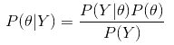

其中 Y 是数据，θ是伯努利分布的参数。

要快速总结贝叶斯规则，

*   给定数据 y 的θ参数的后验概率/可信度

*   给定参数θ的数据的可能性:

*   没有数据 D 的参数的先验/可信度

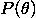

*   边际可能性

# 简单/朴素贝叶斯分层(BH)建模

我们也可以有这样一个概念，所有玩家的技能都来自一个由ωω参数化的共同分布。这类似于说，我们可以从总体分布中生成所有 NBA 球员的θ。

形式上，除了每个球员的 3 分投篮能力由θ表示之外，我们可以将另一个参数ωω集成到 BH 模型中，其中ω参数化了不同位置的技能集分布。

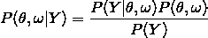

假设θ以ω为条件，我们可以对θ和ω之间的条件关系进行马尔可夫分解。因此，分子可以表示如下:

因此，总的后验概率可以表示为:

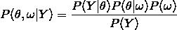

在这种情况下，ω作为θ分布的先验信念。

# NBA 位置的贝叶斯分层模型

不同的位置会有不同的技能组合，但在每个位置，球员往往有相似的技能组合。这为我们构建贝叶斯分层模型提供了前提。对于那些不熟悉它的人来说，我们将球员位置信息合并到一个层次结构中，这为生成单个球员的技能提供了一个良好的基础。这是基于一个普遍合理的假设，即不同位置的球员拥有更同质的技能。并且这种等级是由总体人口分布决定的，该总体人口分布代表了该特定赛季整个 NBA 联盟的投篮能力。

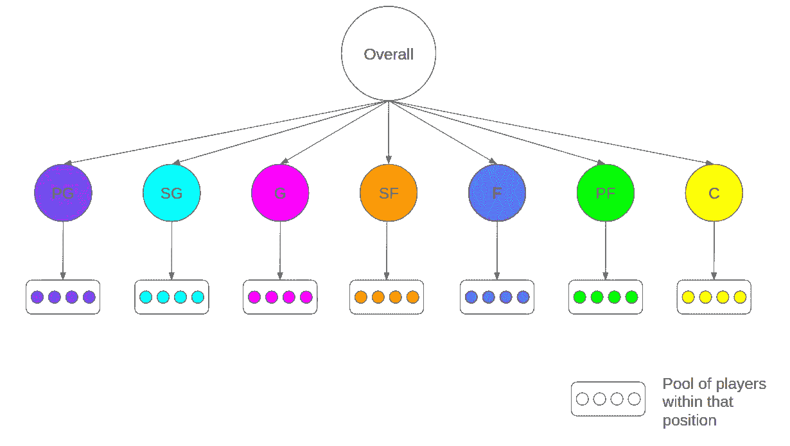

为了帮助促进这种思路，很自然地认为 PGs 比中锋有更好的 3 分投篮技术。因此，考虑一个ωω_ pg 来参数化所有 pg 的θ_pg 分布，同时考虑一个单独的ωω_ c 来参数化所有中心的θ_c 分布。不同位置ω的这种分割有助于为相关位置生成更精确的θ，因为组内属性没有被“交叉污染”或稀释。这可以通过下面的公式看出:

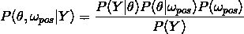

# BH 模型分布的选择

在我们继续之前，我们需要定义纳入 BH 建模的分布。对于本例，我们将利用以下分布:

*   伯努利分布(由θ参数化，限值为 0 和 1)
*   二项式分布(由θ和 N 参数化，限值为 0 和 N，相同θ的 N 个独立伯努利试验系列)
*   贝塔分布(由 A 和 B 参数化，限值为 0 和 1，注意模式ω和浓度κ)

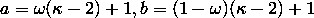

*   伽马分布(由形状 S 和速率 R 参数化，极限为 0 和无穷大)

# JAGS BH 模型图

为了创建分布的模型语法，我们需要将分布合并到最终的后验表示中，如下所示:

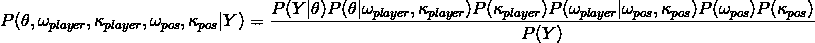

请注意，在最后的验后，我们已经包括了额外的参数，以充分代表分层分组。

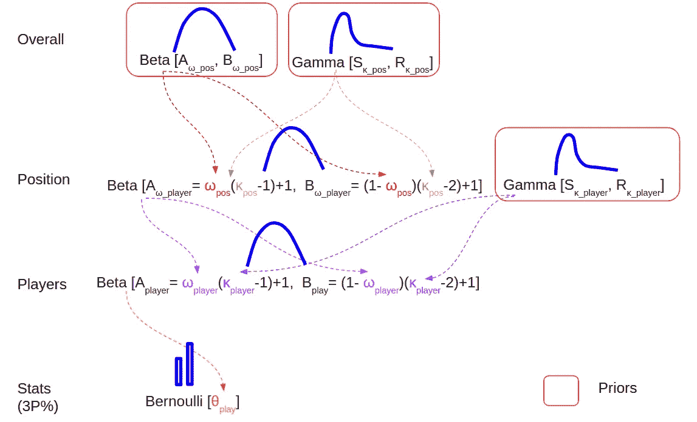

如上面的 BH 图所示，我们可以从自下而上的方法进行分析(玩家个人技能来自基于位置的技能，而基于位置的技能来自假定的先验)。后验概率由以下分布表示:

*   每个球员的三分球试投由一个伯努利分布表示，参数为θ

*   每个球员的一系列 3 分投篮是由θ和尝试次数 n 参数化的二项式分布。这在图中没有正式显示。
*   每个玩家的θ由 Beta 分布产生，由模式ω_player 和浓度κ_player ( *用橙色虚线*表示)参数化

*   假设κ_player 有条件地独立于任何其他参数，则它的先验被单独给出(*由紫色虚线*表示)。这个先验是伽马分布

请注意，由于此参数位于层次结构的职位分组级别，我们必须为每个分组创建尽可能多的先验。类似的类比是，对于 N 个位置，我们总共需要 N 个ω_pos/κ_pos 参数，因此同样地，我们总共需要 N 个κ_player 先验参数。

*   每个ω_player 由每个玩家位置分组的 Beta 分布产生，如ω_pos 和κ_pos 所参数化的(*由粉色虚线*表示)

*   每个ω_pos 也由先验分布定义，该先验分布是贝塔分布(由红色虚线表示的

*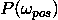*

*   *每个κ_pos 由先验分布定义，该先验分布是伽马分布(由深绿色虚线表示的*

****

*   **分母 P(Y)代表 Y 的边际分布。这通常不在 JAGS 马尔可夫链蒙特卡罗(MCMC)模拟中考虑，因为分母是一个归一化因子，使用 MCMC 算法(Gibs 采样)可以将其抵消。**

**还值得注意的是，先验知识通常被设定为模糊/不确定的，除非一个人已经定义了感兴趣的特定领域的知识。**

# **模拟结果**

**使用“进行贝叶斯数据分析”中的修改脚本在 JAGS 上运行 MCMC 模拟，我们得到了以下结果。用 500 步老化和 100 步间隔中的变薄来模拟具有独立初始点的 3 个 MCMC 链，以降低自相关。**

# **欧米茄的整体分销**

**参数“ω0”表示总体先验β分布，从该分布中生成ω_ pos 参数。**

*   **右上图示出了 4802 的中等有效样本量(ESS)。根据经验，为了使高密度区间(HDI)分位数限制可信，至少应该在 10，000 左右，但是在 3000 以上，估计的平均值/分布模式仍然是可靠的。**
*   **左上图显示了对整个参数范围内 3 个 MCMC 链的探索，我们可以观察到这些链进行了充分的探索(请记住，omega 来自极限 0 和 1 的 Beta 分布)。**
*   **左下方的图表描绘了 Gelman 图，这是一个诊断图，用于比较链间方差和每个链内方差。基本上，Gelman-Rubin 测量了一个称为“尺度缩减因子”的值，该值表示几个链内的方差和几个链之间的方差之间是否存在显著差异。如果比例因子高于 1.1，则表明某些 MCMC 链可能已经卡住，并且可能没有正确收敛。在我们的例子中，比例因子接近 1.0，这表明链的收敛。**
*   **右下角的图表描述了每条链的密度图。因为所有的链都有相似的密度，所以我们可以推断出这些模拟相互印证。在参数值的尺度上，所述 MCSE 表示链中样本均值的估计 SD。由于 MCSE 很小，在这种情况下，模拟估计的标准偏差是可以的。**

**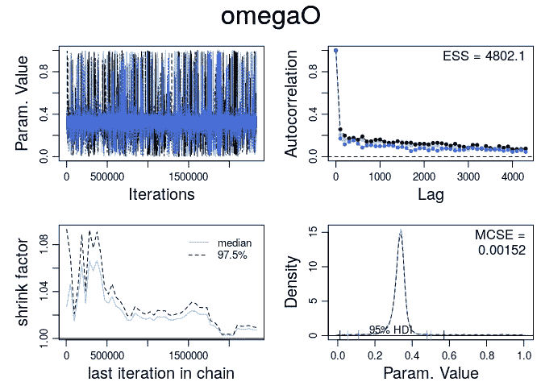**

# **基于位置的 Omega 分布**

**对于参数“omega[x]”，其中 x 是每个位置分组的索引，它表示从“omega 0”生成的位置分组参数。下面的图汇集了每个位置的 omega 的所有生成的概率分布，其中 omega[1]代表中锋的 beta 分布模式，omega[7]代表得分后卫的 beta 分布模式。显示了每个分布的 95%(默认)HDI，但不幸的是，对于某些位置，分布太窄，以至于叠加的文本相互“阻挡”(例如在 omega[7] SG 中看到的)。**

**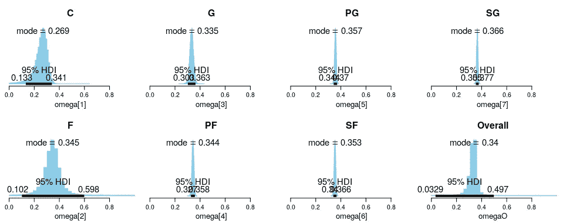**

**正如所料，与后卫或得分后卫等后场角色相比，中锋和前锋等大个子角色的三分球命中率通常要差得多。这可以从分布的模式中看出。此外，与 PGs/SGs 相比，中锋和前锋的分布也有更大的差异。我们知道这是事实，当有像卡尔-安东尼·唐斯或凯文·乐福这样的球员拥有非凡的三分球能力时，而有像鲁迪·戈伯特或德安德鲁·乔丹这样的中锋却没有这种能力。**

**有趣的是，大前锋的三分球命中率似乎很高。在检查数据时，帕斯卡尔·西亚卡姆和达尼罗·加里纳利等球员被包括在内。有些 PFs 的三分球命中率很低，但是那些投篮命中率低的 PFs 总的出手次数更少。这可以解释为什么这个位置的三分球命中率比预期的要高。**

**另一个有趣的发现是，对于 G 位置，分布的模式实际上低于 PFs，并且也具有更高的分布扩散。也许可以说，由于 G 位球员扮演双重角色(PG 和 SG)，他们的分组是具有混合技能的球员，而 PFs 倾向于折衷具有同质特殊 3 分投篮技能的球员。**

# **位置ω的差异**

**我们还可以确定不同位置的ω值的差异。**

**下图是中锋和 PG 位置的简单对比。左上角和右下角的图显示了每个位置的ω值的直方图分布，而右上角的图显示了模拟的差异。我们可以看到，对于(C — PG)，差值的众数是-0.084。然而，这不足以让我们得出存在重大差异的结论。为此，我们依赖直方图的 HDI 区间。读取该图告诉我们，直方图的 99.7%位于 0 以下，而只有 0.3%位于 0 以上。同样，95%人类发展指数上限为-0.0126。因此，我们可以得出这样的结论:C 队和 PGs 队的三分球命中率有显著差异。**

**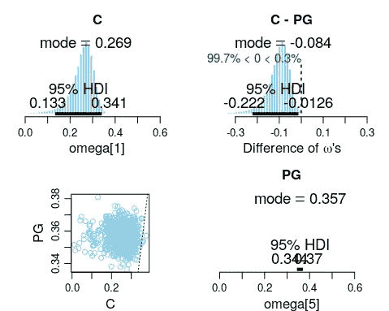**

**我们可以对 PF 和 G 位置进行类似的比较。请注意，我们以前遇到过 PFs 有惊人的 3 分命中率，而 Gs 的命中率比 PFs 低。如右上图所示，关键值 0 位于位置 omegas 差异的 95% HDI 可信区间限值之间。因此，我们不能得出 PFs 和 Gs 的三分球命中率有差异的结论。**

**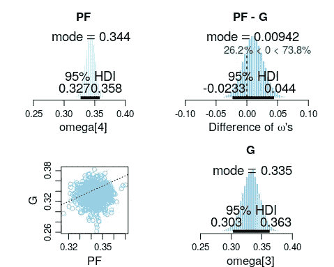**

# **单个玩家的θ比较**

**我们也可以找出球员的具体表现。比较两个不同位置的精英球员(詹姆斯·哈登对卡尔安东尼唐斯)，我们现在观察到在所有的柱状图中有一个红色的十字。这个红叉代表原始的单个球员数据，不考虑位置的等级。比如我们看到对于卡尔-安东尼-唐斯来说，他的个人百分比是 139/354 = 39.27%。他的θ直方图的模式显示为相对较低的 38.8%。这是因为在 BH 模型中的位置信息导致了“缩水”,中锋的投篮命中率只有 26.9%。**

**这种缩水效应在詹姆斯·哈登并不明显，他的实际三分球命中率是 374/1030 = 36.3%，相比之下位置模式值为 36.6%。**

**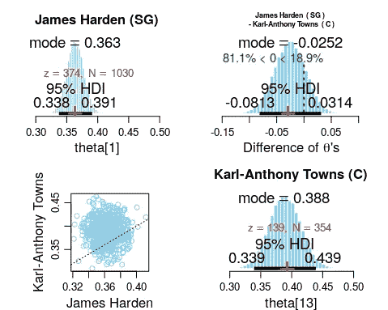**

**值得强调的是，术语“收缩”可能会被错误地解释。这并不总是意味着估计的价值减少了。事实上，这是双向的。对于那些个人模式低于位置/组模式值的人，这将增加他们估计的个人模式。反之亦然，对于那些具有高于位置/组模式值的单独模式。“收缩”的概念适用于向组值收缩。**

**斯蒂芬·库里和尤素夫·努尔基奇的比较可以进一步说明这一点。斯蒂芬·库里的投篮命中率为 352/807 = 43.6%，远远高于 35.7%的位置控卫模式。这使得他的预计投篮命中率达到 41.8%。另一方面，尤素夫·努尔基奇 29 投 0 中，但根据位置信息(mode = 26.9%)，他的估计投篮命中率为 6.18%。**

**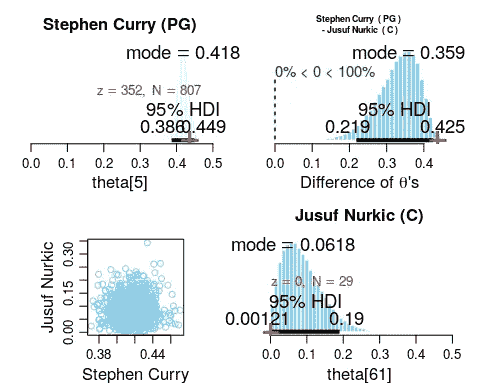**

# **摘要**

**在这个分析中，我展示了用 NBA 位置信息对 3 分命中率进行贝叶斯分层建模的应用。我们还对 MCMC 仿真进行了一些诊断，以及如何验证仿真的可靠性。此外，我们还分析了每个位置和某些球员的投篮命中率。**

**随着分层模型的出现，出现了一个关键的概念“收缩”，当我们比较每个位置的球员以及位置信息如何影响他们估计的投篮命中率时，也说明了这一点。**

**这种分析的很大一部分是基于 John Kruschke 的书[做贝叶斯数据分析](https://sites.google.com/site/doingbayesiandataanalysis/)。**

**关于 Python scraper 或 R 分析代码的更多细节，请查看项目 [Github repo](https://github.com/kfoofw/nba_espn/blob/master/3.analysis/threepoint_2018-19/Bayesian-Hierarchical-Modelling-of-3-point-shooting.md) 。**

**下篇就来看看近十年来(2009/10 至 2018/19 常规赛)中锋和大前锋的 [3 分投篮技术。](/@kfoofw/analysis-of-3-point-shooting-skills-of-big-men-positions-across-a-decade-75c7a5120dc4)**