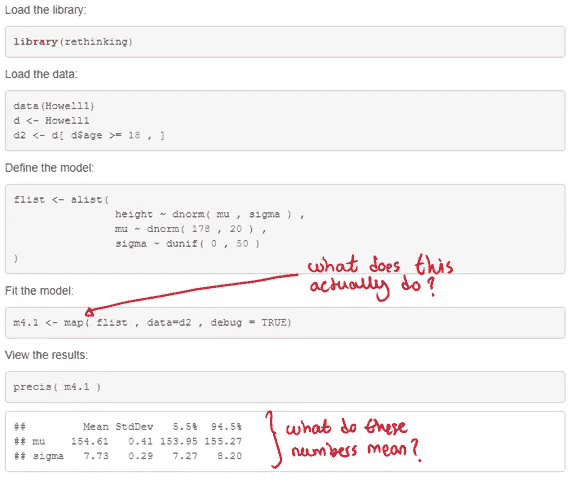

# 贝叶斯推理简介

> 原文：<https://medium.com/analytics-vidhya/bayesian-inference-how-quadratic-approximation-works-40cc70e79fb0?source=collection_archive---------6----------------------->

## 第 2 部分:二次近似如何工作

# 介绍

在本文中，我将解释二次近似法在估计概率分布的后验概率时是如何工作的。

这篇文章是我上一篇[文章](/towards-artificial-intelligence/bayesian-inference-how-grid-approximation-works-e2c79a516c49)的延续，在那篇文章中我讨论了网格近似是如何工作的。我鼓励…