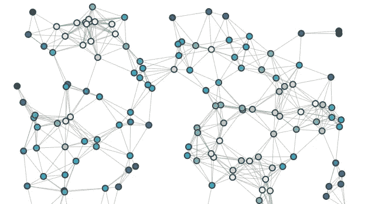
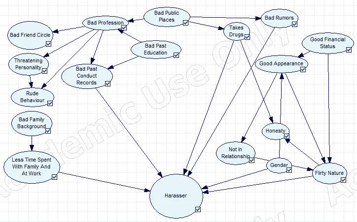

# 贝叶斯网络——使用 GeNIe 建模

> 原文：<https://medium.com/analytics-vidhya/bayesian-network-modelling-using-genie-b80cf8704630?source=collection_archive---------9----------------------->

图片来源[此处](https://towardsdatascience.com/a-tale-of-two-convolutions-differing-design-paradigms-for-graph-neural-networks-8dadffa5b4b0)

本文通过使用贝叶斯模型预测性骚扰指控的有效性，讨论了基于贝叶斯模型的真实世界用例(模拟例子)。

在对性骚扰和掠夺性指控的评估中，背景信息常常被忽视。因此，结果可能是个人偏见和偏爱的结果。在本文中，我们提供了一个详细的贝叶斯网络，在该网络中，事件(节点)及其各自的条件概率和边际概率被公式化，从而在分析网络时，我们考虑了事件发生的每种可能性及其对整个网络结果的影响。

# 介绍

贝叶斯网络、贝叶斯网络、信任网络、贝叶斯(ian)模型或概率有向无环图形模型是一种概率图形模型(一种统计模型),其通过有向无环图(DAG)表示一组变量及其条件依赖性。1 在我们的模型中，我们使用贝叶斯网络的能力来预测被指控的人实际上是否是一个骚扰者。我们使用贝叶斯网络对基于先验、边缘和后验概率的给定证据进行概率和统计分析。我们试图提出一个简单而有效的模型，该模型预测正确的结果，并最小化影响真实决策的可能偏差的概率。

# 描述

在本节中，我们将详细描述该场景。我们研究这个场景，并确定可能导致决定性情况的因果关系。性骚扰是一个敏感的话题，需要仔细的建模。经过研究，我们注意到一些因素，它们之间的关系可以导致决定性的情况。以下是该场景中列出的一些不确定性/事件。不确定性之间的因果关系将在本节后面详细讨论。

1.  **不好的职业:**这个事件从概率的角度捕捉了这个人所从事的职业是否不好的信息。
2.  **良好的外表:**这个变量量化了一个人在美丽/英俊方面的表现。
3.  **吸毒:**这个变量反映了这个人对毒品上瘾的程度。
4.  **良好的财务状况:**这个变量量化了被告人的财务状况。这个变量的值越大，这个人的财务状况就越好。
5.  **不良过往行为记录:**此变量捕捉此人一生中不良的过往行为记录。
6.  **gender:** 这个变量存储了人的性别是男是女的信息。
7.  **没有关系:**该变量捕捉被告是否有关系。
8.  **诚实:**这个变量量化了一个人在日常生活中有多诚实。
9.  **不良家庭背景:**这个变量从商业、道德和社会价值观方面量化了家庭背景的不良。
10.  **不良过往教育:**该变量存储被告是否在社会和道德等级较低的机构学习的信息。
11.  **不良公共场所:**此变量捕获此人是否访问不良公共场所。
12.  **粗鲁行为:**此变量捕捉到此人的粗鲁本性和行为。
13.  **不良谣言:**这个变量量化了关于这个人的不良谣言在社会上传播的程度。
14.  **威胁性人格:**这个变量捕捉到了被告的威胁性人格。
15.  **不良社交圈:**这个变量捕获了这个人是否有不良社交伙伴的信息。
16.  花在家庭和工作上的时间更少:这个变量是最重要的变量之一，因为它捕捉到了不寻常的场景。如果这个人没有花更多的时间陪伴家人和工作，那么这个人有可能参与了不寻常的活动。变量量化了这些信息。
17.  **轻浮天性:**这个变量量化了这个人对异性的轻浮程度。

上面提到的是一些最有可能发生的事件和不确定性，它们与指控某人是否是性骚扰者的决定有直接关系。

我们现在使用上述不确定性来创建可能的因果关系，以对场景进行建模，从而获得准确的结果。

一般来说，有一种观念认为男人更可能是骚扰者。如果我们在我们的模型中映射这种情况，我们可以看到*性别*变量作为捕食者被捕获的可能性很高。如果关于一个人有预先存在的*坏谣言*，那么它也可以映射为因果关系，以确定决策的性质。*轻浮的天性*和*不良传闻*可以直接映射为因果关系。一般来说，我们的模型运行的基础是，变量值越差，被指控的人就越有可能。在现实世界中，不良的家庭背景以及花在家庭和工作上的时间较少有着直接的因果关系。同样，毒品和威胁人格可以有直接的因果关系等等。在下一节中，我们将定义模型的结构，并根据网络分析、调查和二次研究来分配先验概率。

# 模型

在本节中，我们定义模型的参数。在本节的前半部分，我们设计基本的网络结构，后半部分，我们分配先验概率并计算每个节点/事件的边际概率。

## 结构

为了形成结构，我们仔细分析了我们在上一节中确定的因果关系。我们注意到，不良职业与不良朋友圈、威胁性人格、粗鲁行为、不良过往行为记录和骚扰直接相关。不良职业概率的变化改变了所有这些事件的概率。一个主要的集群是由事件良好的外表，良好的财务状况，轻浮的性质和没有关系。所有这些实体直接影响骚扰者的概率。由于这种观念认为男性更容易受到骚扰，因此性别的可能性直接影响骚扰者的可能性。我们也注意到服用药物直接影响诚实和骚扰者。研究了这些和更多的因果关系，并在此基础上建立了网络。网络看起来如下。

使用 GeNIe 生成的贝叶斯模型

## 可能性

我们用现实世界的感觉来计算条件概率和边际概率。通过研究调查和进行二次研究，我们设计了网络的先验概率。在自动贝叶斯网络中，如果向模型提供一些预先存在的标记数据，这些先验概率实际上是由网络本身学习的。

**网络使用情况**

为了表示可以使用该模型的问题，我们确定了可以使用该贝叶斯模型做出的七个主要问题或七种主要类型的样本推理。

1.  给定某人 X 有**不良职业**的证据，预测 X 是否是骚扰者。
2.  给定一个人 X **吸毒**的证据，预测 X 是否是骚扰者。
3.  给定一个人 X 没有**不良职业**和**不良家庭背景**但有**不良过往行为记录**、**不良社交圈**、**不良过往教育**的证据，预测 X 是否是骚扰者。
4.  给定一个人 X 是**诚实的**，访问**不良公共场所**，**吸毒**，有**良好的外表**，有**轻浮的天性**并且不在**关系中**的证据，预测 X 是否是骚扰者。
5.  给定一个人 X 是**男性**并且有**良好的财务状况**的证据，预测 X 是否是骚扰者。
6.  给定一个人 X 是骚扰者并且没有**轻浮天性**的证据，预测 X 是否**吸毒**。
7.  假设一个人 X 花**更少的时间和家人在一起，工作**，不在**关系中**，不是**诚实**而是**访问不良公共场所**，预测 X 是否是**男性**。

# 结论

指控某人性掠夺是一项关键任务。结果经常受到个人偏见和偏爱的影响。我们提供了预测这个人是否是骚扰者的替代解决方案。为此，我们使用贝叶斯网络开发了一个基于网络的架构，并确定了场景中的一些不确定性。我们通过调查和二次研究来确定每个节点的概率。我们使用 GeNIe 对我们的网络进行建模和分析。

# 参考

1.  网络结构(如上图所示)的灵感来自于[，一个用于儿童性虐待评估和调查的贝叶斯决策支持工具](https://www.researchgate.net/publication/319092849_A_Bayesian_Decision-Support_Tool_for_Child_Sexual_Abuse_Assessment_and_Investigation)。