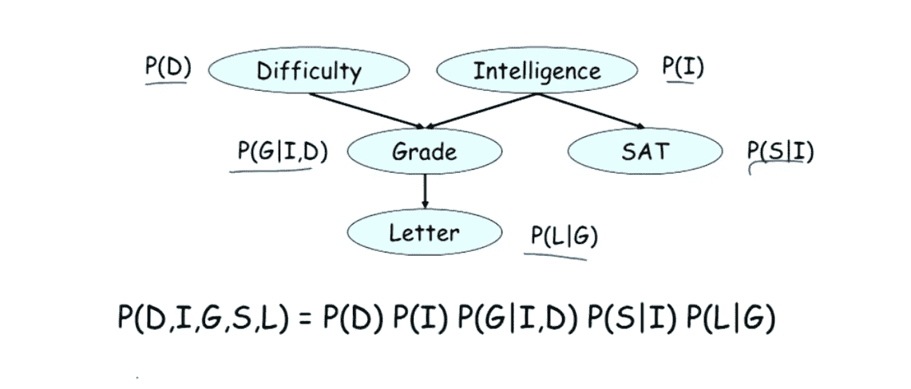

# 贝叶斯网络:基础

> 原文：<https://medium.com/analytics-vidhya/bayesian-networks-fundamentals-2f5589c3e0b7?source=collection_archive---------5----------------------->

贝叶斯网络

我知道这些听起来很难，事实也的确如此！

**是的，没错。保持你的概念清晰就好。**

当我开始统计学的时候，这是我所面临的最艰难的一章。让我们先看看基本的东西。

**什么是概率？**

概率的定义是

> 可能性可能性的性质或状态；某事可能发生的程度。

它是在给定的样本空间中计算事件发生的可能性的方法。

在概率的简单例子中，我们可以用下面的公式来表示

**Prob(Event)=事件在样本空间发生的次数/样本空间总数。**

涵盖了特定硬币的例子，如投掷硬币和正面

随机掷硬币两次

1 —在第一次投掷中，我们得到第一次投掷的概率:第一次投掷给出的是头和尾的概率。

2 —在两个样本空间中，我们得到(H，T):但是第二次投掷我们得到 4 个样本空间，我们计算概率，反之亦然。这将是两次抛硬币。

在树形图中绘制样本空间时。它被称为“概率树”

概率到此为止。

**学习贝叶斯网络时知道概率重要吗？**

**是**

重要的是，当你开始学习贝叶斯网络时，概率树在概率图形模型中扮演着重要的角色。它在计算机视觉和基因组学领域发挥着重要的作用。

**什么是概率模型？**

概率模型是一种以树形结构实现的模型，这种方式使得你可以测量任意节点上的概率流。这是我对概率模型的定义。

普通流感和宇航员访问太空的概率模型。

概率模型显示了每个节点通过链路连接到另一个状态的状态。每个节点都有概率，就像从火星来的宇航员和患普通感冒的人有相同的症状。

每个节点相对于状态的概率

对于上述网络，每个节点都有概率，如“0”为假，“1”为真。

有些状态有独立的概率，比如访问火星。

我们可以看到，概率与每个节点相关联。每个节点通过与每个概率函数简单相乘来计算。让我们看一个例子

我们以概率函数为例来检验贝叶斯网络的链式规则

贝叶斯模型

上面的例子是说有独立的国家难度(基于考试难度)和其他是智力(基于智力)。根据难度和智力，学生得到分数，根据分数，他们得到推荐信。

每个节点有独立和非独立节点的概率。

所以每个节点都有唯一的概率，有些依赖于一个节点，有些是独立的。

## 联合概率

联合概率或点积

为了计算函数的联合概率，我们只需将所有状态的概率相乘。由此，我们得到上面的公式。我用以下符号来表示上述状态:

难度

I:智力

g:年级

学生:星期六

l:信

现在考虑你想要 p(d1，i1，g2，s0，I1)的概率的情况

所以只需参考表格

p(d1)。p(i1)。p(g2|d1，i1)..p(i1，g2)。p(s0。I1)= 0.6 * 0.3 * 0.3 * 0.6 * 0.2 = 0.00648

所以你得到了给定状态下特定节点的概率。

不要这样认为，我们只是刚刚触及表面。

只需点击我更多的主题或查询，如贝叶斯主题，如推理模式和
图流。
邮箱:【saurabhkdm721@gmail.com】
Linkedin:[https://www.linkedin.com/in/saurabh-kadam-853b577a/](https://www.linkedin.com/in/saurabh-kadam-853b577a/)

参考资料:斯坦福大学课堂讲稿。