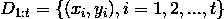

# 贝叶斯优化

> 原文：<https://medium.com/analytics-vidhya/bayesian-optimization-9ddb3aff0eb4?source=collection_archive---------11----------------------->

# **简介**

贝叶斯优化的最早工作可以追溯到 1964 年 Kushner 的工作。现在它是机器学习中非常流行的技术。当优化没有闭合形式表达式的目标函数 f(x)并且只能在采样值处获得该函数 f(x)的观测值(可能有噪声)时，寻找最优值的梯度下降法失败。当计算 f(x)不是很昂贵时，可以用数字估计梯度或使用网格搜索/随机搜索。然而，在某些情况下，给定点上 f 的计算值可能是昂贵的。我举几个评估贵的例子:x 是地理坐标，f(x)是油量；x 是深度神经网络的超参数，f 是某个目标函数，那么计算 f(x)将花费很长时间；x 是一种药物，f(x)是对抗疾病的效力，那么它不仅耗时、耗钱，而且耗鼠🙃。这就是贝叶斯优化有用的时候。

贝叶斯优化是一个寻找最优解的迭代过程，它非常善于用最少的尝试次数找到全局极值，这是网格搜索或随机搜索的一个优势。在本文中，我们将按照以下顺序介绍贝叶斯优化:

*   什么是贝叶斯优化？
*   代理函数:逼近原始目标函数的高斯过程(GP)
*   采集功能:采样位置指南
*   优化迭代过程的图示

# **什么是贝叶斯优化？**

贝叶斯优化是一种寻找目标函数极值的算法，尤其是当函数的评估成本很高时。贝叶斯优化的主要思想是首先基于当前采样点使用代理函数来逼近目标函数 f。代理函数应该能够模拟任意复杂的函数，并且评估起来也很便宜。然后找一个获取函数，根据当前的代理模型来估计优化的利润，下一个采样点就是获取函数最大化的地方。

它之所以被称为贝叶斯，是因为贝叶斯优化使用了著名的“贝叶斯定理”，该定理指出，给定证据(或数据，或观察值)E 的模型 M 的后验概率与给定 M 的 E 的可能性乘以 M 的先验概率成比例:

在贝叶斯优化中，先验 P(f)表示我们对可能的目标函数空间的信念。连同观察到的数据

获得后验分布:

后验分布反映了我们对未知函数 f 的最新看法。它也被称为**替代函数，**，充当真实目标函数 f 的近似值。至于先验，高斯过程(GP)非常适合于一大类常见的优化任务。[Martin Krasser 的博客](http://krasserm.github.io/2018/03/19/gaussian-processes/)是高斯过程的一个很好的资源。高斯过程完全由其均值函数和协方差函数来确定。GP 的一个直觉是，它类似于一个函数，但它不是返回 x 处的标量，而是返回均值等于 f(x)的正常变量。注意，替代函数不仅仅是一个确定性函数:当它被用来逼近真实的目标函数时，我们还可以测量它的不确定性。

图 1:阴影作为不确定性水平的代理函数

第二个问题是如何有效地采样下一个点，在这里对函数 f 求值，我们将介绍一种叫做**采集函数**的函数，作为确定下一个采样位置的指导。它被定义为使得高采集对应于目标函数的潜在高值(如果目标是找到最大值)，或者因为预测高，不确定性大，或者两者都有。当搜索在不确定性高的区域时，就是探索；当搜索在具有高估计值的区域时(假设我们在寻找目标函数的最大值)，这就是剥削。在确定下一个采样点时，应注意勘探和开采之间的权衡。下一个采样点是采集最大化的地方:

其中 u 是采集函数的通用符号。

图 2:采集功能(红色部分)如何引导下一个采样位置。

让我们把所有的东西放在一起。

**贝叶斯优化**

对于 t = 1，2，…，do

1.  通过在高斯过程上优化采集函数来找到下一个采样点 x_t。
2.  在 x_t 采样目标函数。
3.  增加观察值并更新高斯过程。

循环结束。

# **替代函数:逼近原始目标函数的高斯过程**

根据贝叶斯公式和高斯先验假设，后验分布仍然是高斯过程。它是对原始目标函数的近似，带有不确定性估计，参见图 1。

# **采集功能:对采样位置的引导**

采集功能有许多选项。热门选项有*最大改善概率*(MPI)*预期改善*(EI)*置信上限* (UCB)。下面我们将一一介绍。

**最大改善概率(MPI)**

最大改进概率是代理函数不小于当前最大值的最大概率。由于我们知道替代函数在任一点的分布是正态分布，因此获取函数为

在上面的公式中，f*是目标函数的当前最大值，f-hat 是具有标准差σ的代理函数。

参数ε是一个折衷参数。没有它，公式就是纯粹的剥削。极有可能无限小地大于 f*的点将被绘制在提供更大增益但不太确定性的点上。

**预期改善(EI)**

MPI 的缺点是，它只考虑改进的可能性，而没有考虑一个点可能产生的改进的幅度。EI 两者兼顾。改进函数定义为

所以 I(x)是预测值比目前已知的最佳值高多少的正部分。下一个采样点是

由于后验分布是均值(x)和方差 Var(x)正态分布，因此可以计算改进函数的期望值，结果是:

在哪里

Phi 和 phi 是标准正态分布的 CDF 和 PDF。

图 3:我们对某一点上函数值的不确定性(比如上面的 x = 8)可以看作是一个具有均值和标准差的正态随机变量的实现。⁵

类似于最大改进概率，我们可以引入一个参数ε用于勘探-开采的权衡:勘探时，我们应该选择代理方差大的点；开发时，应选择替代均值高的点。在上面的公式中，所有的 f*都被 f *+ε代替。

**置信上限(UCB)**

最后一个流行的获取函数是上/下置信界限，其定义如下:

用户可以自由调整 UCB 采集功能中的参数 k。

# **优化过程的图示**

图 4:贝叶斯优化迭代过程的图示

注意:生成图 4 的代码来自 Martin Krasser。

# **参考**

[1]Harold j . Kushner，“在有噪声的情况下定位任意多峰曲线最大值点的新方法。”*基础工程学报*86.1(1964):97–106。

[2]马丁·克拉瑟。“高斯过程”。[http://krasserm.github.io/2018/03/19/gaussian-processes/](http://krasserm.github.io/2018/03/19/gaussian-processes/)

[3]贝叶斯优化概述[https://soubhikbarari . github . io/blog/2016/09/14/贝叶斯优化概述](https://soubhikbarari.github.io/blog/2016/09/14/overview-of-bayesian-optimization)

[4]https://en.wikipedia.org/wiki/Gaussian_process 的高斯过程

[5] Jones，D.R .，Schonlau，m .和 Welch，W.J .全球优化杂志(1998 年)13: 455。[https://doi.org/10.1023/A:1008306431147](https://doi.org/10.1023/A:1008306431147)

[6]马丁·克拉瑟。[https://github.com/krasserm/bayesian-machine-learning](https://github.com/krasserm/bayesian-machine-learning)