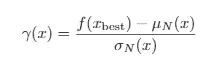

# 贝叶斯优化基础(1)

> 原文：<https://medium.com/analytics-vidhya/bayesian-optimization-basics-1-30e362119cf?source=collection_archive---------18----------------------->

图片来源:[https://pxhere.com/en/photo/1225110](https://pxhere.com/en/photo/1225110)

在本文中，我们将基于 NIPS 2012 年发表的论文《机器学习算法的实用贝叶斯优化》来谈谈几个基本概念。

内容包括以下内容:

1.  代理函数和高斯过程。
2.  采集功能。
3.  贝叶斯优化的可能局限性。

代理函数和高斯过程。

什么是代理函数？“代理人”的意思是“[作为替代品的人](https://www.merriam-webster.com/dictionary/surrogate)”。在我们的例子中，由于我们试图优化的函数要么是黑盒函数(如神经网络)，要么是带有隐式参数的东西，因此我们需要使用一些众所周知的函数来表示它们，以便更好地优化。

那么有哪些众所周知的函数被用作这些代理函数呢？在大多数情况下，我们使用高斯过程。

那么什么是高斯过程呢？

高斯过程是一个随机过程，它具有这样的性质:如果从过程中采样 N 个点，它将形成一个多元高斯分布。

典型的高斯过程如下所示，其中蓝色点(样本数据)回归为高斯过程(红色曲线):

图片来源:【https://www.mathworks.com/help/stats/fitrgp.html 

我们使用高斯过程作为代理函数，因为 GP 很好理解，而且它很平滑！

一旦我们假设我们可以用一个 GP 来近似原始函数，那么我们自然会问:达到近似的最好方法是什么？或者另一种提问方式是，如果我们通过迭代生成 GP 来逼近原函数，那么搜索下一个样本点的方向应该是什么，这样才能加快逼近的速度？再者，是否可以给搜索范围内的所有点一个估计值，这样就可以简单地将值最大的点作为下一个样本点。

是的，这是可能的。因为我们要给搜索范围内的所有点一个估计值，所以我们要定义一个新的函数——获取函数。

NIPS 2012 年的这篇论文提到了定义获取函数的 3 种不同方法:a)改进的概率；b)预期的改进；c) GP 置信上限。

这里重点说一下改善获取函数的概率。

假设我们已经采样了 N 个具有相应值{y_n}的点{x_n}，那么就有可能估计均值函数

和方差函数

并且我们可以定义对应的 f(x_best)=argmin f(x_n)

和

伽玛函数应该看起来像下面的青色曲线:

如果我们基于 gamma 定义采集函数，则 alpha(x)=CDF(gamma(x))，看起来像下面的绿色曲线:

获取函数给出了接近原点的最大概率改善值，这意味着搜索方向如下

生成图形的 MATLAB 代码可以在[这里](https://gist.github.com/adoskk/5ca0e0ef146b63ba2c8720a976a2aff2)找到。这个例子改编自 [MATLAB 官网](https://www.mathworks.com/help/stats/fitrgp.html)上的原始文档页面。

一旦我们开始使用贝叶斯优化，那么自然会出现问题，这种方法的局限性是什么？如果它是完美的，那么到目前为止每个人都应该在使用它，对吗？

在论文中，作者确实提到了 3 个主要问题:

1.  不同的核函数选择和超参数可能会影响结果
2.  在参数空间的不同区域，执行时间可能会有所不同
3.  并行化问题。

我不打算在这里深入这些话题，但主要的想法是，贝叶斯优化本身可以进一步优化。特别是当你试图用它来进行深度网络的超参数搜索时，要三思而行，优化方法也有超参数。并行化绝对是一个令人担忧的因素，因为如今人们正在将作业转移到具有多个 GPU 的集群。

但是希望这篇文章能够阐明一些基本概念，并帮助您更好地理解贝叶斯优化！