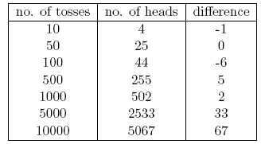
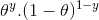

# 贝叶斯统计用简单的英语向初学者解释

> 原文：<https://medium.com/analytics-vidhya/bayesian-statistics-explained-to-beginners-in-simple-english-3d117caf2bff?source=collection_archive---------2----------------------->

贝叶斯统计在许多分析家的头脑中仍然是难以理解的。被机器学习不可思议的力量所震惊，我们中的许多人变得对统计数据不忠。我们的重点已经缩小到探索机器学习。不是真的吗？

我们无法理解机器学习只是解决现实世界问题的一种方式。在一些情况下，它不能帮助我们解决业务问题，即使这些问题涉及到数据。至少可以说，统计学知识将使你能够处理复杂的分析问题，而不管数据的大小。

18 世纪 70 年代，托马斯·贝叶斯提出了“贝叶斯定理”。即使过了几个世纪，“贝叶斯统计”的重要性也没有消失。事实上，今天这个话题在一些世界领先的大学里被深入讲授。

带着这个想法，我创建了这本贝叶斯统计初学者指南。我试图用简单的方式用例子来解释这些概念。有基本概率统计知识者优先。到本文结束时，您将对贝叶斯统计及其相关概念有一个具体的理解。

# 目录

1.  频繁统计
2.  频率主义统计学的固有缺陷
3.  贝叶斯统计
4.  贝叶斯推理
5.  重要性测试——频率主义者与贝叶斯主义者

在我们真正钻研贝叶斯统计之前，让我们花几分钟了解一下 *Frequentist 统计*，这是我们大多数人遇到的更流行的统计版本，以及其中固有的问题。

# 1.频繁统计

几个世纪以来，*常客*和*贝叶斯*之间的争论一直困扰着初学者。因此，重要的是要了解两者之间的区别以及如何存在一条细线的分界线！

这是统计世界中使用最广泛的推理技术。事实上，一般来说，这是一个进入统计世界的人遇到的第一个思想流派。

**频率统计**检验一个事件(假设)是否发生。它计算一个事件在实验的长期运行中的概率(即在相同的条件下重复实验以获得结果)。

这里，取**固定大小**的采样分布。然后，理论上重复实验**无限次**，但实际上是带着停止的意图进行的。例如，我做了一个停止的实验，当这个实验重复 1000 次或者我在掷硬币中看到至少 300 个正面时，我会停止这个实验。

现在让我们深入一点。

现在，我们将通过一个掷硬币的例子来理解*常客统计*。目标是评估硬币的公平性。下表显示了磁头的频率:

我们知道扔硬币时正面朝上的概率是 0.5。`No. of heads`代表实际获得的人头数。`Difference`是`0.5*(No. of tosses) - no. of heads`的区别。

重要的是要注意，尽管随着投掷次数的增加，实际头数和预期头数(投掷次数的 50%)之间的差异增加，但头数与投掷总数的比例接近 0.5(对于公平硬币)。

这个实验向我们展示了频率主义方法中发现的一个非常普遍的缺陷，即*实验结果对实验重复次数的依赖性。*

要了解更多关于频率统计方法的知识，你可以去上这个关于推断统计学的[精品课程](https://classroom.udacity.com/courses/ud201/lessons/1306898579/concepts/1611758530923)。

# 2.频率主义统计学的固有缺陷

到目前为止，我们只看到了*常客统计*中的一个缺陷。嗯，这只是开始。

20 世纪见证了应用于数字模型的*频数统计*的大规模热潮，以检查一个样本是否不同于另一个样本，一个参数是否重要到足以保留在模型中，以及假设检验的各种其他表现形式。但是*频数统计*在其设计和解释上有一些重大缺陷，这在所有现实生活问题中引起了严重关注。例如:

1.`p-values`根据样本(固定大小)统计测量，其中一些停止意向随着意向和样本大小的变化而变化。也就是说，如果两个人对同一个数据进行操作，并且有不同的停止意图，他们可能对同一个数据得到两个不同的`p- values` ，这是不希望的。

例如:当总数达到 100 时，人 A 可以选择停止扔硬币，而 B 停在 1000。对于不同的样本量，我们得到不同的 t 值和不同的 p 值。类似地，停止的意图可以从固定的翻转次数变为翻转的总持续时间。在这种情况下，我们也必然会得到不同的 *p 值*。

2-像`p-value`一样，置信区间(C.I)很大程度上取决于样本大小。这使得停止势绝对荒谬，因为无论多少人对相同的数据进行测试，结果都应该是一致的。

3-置信区间(C.I)不是概率分布，因此它们不提供参数的最可能值和最可能值。

这三个原因足以让你开始思考*频率主义方法*的缺点，以及为什么需要*贝叶斯方法*。让我们找出它。

从这里，我们将首先了解贝叶斯统计的基础知识。

# 3.贝叶斯统计

> 贝叶斯统计是一种将概率应用于统计问题的数学方法。它为人们提供了工具来更新他们对新数据证据的信念。”

明白了吗？我举个例子解释一下:

假设，在[尼基·劳达](https://en.wikipedia.org/wiki/Niki_Lauda)和[詹姆斯亨特](https://en.wikipedia.org/wiki/James_Hunt)之间的所有 4 场冠军赛(F1)中，尼基赢了 3 场，而詹姆斯只赢了 1 场。

所以，如果你要赌下一场比赛的赢家，他会是谁？

我打赌你会说尼基·劳达。

这是个转折。如果有人告诉你，詹姆斯赢的时候下过一次雨，尼基赢的时候下过一次雨，而下一次约会肯定会下雨，那该怎么办？那么，你现在会把钱押在谁身上？

凭直觉，很容易看出詹姆斯获胜的几率已经急剧增加。但问题是:多少？

为了理解手头的问题，我们需要熟悉一些概念，首先是条件概率(下面解释)。

此外，还有一些先决条件:

先决条件:

1.  线性代数:为了刷新你的基础知识，你可以看看[可汗的学院代数](https://www.khanacademy.org/math/linear-algebra)。
2.  概率和基础统计:为了刷新你的基础知识，你可以看看可汗学院的另一门课程。

# 3.1 条件概率

它被定义为:给定 B 的事件 A 的概率等于 B 和 A 一起发生的概率除以 B 的概率。”

例如:假设两个部分相交的集合 A 和 B 如下所示。

集合 A 代表一组事件，集合 B 代表另一组事件。我们希望计算一个给定的 B 已经发生的概率。让我们用红色阴影表示事件 B 的发生。

既然 B 发生了，现在对 A 重要的部分是蓝色阴影部分，有趣的是

。所以，给定 B 的概率结果是:

因此，给定 A 已经发生，我们可以写出事件 B 的公式:

或者

现在，第二个等式可以改写为:

这被称为**条件概率**。

让我们试着用这个技巧回答一个打赌的问题。

假设，B 是詹姆斯·亨特获胜的*事件。a 是下雨*的*事件。因此，*

1.  P(A) =1/2，因为四天里下了两次雨。
2.  P(B)是 1/4，因为詹姆斯在四场比赛中只赢了一场。
3.  P(A|B)=1，因为每次詹姆斯赢的时候都下雨。

将条件概率公式中的值代入，我们得到的概率为 50%左右，这几乎是不考虑降雨时 25%的两倍(在您那里求解)。

鉴于新的*证据*即下雨，这进一步坚定了我们对詹姆斯获胜的信念。你一定想知道这个公式和你可能听说过的很相似。想想吧！

大概，你猜对了。看起来像**贝叶斯定理**。

贝叶斯定理建立在条件概率之上，是贝叶斯推理的核心。现在就来详细了解一下。

# 3.2 贝叶斯定理

贝叶斯定理在多个事件发生时生效

用另一个事件 b 组成一个详尽的集合。这可以借助下图来理解。

现在，B 可以写成

所以，B 的概率可以写成:

但是

因此，在条件概率方程中替换 P(B ),我们得到

这是**贝叶斯定理**的方程。

# 4.贝叶斯推理

深入研究它的理论方面是没有意义的。所以，我们要学习它是如何工作的！我们举一个抛硬币的例子来理解*贝叶斯推断*背后的思想。

*贝叶斯推理*的一个重要部分是*参数*和*模型的建立。*

模型是观察到的事件的数学公式。参数是模型中影响观察数据的因素。例如，在掷硬币时，硬币的**公平性**可以定义为用θ表示的硬币的参数。事件的结果可以用 d 来表示。

现在回答这个。给定硬币的公平性(θ)，9 次投掷中有 4 次正面朝上的概率(D)是多少？即`P(D|θ)`

等等，我问对问题了吗？号码

我们应该更有兴趣知道:给定一个结果(D ),硬币公平(θ=0.5)的概率是多少

让我们用贝叶斯定理来表示它:

`P(θ|D)=(P(D|θ) X P(θ))/P(D)`

在这里，`P(θ)` 是*之前的，即我们在抛硬币之前对硬币的公平性的信念强度。我们完全可以相信硬币在 0 到 1 之间有任何程度的公平性。*

*`P(D|θ)`给定θ的分布，观察我们结果的可能性。如果我们知道硬币是公平的，这就给出了在特定的掷硬币次数中观察人头数的概率。*

*`P(D)`就是证据。这是通过对所有可能的θ值求和(或积分)确定的数据概率，并根据我们对这些特定θ值的信任程度进行加权。*

**如果我们对硬币的公平性有多种看法(但不确定)，那么这就告诉我们，在我们相信硬币的公平性的所有可能性中，看到某个翻转序列的概率。**

*`P(θ|D)`是观察证据后我们的参数的后验置信，即头数。*

*从这里开始，我们将深入这个概念的数学含义。别担心。一旦你理解了它们，理解它的数学就相当容易了。*

*为了正确定义我们的模型，我们事先需要两个数学模型。一个用于表示***【D |θ】***，另一个用于表示 ***先验信念的分布。*** 这两者的乘积给出了 ***后验置信 P(θ|D)*** 分布。*

*由于先验和后验都是关于硬币公平分配的信念，直觉告诉我们两者应该有相同的数学形式。请记住这一点。我们将再次回到它。*

*所以，有几个函数支持贝叶斯定理的存在。了解它们是很重要的，因此我详细解释了它们。*

# *4.1.伯努利似然函数*

*让我们回顾一下我们学到的可能性函数。因此，我们了解到:*

**它是在给定的硬币公平度下，观察到特定数量的硬币正面朝上的概率。这意味着我们观察正面/反面的概率取决于硬币的公平性(θ)。**

*`P(y=1|θ)=`*

**

*[如果硬币是公平的θ=0.5，观察到正面(y=1)的概率是 0.5]*

*`P(y=0|θ)=`*

**

*[如果硬币是公平的θ=0.5，观察到尾部(y=0)的概率是 0.5]*

*值得注意的是，将 1 表示为正面，将 0 表示为反面只是一种数学符号，用于表示模型。我们可以将上面的数学定义组合成一个单一的定义来表示两种结果的概率。*

*p(y |θ)= 1*

**

*这被称为**伯努利似然函数**，抛硬币的任务被称为伯努利试验。*

*`y={0,1},θ=(0,1)`*

*而且，当我们想要看到一系列的头或翻转时，其概率由下式给出:*

****

*此外，如果我们对人头数 *z* 出现在 *N* 次翻转中的概率感兴趣，那么概率由下式给出:*

**

# *4.2.先验信念分布*

*这种分布用于表示我们对基于先前经验的参数的信念的优势。*

*但是，如果一个人以前没有经验呢？*

*别担心。数学家们也设计了减轻这个问题的方法。它被称为`uninformative priors` *。我想事先通知你，这只是一个误称。每一个无信息先验总是提供一些信息事件的常数分布先验。**

*嗯，用来表示先验信念的数学函数被称为`*beta distribution*` ***。它有一些非常好的数学性质，使我们能够对我们关于二项分布的信念进行建模。****

*贝塔分布的概率密度函数的形式为:*

**

*这里，我们的重点是分子。分母只是为了确保积分后的总概率密度函数等于 1。*

*`α`和`β`被称为密度函数的形状决定参数。这里`α`类似于试验中的头数，而`β`对应于尾数。下面的图表将帮助您可视化不同的`α`和`β`值的 beta 分布*

**

*您也可以使用 R 中的以下代码来绘制 beta 分布图:*

*`> library(stats)
> par(mfrow=c(3,2))
> x=seq(0,1,by=o.1)
> alpha=c(0,2,10,20,50,500)
> beta=c(0,2,8,11,27,232)
> for(i in 1:length(alpha)){
y<-dbeta(x,shape1=alpha[i],shape2=beta[i])
plot(x,y,type="l")
}`*

**注:* `α`和`β`直观易懂，因为它们可以通过知道分布的均值(μ)和标准差(σ)来计算。事实上，它们的关系如下:*

****

*如果已知分布的平均值和标准偏差，就可以很容易地计算出形状参数。*

***从上图得出的推论:***

1.  *当没有抛硬币时，我们相信硬币的每一个公平性都是可能的，正如那条平线所描绘的。*
2.  *当正面的数量多于反面时，图表显示峰值向右移动，表明正面的概率更高，硬币是不公平的。*
3.  *随着更多的投掷完成，正面继续以更大的比例出现，峰值变窄，增加了我们对硬币价值公平性的信心。*

# *4.3.后验置信分布*

*我们选择先验信念的原因是为了得到一个贝塔分布。这是因为当我们把它乘以一个似然函数时，后验分布产生了一种类似于先验分布的形式，这种形式更容易联系和理解。如果这么多的信息吊起了你的胃口，我敢肯定你已经准备好多走一英里了。*

*让我们用贝叶斯定理计算后验置信。*

***使用贝叶斯定理计算后验置信度***

******

*现在，我们的后验信念变成了，*

**

*这很有意思。只要知道我们关于参数`θ`的信念的均值和标准分布，并通过观察 N 次翻转中的头部数量，我们就可以更新我们关于模型参数`θ`的信念。*

*让我们借助一个简单的例子来理解这一点:*

*假设，你认为一枚硬币有偏差。它的平均(μ)偏差约为 0.6，标准偏差为 0.1。*

*然后，*

*`α= 13.8`，`β=9.2`*

*即我们的分布将偏向右边。假设，你在 100 次翻转(`N=100`)中观察到 80 个头(`z=80`)。让我们看看我们的先验和后验信念会是什么样子:*

*`prior = P(θ|α,β)=P(θ|13.8,9.2)`*

*`Posterior = P(θ|z+α,N-z+β)=P(θ|93.8,29.2)`*

*让我们将这两种信念形象化在一张图上:*

**

*上图的 R 代码如下:*

*`> library(stats)
> x=seq(0,1,by=0.1)
> alpha=c(13.8,93.8)
> beta=c(9.2,29.2)
> for(i in 1:length(alpha)){
y<-dbeta(x,shape1=alpha[i],shape2=beta[i])
plot(x,y,type="l",xlab = "theta",ylab = "density")`*

*`}`*

*随着越来越多的翻转和新的数据被观察到，我们的信念得到更新。这就是贝叶斯推理的真正威力。*

# *5.重要性测试——频率主义者与贝叶斯主义者*

*在不深入严格的数学结构的情况下，本节将为您提供一个快速概述，介绍 frequentist 和 bayesian 方法的不同方法，以测试组间的显著性和差异，以及哪种方法最可靠。*

# *5.1.p 值*

*在此，计算来自固定大小的*抽样分布的特定样本的 t 分数。然后，预测 p 值。我们可以将 p 值解释为(以均值为 100 的分布的 p 值为 0.02 为例) :样本均值等于 100 的概率为 2%。**

*这种解释有一个缺陷，即对于不同大小的抽样分布，必然会得到不同的 t 值，从而得到不同的 p 值。这完全是荒谬的。小于 5%的 p 值不能保证零假设是错误的，大于 5%的 p 值也不能保证零假设是正确的。*

# *5.2.置信区间*

*置信区间也有同样的缺陷。此外，由于 C.I 不是一个概率分布，没有办法知道哪些值是最有可能的。*

# *5.3.贝叶斯因子*

*贝叶斯因子相当于贝叶斯框架中的 p 值。让我们全面地理解它。*

*贝叶斯框架中的*零假设*假设∞概率分布仅在参数的特定值(比如θ=0.5)处，而在其他地方概率为零。(M1)*

**的另一个假设*是θ的所有值都是可能的，因此一条平坦的曲线代表了分布。(M2)*

*现在，新数据的后验分布如下。*

**

*贝叶斯统计调整了各种θ值的可信度(概率)。很容易看出，概率分布已经向 M2 转移，其值高于 M1，即 M2 更有可能发生。*

*贝叶斯因子不依赖于θ的实际分布值，而是依赖于 M1 和 M2 值的移动幅度。*

*在图 A 中(如上所示):左栏(M1)是零假设的先验概率。*

*在图 B 中(如图所示)，左边的柱是零假设的后验概率。*

*贝叶斯因子被定义为后验优势与先验优势的比率，*

**

*拒绝一个零假设，一个 BF <1/10 is preferred.*

*We can see the immediate benefits of using Bayes Factor instead of p-values since they are independent of intentions and sample size.*

# *5.4\. High Density Interval (HDI)*

*HDI is formed from the posterior distribution after observing the new data. Since HDI is a probability, the 95% HDI gives the 95% most credible values. It is also guaranteed that 95 % values will lie in this interval unlike C.I.*

*Notice, how the 95% HDI in prior distribution is wider than the 95% posterior distribution. This is because our belief in HDI increases upon observation of new data.*

**

# *End Notes*

*The aim of this article was to get you thinking about the different type of statistical philosophies out there and how any single of them cannot be used in every situation.*

*It’s a high time that both the philosophies are merged to mitigate the real world problems by addressing the flaws of the other. Part II of this series will focus on the Dimensionality Reduction techniques using MCMC (Markov Chain Monte Carlo) algorithms. Part III will be based on creating a Bayesian regression model from scratch and interpreting its results in R. So, before I start with Part II, I would like to have your suggestions / feedback on this article.*

*Did you like reading this article ? As a beginner, were you able to understand the concepts? Let me know in comments.*

**原载于 2016 年 6 月 19 日*[*【www.analyticsvidhya.com*](https://www.analyticsvidhya.com/blog/2016/06/bayesian-statistics-beginners-simple-english/)*。**