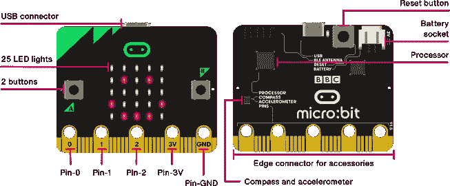

# BBC 微:比特作为无线传感器

> 原文：<https://medium.com/analytics-vidhya/bbc-micro-bit-as-a-wireless-sensor-2624078137a0?source=collection_archive---------9----------------------->

## 物联网| BBC 微:比特

## 使用 micro:bit 作为无线模数转换器



微观:比特特征。[https://microbit.org/get-started/user-guide/overview/](https://microbit.org/get-started/user-guide/overview/)

BBC micro:bit 是一款廉价的微控制器，有几个输入/输出、按钮，更重要的是还有一个蓝牙收音机。在我的一个 Raspberry Pi (RPi)项目中，我需要一个模数转换器(ADC)来读取一些传感器值。有些人可能知道 RPi 没有任何模拟输入，所以需要一个外部转换器，如 MCP3008 芯片。

我不想为我的 RPI 使用试验板，所以我看了看我的电子元件箱，找到了 BBC micro:bit。好的一面是 micro:bit 有 3 个 ADC 输入，很容易访问，并且由电池或 USB 供电。我开始考虑如何将 micro:bit 连接到我的 RPi。出于这个原因，我想避免尝试在两者之间建立 USB 连接或某种有线连接。所以我开始尝试找出一个蓝牙连接。

# 蓝牙

蓝牙非常适合短距离和低带宽连接。因为我只打算在两个组件之间传递几个字节的数据，所以这似乎是正确的选择。现在，我知道蓝牙连接通常会消耗电池，当我试图使用 2 节 AAA 电池来运行 micro:bit 时，我完全预料到了这一点。因此，作为一个警告，我将要描述的工作，但可能不是最有效的电池方法。

有两种主要的蓝牙连接类型，第一种是通用配对模式类型连接，其中蓝牙控制器可以连接到多个设备，但单个设备只能启用一个连接。第二种是无连接方法，有时称为蓝牙 LE(低能耗)。在这种模式下，设备会公布一些数据(通常是一个 URL ),其他蓝牙设备无需建立连接即可读取这些数据。micro:bit 支持广告 Eddystone URL。Eddystone 是一个 Google 标准，用于通过 Bluetooth LE 广告 URL。这些信标被企业用作营销和广告媒介。然而，我的目标是使用这种方法通过蓝牙广告传感器数据。

# 微:位

微:位有 3 个方便的引脚 P0，P1 和 P2，支持模拟输入。想象一下，有三个传感器连接到这些输入中的每一个，并需要传输它们的值。每个模拟输入连接到一个 10 位 ADC，这意味着数值范围为 0–1023 整数(0–3V)。这是我需要的足够的精度，将完美地工作。我也只需要偶尔读取传感器(例如，每 5 秒)。下面的 Javascript 代码应该可以实现这一点。您可以将其复制到“MakeCode for micro:bit”编辑器中。确保您启用了蓝牙功能，而不是无线电。

URL 格式很简单`adc/P0/P1/P2`，比如`adc/100/250/900`。这使得任何程序都可以轻松地读取和解析 URL。

# 计算机编程语言

我将使用 Python 来读取蓝牙信标和 Eddystone URL。读取蓝牙 Eddystone URLs 需要任何蓝牙库。我选择使用`aioblescan`，因为它有一个简单的 API。

`my_process`函数是读取和解析 Eddystone URL 的关键。`asyncio`只是用来循环运行这个，定期扫描蓝牙。虽然这段代码会连续打印这些值，但是请记住，我们的 micro:bit 只是每 5 秒更新一次。输出如下所示:

```
2020-09-04T12:28:16.348710 - ['876', '254', '247']2020-09-04T12:28:16.385642 - ['879', '253', '250']2020-09-04T12:28:16.425616 - ['876', '254', '248']2020-09-04T12:28:16.462815 - ['876', '253', '250']2020-09-04T12:28:16.491648 - ['876', '254', '247']2020-09-04T12:28:16.530890 - ['877', '253', '250']2020-09-04T12:28:16.569894 - ['877', '254', '247']2020-09-04T12:28:16.605666 - ['876', '253', '250']2020-09-04T12:28:16.644787 - ['876', '254', '248']2020-09-04T12:28:16.671624 - ['876', '253', '250']2020-09-04T12:28:16.714569 - ['876', '254', '247']2020-09-04T12:28:16.744807 - ['876', '253', '250']2020-09-04T12:28:16.779926 - ['876', '254', '248']2020-09-04T12:28:16.886823 - ['878', '253', '250']2020-09-04T12:28:16.957036 - ['877', '254', '250']2020-09-04T12:28:16.989715 - ['876', '254', '247']2020-09-04T12:28:17.029785 - ['876', '253', '250']2020-09-04T12:28:17.060848 - ['877', '254', '247']2020-09-04T12:28:17.099637 - ['876', '253', '250']2020-09-04T12:28:17.135585 - ['876', '254', '248']
```

这样，我就可以将 micro:bit 作为多个传感器的无线发射器。这当然让我很满意，因为我以一种创新的方式将 micro:bit 用作无线传感器。希望这对你有用。