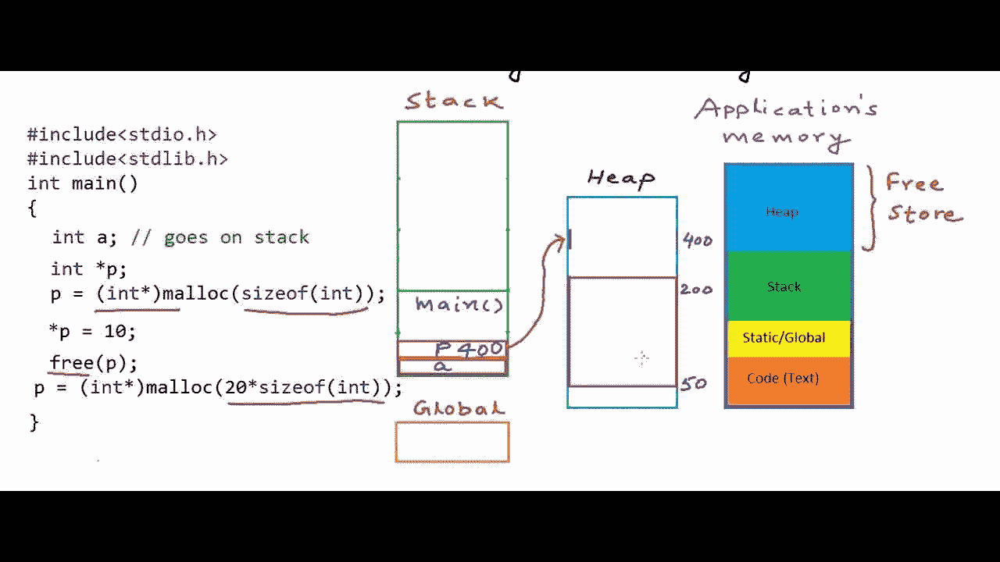
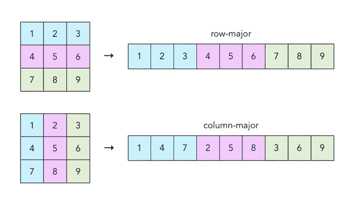
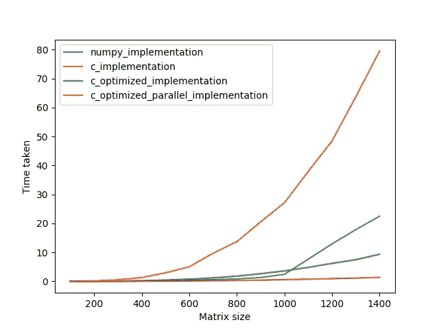

# 通过用 C 扩展 Python 来提高性能速度

> 原文：<https://medium.com/analytics-vidhya/beating-numpy-performance-by-extending-python-with-c-c9b644ee2ca8?source=collection_archive---------1----------------------->

*嵌入* ***C*** *成****Python****进行性能提速。*


尼克·希利尔在 [Unsplash](https://unsplash.com?utm_source=medium&utm_medium=referral) 上拍摄的照片

你有没有想过 NumPy 是如何快速完成复杂的计算的？秘密在于它使用了低级编程语言**—**—**C**。将数据传递给 **C** ，执行计算并将其返回给 **Python。你会问什么更简单？事实上，这并不像你可能认为的那样是一项完全琐碎的任务。**

在这篇文章中，我将展示如何用 C 语言扩展你的 Python 代码以获得更好的性能速度，还将展示如何比 NumPy 代码更快地进行计算。这里假设你已经熟悉了一些 **Python** 和 **C** 的基础知识。

## **比较纯 Python 点积和 NumPy 的性能**

在这篇文章中，我将比较在两个任意矩阵上执行点积的速度。

在 **Python、**和任何其他编程语言中，做 2 个矩阵的点积最简单直接的方法就是使用 3 个嵌套的 for 循环。让我们考虑下面的例子。

我们将首先导入所有必要的模块，并在 **python_dot_product.py** 文件中创建用于比较性能的辅助函数，

```
#python_dot_product.py**import** time
**import** numpy **as** np **import** random **as** rn **def** timer(*func*):
    **def** wrapper(**args*, ***kwargs*):
        before = time.time()
        result = func(**args*, ***kwargs*)
        after = time.time()
        **return** after - before, result
    **return** wrapper **def** generate(*size, range_*):
    arr = [[[rn.randrange(*range_) **for** _ **in** range(size)] **for** _ **in** range(size)] **for** _ **in** range(2)]
    **return** arr
```

其中**定时器**函数只是一个简单的装饰函数，帮助我们测量执行函数所用的时间，而**生成**函数只是为我们提供一个 2D 随机数数组。

为了本教程的方便，我将使用大小为 **MxM** 的矩阵。

下一步是创建点产品的 **Python** 和 **NumPy** 实现函数，并对它们应用我们的**定时器**装饰器。

```
**@timer**
**def** python_implementation(*arr1*, *arr2*):
    result = [[0 **for** _ **in** range(len(arr1))] **for** _ **in** range(len(arr2[0]))]
    **for** i **in** range(len(arr1)):
        **for** j **in** range(len(arr2[0])):
            **for** k **in** range(len(arr2[0])):
                result[i][j] += arr1[i][k] * arr2[k][j]
    **return** result **@timer
def** numpy_implementation(*arr1, arr2*):
    **return** np.array(arr1).dot(arr2)
```

最后比较结果。我将用矩阵大小为 **500x500** 的函数来测试我们的函数，向您展示性能上的明显差异。

```
**if** __name__ == '__main__':
    data = generate(*size=500, range_=(1, 100)*)
    numpy_time_taken, numpy_result = numpy_implementation(*data)
    python_time_taken, python_result = python_implementation(*data)
    print(f"time taken with numpy: {numpy_time_taken} seconds")
    print(f"time taken with python: {python_time_taken} seconds")
```

输出:

```
time taken with numpy: **0.16844797134399414** seconds
time taken with python: **32.14348006248474** seconds
```

哇，原来 **NumPy** 比天真的 **Python** 实现点积大约快 **320** 倍。

那么，我们如何加快我们的代码呢？问题是我们的实现具有时间复杂度为**O(n)**，这是非常低效的。但是我们能减少它吗？是的，我们可以稍微修改我们的 **python_implementation** 函数以获得更低的时间复杂度，但是尽管如此，即使你最小化时间复杂度和在 **Python** 中完成的操作，它也永远不会接近 **NumPy** 的性能。

那么，我们如何接近甚至击败 NumPy？这是我们必须深入挖掘的地方，并开始用 C 代码扩展我们的 Python 代码。因为 **Python** 是解释型语言，比编译型的 **C** 慢，所以后者会快很多。

## 实现 C 模块以便 Python 与之交互

在 **c_extension.c** 文件中，我们将在 **C** 中为我们的点积函数创建实际的逻辑，稍后可以从 Python 中调用。

最重要的是进口。

```
//c_extension.c**#include** "Python.h"
**#include** "stdlib.h"
**#include** "omp.h"
```

**#include "Python.h"** 行基本上说的是我们在导入 **Python** 开发头，它将允许我们传递、处理和返回 **Python** 数据类型和对象。如果您在导入 **Python.h** 头文件时遇到问题，请访问[此处](https://stackoverflow.com/questions/21530577/fatal-error-python-h-no-such-file-or-directory)获取解决方案。

我们将需要它，因为 **Python** 中的一切都是对象，而 **C** 没有对象。

**stdlib.h** —用于访问内存分配函数。

如果你不知道标题是什么，现在不要担心它。我们将稍后到达那里。

我们将从编写我们的**点积**函数的原型开始。

```
**PyObject*** dot_product(**PyObject*** self, **PyObject*** args)
```

从关于将 C 嵌入 Python 的官方教程[来看，这是一个获取并返回 Python 对象的 C 函数的样子。](https://docs.python.org/3/extending/extending.html#)

所以我们简单地创建一个 C 函数，它可以接收和返回 Python 对象。现在我们可以实现实际的逻辑了。

```
**PyObject*** dot_product(**PyObject*** self, **PyObject*** args) {
    **PyObject*** mat1, *mat2; **if**(!**PyArg_ParseTuple**(args, "O|O", &mat1, &mat2)) {
        **return** NULL;
    }
}
```

现在让我们一行一行地看看这里到底发生了什么。

*   **py object ***self-是一个默认参数，它必须出现在任何想要与 Python 交互的 C 函数中。你可以把它想象成 Python 对象方法中的一个 **self** 参数。
*   **PyObject*** args —这实际上是所有参数作为一个**元组**传递的地方。
*   **PyObject*** mat1，mat2 —创建类型为 **PyObject** 的指针，我们将在这里存储我们的 2D 数组。
*   PyArg_ParseTuple —这是所有神奇事情发生的地方。这个函数接受传递给 C 函数的所有参数(在我们的例子中是 **args** )作为一个元组，并对它们进行解析，以便您可以将它们赋给一些变量，并在以后引用它们。这个函数的第一个参数是我们作为参数接受的参数( **args** )。第二个实际上是一个模式，它告诉这个函数您期望什么数据类型或对象。在我们的例子中，我们有" **O|O"** ，这基本上意味着我们期待 2 个 Python 对象(在我们的例子中，这些对象将是 2 个 Python 列表)。更多信息见[这个](https://pythonextensionpatterns.readthedocs.io/en/latest/parsing_arguments.html)。其余的参数只是变量，我们解析的参数将放在这里。在 if 语句中返回 NULL 只会在您没有传递足够的解析模式中指定的参数时抛出一个异常。

所以现在当我们在 C 中收到 Python 列表时，我们可以对它们执行任何类型的操作。首先要做的是获取尺寸。

```
**PyObject*** dot_product(**PyObject*** self, **PyObject*** args) {
    //previous code omitted

    //getting dimensions of our lists
    **int** mat1_rows, mat1_columns, mat2_rows, mat2_columns; mat1_rows = **PyObject_Length**(mat1);
    mat1_columns = **PyObject_Length**(**PyList_GetItem**(mat1, 0));
    mat2_rows = **PyObject_Length**(mat2);
    mat2_columns = **PyObject_Length**(**PyList_GetItem**(mat2, 0));
}
```

这里我们只是用指向行数的函数来获取列表的长度。**PyList _ GetItem**(*object，index* )函数获取 List 的一个元素，就像在 Python 中你通常会做的***list【index】****。然后我们取 1 个元素的长度，它指向矩阵中的列数。*

现在当我们有了维度和数组本身，我们就可以实现点积逻辑了。

```
**PyObject*** dot_product(**PyObject*** self, **PyObject*** args) {
    //previous code omitted

    **PyObject** *****pyResult = **PyList_New**(mat1_rows);
    **PyObject*** item, *****mat1_current_row;
    **int** total; **for**(**int** i = 0; i < mat1_rows; i++) {
        item = **PyList_New**(mat2_columns);
        mat1_current_row = **PyList_GetItem**(mat1_current_row, i); **for**(**int** j = 0; j < mat2_columns; j++) {
        total = 0; **for** (**int** k = 0; k < mat2_rows; k++) {
            total += \(**int**)**PyLong_AsLong**(**PyList_GetItem**(mat1_current_row, k)) * \
(**int**)**PyLong_AsLong**(**PyList_GetItem**(**PyList_GetItem**(mat2, k), j));
            }
        **PyList_SetItem**(item, j, **PyLong_FromLong**(total));
        }
    **PyList_SetItem**(pyResult, i, item);
    }}
```

与我们已经在 Python 中实现的逻辑相同。让我们在这里澄清一些时刻:

*   **PyList_New** 代表自己。我们正在创建长度为 mat1_rows 的 Python 列表。
*   **PyLong_AsLong** 正在将 python **long** 对象转换成 C **long** 对象，这样你就可以在 C 中对其进行操作，就像这里我们将它添加到 C 整数 **total** 变量中。没有办法把它转换成普通整数，所以我们必须在转换后把它转换成 int。
*   PyList_SetItem 也代表它自己。类似于 Python 的 ***列表【索引】=值*** *。*但这里只是一个函数**PyList _ SetItem**T10【listObject，index，value】。
*   **PyLong_FromLong** 与 **PyLong_AsLong** 相同，反之亦然。所以我们将 C **long** 转换成 Python **long** 对象。

在这些操作之后，我们完成了点积，并准备将结果返回给 Python。

```
**PyObject*** dot_product(**PyObject*** self, **PyObject*** args) {
    //previous code omitted

    **return** **Py_BuildValue**("O", pyResult);
}
```

这就是如何将 Python 对象从 C 语言返回到 Python 语言。正如你已经猜到的，Py_BuildValue 将从传递给它的值中构建 Python 对象。第一个参数表示我们想要构建什么类型的对象。在我们的例子中，这仍然是列表对象，所以您传递指向任意对象的 **"O"** 模式(例如，对于像 **int 这样的原始数据类型，**模式将是“I”)。

最后要做的是添加以下代码:

```
//c_extension.c//previous code omitted**static** **PyMethodDef** module_methods[] = {
        {"dot_product", (**PyCFunction**) **dot_product**, **METH_VARARGS**, "Calculates dot product of two matrices"}
};

**static** **struct** **PyModuleDef** cModPyDem = {
        **PyModuleDef_HEAD_INIT**,
        "c_extension",
        "",
        -1,
        module_methods
};

**PyMODINIT_FUNC** PyInit_c_extension(**void**) {
    **return** **PyModule_Create**(&cModPyDem);
}
```

其中 **module_methods** 是方法表，我们在其中定义了可从我们的扩展中调用的所有方法，而 **PyInit_extension_c** 是初始化函数，当我们开始构建我们的扩展时，将调用该函数。我不会深入细节，但是你可以查看这个[官方指南](https://docs.python.org/2/extending/extending.html#the-module-s-method-table-and-initialization-function)关于如何设置方法表和初始化功能。这里唯一要记住的是 **PyInit_** 应该用您的扩展名继续(在我们的例子中是 **c_extension** )。

## 构建 Python 扩展

现在，当我们完成了 C，是时候回到 Python 了。为了使用我们的 **c_extension.c** 文件，我们必须将其构建为 Python 模块。使用以下代码创建一个 **setup.py** 文件:

```
# setup.py**from** setuptools **import** setup, Extension
**import** os

os.environ["CC"] = "gcc-9"ext = **Extension**(
      'c_extension',
      sources = [**'path/to/your/c_extension.c'**])

**setup**(name='c_extension',
       version='1.0',
       description='This is a demo package',
       ext_modules=[ext])
```

只有当你想明确地告诉 Python 你想使用哪个编译器时，才使用 **os.environ["CC"]** 。为了方便起见，我使用了 **gcc-9** ，因为我的默认编译器是 **clang** 。

在构建扩展之前，我建议你在你的项目中创建虚拟环境，如果你还没有的话。如果这样做了，在从您的 **setup.py** 文件所在的目录运行以下命令之前激活它:

```
python setup.py build_ext --inplace
```

或者

```
pip install .
```

这将在你的 virtualenv 中安装 **c_extension** 模块。

## 测试 C 扩展

现在让我们回到 **python_dot_product.py，**导入我们的扩展并创建函数来测试它。

```
# python_dot_product.py**import** c_extension **@timer**
**def** c_implementation(arr1, arr2):
    **return** c_extension.dot_product(arr1, arr2)
```

并运行:

```
**if** __name__ == '__main__':
    data = generate(size=500, range_=(1, 100))
    numpy_time_taken, numpy_result = numpy_implementation(*data)
    python_time_taken, python_result = python_implementation(*data)
    c_time_taken, c_result = c_implementation(*data)
    **print**(f"time taken with numpy: {numpy_time_taken} seconds")
    **print**(f"time taken with python: {python_time_taken} seconds")
    **print**(f"time taken with c: {c_time_taken} seconds")
```

输出:

```
time taken with numpy: **0.1746230125427246** seconds
time taken with python: **33.78820300102234** seconds
time taken with c: **2.838326930999756** seconds
```

哇！看看我们的性能速度有了多么显著的提高。从 32-33 秒缩短到仅 2.8 秒！现在你可以看到这种技术有多强大了。仅使用 c，性能就提高了近 12 倍。

但是我们仍然可以做得更好。目前我们的 **c_extension.c** 代码还没有优化。这意味着在执行矩阵乘法时，我们还没有进行任何内存优化。

## 存储器安排和存取

为了了解如何优化我们的代码，我们必须了解一些关于内存安排和处理器如何访问它的时刻。

**堆 vs 栈**

当我们谈论内存分配和访问时，我们必须知道数据存储在哪里，处理器访问它的速度有多快。堆栈和堆是运行时程序中数据存在的两个地方。这两者之间唯一的区别是在**栈**上数据被直接访问，而在**堆**上数据被间接访问。但这意味着什么呢？



当你创建一个预定义内存大小的变量，比如 **int、**或分配固定大小的内存**、**在编译阶段，编译器知道在运行之前应该分配多少内存，因此这些数据放在**堆栈**中。当在**堆栈**中时，需要时可以直接访问。但是当你使用像 **malloc** 、 **calloc** 等内存分配函数时，其中分配的内存大小只在运行时定义，这些数据放在**堆**中，并将通过指针(间接)访问。因此，从**堆**访问数据总是比从**栈**访问数据慢。

**内存排列**

每个 N 维数组在内存中都是有序的。说到内存访问，计算机喜欢把相关的数据放在一起。简单地顺序访问是更快的计算方式，因为每次需要获取特定值时，不会在内存位置之间跳转。按顺序表示二维数组的两种方式是以行为主和以列为主。



如果我们将我们的阵列从 2D 转换到 1D，内存跳跃将被消除+我们将减少缓存未命中。

现在，当我们知道从**栈**和**堆**访问数据的区别以及内存安排时，我们就可以开始优化我们的代码了！

## 优化 C 代码

既然现在我们知道了从**栈**和**堆** d 中访问数据的区别，我们可以在 **c_extension.c** 中创建预定义大小的数组。

```
//c_extension.c**#define** **MAX_SIZE** 500*500
**typedef** **double** BASE_TYPE;
**BASE_TYPE** row_major[**MAX_SIZE**];
**BASE_TYPE** column_major[**MAX_SIZE**];
```

现在，我们可以用实际值填充预定义的数组，但在此之前，需要注意一点。

当我们处理像 **PyList_SetItem** 和 **PyList_GetItem** 、**T5 这样的 Python 函数时，实际上它们非常慢。因此，在任何实际计算之前，我们最好将所有数据从 Python 对象转移到 C 数组中。这将加快这一进程。**

```
//c_extension.c **BASE_TYPE** **init_result_array(**int** total_rows, **int** total_columns) {
    //creating 2D array for copying Python list object into **BASE_TYPE** **result_array = (**BASE_TYPE** **)calloc(total_rows, sizeof(**BASE_TYPE** *));
    for(**int** row = 0; row < total_rows; row++) {
        result_array[row] = (**BASE_TYPE** *)calloc(total_columns, sizeof(**BASE_TYPE**));
    }
    **return** result_array;
}**BASE_TYPE** **convert(**PyObject** *ndimarray, int rows, int columns) {
    //Unwraps Python list into C pointer to 2D array

    **BASE_TYPE** **c_array = init_result_array(rows, columns);
    **PyObject** *current_row;
    for (**int** i = 0; i < rows; ++i) {
        current_row = **PyList_GetItem**(ndimarray, i);
        for (**int** j = 0; j < columns; ++j) {
            c_array[i][j] = (**BASE_TYPE** )**PyLong_AsLong**(**PyList_GetItem**(current_row, j));
        }
    }
    **return** c_array;
}
```

还要创建行和列主变换函数。

```
**void** transform_row_major(**BASE_TYPE** **ndimarray, **int** rows, **int** columns) {
    **for** (**int** i = 0; i < rows; i++) {
        **for** (**int** j = 0; j < columns; j++) {
            row_major[i * columns + j] = ndimarray[i][j];
        }
    }
}

**void** transform_column_major(**BASE_TYPE** **ndimarray, **int** rows, **int** columns) {
    **for** (**int** i = 0; i < rows; i++) {
        **for** (**int** j = 0; j < columns; j++) {
            column_major[j * rows + i] = ndimarray[i][j];
        }
    }
}
```

最后是将 C 指针转换回 python 2D 列表对象的函数。

```
**PyObject*** build_python_array(**BASE_TYPE**** result_array, **int** rows, **int** columns) {
    // Building Python result object from C 2D array pointer

    **PyObject** *item;
    **PyObject** *pyResult = PyList_New(rows);
    **for** (**int** i= 0; i< rows; ++i) {
        item = PyList_New(columns);
        **for** (**int** j= 0; j< columns; ++j) {
            **PyList_SetItem**(item, j, **PyLong_FromLong**(result_array[i][j]));
        }
        **PyList_SetItem**(pyResult, i, item);
    }
    **return** pyResult;
}
```

现在让我们实现**点积优化**函数。

```
**PyObject*** dot_product_optimized(**PyObject*** self, **PyObject*** args) {
    **PyObject** *mat1;
    **PyObject** *mat2;

    **if** (!**PyArg_ParseTuple**(args, "O|O", &mat1, &mat2)){
        **return** NULL;
    }
    **int** mat1_rows, mat1_columns, mat2_rows, mat2_columns;
    mat1_rows = **PyObject_Length**(mat1);
    mat1_columns = **PyObject_Length**(**PyList_GetItem**(mat1, 0));
    mat2_rows = **PyObject_Length**(mat2);
    mat2_columns = **PyObject_Length**(**PyList_GetItem**(mat2, 0));

    **BASE_TYPE** **mat1_c = convert(mat1, mat1_rows, mat1_columns);
    **BASE_TYPE** **mat2_c = convert(mat2, mat2_rows, mat2_columns);
    transform_row_major(mat1_c, mat1_rows, mat1_columns);
    transform_column_major(mat2_c, mat2_rows, mat2_columns);
    **BASE_TYPE** **result = init_result_array(mat1_rows, mat2_columns);
    **int** tot, iOff, jOff;
    **for** (**int** i=0; i < mat1_rows; i++) {
        iOff = i * mat1_columns;
        **for** (**int** j=0; j < mat2_columns; j++) {
            tot = 0;
            jOff = j * mat2_rows;
            **for** (**int** k=0; k < mat2_rows; k++){
                tot += row_major[iOff + k] * column_major[jOff + k];
        }
        result[i][j] = tot;
    }
        **return** **Py_BuildValue**("O", build_python_array(result, mat1_rows, mat2_columns));
}
```

并将其添加到方法表中。

```
**static** **PyMethodDef** module_methods[] = {
        {"dot_product", (**PyCFunction**) dot_product, **METH_VARARGS**, "Calculates dot product of two matrices"},
        {"dot_product_optimized", (**PyCFunction**) dot_product_optimized, **METH_VARARGS**, "Optimized version of dot_product"}
};
```

在 **python_dot_product.py** 中构建扩展并实现新功能。

我将只留下新的解决方案+ **NumPy** 实现。

```
#python_dot_product.py **@timer**
**def** c_optimized_implementation(arr1, arr2):
    **return** c_extension.dot_product_optimized(arr1, arr2)**if** __name__ == '__main__':
    data = generate(size=500, range_=(1, 100))
    numpy_time_taken, numpy_result = numpy_implementation(*data)
    c_optimized_time_taken, c_optimized_result = c_optimized_implementation(*data)
    **print**(f"time taken with numpy: {numpy_time_taken} seconds")
    **print**(f"time taken with optimized c: {c_optimized_time_taken} seconds")
```

输出:

```
time taken with numpy: **0.18149495124816895** seconds
time taken with optimized c: **0.42600393295288086** seconds
```

了解如何通过执行内存优化来显著减少执行时间。从 **2.8** 秒到 **0.42** ！它几乎比直接的 C 实现快 7 倍。但是我们仍然比数字慢了大约 4 倍。

我们已经走了很远，但我们还没有完成。我们还可以实现一种技术来胜过 NumPy。

## 过程并行化

这就是我们要打败 NumPy 的地方。使用并行处理将允许我们把 for 循环分成 n 个部分，每个线程都要计算它的部分。OpenMp 库将为我们做所有的工作。这就是我们需要 **#include "omp.h"** 行的地方。为了实现这一点，我们必须稍微修改我们的代码。

```
**PyObject*** dot_product_optimized_parallel(**PyObject*** self, **PyObject*** args) {
    **PyObject** *mat1;
    **PyObject** *mat2;

    if (!**PyArg_ParseTuple**(args, "O|O", &mat1, &mat2)){
        **return** NULL;
    }
    int mat1_rows, mat1_columns, mat2_rows, mat2_columns;
    mat1_rows = **PyObject_Length**(mat1);
    mat1_columns = **PyObject_Length**(PyList_GetItem(mat1, 0));
    mat2_rows = **PyObject_Length**(mat2);
    mat2_columns = **PyObject_Length**(PyList_GetItem(mat2, 0));
    **BASE_TYPE** **mat1_c = convert(mat1, mat1_rows, mat1_columns);
    **BASE_TYPE** **mat2_c = convert(mat2, mat2_rows, mat2_columns);
    transform_row_major(mat1_c, mat1_rows, mat1_columns);
    transform_column_major(mat2_c, mat2_rows, mat2_columns);
    **BASE_TYPE** **result = init_result_array(mat1_rows, mat2_columns);
    **#pragma omp parallel num_threads(6)**
    {
        **int** tot, iOff, jOff;
        **#pragma omp for**
        **for**(**int** i=0; i < mat1_rows; i++) {
            iOff = i * mat1_columns;
            **for**(**int** j=0; j < mat2_columns; j++) {
                tot = 0;
                jOff = j * mat2_rows;
                **for**(**int** k=0; k < mat2_rows; k++){
                    tot += row_major[iOff + k] * column_major[jOff + k];
                }
                result[i][j] = tot;
            }
        }
    };
    **return** **Py_BuildValue**("O", build_python_array(result, mat1_rows, mat2_columns));
}
```

与之前相同，但是现在我们已经定义了 **#pragma omp parallel** 作用域，它告诉程序这个部分将被并行化。使用 **num_threads** 定义将创建多少个线程。我建议您创建与处理器中内核数量相同的内核。#pragma omp for 让我们的 for 循环并行运行而不出错，因为如果没有它，你将不得不手动地在线程间分配所有的工作。例如，如果我们的 I 从 0 到 36，它将这样划分:

*   线程数量。1-从 0 到 6 的迭代
*   线程数量。2-从 6 到 12 的迭代
*   线程数量。3-从 12 到 18 的迭代
*   线程数量。4-从 18 到 24 的迭代
*   线程数量。5—迭代次数从 24 到 30
*   线程数量。6-从 30 到 36 的迭代

这一切都由 **#pragma omp 为**处理。

事实上，OpenMp 可以为您提供更多的东西。可以查看一下[官方文档](https://computing.llnl.gov/tutorials/openMP/)。

为了让它工作，我们必须修改我们的 setup.py 文件，告诉编译器我们想要使用 OpenMp 库。

```
**from** setuptools **import** setup, Extension
**import** os

os.environ["CC"] = "gcc-9"
ext = **Extension**(
      'c_extension',
      sources = [**'path/to/your/c_extension.c'**],
      extra_compile_args=['-**fopenmp**'],
      extra_link_args=['-**lgomp**'])

**setup**(name = 'c_extension',
       version ='1.0',
       description='This is a demo package',
       ext_modules=[ext])
```

你需要添加 **extra_compile_args** 和 **extra_link_args** 参数，所以现在编译器会知道你想要使用 **OpenMp** 库，所有的 **#pragma** 语句都会被考虑进去。这就是我推荐你使用 **gcc** 编译器的地方，如果你的默认编译器是 **clang** (Mac 用户)。

现在构建扩展并实现测试功能。

```
#python_dot_product.py **@timer**
**def** c_optimized_parallel_implementation(arr1, arr2):
    **return** c_extension.**dot_product_optimized_parallel**(arr1, arr2)
```

并运行:

```
**if** __name__ == '__main__':
    data = generate(size=500, range_=(1, 100))
    numpy_time_taken, numpy_result = numpy_implementation(*data)
    c_optimized_time_taken, c_optimized_result = c_optimized_implementation(*data)
    c_optimized_parallel_time_taken, _ = c_optimized_parallel_implementation(*data)
    **print**(f"time taken with numpy: {numpy_time_taken} seconds")
    **print**(f"time taken with optimized c: {c_optimized_time_taken} seconds")
    **print**(f"time taken with optimized parallelized c: {c_optimized_parallel_time_taken} seconds")
```

输出:

```
time taken with numpy: **0.1738600730895996** seconds
time taken with optimized c: **0.4289052486419678** seconds
time taken with optimized parallelized c: **0.06976795196533203** seconds
```

很了不起，是吧？现在我们大约比 **NumPy** 快 3 倍！

事实上，您可以使用这个例子用 C 扩展您的 Python 代码来完成任何涉及数值计算的任务。这给了你速度上的优势。

## 可视化性能速度

这是不同实现的性能速度的可视化。我将用步骤 100 在尺寸为 **100x100** 到 **1400x1400** 的矩阵上测试它们。使用 matplotlib:

```
#python_dot_product.py **import** matplotlib.pyplot **as** plt**def** writeStats(stats, f, data, size, implementation):
    time_taken, _ = f(*data)
    stats[implementation].**append**({'size': size, 'time_taken': time_taken})
    **return** stats **if** __name__ == '__main__':
    implementations = [f **for** f in **globals**().**keys**() if **callable**(**globals**()[f]) **and** '_' **in** f **and** f != 'python_implementation']
    stats = {k: [] **for** k **in** implementations}

    **for** i **in** **range**(100, 1500, 100):
        data = generate(i, range_=(1, 100))
        **for** implementation in implementations:
            stats = **writeStats**(stats, **globals**()[implementation], data, i, implementation)

    **for** implementation, stats_ in **stats**.**items**():
        plt.**plot**([n['size'] **for** n **in** stats[implementation]], [n['time_taken'] **for** n **in** stats[implementation]], label=implementation)
    plt.**legend**()
    plt.**xlabel**('Matrix size')
    plt.**ylabel**('Time taken')
    plt.**show**()
```

输出:



## 结论

现在你知道如何用 c 扩展你的 Python 代码了。事实上，这在很多情况下都会派上用场。点产品示例只是一个演示，展示了它的强大功能。