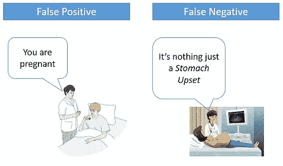
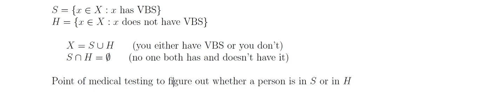
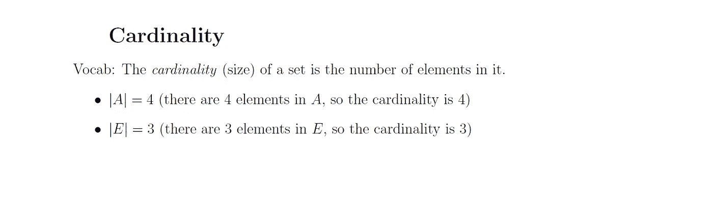
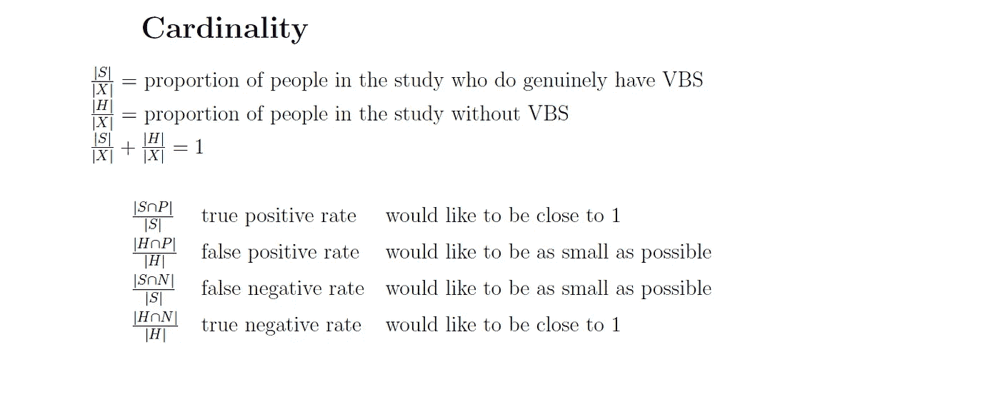

# 假阳性和假阴性的美丽概念

> 原文：<https://medium.com/analytics-vidhya/beautiful-concept-of-false-positive-and-false-negative-7f47506b643f?source=collection_archive---------13----------------------->

当测试结果失败时(图片:quanthub.com)

在我们的日常生活中，并不是任何测试或病毒扫描或任何其他活动的结果都是真实的。当你看到上面的图片时，很明显测试失败了。一名男子被检测为怀孕，而一名孕妇被宣布为胃部不适。所以，像这样的事件在日常生活中会发生，因为我们的测试系统有一定的局限性，因此有时会给出错误的结果。尽管如此，无论是医学测试、病毒扫描还是任何其他事件，我们都希望将错误结果的价值降至最低。

首先，让我们借助一个医学测试实例和集合论来尝试理解整个概念。

让我们假设 X =临床试验中的一组人

VBS:非常糟糕的综合症

S =患病人数。显然，患病人数是 X(总人数)的一部分。

H =健康的人数也是 x 的一部分。

然后，我们得到如下图所示的结果:

通过集合论表示患病和健康的人

假设测试结果为阳性的人用 P 表示，测试结果为阴性的人用 N 表示。在理想情况下，S 等于 P——患病的人总是测试结果为阳性，H 等于 N——健康的人总是测试结果为阴性。…但情况并非总是如此。

基于集合论的正例(P)和负例(N)

现在，我们将深入研究真阳性、真阴性、假阳性和假阴性的概念。

在这里，患病且测试呈阳性的人是真正的阳性，

健康(H)和测试阴性(N)的人是真正的阴性，

患病但测试呈阴性的人是假阴性的

健康(H)但检测呈阳性(P)的人是假阳性。

这通过下面的集合论来表示:

真正负和假正负表征

现在，我们讨论基数的概念。基数不是什么，而是一个集合中元素的数量。如果一个集合有 5 个元素，它的基数就是 5。如果一个集合有 9 个元素，它的基数是 9。

***注:*** 集合 A 的基数表示为|A|。

基数概念

所以，|S|/|X| =研究中真正患有 VBS 的人的比例

|H|/|X| =研究中没有 VBS 的人数比例

现在，|S|/|X| + |H|/|X| = 1(因为这是整体比例值，即病人和健康人的比例)

真假阳性率和阴性率

因此，我们的主要努力是将假阳性和假阴性率降至最低，因为它们并不代表正确的结果。

这个概念的另一个更简单的解释是:

这就像有人告诉你**做了**某事，而你**没有做**！或者你真的**做了**却**没有**做。

它们都有一个特殊的名字:**【假阳性】****【假阴性】**，如下图所示:

假阳性和假阴性的表格表示

让我们来看一些“**假阳性**”和“**假阴性**”的例子:

*   **机场安检**:误报**是指钥匙或硬币等普通物品被误认为武器(机器发出“嘟嘟”声)。**
*   ****质量控制**:一个“**假阳性**”是质量好的项目被拒绝，一个“**假阴性**”是质量差的项目被接受。(“阳性”结果意味着存在缺陷)。**
*   ****杀毒软件**:一个“**误报**”就是当一个正常文件被认为是病毒的时候。**
*   ****医学筛查**:给一大群人做的低成本检查，可以给很多**假阳性**(说你没有病，然后让你去做更准确的检查。**

**所以，这是一个非常简单而美好的概念。同样，在机器学习中，**假阳性**是模型错误预测**阳性**类别的结果。而**假阴性**是模型错误预测**阴性**类的结果。**

**但是许多人不理解“是”或“否”背后的真实数字，我们将在下一篇文章中讨论这些数字。**