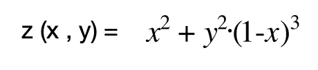
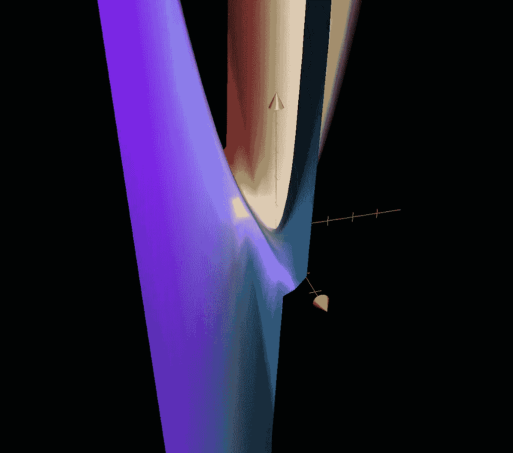
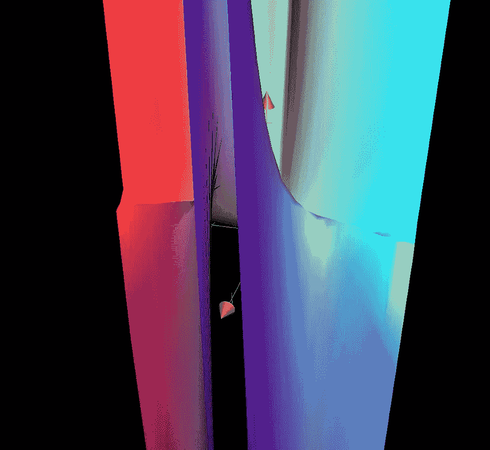
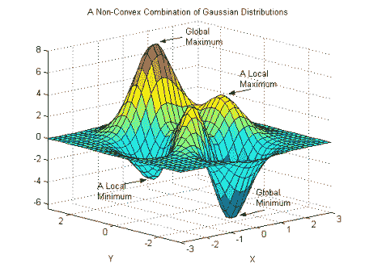

# 神经网络的美丽陷阱

> 原文：<https://medium.com/analytics-vidhya/beautiful-trap-of-neural-networks-96c6afce9c24?source=collection_archive---------18----------------------->

H.黑尔莱因/昂斯普拉什

如今，神经网络(NN)已经成为每个现代趋势讨论的“时尚”属性。大多数具有某种程度的技术甚至非技术背景的人能够以不同程度的信心推测它们，经常给一个见多识广的听众留下怀疑的印象。如果有人试图谈论这些神秘技术和人类大脑解剖结构之间的联系，这是一个严重的愚蠢行为，不是作为一名有经验的数据科学家获得信誉的最佳方式。

简单地说，神经网络是一系列能够识别模式的机器学习算法。虽然这个定义可能看起来相当模糊，不太能说明问题，但它可能仍然是最准确的通用语言描述。事实上，这些算法在结构上非常相似，因为它们都通过一些严格和高度密集的计算将输入与输出联系起来，并且能够在最少的预处理下处理几乎任何类型的原始数据。而且输出很容易满足每个工程师的需求——无论是回归还是分类问题。使用这些算法，我们可以以所需的精度逼近任何光滑(甚至不太光滑)的函数。听起来像个梦，会有什么问题呢？！

但是，一如既往，这个梦想的代价很高，即使是最简单的神经网络模型也需要相当高的计算复杂度。模型参数的数量随着复杂性的增加而成倍增加，这意味着这些模型很容易过度拟合，需要正则化。模型的超参数调整变成了一个直观的捉迷藏游戏，需要非常长的迭代。

鉴于这些局限性，NN 成功的基石是什么？是他们的高性能水平！在许多情况下，他们胜过其他模型，他们的结果是无与伦比的。神经网络只是不断调整它们的参数，直到它们的误差进一步不可减少。这称为参数优化，有许多基于梯度下降法的算法，我在下面列出了一部分:

*   **亚当** —自适应矩估计
*   **AdaGrad** —自适应渐变
*   **阿达德尔塔** —阿达格拉德延伸
*   **内斯特罗夫**算法
*   **RMSProp** —均方根传播
*   **SGD** —随机梯度下降
*   **LBFGS** —有限内存 Broyden–Fletcher–gold farb–Shanno 算法
*   **直线** —布雷森汉姆直线算法
*   **共轭梯度**
*   **黑森自由**(又名**截断牛顿**算法

到目前为止听起来很直接，不是吗？梯度下降法中具有共同特性的各种优化选项。

但是等一下，在这种无聊的情况下，还有什么是不受欢迎的呢？梯度下降法给任何有微积分和应用数学背景的人敲响了警钟。基本算法本身就像小山一样古老，但有一个非常令人不快的警告。坦率地说，它可以愚弄你。正如基础微积分告诉我们的，我们可能会下降到局部最小值，而不是期望的全局最小值，这是可以理解的问题。有几种类型的局部极小值——鞍形、高原、平坦区域以及其他不规则区域，如悬崖和爆炸梯度。但即使是非常简单的多项式

画在原点周围可以看起来像这样美！

是的，有人会说这种情况可以通过分析来解决。但是，大多数机器学习算法的美妙之处只是开始于微积分结束的地方——基本上，如果我们能够简单地使用一支笔和一些(很多)草稿纸来获得结果，我们就不会真的需要这些计算方法。我们确实需要并广泛使用这些算法来处理我们无法通过分析找到所需最小值的函数。很多时候，这甚至被证明是数学上不可能的！！！

本地和全球最小值(来源——维基共享资源)

所以，这听起来像个陷阱。我们性能最佳的模型并不能提供绝对可信的结果！在有许多具有相等损失函数值的局部极小值的情况下，它可以被认为不是非常重要，但是如果我们的“真正的”全局极小值具有比我们用各种梯度下降优化方法找到的任何局部极小值低得多的成本，会发生什么呢？在大多数情况下，我们甚至不能绘制我们的损失函数(就像多维问题一样——99%的模型具有多个特征),即使我们可以，我们的梯度通常仍然很小。

这为学术研究提出了一个开放的问题和一个广阔的领域。正如伊恩·戈德费罗、约舒阿·本吉奥和亚伦·库维尔在他们关于深度学习的教科书中指出的那样:“*具有实际意义的网络是否有许多高成本的局部极小值，以及优化算法是否会遇到它们仍是悬而未决的问题。多年来，大多数从业者认为局部极小值是困扰神经网络优化的一个常见问题。今天，情况似乎并非如此。这个问题仍然是一个活跃的研究领域，但专家们现在怀疑，对于 sufficiently 大型神经网络，大多数局部最小值具有低成本函数值，找到真正的全局最小值并不重要，而不是在参数空间中找到一个成本低但不是最小的点。*(Ian Godfellow 等《深度学习》，麻省理工出版社 2016 年)

因此，我们仍然可以使用神经网络并取得巨大的成果，希望未来的理论发现将解释它们的更多特征。我们可以试验它们的拓扑结构，只受我们的想象力和计算能力的限制，但我们必须记住，我们的结果可能不是 100%可信的。