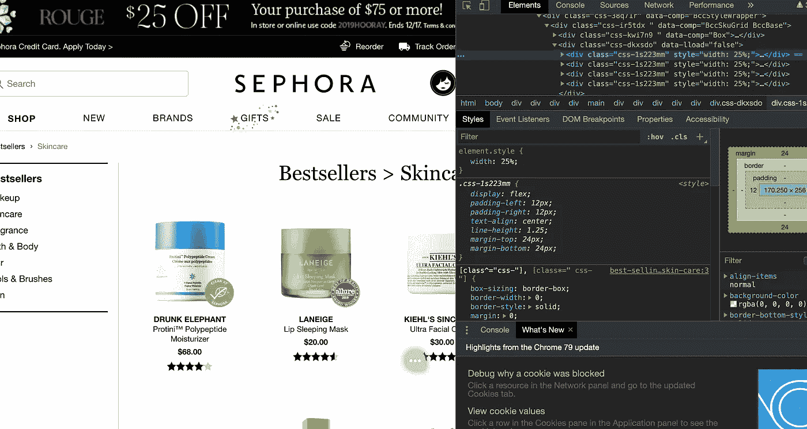

# 美丽的苏普，美丽的我

> 原文：<https://medium.com/analytics-vidhya/beautifulsoup-beautiful-me-7d43ba8af476?source=collection_archive---------19----------------------->

我喜欢美容产品。我喜欢看着它们，使用它们，谈论它们，当然，也喜欢为它们购物。但购物经历中最糟糕的部分总是刷你的信用卡:如果我能以更低的价格找到更好的产品呢？所以我决定做一个小调查。

Sephora.com 的内部

之前用 BeautifulSoup 练习过一些 webscraping，我决定将它的功能与 Selenium driver 结合起来，构建一个函数来提取所有必要的数据，以满足我的好奇心。我的主要问题是:收视率最高的产品是什么？价格最低的产品有哪些？一个产品可以有最高的评级和最低的价格吗？一点剧透警报，它不能…

# 从语法上分析

毫不奇怪，我的旅程中最困难的部分不是数据分析，而是实际获取数据，清理数据，并将其传输到熊猫的数据框架中。我知道我可以用美丽的汤来刮丝芙兰的网站，但我也想直观地跟踪进度。所以我决定使用 Selenium driver，它可以点击页面，选择元素，并以我需要的格式提供数据。

不要忘记进口你需要的一切！

我想构建一个函数来完成以下任务:

*   打开上面有多个产品的页面
*   选择包含产品所有信息的 HTML 代码块
*   复制品牌名称、产品名称、价格，将价格转换成浮点数，并将所有内容放入字典中
*   查找包含产品页面链接的类
*   单击该链接
*   复制“喜欢”的数量，将其转换为字符串，放入字典中
*   对页面上的所有产品重复所有步骤(为了方便起见，我决定将我的搜索限制在每页 20 个产品)
*   当然，利用时间。睡眠来避免堵塞！

以下是我得到的信息:

注释说明了每个代码块的作用

# 创建词典

在我编写了为我完成所有繁重工作的函数之后，我只需要为它输入几个不同类别的 URL:化妆品、护肤品、美发产品等等。这个函数需要一点时间来执行，因为我让它在每次迭代后休眠一秒钟。以下是输出结果:

# 数据框架和分析

为了实际执行分析，我决定将我的字典转换成熊猫数据帧:

现在我能搞清楚哪些产品是最好的了！

我想我应该买化妆品类的 Anastasia's Brow Wiz 和 Kat Von D's Liner，因为这两款表都是他们做的。

还有丝芙兰的湿巾，兰芝的唇膜，护肤的真理精华液

在我的浴室里给一些 Olaplex 腾个地方！

你可能已经注意到，没有产品实际上有最低的价格和最高的评级，但这不是一个问题。我将满足于“最高评级之一”。该去购物了！