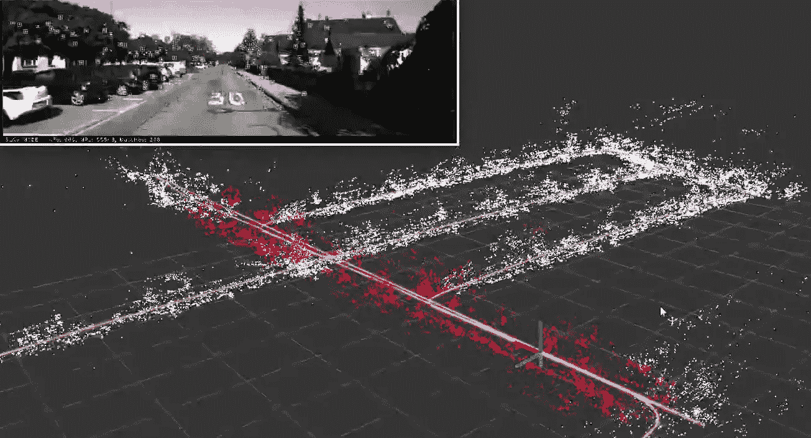
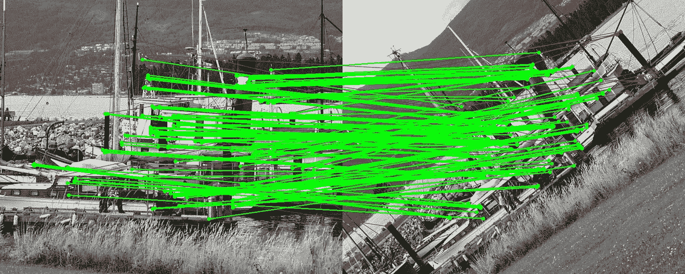

# BEBLID:为什么局部特征描述符在 2020 年仍然重要？

> 原文：<https://medium.com/analytics-vidhya/beblid-why-feature-descriptors-are-still-important-in-2020-10f0526886f?source=collection_archive---------6----------------------->

最近，我们发表了一篇论文，介绍了一种新的局部图像特征描述符，称为**be blid:Boosted Efficient Binary Local Image Descriptor。**我们提供了它的源代码:【https://github.com/iago-suarez/BEBLID】T2 这篇文章是对它的非正式介绍，我希望能让你对它感兴趣。

 [## 埃古-苏亚雷斯/贝布利德

### 这个库包含 BEBLID 本地图像描述符的源代码，该代码依赖于 OpenCV 4。

github.com](https://github.com/iago-suarez/BEBLID) 

如果说最近在计算机视觉领域发生了一场革命，那毫无疑问就是深度学习。卷积神经元网络(CNN)是自动学习非常丰富的图像特征的惊人工具。它们功能强大，可端到端训练，代表非常抽象的知识，但它们有一个主要缺点:它们速度慢！如果你经常尝试把这种网络植入你的手机，你可能会看到你的手机开始燃烧，电池耗尽。这就是为什么高效视觉在今天仍然有意义。

如果可能的话，这在一个特殊情况下变得更加重要:3D 视觉。大多数三维视觉技术，如同步定位和映射(SLAM)，运动结构(SfM)或实时自定位，都依赖于快速特征匹配来反映某些场景模型的特征和摄像机当前看到的特征。

图片取自 ORB-SLAM2 演示:【https://www.youtube.com/watch?v=j2ZNuBCr4SA 

正是在这种情况下，低级功能仍然扮演着重要的角色。但是什么是地方特色呢？嗯，只是一个容易识别的区域:一个斑点，一个角落，一个片段…如果你想要一个很棒的介绍，我推荐 OpenCV 的教程。重点是，我们通常希望我们的方法以这样一种方式记忆这些角，以便下次它看到它们时，它说:嘿，我想我们以前见过！这就是 BEBLID 所做的。

BEBLID 使用一串 0 和 1(二进制字符串)描述了图像的一小部分，这样，下次我们用另一种照明或从不同的角度检测图像的同一部分时，两个二进制字符串将非常相似。二进制字符串就像图像指纹。

与其他类似的描述符(如 ORB、LATCH 或 BinBoost)相比，BEBLID 更快、更准确地描述了斑点和角落，描述一幅图像不到 2 毫秒。详见文中的[。在这里，我将向您展示一个如何使用它的示例:](https://www.researchgate.net/publication/340686020_BEBLID_Boosted_Efficient_Binary_Local_Image_Descriptor)

该示例使用 OpenCV 4.1.0。基本上，它导入 BEBLID 描述符，你可以在这里找到，检测 ORB 关键点，使用 BEBLID 进行描述，与 OpenCV BFMatcher 进行匹配，并打印两幅图像之间的匹配特征。在 BEBLID 演示中有完整的代码[。](https://github.com/iago-suarez/BEBLID/blob/master/demo.cpp)

我们计划做一个 pull 请求，在 OpenCV 中包含描述符，所以在不久的将来，我们将提供 Python 和 Java 演示。现在，很抱歉，它只是 C++。

总而言之:

*   BEBLID 是一个非常有效的二值兴趣点描述符。
*   它在智能手机 CPU 中不到 2 毫秒的时间内提取每幅图像的 2000 个描述符。如果你像我一样正在做增强现实，这是很棒的。
*   它和 ORB 一样快，有比 BinBoost 更好的地图，并且在 HPatches bechmark 中接近筛选。